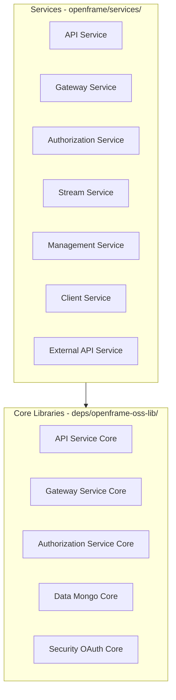

# Contributing to OpenFrame OSS Tenant

Thank you for your interest in contributing to OpenFrame OSS Tenant! This guide will help you get started with contributing to our open-source MSP automation platform.

## 🌟 Ways to Contribute

### Code Contributions
- **Bug Fixes**: Help us identify and fix issues
- **Feature Development**: Implement new MSP automation capabilities
- **Performance Improvements**: Optimize service performance and resource usage
- **Security Enhancements**: Strengthen authentication, authorization, and data protection
- **Integration Development**: Add support for new MSP tools and services

### Documentation & Community
- **Documentation Improvements**: Enhance guides, API docs, and tutorials
- **Example Applications**: Create sample integrations and use cases
- **Testing**: Expand test coverage and quality assurance
- **Community Support**: Help other developers in our Slack community

## 🚀 Getting Started

### Prerequisites

Before contributing, ensure you have:

- **Java 21+** - OpenJDK or Oracle JDK
- **Node.js 18+** - For tooling layer development
- **Maven 3.8+** - For building Spring Boot services
- **Docker & Docker Compose** - For local infrastructure
- **Git** - Version control

### Development Environment Setup

1. **Fork and Clone the Repository**
   ```bash
   # Fork the repo on GitHub, then clone your fork
   git clone https://github.com/YOUR_USERNAME/openframe-oss-tenant.git
   cd openframe-oss-tenant
   
   # Add upstream remote
   git remote add upstream https://github.com/flamingo-stack/openframe-oss-tenant.git
   ```

2. **Set Up Local Development Environment**
   ```bash
   # Start infrastructure services
   docker-compose up -d mongodb kafka redis cassandra nats
   
   # Install Node.js dependencies
   npm install
   
   # Build Spring Boot services
   mvn clean install -DskipTests
   ```

3. **Verify Setup**
   ```bash
   # Start core services
   ./start-dev-services.sh
   
   # Test API health
   curl http://localhost:8080/actuator/health
   ```

## 🏗️ Architecture Understanding

### Core Services Overview

OpenFrame follows a microservices architecture with these key components:



### Development Principles

- **Multi-Tenant First**: Every component supports tenant isolation
- **Event-Driven Architecture**: Services communicate via Kafka events
- **Security by Design**: OAuth2/OIDC with JWT tokens and API key authentication
- **Observability**: Comprehensive logging, metrics, and health checks
- **Modular Design**: Reusable core libraries with deployable applications

## 🔧 Development Workflow

### Branch Strategy

We use a simplified GitHub Flow:

1. **Create Feature Branch**
   ```bash
   git checkout -b feature/your-feature-name
   ```

2. **Make Changes**
   - Write clean, well-documented code
   - Follow existing code style and patterns
   - Add tests for new functionality

3. **Test Locally**
   ```bash
   # Run unit tests
   mvn test
   
   # Run integration tests
   mvn verify -Pintegration-tests
   
   # Test specific service
   mvn test -pl openframe/services/openframe-api
   ```

4. **Commit Changes**
   ```bash
   git add .
   git commit -m "feat: add new MSP tool integration"
   ```

5. **Push and Create PR**
   ```bash
   git push origin feature/your-feature-name
   ```
   
   Then create a Pull Request on GitHub.

### Commit Message Convention

We follow conventional commits:

- `feat:` - New features
- `fix:` - Bug fixes
- `docs:` - Documentation changes
- `test:` - Adding or updating tests
- `refactor:` - Code refactoring
- `perf:` - Performance improvements
- `build:` - Build system changes

**Examples:**
```
feat: add ConnectWise integration for ticket management
fix: resolve JWT token validation in multi-tenant context
docs: update API service architecture documentation
test: add integration tests for stream service event processing
```

## 📝 Code Style Guidelines

### Java (Spring Boot Services)

- **Code Formatting**: Follow Google Java Style Guide
- **Package Structure**: Organize by feature, not layer
- **Naming**: Use descriptive names for classes, methods, and variables
- **Documentation**: Add Javadoc for public APIs
- **Testing**: Write unit tests with JUnit 5 and integration tests with Testcontainers

**Example Service Structure:**
```java
@RestController
@RequestMapping("/api/organizations")
@Validated
public class OrganizationController {
    
    private final OrganizationService organizationService;
    
    public OrganizationController(OrganizationService organizationService) {
        this.organizationService = organizationService;
    }
    
    @GetMapping
    public ResponseEntity<Page<OrganizationDTO>> getOrganizations(
            @AuthenticationPrincipal AuthPrincipal principal,
            @Valid OrganizationFilterOptions filterOptions) {
        // Implementation
    }
}
```

### Node.js (Tooling Layer)

- **TypeScript**: Use TypeScript for type safety
- **ESLint**: Follow project ESLint configuration
- **Code Organization**: Organize by feature modules
- **Error Handling**: Use proper error handling with try/catch
- **Documentation**: Add JSDoc comments for public functions

**Example Function:**
```typescript
/**
 * Process MSP tool events and enrich with organizational context
 * @param event - Raw tool event
 * @param tenantId - Tenant identifier for context
 * @returns Enriched event with additional metadata
 */
export async function enrichToolEvent(
  event: RawToolEvent,
  tenantId: string
): Promise<EnrichedEvent> {
  // Implementation
}
```

## 🧪 Testing Guidelines

### Testing Strategy

We maintain high test coverage across all services:

- **Unit Tests**: Test individual components in isolation
- **Integration Tests**: Test service interactions with databases and messaging
- **API Tests**: Test REST and GraphQL endpoints
- **Contract Tests**: Validate service interfaces

### Writing Tests

**Unit Test Example:**
```java
@ExtendWith(MockitoExtension.class)
class UserServiceTest {
    
    @Mock
    private UserRepository userRepository;
    
    @InjectMocks
    private UserService userService;
    
    @Test
    void shouldCreateUserSuccessfully() {
        // Given
        CreateUserRequest request = new CreateUserRequest("test@example.com");
        User savedUser = new User("test@example.com");
        when(userRepository.save(any(User.class))).thenReturn(savedUser);
        
        // When
        User result = userService.createUser(request);
        
        // Then
        assertThat(result.getEmail()).isEqualTo("test@example.com");
    }
}
```

**Integration Test Example:**
```java
@SpringBootTest(webEnvironment = SpringBootTest.WebEnvironment.RANDOM_PORT)
@TestPropertySource(locations = "classpath:application-test.properties")
class OrganizationControllerIntegrationTest {
    
    @Autowired
    private TestRestTemplate restTemplate;
    
    @Test
    void shouldReturnOrganizationsForAuthenticatedUser() {
        // Test implementation with real HTTP calls
    }
}
```

### Running Tests

```bash
# Run all tests
mvn test

# Run tests for specific service
mvn test -pl openframe/services/openframe-api

# Run integration tests
mvn verify -Pintegration-tests

# Run tests with coverage
mvn test jacoco:report
```

## 🔍 Code Review Process

### Pull Request Requirements

Before submitting a PR, ensure:

- [ ] **Code compiles** without warnings
- [ ] **All tests pass** locally
- [ ] **New features have tests** with adequate coverage
- [ ] **Documentation is updated** for public APIs
- [ ] **Commit messages** follow conventional format
- [ ] **No sensitive information** in code or commit history

### Review Checklist

Reviewers will check:

- **Functionality**: Does the code solve the problem correctly?
- **Architecture**: Does it fit the existing system design?
- **Security**: Are there any security vulnerabilities?
- **Performance**: Are there any performance concerns?
- **Testing**: Is test coverage adequate?
- **Documentation**: Are changes properly documented?

## 🛡️ Security Considerations

### Security Guidelines

- **Never commit secrets**: Use environment variables or secure vaults
- **Validate input**: Always validate and sanitize user input
- **Use parameterized queries**: Prevent SQL injection attacks
- **JWT validation**: Ensure proper token validation in all services
- **API authentication**: Require authentication for all non-public endpoints

### Reporting Security Issues

If you discover a security vulnerability, please:

1. **DO NOT** open a GitHub issue
2. **Email us privately** at security@flamingo.run
3. **Provide detailed information** about the vulnerability
4. **Allow time for response** before public disclosure

## 📚 Documentation Standards

### Code Documentation

- **Javadoc**: Document all public classes and methods
- **README files**: Each service should have a README
- **API Documentation**: Use OpenAPI/Swagger for REST APIs
- **Architecture Decisions**: Document significant design decisions

### Writing Guidelines

- **Clear and concise**: Write for developers at all skill levels  
- **Include examples**: Provide code examples and usage patterns
- **Keep updated**: Update docs when changing functionality
- **Test documentation**: Ensure examples work correctly

## 🚀 Feature Development Guide

### Adding New MSP Tool Integration

1. **Research the Tool API**
   - Study API documentation and authentication methods
   - Understand data models and event structures
   - Identify integration points with OpenFrame

2. **Create Integration Module**
   ```bash
   # Create new integration in integrated-tools/
   mkdir integrated-tools/your-tool-name
   cd integrated-tools/your-tool-name
   ```

3. **Implement Core Components**
   - **SDK Wrapper**: Java client for the tool's API
   - **Event Mappers**: Transform tool events to OpenFrame format  
   - **Stream Processors**: Handle event enrichment and routing
   - **Configuration**: Tool-specific settings and credentials

4. **Add Tests and Documentation**
   - Unit tests for all components
   - Integration tests with tool APIs
   - Setup documentation and troubleshooting guide

### Extending Core Services

1. **Identify Extension Point**
   - Review existing service architecture
   - Identify where new functionality fits
   - Consider impact on other services

2. **Follow Service Patterns**
   - Use existing controller/service/repository patterns
   - Implement proper error handling and validation
   - Add appropriate logging and metrics

3. **Update GraphQL Schema** (if applicable)
   ```graphql
   extend type Query {
       newFeature(input: NewFeatureInput!): NewFeatureResult
   }
   
   input NewFeatureInput {
       parameter: String!
   }
   
   type NewFeatureResult {
       success: Boolean!
       data: String
   }
   ```

## 🌍 Community Guidelines

### Communication

- **Be respectful**: Treat all contributors with respect
- **Be inclusive**: Welcome contributors from all backgrounds
- **Be constructive**: Provide helpful feedback and suggestions
- **Be patient**: Remember that contributors have different experience levels

### Getting Help

- **OpenMSP Slack**: https://join.slack.com/t/openmsp/shared_invite/zt-36bl7mx0h-3~U2nFH6nqHqoTPXMaHEHA
- **Discussions**: Start discussions for questions and ideas
- **Documentation**: Check existing docs before asking questions
- **Code Examples**: Refer to existing service implementations

### Channels in OpenMSP Slack

- `#general` - General discussions and announcements
- `#development` - Development questions and technical discussions  
- `#integrations` - MSP tool integration development
- `#help` - Get help with setup and configuration

## 📄 Legal & Licensing

### Contributor License Agreement

By contributing to OpenFrame OSS Tenant, you agree that:

- Your contributions are your original work
- You grant Flamingo Stack rights to use your contributions
- Your contributions will be licensed under the Flamingo AI Unified License v1.0

### License Compliance

- Ensure all dependencies are compatible with our license
- Do not include GPL or AGPL licensed code
- Add license headers to new files when required

## ✅ Checklist for Contributors

Before submitting your first contribution:

- [ ] Read this contributing guide completely
- [ ] Set up local development environment
- [ ] Join the OpenMSP Slack community
- [ ] Review existing code to understand patterns
- [ ] Start with a small bug fix or documentation improvement
- [ ] Ensure tests pass locally
- [ ] Create well-structured commits with clear messages

## 🎉 Recognition

We appreciate all contributions to OpenFrame OSS Tenant! Contributors will be:

- **Listed in CONTRIBUTORS.md** - Recognition for your contributions  
- **Mentioned in release notes** - Credit for significant features
- **Invited to community events** - Special access to OpenFrame webinars
- **Given priority support** - Faster response in community channels

## 📞 Contact

- **Community Slack**: https://join.slack.com/t/openmsp/shared_invite/zt-36bl7mx0h-3~U2nFH6nqHqoTPXMaHEHA
- **Website**: https://www.flamingo.run/openframe
- **General Inquiries**: https://flamingo.run

---

Thank you for contributing to OpenFrame OSS Tenant! Together, we're building the future of AI-powered MSP automation. 🚀