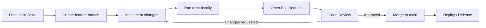

# Contributing to OpenFrame OSS Tenant

Thank you for your interest in contributing to OpenFrame OSS Tenant! This guide covers everything you need to know about code style conventions, branch naming, the pull request process, commit message formats, and review checklists.

---

## Community First

All contributions, issues, and feature requests are managed through the **OpenMSP Slack community** — not GitHub Issues or Discussions.

> **Join OpenMSP Slack:** [https://join.slack.com/t/openmsp/shared_invite/zt-36bl7mx0h-3~U2nFH6nqHqoTPXMaHEHA](https://join.slack.com/t/openmsp/shared_invite/zt-36bl7mx0h-3~U2nFH6nqHqoTPXMaHEHA)
>
> **Community Website:** [https://www.openmsp.ai/](https://www.openmsp.ai/)

Before submitting a PR for a significant change, discuss it in Slack to align on the approach.

---

## Development Workflow



---

## Prerequisites

Before contributing, ensure your environment is set up correctly. See the full [Prerequisites Guide](./docs/getting-started/prerequisites.md) for details. Quick summary:

- **Java 21** (JDK) — Backend services
- **Apache Maven 3.9+** — Build system
- **Node.js 18+** — AI agent tooling
- **Docker 24+** — Infrastructure dependencies
- **Git 2.x** — Source code management

---

## Code Style and Conventions

### Java

The project uses **Google Java Style** conventions with project-specific adjustments.

| Rule | Standard |
|------|---------|
| Indentation | 4 spaces (no tabs) |
| Line length | 120 characters max |
| Import ordering | Static first, then alphabetical |
| Annotations | One per line |
| Braces | K&R style (opening brace on same line) |

**Service layer pattern:**

```java
@Service
@RequiredArgsConstructor
@Slf4j
public class OrganizationCommandService {

    private final OrganizationRepository organizationRepository;
    private final EventPublisher eventPublisher;

    public OrganizationResponse createOrganization(
            CreateOrganizationRequest request,
            AuthPrincipal principal) {
        // ... implementation
    }
}
```

**Controller pattern:**

```java
@RestController
@RequestMapping("/api/organizations")
@RequiredArgsConstructor
public class OrganizationController {

    private final OrganizationCommandService commandService;

    @PostMapping
    @ResponseStatus(HttpStatus.CREATED)
    public OrganizationResponse create(
            @Valid @RequestBody CreateOrganizationRequest request,
            @AuthenticationPrincipal AuthPrincipal principal) {
        return commandService.createOrganization(request, principal);
    }
}
```

Run Checkstyle before committing:

```bash
mvn checkstyle:check
```

### TypeScript / JavaScript (Frontend)

The frontend follows the project's ESLint and Prettier configuration.

| Rule | Standard |
|------|---------|
| Indentation | 2 spaces |
| Quotes | Single quotes |
| Semicolons | Required |
| Line length | 100 characters |
| Component files | PascalCase (e.g., `DeviceCard.tsx`) |
| Utility files | kebab-case (e.g., `device-utils.ts`) |
| Hooks | `use-` prefix (e.g., `use-devices.ts`) |

Run linting before committing:

```bash
cd openframe/services/openframe-frontend
npm run lint
npm run format
```

---

## Branch Naming

All branches should follow this naming convention:

```text
<type>/<short-description>
```

| Type | When to Use | Example |
|------|-------------|---------|
| `feature/` | New feature or enhancement | `feature/add-monitoring-tab` |
| `fix/` | Bug fix | `fix/device-heartbeat-offline-detection` |
| `chore/` | Maintenance, dependencies, tooling | `chore/upgrade-spring-boot-3-3` |
| `docs/` | Documentation changes | `docs/update-contributing-guide` |
| `refactor/` | Code restructuring without behavior change | `refactor/extract-tenant-service` |
| `test/` | Adding or updating tests | `test/add-ticket-service-coverage` |
| `hotfix/` | Critical production fix | `hotfix/fix-jwt-validation-regression` |

**Rules:**
- Use lowercase and hyphens only
- Keep the description short (3–5 words)
- Reference a Slack thread or feature context in the PR description

---

## Commit Message Format

Follow the [Conventional Commits](https://www.conventionalcommits.org/) specification:

```text
<type>(<scope>): <short description>

[optional body]

[optional footer]
```

### Types

| Type | Description |
|------|-------------|
| `feat` | New feature |
| `fix` | Bug fix |
| `docs` | Documentation change |
| `style` | Formatting, missing semicolons (no logic change) |
| `refactor` | Code change that neither fixes a bug nor adds a feature |
| `test` | Adding or updating tests |
| `chore` | Build process, dependency updates, tooling |
| `perf` | Performance improvement |
| `ci` | CI/CD configuration changes |

### Scopes

Use the service or module name:

```text
feat(api): add device filter by organization
fix(gateway): correct JWT issuer cache expiry
refactor(stream): extract event enrichment service
test(management): add scheduler integration tests
chore(deps): upgrade spring-boot to 3.3.1
```

### Examples

```text
feat(tickets): add AI-powered ticket summarization

Integrates Claude AI via @ai-sdk/anthropic to generate
ticket summaries when a ticket is created or updated.
```

```text
fix(auth): prevent duplicate tenant registration

Adds uniqueness validation on tenant domain during registration.
Previously, concurrent registration requests could create
duplicate tenant records.
```

---

## Pull Request Process

### Before Opening a PR

1. Ensure your branch is up to date with `main`:

```bash
git fetch origin
git rebase origin/main
```

2. Run the full test suite:

```bash
mvn clean verify
```

3. Run linting (frontend):

```bash
cd openframe/services/openframe-frontend
npm run lint
```

4. Ensure the build passes:

```bash
mvn clean install -DskipTests
```

### PR Description Template

When opening a PR, include:

```markdown
## Summary
Brief description of what this PR does.

## Changes
- List of specific changes made
- Related service or module

## Testing
- How the changes were tested
- New tests added (if any)

## Notes
- Any breaking changes
- Deployment considerations
- Related Slack discussion link
```

### PR Size Guidelines

| Size | Lines Changed | Notes |
|------|--------------|-------|
| Small | < 100 lines | Preferred — easy to review |
| Medium | 100–500 lines | Acceptable with clear scope |
| Large | > 500 lines | Consider splitting into smaller PRs |

---

## Code Review Checklist

### For PR Authors

Before marking a PR ready for review:

- [ ] All CI checks pass (build, tests, lint)
- [ ] Self-reviewed the diff for obvious issues
- [ ] Added tests for new functionality
- [ ] Updated documentation if behavior changed
- [ ] No debug code, `TODO` comments, or commented-out code in production paths
- [ ] No secrets, credentials, or sensitive data in the diff
- [ ] Commit messages follow Conventional Commits format
- [ ] Branch is rebased on latest `main`

### For Reviewers

When reviewing a PR:

- [ ] Code logic is correct and handles edge cases
- [ ] New code follows existing patterns and conventions
- [ ] Tests adequately cover the new/changed code
- [ ] No security vulnerabilities introduced
- [ ] Multi-tenant scoping is preserved in any new data access
- [ ] API contracts are backward-compatible (or migration path documented)
- [ ] Performance impact is considered for hot paths
- [ ] Error messages are user-friendly and don't expose internals

---

## Testing

The project uses a comprehensive testing strategy:

| Layer | Location | Scope |
|-------|----------|-------|
| **Unit Tests** | `src/test/java/**/*Test.java` | Individual classes and methods |
| **Integration Tests** | `src/test/java/**/*IT.java` | Spring context + Embedded MongoDB |
| **API / E2E Tests** | `openframe/services/openframe-test/` | Full platform API flows |

### Running Tests

```bash
# Run all tests
mvn test

# Run tests for a specific service
mvn test -pl openframe/services/openframe-api

# Run a specific test class
mvn test -pl openframe/services/openframe-api -Dtest=AgentRegistrationServiceTest

# Skip tests for fast builds
mvn clean install -DskipTests
```

### Coverage Targets

- **Service layer:** > 80% line coverage
- **Controller layer:** > 70% line coverage
- **Critical paths** (auth, data access): > 90% line coverage

---

## Security Guidelines

Before merging any PR that touches security-sensitive code:

- [ ] No secrets, passwords, or API keys in source code
- [ ] All new REST endpoints are authenticated (or explicitly documented as public)
- [ ] All new REST endpoints validate input with `@Valid`
- [ ] New MongoDB queries use parameterized criteria (no raw query strings)
- [ ] Tenant scoping is applied in all new repository queries
- [ ] Error responses do not expose internal implementation details
- [ ] New scheduled tasks use ShedLock to prevent duplicate execution
- [ ] Password/secret fields are excluded from logs (`@JsonIgnore`, `@ToString.Exclude`)

---

## Multi-Tenancy Requirements

OpenFrame is a multi-tenant platform. When contributing:

- Always scope data access by `tenantId`
- Never expose one tenant's data to another
- Use the existing `TenantIdProvider` and tenant-aware repositories
- Test tenant isolation in integration tests

---

## Documentation

When your change:

- Adds a new feature → update the relevant reference doc or getting-started guide
- Changes API behavior → update DTOs and any affected docs
- Changes configuration → update the environment/setup docs

---

## License

By contributing to OpenFrame OSS Tenant, you agree that your contributions will be licensed under the same license as the project. Please ensure you have the right to contribute any code you submit.

---

## Getting Help

Stuck or have questions? The OpenMSP community is here to help:

> **OpenMSP Slack:** [https://join.slack.com/t/openmsp/shared_invite/zt-36bl7mx0h-3~U2nFH6nqHqoTPXMaHEHA](https://join.slack.com/t/openmsp/shared_invite/zt-36bl7mx0h-3~U2nFH6nqHqoTPXMaHEHA)
>
> **Community Website:** [https://www.openmsp.ai/](https://www.openmsp.ai/)

---

<div align="center">
  Built with 💛 by the <a href="https://www.flamingo.run/about"><b>Flamingo</b></a> team
</div>
