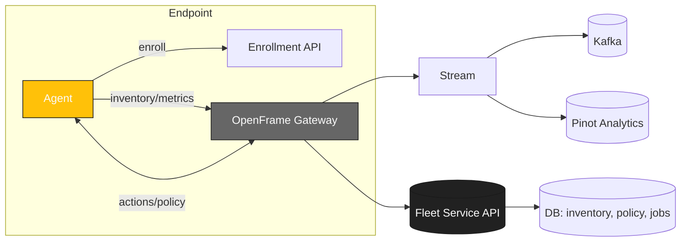

<div align="center">
  <picture>
    <!-- Dark theme -->
    <source media="(prefers-color-scheme: dark)" srcset="docs/assets/logo-openframe-full-dark-bg.png">
    <!-- Light theme -->
    <source media="(prefers-color-scheme: light)" srcset="docs/assets/logo-openframe-full-light-bg.png">
    <!-- Default / fallback -->
    
  </picture>

  <h1>Fleet</h1>

  <p><b>Device & software fleet management that integrates with OpenFrame — provisioning, updates, inventory, policy, and remote actions across Windows, macOS, and Linux.</b></p>

  <p>
    <a href="LICENSE.md">
      
    </a>
    <a href="https://www.flamingo.run/knowledge-base">
      
    </a>
    <a href="https://www.openmsp.ai/">
      
    </a>
  </p>
</div>

---

## Quick Links
- [Quick Start](#quick-start)  
- [Configuration](#configuration)  
- [Development](#development)  
- [Security](#security)  

---

## Highlights

- Cross-platform device management (Windows, macOS, Linux)  
- Zero-touch provisioning (bootstrap scripts / enrollment tokens)  
- Inventory & health (hardware, OS, software, services)  
- Policy engine (baseline hardening, schedule, constraints)  
- Software catalog & updates (install, pin, rollback)  
- Remote actions (scripts, services, processes, files)  
- Compliance reporting (drift, remediation, audit)  
- Integrations: OpenFrame Gateway, Stream (Kafka), Analytics (Pinot), Auth (OIDC/JWT)  
- API-first (REST/GraphQL gateway), web console (operator UI)  

---

## Architecture

Fleet runs as a service in OpenFrame and talks to endpoint agents via Gateway. Events flow into Stream and Analytics for compliance and dashboards.



---

## Quick Start

Prerequisites:  
- Go 1.21+  
- Access to a running OpenFrame Gateway  

Build:  
```bash
git clone https://github.com/Flamingo-CX/fleet.git
cd fleet
go mod download
go build -ldflags "-s -w"
```

Run:  
```bash
./fleet --server https://gateway.local --token <JWT>
```

---

## Configuration

Configuration files and environment variables allow you to set:  
- `FLEET_SERVER` – Gateway base URL  
- `FLEET_TOKEN` – JWT token for authentication  
- `FLEET_LOG_LEVEL` – error, warning, info, debug  
- `FLEET_UPDATE_CHANNEL` – stable, beta  
- `FLEET_SYNC_INTERVAL` – how often devices/software check in  

---

## Development

Install dependencies:  
```bash
go mod tidy
```

Run tests:  
```bash
go test ./...
```

Lint & format:  
```bash
go fmt ./...
golangci-lint run
```

---

## Security

- All communication is encrypted with TLS 1.3  
- OAuth2/OIDC → JWT for authentication (via Gateway)  
- Minimal client-side privileges required  
- Safeguards against unsafe command execution  

Found a vulnerability? Email **security@flamingo.run** instead of opening a public issue.  

---

## Contributing

We welcome PRs! Please follow these guidelines:  
- Use branching strategy: `feature/...`, `bugfix/...`  
- Add descriptions to the **CHANGELOG**  
- Follow consistent Go code style (`go fmt`, linters)  
- Keep documentation updated in `docs/`  

---

## License

This project is licensed under the **Flamingo Unified License v1.0** ([LICENSE.md](LICENSE.md)).

---

<div align="center">
  <table border="0" cellspacing="0" cellpadding="0">
    <tr>
      <td align="center">
        Built with 💛 by the <a href="https://www.flamingo.run/about"><b>Flamingo</b></a> team
      </td>
      <td align="center">
        <a href="https://www.flamingo.run">Website</a> • 
        <a href="https://www.flamingo.run/knowledge-base">Knowledge Base</a> • 
        <a href="https://www.linkedin.com/showcase/openframemsp/about/">LinkedIn</a> • 
        <a href="https://www.openmsp.ai/">Community</a>
      </td>
    </tr>
  </table>
</div>
