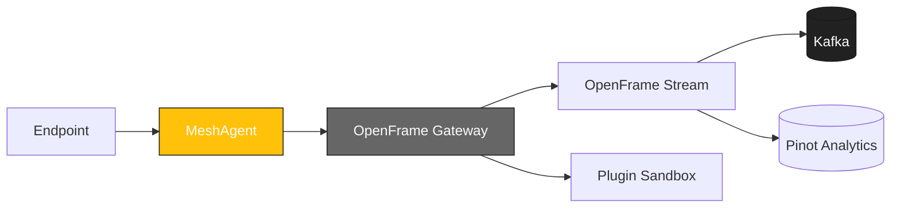

<div align="center">
  <picture>
    <!-- Dark theme -->
    <source media="(prefers-color-scheme: dark)" srcset="docs/assets/logo-openframe-full-dark-bg.png">
    <!-- Light theme -->
    <source media="(prefers-color-scheme: light)" srcset="docs/assets/logo-openframe-full-light-bg.png">
    <!-- Default / fallback -->
    
  </picture>

  <h1>MeshCentral Agent</h1>

  <p><b>Cross-platform endpoint agent for remote management, automation, and secure connectivity in the OpenFrame ecosystem.</b></p>

  <p>
    <a href="LICENSE.md">
      
    </a>
    <a href="https://www.flamingo.run/knowledge-base">
      
    </a>
    <a href="https://www.openmsp.ai/">
      
    </a>
  </p>
</div>

---

## Quick Links
- [Quick Start](#quick-start)  
- [Configuration](#configuration)  
- [Development](#development)  
- [Security](#security)  

---

## Highlights

- Remote management of endpoints (Windows, macOS, Linux)  
- Secure integration with OpenFrame Gateway  
- JWT-based authentication and enrollment secrets  
- Sandbox model for plugins and scripts  
- Auto-update support with signed binaries  
- Extensible for automation and monitoring  

---

## Architecture

MeshAgent runs on endpoints and connects securely to OpenFrame Gateway:



# MeshAgent

## Quick Start

### Prerequisites
- Node.js 18+
- Build tools (make, gcc/clang)
- Access to a running OpenFrame Gateway

### Build (native agent)
```bash
git clone https://github.com/flamingo-stack/MeshAgent.git
cd MeshAgent
npm install
make
```

### Run
```bash
./meshagent --server https://gateway.local --token <JWT>
```

## Configuration

Configuration files and environment variables allow you to set:
- `MESH_SERVER` – Gateway base URL
- `MESH_TOKEN` – JWT token for authentication
- `MESH_LOG_LEVEL` – error, warning, info, debug
- `MESH_UPDATE_CHANNEL` – stable, beta
- `MESH_PLUGIN_DIR` – path for custom plugins

---

## Development

Install dependencies:
```bash
npm install
```

Build (native agent):
```bash
make
```

Run tests (if available):
```bash
npm test
```

Format & lint (JS code):
```bash
npm run lint
```

## Security

- TLS 1.3 enforced for all transport
- JWT authentication via OpenFrame Gateway
- Enrollment secrets or pre-shared keys supported
- Sandbox model for plugins and scripts
- Auto-update support with signed binaries

Found a vulnerability? Email security@flamingo.run instead of opening a public issue.

---

## License

This project is licensed under the **Flamingo Unified License v1.0** ([LICENSE.md](LICENSE.md)).

---

<div align="center">
  <table border="0" cellspacing="0" cellpadding="0">
    <tr>
      <td align="center">
        Built with 💛 by the <a href="https://www.flamingo.run/about"><b>Flamingo</b></a> team
      </td>
      <td align="center">
        <a href="https://www.flamingo.run">Website</a> • 
        <a href="https://www.flamingo.run/knowledge-base">Knowledge Base</a> • 
        <a href="https://www.linkedin.com/showcase/openframemsp/about/">LinkedIn</a> • 
        <a href="https://www.openmsp.ai/">Community</a>
      </td>
    </tr>
  </table>
</div>

