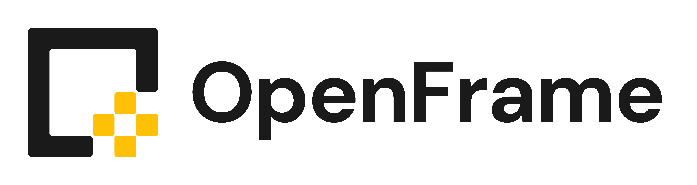
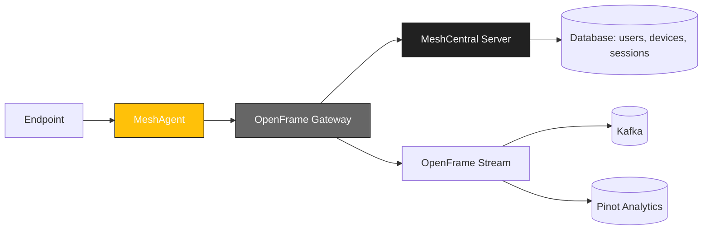

<div align="center">
  <picture>
    <!-- Dark theme -->
    <source media="(prefers-color-scheme: dark)" srcset="docs/assets/logo-openframe-full-dark-bg.png">
    <!-- Light theme -->
    <source media="(prefers-color-scheme: light)" srcset="docs/assets/logo-openframe-full-light-bg.png">
    <!-- Default / fallback -->
    
  </picture>

  <h1>MeshCentral</h1>

  <p><b>Web-based remote monitoring & management server integrated into the OpenFrame ecosystem.</b></p>

  <p>
    <a href="LICENSE.md">
      
    </a>
    <a href="https://www.flamingo.run/knowledge-base">
      
    </a>
    <a href="https://www.openmsp.ai/">
      
    </a>
  </p>
</div>

---

## Quick Links
- [Quick Start](#quick-start)  
- [Configuration](#configuration)  
- [Development](#development)  
- [Security](#security)  

---

## Highlights

- Remote access & management for devices via web interface  
- Agentless and agent-based connectivity  
- User, device, and group policy management  
- File transfer, remote desktop, and terminal support  
- Multi-tenant support with OpenFrame Gateway integration  
- Extensible with plugins and automation scripts  

---

## Architecture

MeshCentral acts as a server inside OpenFrame, connected to Gateway and endpoint agents:



## Quick Start

### Prerequisites:
- Node.js 18+
- MongoDB or MariaDB for persistence
- Access to a running OpenFrame Gateway

### Build & Run:
```bash
git clone https://github.com/flamingo-stack/MeshCentral.git
cd MeshCentral
npm install
node meshcentral
```

## Configuration

Configuration files and environment variables allow you to set:
- `MESH_SERVER` – Gateway base URL
- `MESH_TOKEN` – JWT token for authentication
- `MESH_DB` – Database connection string (MongoDB/MariaDB)
- `MESH_LOG_LEVEL` – error, warning, info, debug
- `MESH_UPDATE_CHANNEL` – stable, beta

## Development

Install dependencies:
```bash
npm install
```

Run server in development mode:
```bash
node meshcentral --debug
```

Run tests (if available):
```bash
npm test
```

Lint & format:
```bash
npm run lint
```

## Security

- TLS 1.3 enforced for all communication
- JWT authentication via OpenFrame Gateway
- Role-based access control (RBAC) for users and devices
- Database encryption for secrets
- Support for enrollment secrets or pre-shared keys

Found a vulnerability? Email security@flamingo.run instead of opening a public issue.

## Contributing

We welcome PRs! Please follow these guidelines:  
- Use branching strategy: `feature/...`, `bugfix/...`  
- Add descriptions to the **CHANGELOG**  
- Follow consistent Go code style (`go fmt`, linters)  
- Keep documentation updated in `docs/`  

---

## License

This project is licensed under the **Flamingo Unified License v1.0** ([LICENSE.md](LICENSE.md)).

---

<div align="center">
  <table border="0" cellspacing="0" cellpadding="0">
    <tr>
      <td align="center">
        Built with 💛 by the <a href="https://www.flamingo.run/about"><b>Flamingo</b></a> team
      </td>
      <td align="center">
        <a href="https://www.flamingo.run">Website</a> • 
        <a href="https://www.flamingo.run/knowledge-base">Knowledge Base</a> • 
        <a href="https://www.linkedin.com/showcase/openframemsp/about/">LinkedIn</a> • 
        <a href="https://www.openmsp.ai/">Community</a>
      </td>
    </tr>
  </table>
</div>
