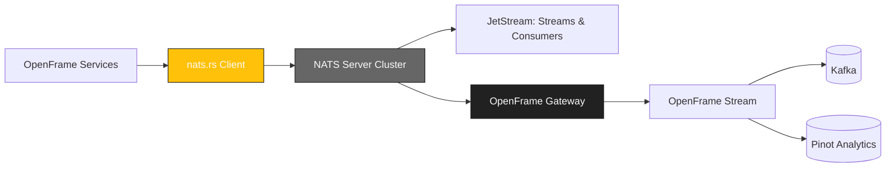

<div align="center">
  <picture>
    <!-- Dark theme -->
    <source media="(prefers-color-scheme: dark)" srcset="docs/assets/logo-openframe-full-dark-bg.png">
    <!-- Light theme -->
    <source media="(prefers-color-scheme: light)" srcset="docs/assets/logo-openframe-full-light-bg.png">
    <!-- Default / fallback -->
    
  </picture>

  <h1>Nats.rs</h1>

  <p><b>Rust client library for NATS messaging, optimized and integrated for the OpenFrame ecosystem.</b></p>

  <p>
    <a href="LICENSE.md">
      
    </a>
    <a href="https://www.flamingo.run/knowledge-base">
      
    </a>
    <a href="https://www.openmsp.ai/">
      
    </a>
  </p>
</div>

---

## Quick Links
- [Quick Start](#quick-start)  
- [Configuration](#configuration)  
- [Development](#development)  
- [Security](#security)  

---

## Highlights

- Pure Rust client for NATS messaging  
- High performance async implementation (Tokio-based)  
- JetStream support (streams, consumers, persistence)  
- TLS + JWT authentication compatible with OpenFrame Gateway  
- Resilient connections with auto-reconnect and backoff  
- Lightweight & dependency-minimal  

---

## Architecture

This library integrates with the OpenFrame Gateway and Stream to deliver reliable messaging:



## Quick Start

### Prerequisites
- Rust 1.70+
- Cargo package manager
- Access to a running NATS cluster (or OpenFrame Gateway)

### Add to Cargo.toml
```toml
[dependencies]
nats = { git = "https://github.com/flamingo-stack/nats.rs" }
```

### Publish & Subscribe example
```rust
use nats;

fn main() -> std::io::Result<()> {
    // Connect to NATS
    let nc = nats::connect("nats://127.0.0.1:4222")?;
    
    // Subscribe
    let sub = nc.subscribe("updates")?;
    
    // Publish
    nc.publish("updates", "hello from OpenFrame!")?;
    
    // Handle messages
    for msg in sub.messages() {
        println!("Received: {:?}", msg);
    }
    
    Ok(())
}
```

## Configuration

Environment variables supported:
- `NATS_URL` – NATS server URL (default: `nats://127.0.0.1:4222`)
- `NATS_CREDS` – Path to user credentials file (JWT auth)
- `NATS_TLS_CA` – Path to CA certificate for TLS
- `NATS_TLS_CERT` – Path to client certificate
- `NATS_TLS_KEY` – Path to client key

## Development

Build locally:
```bash
cargo build
```

Run tests:
```bash
cargo test
```

Lint & format:
```bash
cargo fmt
cargo clippy
```

## Security

- TLS 1.3 enforced for all communication
- JWT and nkey authentication supported
- Auto-reconnect with exponential backoff
- Secure by default (no plain TCP in production)

Found a vulnerability? Email security@flamingo.run instead of opening a public issue.

---

## Contributing

We welcome PRs! Please follow these guidelines:  
- Use branching strategy: `feature/...`, `bugfix/...`  
- Add descriptions to the **CHANGELOG**  
- Follow consistent Go code style (`go fmt`, linters)  
- Keep documentation updated in `docs/`  

---

## License

This project is licensed under the **Flamingo Unified License v1.0** ([LICENSE.md](LICENSE.md)).

---

<div align="center">
  <table border="0" cellspacing="0" cellpadding="0">
    <tr>
      <td align="center">
        Built with 💛 by the <a href="https://www.flamingo.run/about"><b>Flamingo</b></a> team
      </td>
      <td align="center">
        <a href="https://www.flamingo.run">Website</a> • 
        <a href="https://www.flamingo.run/knowledge-base">Knowledge Base</a> • 
        <a href="https://www.linkedin.com/showcase/openframemsp/about/">LinkedIn</a> • 
        <a href="https://www.openmsp.ai/">Community</a>
      </td>
    </tr>
  </table>
</div>
