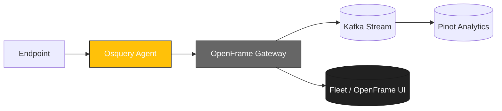

<div align="center">
  <picture>
    <!-- Dark theme -->
    <source media="(prefers-color-scheme: dark)" srcset="docs/assets/logo-openframe-full-dark-bg.png">
    <!-- Light theme -->
    <source media="(prefers-color-scheme: light)" srcset="docs/assets/logo-openframe-full-light-bg.png">
    <!-- Default / fallback -->
    
  </picture>

  <h1>Osquery</h1>

  <p><b>Cross-platform endpoint visibility and telemetry engine, integrated with OpenFrame — SQL-powered queries for Windows, macOS, and Linux.</b></p>

  <p>
    <a href="LICENSE.md">
      
    </a>
    <a href="https://www.flamingo.run/knowledge-base">
      
    </a>
    <a href="https://www.openmsp.ai/">
      
    </a>
  </p>
</div>

---

## Quick Links
- [Quick Start](#quick-start)  
- [Configuration](#configuration)  
- [Development](#development)  
- [Security](#security)  

---

## Highlights

- Unified endpoint visibility across Windows, macOS, Linux  
- Query the system state using SQL (processes, users, network, registry, etc.)  
- Lightweight daemon with minimal performance overhead  
- Extensible with custom tables and plugins  
- Integrates with OpenFrame Gateway, Stream (Kafka), and Analytics (Pinot)  
- Useful for inventory, compliance, incident response, and threat hunting  

---

## Architecture

Osquery runs as an agent on endpoints, collecting data and exposing it via SQL. Integrated with OpenFrame, results flow into Gateway → Stream → Analytics.



---

## Quick Start

Prerequisites:  
- CMake 3.22+  
- C++17 compiler (Clang or MSVC)  
- Go 1.21+ (if building extensions for OpenFrame integration)  

Build (Linux/macOS):  
```bash
git clone https://github.com/Flamingo-CX/osquery.git
cd osquery
make deps
make
./build/linux/osquery/osqueryi --version
```

Build (Windows):  
```powershell
git clone https://github.com/Flamingo-CX/osquery.git
cd osquery
tools\make-win64-binaries.bat
.\build\windows\osquery\RelWithDebInfo\osqueryi.exe --version
```

Run interactive query shell:  
```bash
osqueryi "SELECT * FROM processes LIMIT 5;"
```

---

## Configuration

Configuration supports JSON files, CLI flags, and environment variables.

Examples:  
- `--config_path=/etc/osquery/osquery.conf`  
- `--logger_plugin=filesystem`  
- `--tls_hostname=gateway.local`  
- `--enroll_secret_env=OSQUERY_ENROLL_SECRET`  

Environment variables:  
- `OSQUERY_SERVER` – OpenFrame Gateway URL  
- `OSQUERY_TOKEN` – JWT token for authentication  
- `OSQUERY_LOG_LEVEL` – error, warning, info, debug  

---

## Development

Install dependencies:  
```bash
make deps
```

Run tests:  
```bash
make test
```

Lint & format:  
```bash
make format
make lint
```

---

## Security

- TLS 1.3 enforced for all communication  
- JWT / enrollment secrets via OpenFrame Gateway  
- Minimal privileges required on endpoints  
- Sandboxed extensions & plugins  

Found a vulnerability? Email **security@flamingo.run** instead of opening a public issue.  

---

## Contributing

We welcome PRs! Please follow these guidelines:  
- Use branching strategy: `feature/...`, `bugfix/...`  
- Add descriptions to the **CHANGELOG**  
- Run `make test` before submitting  
- Keep documentation updated in `docs/`  

---

## License

This project is licensed under the **Flamingo Unified License v1.0** ([LICENSE.md](LICENSE.md)).

---

<div align="center">
  <table border="0" cellspacing="0" cellpadding="0">
    <tr>
      <td align="center">
        Built with 💛 by the <a href="https://www.flamingo.run/about"><b>Flamingo</b></a> team
      </td>
      <td align="center">
        <a href="https://www.flamingo.run">Website</a> • 
        <a href="https://www.flamingo.run/knowledge-base">Knowledge Base</a> • 
        <a href="https://www.linkedin.com/showcase/openframemsp/about/">LinkedIn</a> • 
        <a href="https://www.openmsp.ai/">Community</a>
      </td>
    </tr>
  </table>
</div>
