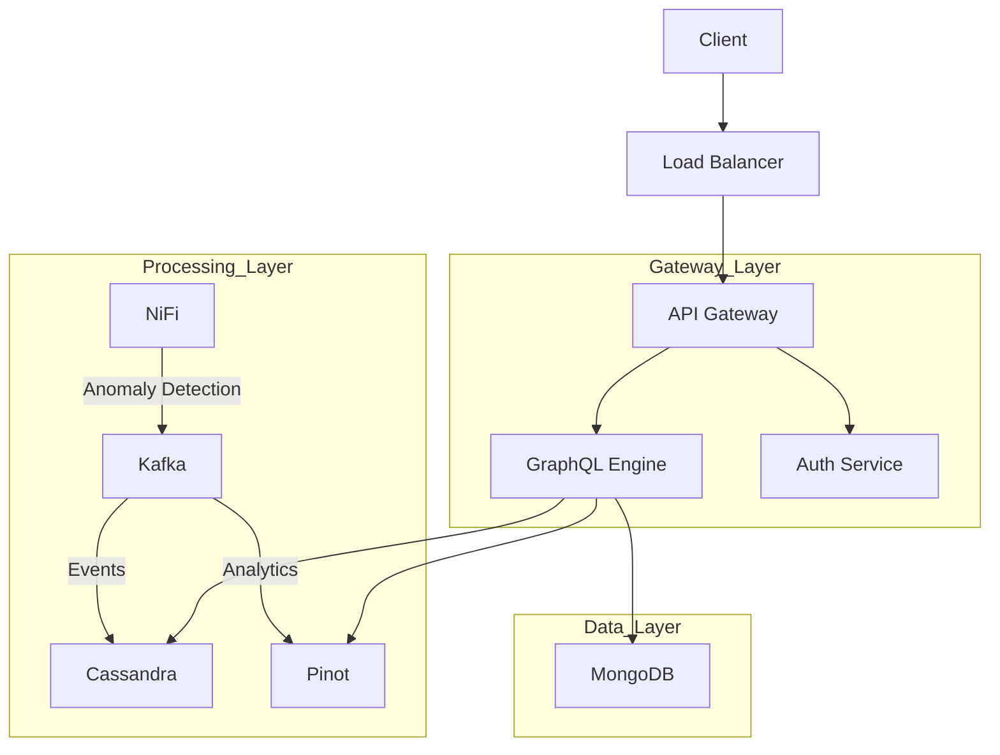
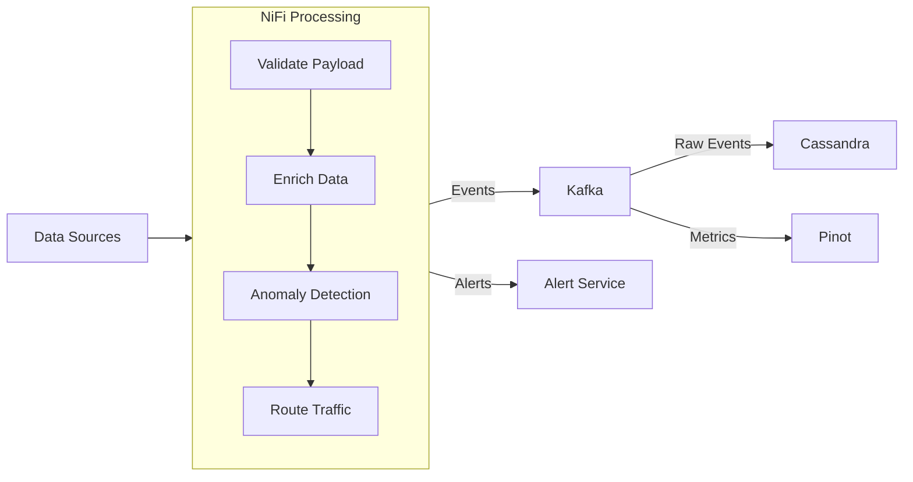

# 


[](https://github.com/Flamingo-CX/openframe/actions/workflows/ci.yml)

# OpenFrame Complete Architecture and Implementation Guide

## Table of Contents
1. System Overview
2. Data Flows and System Architecture
3. Core Components
4. Shared Core Library
5. GraphQL Implementation
6. Service Implementations
7. Database Architecture
8. Analytics with Apache Pinot
9. Security Implementation
10. Deployment and Observability
11. Future Enhancements

## 1. System Overview

### 1.1 Architecture
OpenFrame is a distributed platform built on microservices architecture, designed for high scalability and resilience.

The purpose of OpenFrame is to create a single data, API, automation, and AI layer on top of a curated list of existing open-source projects, resulting in a unified IT and security platform. This platform offers:
- A unified dashboard for managing services and workflows.
- Automated deployments and monitoring.
- Anomaly detection and AI “copilots” (assistants) for real-time predictive insights.
- Integrated security controls ensuring consistent and secure access across services.

By combining proven open-source components like NiFi, Kafka, Pinot, etc., OpenFrame provides an end-to-end solution featuring advanced data flow management, AI-driven analytics, and a tightly integrated security model—all exposed through a cohesive API. This reduces complexity, increases developer productivity, and allows organizations to focus on building new capabilities rather than reinventing core infrastructure.

Key components:
- API Gateway with unified GraphQL interface
- Event-driven stream processing with NiFi and Kafka
- Multi-layered data storage:
  * MongoDB for application data
  * Cassandra for event storage
  * Apache Pinot for analytics
- Service mesh for inter-service communication
- Containerized deployment with Kubernetes

### 1.2 Technology Stack

#### Core Technologies
- Backend: Spring Boot 3.2.x, OpenJDK 21
- API: GraphQL (Netflix DGS Framework)
- Stream Processing: Apache NiFi 2.0
- Databases: 
  * MongoDB 7.x (application data)
  * Cassandra 4.x (event storage)
  * Apache Pinot 1.0.0 (analytics)
- Message Queue: Apache Kafka 3.6
- Service Mesh: Istio 1.20
- Observability: Prometheus, Grafana, Loki

#### Development Requirements
- OpenJDK 21.0.1+
- Maven 3.9.6+
- Docker 24.0+ and Docker Compose 2.23+
- Kubernetes 1.28+
- Git 2.42+

### 1.3 System Requirements
Describes basic performance targets (e.g., max latency < 500ms, 100,000 events/sec throughput), availability goals, 
and compliance requirements (AES-256 encryption, OAuth 2.0 / JWT authentication, audit logging).

## 2. Data Flows and System Architecture

### 2.1 High-Level Architecture


### 2.2 Stream Processing Flow


### 2.3 Data Processing Rules
Defines NiFi rules and processors that validate and enrich events, apply anomaly detection (e.g., thresholds, Z-score),
and route them to Kafka or an internal alerts service based on event type or priority.

### 2.4 Data Storage Strategy
Outlines how MongoDB stores app data and configurations, Cassandra handles time-series events and logs, 
and Pinot handles real-time analytics and complex aggregations.

### 2.5 System Integration Points
This visual depicts how Agents and Applications talk to the Gateway, which routes requests to microservices
and various data stores. MongoDB, Cassandra, and Pinot are used for application data, event storage, and
analytics, respectively.

## 3. Core Components

### 3.1 API Gateway Configuration
Configures Spring Cloud Gateway to route traffic from /graphql and /health routes to the appropriate microservices,
applying rate-limiting (e.g., Redis) and circuit breaker fallback endpoints. Ensures requests are throttled when needed
and gracefully rerouted if a service is unavailable.

### 3.2 Stream Processing Configuration
Defines an Apache NiFi flow that ingests data from Kafka topics like "raw-events," applies transformations or anomaly
detection (e.g., IsolationForest), and routes processed data to downstream topics or services for further analysis.

### 3.3 Kafka Configuration
Specifies bootstrap server addresses, JSON serializers, an idempotent producer mode for guaranteed delivery, and
declares multiple topics (raw-events, processed-events, anomalies) with partition and replication settings to handle
heavy loads and ensure fault tolerance.

### 3.4 Additional Modules
- openframe-management: A dedicated service for orchestrating and configuring integrated tools (like NiFi, Grafana, etc.) and performing administrative tasks.
- openframe-data: A shared data-access library that centralizes database repositories, Cassandra models, and Mongo repositories for other services to reuse.
- openframe-security: A library containing JWT logic, OAuth2 resource server configuration, and fundamental security patterns (e.g., web security config).
- openframe-gateway.yml: YAML configuration for the API gateway (Spring Cloud Gateway) that handles traffic routing, global CORS rules, and custom filters.

### 3.5 Istio Service Mesh
Uses Istio VirtualService resources and gateways to match URLs like /graphql, define retries (e.g., three attempts),
and set timeouts (e.g., 10 seconds). Provides traffic management, service discovery, and resiliency within the mesh.

### 3.6 Circuit Breaker Configuration
Employs libraries such as Resilience4j or Spring Cloud Circuit Breaker to define thresholds, fallback strategies, and
timing rules. Opens circuits when a service repeatedly fails or is slow, preventing cascading issues and improving
overall system reliability.

## 4. Shared Core Library
OpenFrame includes a “core” library, located under libs/openframe-core, which hosts shared domain models, utilities, and configurations. 
This library helps maintain consistency across microservices by:
- Providing common entities (e.g., User, Device, OAuthToken).
- Offering baseline services like CoreService for general event processing.
- Including optional Dockerfiles for debugging, if you need to run openframe-core as a standalone microservice.
- Containing commented-out or optional dependencies related to Spring Security or JWT for easy integration when required.

## 5. GraphQL Implementation

### 5.1 Schema Definition
Describes the data models, available queries, and mutation endpoints for retrieving and modifying users, events,
and analytical insights. Incorporates time-based fields (TimeRange) and enumerations for flexible queries.

### 5.2 GraphQL Configuration
Loads a .graphql schema from the classpath and sets up DataLoaderRegistry. Facilitates batching, caching, and
structured query handling for improved performance across microservices.

### 5.3 Resolvers Implementation
Maps each field in the schema (e.g., user, events, analytics) to its underlying service method. Retrieves data
from MongoDB, Cassandra, or Pinot, ensuring GraphQL queries are served with correct business logic.

### 5.4 Data Loaders
Implements asynchronous fetching of related objects. Automatically groups and batches queries (e.g., for user
events), boosting performance and reducing redundant database calls.

### 5.5 Error Handling
Wraps GraphQL queries/mutations in a custom exception handler, converting domain or security errors into GraphQL errors. 
Supports custom error codes (e.g., from a BusinessException) and security checks before returning error responses.

## 6. Service Implementations

### 6.1 Base Service Configuration
Provides the primary Spring Boot entry point, adding logging support, CORS rules, and optional discovery-client features. 
Ensures each microservice can run with consistent configuration across the OpenFrame ecosystem.

### 6.2 User Service
```java
@Service
@Slf4j
public class UserService {
    private final MongoTemplate mongoTemplate;
    private final RedisCacheManager cacheManager;

    @Cacheable(value = "users", key = "#id")
    public User findById(String id) {
        return mongoTemplate.findById(id, User.class);
    }

    @Cacheable(value = "users", key = "#tenantId")
    public List<User> findByTenantId(String tenantId, UserFilter filter) {
        Query query = new Query(Criteria.where("tenantId").is(tenantId));
        if (filter != null) {
            applyFilter(query, filter);
        }
        return mongoTemplate.find(query, User.class);
    }

    @CacheEvict(value = "users", key = "#result.id")
    public User createUser(CreateUserInput input) {
        User user = User.builder()
            .tenantId(input.getTenantId())
            .email(input.getEmail())
            .role(input.getRole())
            .settings(input.getSettings())
            .build();
        
        return mongoTemplate.save(user);
    }
}
```

### 6.3 Event Service
```java
@Service
@Slf4j
public class EventService {
    private final CassandraTemplate cassandraTemplate;
    private final KafkaTemplate<String, Event> kafkaTemplate;

    public List<Event> findEvents(
            String tenantId, 
            TimeRange timeRange,
            EventFilter filter) {
        
        Select select = QueryBuilder.select().from("events");
        Where where = select.where(
            QueryBuilder.eq("tenant_id", tenantId))
            .and(QueryBuilder.gte("timestamp", timeRange.getStart()))
            .and(QueryBuilder.lte("timestamp", timeRange.getEnd()));
            
        if (filter != null) {
            applyFilter(where, filter);
        }
        
        return cassandraTemplate.select(select, Event.class);
    }

    public void createEvent(CreateEventInput input) {
        Event event = Event.builder()
            .tenantId(input.getTenantId())
            .type(input.getType())
            .timestamp(Instant.now())
            .data(input.getData())
            .source(input.getSource())
            .build();
            
        // Send to Kafka for processing by NiFi
        kafkaTemplate.send("raw-events", event.getTenantId(), event)
            .addCallback(
                success -> log.debug("Event published successfully"),
                failure -> log.error("Failed to publish event", failure)
            );
    }
}
```

### 6.4 Analytics Service
```java
@Service
@Slf4j
public class AnalyticsService {
    private final Connection pinotConnection;
    private final CacheManager cacheManager;

    public AnalyticsResult getAnalytics(
            String tenantId,
            List<String> metrics,
            List<String> dimensions,
            TimeRange timeRange) {
        
        String cacheKey = buildCacheKey(tenantId, metrics, dimensions, timeRange);
        return cacheManager.getCache("analytics")
            .get(cacheKey, () -> queryPinot(
                tenantId, 
                metrics, 
                dimensions, 
                timeRange
            ));
    }

    private AnalyticsResult queryPinot(
            String tenantId,
            List<String> metrics,
            List<String> dimensions,
            TimeRange timeRange) {
        
        String query = buildPinotQuery(tenantId, metrics, dimensions, timeRange);
        ResultSet resultSet = pinotConnection.execute(query);
        return processResults(resultSet);
    }

    private String buildPinotQuery(
            String tenantId,
            List<String> metrics,
            List<String> dimensions,
            TimeRange timeRange) {
        
        return """
            SELECT %s, %s
            FROM events
            WHERE tenantId = '%s'
                AND timestamp BETWEEN %d AND %d
            GROUP BY %s, DATETIMECONVERT(timestamp, '1:MILLISECONDS:EPOCH', 
                     '1:MILLISECONDS:SIMPLE_DATE_FORMAT:%s', '1:MILLISECONDS')
            """.formatted(
                String.join(", ", dimensions),
                buildMetricsClause(metrics),
                tenantId,
                timeRange.getStart().toEpochMilli(),
                timeRange.getEnd().toEpochMilli(),
                String.join(", ", dimensions),
                timeRange.getGranularity().getFormat()
            );
    }
}
```

## 7. Database Architecture

### 7.1 MongoDB Configuration
```yaml
spring:
  data:
    mongodb:
      uri: mongodb://${MONGO_USER}:${MONGO_PASSWORD}@${MONGO_HOST}:27017/${MONGO_DATABASE}
      database: openframe
      options:
        max-connection-idle-time: 60000
        connect-timeout: 10000
  
  mongodb:
    indexes:
      enabled: true
      auto: true
```

### 7.2 Application Data Models
```java
@Document(collection = "users")
public class User {
    @Id
    private String id;
    
    @Indexed
    private String tenantId;
    
    @Indexed(unique = true)
    private String email;
    
    private UserRole role;
    private Map<String, Object> settings;
    private Date createdAt;
    private Date updatedAt;
    
    @Version
    private Long version;
}

@Document(collection = "tenants")
public class Tenant {
    @Id
    private String id;
    
    @Indexed(unique = true)
    private String name;
    
    private TenantConfig config;
    private List<String> allowedOrigins;
    private Map<String, Object> features;
    private Date createdAt;
    private Date updatedAt;
}

@Document(collection = "configurations")
public class SystemConfig {
    @Id
    private String id;
    
    @Indexed
    private String category;
    
    private String key;
    private Object value;
    private String description;
    private Date lastModified;
    
    @Version
    private Long version;
}
```

### 7.3 Cassandra Configuration
```yaml
spring:
  data:
    cassandra:
      keyspace-name: openframe
      contact-points: ${CASSANDRA_HOST}
      port: 9042
      local-datacenter: dc1
      schema-action: CREATE_IF_NOT_EXISTS
      request:
        timeout: 10s
      connection:
        connect-timeout: 10s
        init-query-timeout: 10s
```

### 7.4 Event Data Models
```java
@Table(name = "events")
public class Event {
    @PrimaryKey
    private EventKey key;
    
    @Column(name = "event_type")
    private String type;
    
    @Column(name = "event_data")
    private Map<String, String> data;
    
    @Column
    private String source;
    
    @Column
    private Instant timestamp;
    
    @Data
    public static class EventKey {
        @PrimaryKeyColumn(
            name = "tenant_id", 
            ordinal = 0, 
            type = PrimaryKeyType.PARTITIONED
        )
        private String tenantId;
        
        @PrimaryKeyColumn(
            name = "year_month", 
            ordinal = 1, 
            type = PrimaryKeyType.PARTITIONED
        )
        private YearMonth yearMonth;
        
        @PrimaryKeyColumn(
            name = "event_id",
            ordinal = 2,
            type = PrimaryKeyType.CLUSTERED,
            ordering = Ordering.DESCENDING
        )
        private UUID eventId;
    }
}

// Additional tables for specific event types
@Table(name = "audit_logs")
public class AuditLog {
    @PrimaryKey
    private AuditLogKey key;
    
    @Column
    private String action;
    
    @Column
    private String userId;
    
    @Column
    private String resourceType;
    
    @Column
    private String resourceId;
    
    @Column
    private Map<String, String> changes;
    
    @Column
    private String status;
}
```

### 7.5 Database Access Patterns
```java
@Configuration
public class DatabaseConfig {
    
    @Bean
    public CassandraTemplate cassandraTemplate(Session session) {
        return new CassandraTemplate(session);
    }
    
    @Bean
    public MongoTemplate mongoTemplate(MongoDatabaseFactory mongoDbFactory) {
        MongoTemplate template = new MongoTemplate(mongoDbFactory);
        
        // Custom converters
        template.setWriteConcern(WriteConcern.MAJORITY);
        template.setReadPreference(ReadPreference.primaryPreferred());
        
        return template;
    }
}

@Component
public class EventRepository {
    private final CassandraTemplate cassandraTemplate;
    
    public List<Event> findByTenantAndTimeRange(
            String tenantId, 
            Instant start, 
            Instant end) {
        
        Select select = QueryBuilder.select().from("events");
        Where where = select.where(
            QueryBuilder.eq("tenant_id", tenantId))
            .and(QueryBuilder.gte("timestamp", start))
            .and(QueryBuilder.lte("timestamp", end));
            
        return cassandraTemplate.select(select, Event.class);
    }
    
    public void saveEvent(Event event) {
        cassandraTemplate.insert(event);
    }
}
```

## 8. Analytics with Apache Pinot

### 8.1 Pinot Schema Definition
```yaml
schemaName: events
dimensionFieldSpecs:
  - name: tenant_id
    dataType: STRING
  - name: event_type
    dataType: STRING
  - name: source
    dataType: STRING
  - name: user_id
    dataType: STRING
  
metricFieldSpecs:
  - name: duration_ms
    dataType: LONG
  - name: value
    dataType: DOUBLE
  
dateTimeFieldSpecs:
  - name: timestamp
    dataType: TIMESTAMP
    format: 1:MILLISECONDS:EPOCH
    granularity: 1:MILLISECONDS

schemaAnnotations:
  retention.timeunit: DAYS
  retention.timevalue: "90"
```

### 8.2 Table Configuration
```yaml
tableName: events
tableType: HYBRID
segmentsConfig:
  timeColumnName: timestamp
  timeType: MILLISECONDS
  retentionTimeUnit: DAYS
  retentionTimeValue: 90
  segmentPushFrequency: 1h
  segmentPushType: APPEND
  replication: 2
  schemaName: events

tenantConfig:
  broker: DefaultTenant
  server: DefaultTenant

indexingConfig:
  loadMode: MMAP
  sortedColumn: [timestamp]
  invertedIndexColumns: [tenant_id, event_type]
  rangeIndexColumns: [timestamp]
  aggregateMetrics: true
  noDictionaryColumns: [value]

streamConfig:
  streamType: kafka
  stream.kafka.consumer.type: lowLevel
  stream.kafka.topic.name: events
  stream.kafka.decoder.class.name: org.apache.pinot.plugin.stream.kafka.KafkaJSONMessageDecoder
  stream.kafka.consumer.factory.class.name: org.apache.pinot.plugin.stream.kafka.KafkaConsumerFactory
  stream.kafka.broker.list: kafka:9092
  stream.kafka.consumer.prop.auto.offset.reset: largest
```

### 8.3 Analytics Service Implementation
```java
@Service
@Slf4j
public class PinotAnalyticsService {
    private final Connection pinotConnection;
    private final CacheManager cacheManager;

    public AnalyticsResult getAggregatedMetrics(AnalyticsQuery query) {
        String cacheKey = generateCacheKey(query);
        return cacheManager.getCache("analytics")
            .get(cacheKey, () -> executeQuery(query));
    }

    private AnalyticsResult executeQuery(AnalyticsQuery query) {
        String sql = buildQuery(query);
        log.debug("Executing Pinot query: {}", sql);
        
        ResultSet resultSet = pinotConnection.execute(sql);
        return processResults(resultSet, query);
    }

    private String buildQuery(AnalyticsQuery query) {
        StringBuilder sql = new StringBuilder();
        sql.append("SELECT ")
           .append(buildDimensionClause(query.getDimensions()))
           .append(", ")
           .append(buildMetricsClause(query.getMetrics()))
           .append(" FROM events")
           .append(" WHERE tenant_id = '").append(query.getTenantId()).append("'")
           .append(" AND timestamp BETWEEN ").append(query.getStartTime())
           .append(" AND ").append(query.getEndTime());

        if (!query.getDimensions().isEmpty()) {
            sql.append(" GROUP BY ")
               .append(buildDimensionClause(query.getDimensions()));
        }

        if (query.getLimit() > 0) {
            sql.append(" LIMIT ").append(query.getLimit());
        }

        return sql.toString();
    }

    private String buildMetricsClause(List<MetricDefinition> metrics) {
        return metrics.stream()
            .map(metric -> switch (metric.getType()) {
                case COUNT -> "COUNT(*)";
                case SUM -> "SUM(" + metric.getField() + ")";
                case AVG -> "AVG(" + metric.getField() + ")";
                case DISTINCT -> "DISTINCTCOUNT(" + metric.getField() + ")";
                default -> throw new UnsupportedOperationException(
                    "Unsupported metric type: " + metric.getType()
                );
            })
            .collect(Collectors.joining(", "));
    }
}
```

### 8.4 Pinot Query Models
```java
@Data
@Builder
public class AnalyticsQuery {
    private String tenantId;
    private List<String> dimensions;
    private List<MetricDefinition> metrics;
    private long startTime;
    private long endTime;
    private TimeGranularity granularity;
    private Map<String, String> filters;
    private int limit;

    @Data
    public static class MetricDefinition {
        private String field;
        private MetricType type;
        private String alias;
    }

    public enum MetricType {
        COUNT,
        SUM,
        AVG,
        DISTINCT,
        MAX,
        MIN
    }

    public enum TimeGranularity {
        MINUTE("PT1M"),
        HOUR("PT1H"),
        DAY("P1D"),
        WEEK("P1W"),
        MONTH("P1M");

        private final String format;
    }
}
```

### 8.5 Realtime Analytics Integration
```java
@Component
@Slf4j
public class RealtimeAnalyticsProcessor {
    private final PinotAnalyticsService analyticsService;
    private final AlertService alertService;

    @KafkaListener(
        topics = "processed-events",
        groupId = "analytics-processor"
    )
    public void processEvent(ConsumerRecord<String, ProcessedEvent> record) {
        ProcessedEvent event = record.value();
        
        try {
            // Check for anomalies in real-time
            AnalyticsResult realtimeMetrics = analyticsService
                .getRealtimeMetrics(event.getTenantId());

            if (isAnomaly(realtimeMetrics)) {
                alertService.sendAlert(
                    event.getTenantId(),
                    createAnomalyAlert(realtimeMetrics)
                );
            }

        } catch (Exception e) {
            log.error("Error processing event for analytics", e);
        }
    }

    private boolean isAnomaly(AnalyticsResult metrics) {
        return metrics.getMetrics().stream()
            .anyMatch(metric -> 
                metric.getValue() > metric.getThreshold() * 1.5);
    }
}
```

## 9. Security Implementation

### 9.1 Security Configuration
```java
@Configuration
@EnableWebSecurity
@EnableGlobalMethodSecurity(prePostEnabled = true)
public class SecurityConfig {
    @Bean
    public SecurityFilterChain filterChain(HttpSecurity http) throws Exception {
        return http
            .csrf().disable()
            .cors().configurationSource(corsConfigurationSource())
            .and()
            .sessionManagement()
                .sessionCreationPolicy(SessionCreationPolicy.STATELESS)
            .and()
            .authorizeRequests()
                .antMatchers("/graphql").authenticated()
                .antMatchers("/health/**").permitAll()
                .anyRequest().authenticated()
            .and()
            .oauth2ResourceServer()
                .jwt()
                .jwtAuthenticationConverter(jwtAuthenticationConverter())
            .and()
            .build();
    }

    @Bean
    public JwtAuthenticationConverter jwtAuthenticationConverter() {
        JwtGrantedAuthoritiesConverter authoritiesConverter = 
            new JwtGrantedAuthoritiesConverter();
        authoritiesConverter.setAuthorityPrefix("ROLE_");
        authoritiesConverter.setAuthoritiesClaimName("roles");

        JwtAuthenticationConverter converter = new JwtAuthenticationConverter();
        converter.setJwtGrantedAuthoritiesConverter(authoritiesConverter);
        return converter;
    }
}
```

### 9.2 Tenant Security
```java
@Aspect
@Component
public class TenantSecurityAspect {
    @Autowired
    private SecurityContextHolder securityContextHolder;

    @Around("@annotation(requiresTenant)")
    public Object enforceTenantSecurity(
            ProceedingJoinPoint joinPoint, 
            RequiresTenant requiresTenant) throws Throwable {
        
        String tenantId = extractTenantId(joinPoint);
        if (!isAuthorizedForTenant(tenantId)) {
            throw new TenantAccessDeniedException(
                "Access denied to tenant: " + tenantId
            );
        }
        return joinPoint.proceed();
    }

    private boolean isAuthorizedForTenant(String tenantId) {
        JwtAuthenticationToken token = (JwtAuthenticationToken)
            SecurityContextHolder.getContext().getAuthentication();
            
        String userTenantId = token.getToken().getClaim("tenant_id");
        return userTenantId.equals(tenantId) || 
               hasGlobalAdminRole(token);
    }
}
```

### 9.3 GraphQL Security
Intercepts GraphQL requests before execution, extracting tenant info from variables or JWT claims. Enforces
access checks so users can query only their authorized tenants, throwing exceptions on invalid attempts.

### 9.4 Data Encryption
Provides symmetric encryption (AES with GCM) for sensitive fields. Generates IVs, finalizes encryption, and
stores encoded results. Decryption is similarly managed, ensuring data confidentiality at rest or in transit.

### 9.5 Audit Logging
Wraps selected service methods in an auditing aspect. Logs the operation name, parameters, status, and any
failures to a Kafka topic. Enables a secure audit trail for diagnosing issues or compliance checks.

### 9.6 Rate Limiting
Uses a Redis-based rate limiter to throttle excessive requests. Service methods annotated with PreFilter calls
verify an incoming user or tenant has not exceeded set limits, preventing abuse or spikes.

## 10. Deployment and Observability

### 10.1 Kubernetes Deployment
Describes how to run microservices in Kubernetes with horizontal scaling, resource limits (e.g., CPU, memory),
and readiness/liveness probes. Ensures containers stay healthy and restart on failure automatically.

### 10.2 Monitoring Stack
Declares how Prometheus scrapes each service (via ServiceMonitor) and defines a customizable Grafana dashboard
to visualize GraphQL performance, NiFi event processing, or Pinot query latency in real time.

### 10.3 Logging Configuration
Provides a centralized logging setup (Loki) and a log-shipper agent (Promtail):
• Defines where logs are collected, stored, and queried.
• Ensures each container or pod log is automatically aggregated for quick searches.

### 10.4 Metrics Collection
Uses Prometheus instrumentation for capturing application metrics:
• Tracks GraphQL query durations, success/failure rates, and other service-level metrics.
• Exposes an endpoint for Prometheus to scrape, powering dashboards and alerts.

### 10.5 Alerting Rules
Defines threshold-based alerts in Prometheus for monitoring things like:
• High GraphQL error rates, slow query performance.
• NiFi backpressure or Pinot query latency.
Warns operators if performance or reliability degrade beyond certain limits.

### 10.6 Tracing Configuration
Leverages OpenTelemetry to enable distributed tracing with Jaeger:
• Captures end-to-end request flows across microservices.
• Uses sampling, integrated correlation headers, and a collector endpoint to visualize traces.

## 11. Future Enhancements

### 11.1 Planned Features
Outlines upcoming enhancements like GraphQL Subscriptions for real-time updates, advanced NiFi processors with ML,
multi-region deployments for increased scalability, zero-trust security architectures, and improved caching strategies.

### 11.2 Technical Debt and Improvements
Summarizes high-level cleanup and modernization tasks:
• Dependency upgrades, resource optimizations, better test coverage.
• More robust backup strategies and improved automation.

### 11.3 Research Areas
Investigates longer-term goals (machine learning, NiFi optimizations, OLAP expansions):
• Automated anomaly detection, pattern recognition, advanced real-time analytics.
• Possibly new data-aggregation or predictive features still under exploration.
