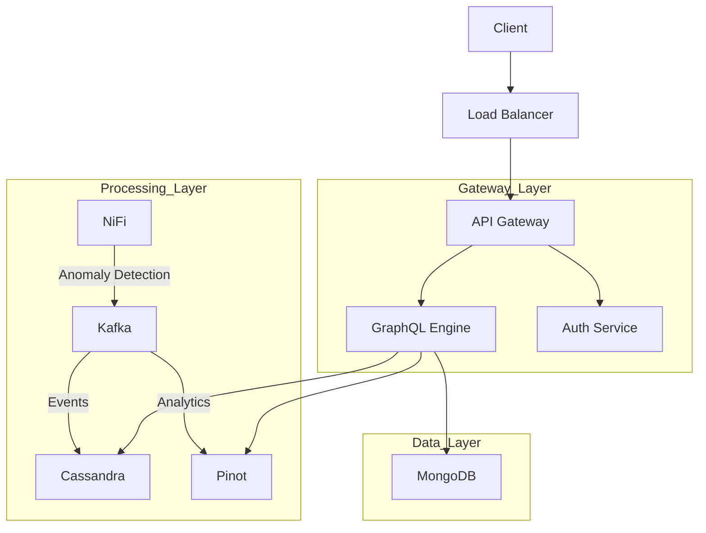
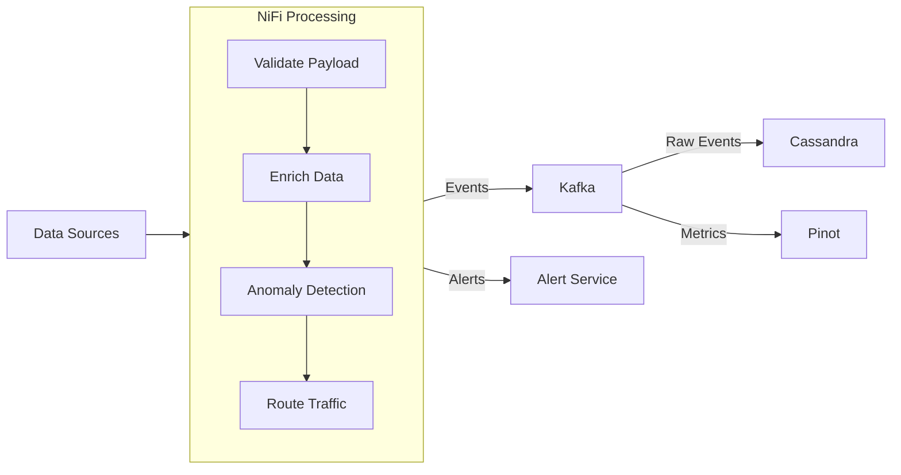
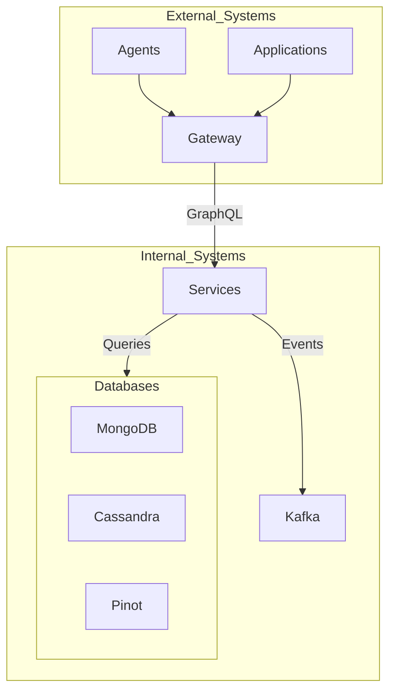

# 


[](https://github.com/Flamingo-CX/openframe/actions/workflows/ci.yml)

# OpenFrame Complete Architecture and Implementation Guide

## Table of Contents
1. System Overview
2. Data Flows and System Architecture
3. Core Components
4. Shared Core Library
5. GraphQL Implementation
6. Service Implementations
7. Database Architecture
8. Analytics with Apache Pinot
9. Security Implementation
10. Deployment and Observability
11. Future Enhancements

## 1. System Overview

### 1.1 Architecture
OpenFrame is a distributed platform built on microservices architecture, designed for high scalability and resilience.

The purpose of OpenFrame is to create a single data, API, automation, and AI layer on top of a curated list of existing open-source projects, resulting in a unified IT and security platform. This platform offers:
- A unified dashboard for managing services and workflows.
- Automated deployments and monitoring.
- Anomaly detection and AI “copilots” (assistants) for real-time predictive insights.
- Integrated security controls ensuring consistent and secure access across services.

By combining proven open-source components like NiFi, Kafka, Pinot, etc., OpenFrame provides an end-to-end solution featuring advanced data flow management, AI-driven analytics, and a tightly integrated security model—all exposed through a cohesive API. This reduces complexity, increases developer productivity, and allows organizations to focus on building new capabilities rather than reinventing core infrastructure.

Key components:
- API Gateway with unified GraphQL interface
- Event-driven stream processing with NiFi and Kafka
- Multi-layered data storage:
  * MongoDB for application data
  * Cassandra for event storage
  * Apache Pinot for analytics
- Service mesh for inter-service communication
- Containerized deployment with Kubernetes

### 1.2 Technology Stack

#### Core Technologies
- Backend: Spring Boot 3.2.x, OpenJDK 21
- API: GraphQL (Netflix DGS Framework)
- Stream Processing: Apache NiFi 2.0
- Databases: 
  * MongoDB 7.x (application data)
  * Cassandra 4.x (event storage)
  * Apache Pinot 1.0.0 (analytics)
- Message Queue: Apache Kafka 3.6
- Service Mesh: Istio 1.20
- Observability: Prometheus, Grafana, Loki

#### Development Requirements
- OpenJDK 21.0.1+
- Maven 3.9.6+
- Docker 24.0+ and Docker Compose 2.23+
- Kubernetes 1.28+
- Git 2.42+

### 1.3 System Requirements
```yaml
requirements:
  performance:
    latency: 
      graphql_queries: < 200ms
      analytics_queries: < 500ms
      stream_processing: < 100ms
    throughput: 100,000 events/second
    availability: 99.99%
  scaling:
    users: 10,000+ concurrent
    data_volume: 1TB+/day
    retention: 1-7 years
  compliance:
    data_encryption: AES-256
    authentication: OAuth 2.0 + JWT
    audit_logging: Enabled
```
## 2. Data Flows and System Architecture

### 2.1 High-Level Architecture


### 2.2 Stream Processing Flow


### 2.3 Data Processing Rules
```yaml
nifi_processors:
  validation:
    - schema_validation
    - data_type_check
    - required_fields
  
  enrichment:
    - geo_location
    - tenant_context
    - metadata_injection
  
  anomaly_detection:
    rules:
      - type: threshold
        metrics: ["response_time", "error_rate"]
        window: 5m
      - type: zscore
        metrics: ["transaction_volume"]
        threshold: 3
    actions:
      - alert
      - tag_event
      - route_to_investigation

  routing:
    - condition: "event.type == 'metric'"
      destination: "pinot"
    - condition: "event.type == 'log'"
      destination: "cassandra"
    - condition: "event.priority == 'high'"
      destination: "alerts"
```

### 2.4 Data Storage Strategy
```yaml
storage_strategy:
  mongodb:
    purpose: "Application data and configurations"
    data_types:
      - user_profiles
      - tenant_configs
      - system_settings
    access_patterns:
      - flexible_queries
      - CRUD_operations
      
  cassandra:
    purpose: "Event and time-series storage"
    data_types:
      - system_events
      - audit_logs
      - metrics
    access_patterns:
      - time_range_queries
      - high_volume_writes
      
  pinot:
    purpose: "Analytics and aggregations"
    data_types:
      - aggregated_metrics
      - analytical_views
    access_patterns:
      - real_time_analytics
      - complex_aggregations
```

### 2.5 System Integration Points


## 3. Core Components

### 3.1 API Gateway Configuration
(code block removed)

### 3.2 Stream Processing Configuration
(code block removed)

### 3.3 Kafka Configuration
(code block removed)

### 3.4 Additional Modules
- openframe-management: A dedicated service for orchestrating and configuring integrated tools (like NiFi, Grafana, etc.) and performing administrative tasks.
- openframe-data: A shared data-access library that centralizes database repositories, Cassandra models, and Mongo repositories for other services to reuse.
- openframe-security: A library containing JWT logic, OAuth2 resource server configuration, and fundamental security patterns (e.g., web security config).
- openframe-gateway.yml: YAML configuration for the API gateway (Spring Cloud Gateway) that handles traffic routing, global CORS rules, and custom filters.

### 3.5 Istio Service Mesh
(code block removed)

### 3.6 Circuit Breaker Configuration
(code block removed)

## 4. Shared Core Library
OpenFrame includes a “core” library, located under libs/openframe-core, which hosts shared domain models, utilities, and configurations. 
This library helps maintain consistency across microservices by:
- Providing common entities (e.g., User, Device, OAuthToken).
- Offering baseline services like CoreService for general event processing.
- Including optional Dockerfiles for debugging, if you need to run openframe-core as a standalone microservice.
- Containing commented-out or optional dependencies related to Spring Security or JWT for easy integration when required.

## 5. GraphQL Implementation

### 5.1 Schema Definition
```graphql
type Query {
  # User queries (MongoDB)
  user(id: ID!): User!
  users(tenantId: ID!, filter: UserFilter): [User!]!

  # Event queries (Cassandra)
  events(
    tenantId: ID!,
    timeRange: TimeRange!,
    filter: EventFilter
  ): [Event!]!

  # Analytics queries (Pinot)
  analytics(
    tenantId: ID!,
    metrics: [String!]!,
    dimensions: [String!],
    timeRange: TimeRange!
  ): AnalyticsResult!
}

type Mutation {
  createUser(input: CreateUserInput!): User!
  updateUser(id: ID!, input: UpdateUserInput!): User!
  
  createEvent(input: CreateEventInput!): Event!
}

type User {
  id: ID!
  tenantId: ID!
  email: String!
  role: UserRole!
  settings: JSONObject
  events: [Event!]!
  analytics: UserAnalytics!
}

type Event {
  id: ID!
  tenantId: ID!
  type: String!
  timestamp: DateTime!
  data: JSONObject!
  source: String
  user: User
}

type AnalyticsResult {
  dimensions: [String!]!
  metrics: [MetricResult!]!
  timeRange: TimeRange!
}

input TimeRange {
  start: DateTime!
  end: DateTime!
  granularity: TimeGranularity!
}

enum TimeGranularity {
  MINUTE
  HOUR
  DAY
  WEEK
  MONTH
}
```

### 5.2 GraphQL Configuration
```java
@Configuration
public class GraphQLConfig {
    @Bean
    public SchemaProvider schemaProvider() {
        return new ClasspathSchemaProvider("/schema/**/*.graphql");
    }

    @Bean
    public DataLoaderRegistry dataLoaderRegistry(
            UserDataLoader userDataLoader,
            EventDataLoader eventDataLoader,
            AnalyticsDataLoader analyticsDataLoader) {
        
        DataLoaderRegistry registry = new DataLoaderRegistry();
        registry.register("users", userDataLoader.createDataLoader());
        registry.register("events", eventDataLoader.createDataLoader());
        registry.register("analytics", analyticsDataLoader.createDataLoader());
        return registry;
    }
}
```

### 5.3 Resolvers Implementation
```java
@DgsComponent
public class QueryResolver {
    private final UserService userService;
    private final EventService eventService;
    private final AnalyticsService analyticsService;

    @DgsQuery
    public User user(@InputArgument String id) {
        return userService.findById(id);
    }

    @DgsQuery
    public List<Event> events(
            @InputArgument String tenantId,
            @InputArgument TimeRange timeRange,
            @InputArgument(name = "filter", optional = true) EventFilter filter) {
        
        return eventService.findEvents(tenantId, timeRange, filter);
    }

    @DgsQuery
    public AnalyticsResult analytics(
            @InputArgument String tenantId,
            @InputArgument List<String> metrics,
            @InputArgument List<String> dimensions,
            @InputArgument TimeRange timeRange) {
        
        return analyticsService.getAnalytics(tenantId, metrics, dimensions, timeRange);
    }
}

@DgsComponent
public class DataResolver {
    @DgsData(parentType = "User", field = "events")
    public CompletableFuture<List<Event>> userEvents(DgsDataFetchingEnvironment dfe) {
        User user = dfe.getSource();
        DataLoader<String, List<Event>> dataLoader = dfe.getDataLoader("events");
        return dataLoader.load(user.getId());
    }

    @DgsData(parentType = "User", field = "analytics")
    public CompletableFuture<UserAnalytics> userAnalytics(DgsDataFetchingEnvironment dfe) {
        User user = dfe.getSource();
        DataLoader<String, UserAnalytics> dataLoader = dfe.getDataLoader("analytics");
        return dataLoader.load(user.getId());
    }
}
```

### 5.4 Data Loaders
```java
@Component
public class EventDataLoader {
    private final EventService eventService;

    public DataLoader<String, List<Event>> createDataLoader() {
        return DataLoader.newDataLoader(userIds ->
            CompletableFuture.supplyAsync(() -> {
                Map<String, List<Event>> eventsByUserId = eventService
                    .findEventsByUserIds(new HashSet<>(userIds));
                return userIds.stream()
                    .map(id -> eventsByUserId.getOrDefault(id, List.of()))
                    .collect(Collectors.toList());
            })
        );
    }
}

@Component
public class AnalyticsDataLoader {
    private final AnalyticsService analyticsService;

    public DataLoader<String, UserAnalytics> createDataLoader() {
        return DataLoader.newDataLoader(userIds ->
            CompletableFuture.supplyAsync(() -> {
                Map<String, UserAnalytics> analyticsByUserId = analyticsService
                    .getUserAnalytics(new HashSet<>(userIds));
                return userIds.stream()
                    .map(id -> analyticsByUserId.get(id))
                    .collect(Collectors.toList());
            })
        );
    }
}
```

### 5.5 Error Handling
```java
@Component
public class GraphQLExceptionHandler implements DataFetcherExceptionHandler {
    
    @Override
    public DataFetcherExceptionHandlerResult onException(
            DataFetcherExceptionHandlerParameters handlerParameters) {
        
        Throwable exception = handlerParameters.getException();
        
        if (exception instanceof BusinessException) {
            return handleBusinessException((BusinessException) exception);
        } else if (exception instanceof SecurityException) {
            return handleSecurityException((SecurityException) exception);
        }
        
        return DataFetcherExceptionHandlerResult.newResult()
            .error(new GraphQLError(exception))
            .build();
    }

    private DataFetcherExceptionHandlerResult handleBusinessException(
            BusinessException ex) {
        return DataFetcherExceptionHandlerResult.newResult()
            .error(GraphQLError.newError()
                .message(ex.getMessage())
                .extension("code", ex.getErrorCode())
                .build())
            .build();
    }
}
```

## 6. Service Implementations

### 6.1 Base Service Configuration
```java
@SpringBootApplication
@EnableDiscoveryClient
public class OpenFrameApplication {
    @Bean
    public LoggingSystem loggingSystem() {
        return LogbackLoggingSystem.get(ClassLoader.getSystemClassLoader());
    }

    @Bean
    public WebMvcConfigurer corsConfigurer() {
        return new WebMvcConfigurer() {
            @Override
            public void addCorsMappings(CorsRegistry registry) {
                registry.addMapping("/graphql/**")
                    .allowedOrigins("*")
                    .allowedMethods("GET", "POST")
                    .allowedHeaders("*");
            }
        };
    }
}
```

### 6.2 User Service
```java
@Service
@Slf4j
public class UserService {
    private final MongoTemplate mongoTemplate;
    private final RedisCacheManager cacheManager;

    @Cacheable(value = "users", key = "#id")
    public User findById(String id) {
        return mongoTemplate.findById(id, User.class);
    }

    @Cacheable(value = "users", key = "#tenantId")
    public List<User> findByTenantId(String tenantId, UserFilter filter) {
        Query query = new Query(Criteria.where("tenantId").is(tenantId));
        if (filter != null) {
            applyFilter(query, filter);
        }
        return mongoTemplate.find(query, User.class);
    }

    @CacheEvict(value = "users", key = "#result.id")
    public User createUser(CreateUserInput input) {
        User user = User.builder()
            .tenantId(input.getTenantId())
            .email(input.getEmail())
            .role(input.getRole())
            .settings(input.getSettings())
            .build();
        
        return mongoTemplate.save(user);
    }
}
```

### 6.3 Event Service
```java
@Service
@Slf4j
public class EventService {
    private final CassandraTemplate cassandraTemplate;
    private final KafkaTemplate<String, Event> kafkaTemplate;

    public List<Event> findEvents(
            String tenantId, 
            TimeRange timeRange,
            EventFilter filter) {
        
        Select select = QueryBuilder.select().from("events");
        Where where = select.where(
            QueryBuilder.eq("tenant_id", tenantId))
            .and(QueryBuilder.gte("timestamp", timeRange.getStart()))
            .and(QueryBuilder.lte("timestamp", timeRange.getEnd()));
            
        if (filter != null) {
            applyFilter(where, filter);
        }
        
        return cassandraTemplate.select(select, Event.class);
    }

    public void createEvent(CreateEventInput input) {
        Event event = Event.builder()
            .tenantId(input.getTenantId())
            .type(input.getType())
            .timestamp(Instant.now())
            .data(input.getData())
            .source(input.getSource())
            .build();
            
        // Send to Kafka for processing by NiFi
        kafkaTemplate.send("raw-events", event.getTenantId(), event)
            .addCallback(
                success -> log.debug("Event published successfully"),
                failure -> log.error("Failed to publish event", failure)
            );
    }
}
```

### 6.4 Analytics Service
```java
@Service
@Slf4j
public class AnalyticsService {
    private final Connection pinotConnection;
    private final CacheManager cacheManager;

    public AnalyticsResult getAnalytics(
            String tenantId,
            List<String> metrics,
            List<String> dimensions,
            TimeRange timeRange) {
        
        String cacheKey = buildCacheKey(tenantId, metrics, dimensions, timeRange);
        return cacheManager.getCache("analytics")
            .get(cacheKey, () -> queryPinot(
                tenantId, 
                metrics, 
                dimensions, 
                timeRange
            ));
    }

    private AnalyticsResult queryPinot(
            String tenantId,
            List<String> metrics,
            List<String> dimensions,
            TimeRange timeRange) {
        
        String query = buildPinotQuery(tenantId, metrics, dimensions, timeRange);
        ResultSet resultSet = pinotConnection.execute(query);
        return processResults(resultSet);
    }

    private String buildPinotQuery(
            String tenantId,
            List<String> metrics,
            List<String> dimensions,
            TimeRange timeRange) {
        
        return """
            SELECT %s, %s
            FROM events
            WHERE tenantId = '%s'
                AND timestamp BETWEEN %d AND %d
            GROUP BY %s, DATETIMECONVERT(timestamp, '1:MILLISECONDS:EPOCH', 
                     '1:MILLISECONDS:SIMPLE_DATE_FORMAT:%s', '1:MILLISECONDS')
            """.formatted(
                String.join(", ", dimensions),
                buildMetricsClause(metrics),
                tenantId,
                timeRange.getStart().toEpochMilli(),
                timeRange.getEnd().toEpochMilli(),
                String.join(", ", dimensions),
                timeRange.getGranularity().getFormat()
            );
    }
}
```

## 7. Database Architecture

### 7.1 MongoDB Configuration
```yaml
spring:
  data:
    mongodb:
      uri: mongodb://${MONGO_USER}:${MONGO_PASSWORD}@${MONGO_HOST}:27017/${MONGO_DATABASE}
      database: openframe
      options:
        max-connection-idle-time: 60000
        connect-timeout: 10000
  
  mongodb:
    indexes:
      enabled: true
      auto: true
```

### 7.2 Application Data Models
```java
@Document(collection = "users")
public class User {
    @Id
    private String id;
    
    @Indexed
    private String tenantId;
    
    @Indexed(unique = true)
    private String email;
    
    private UserRole role;
    private Map<String, Object> settings;
    private Date createdAt;
    private Date updatedAt;
    
    @Version
    private Long version;
}

@Document(collection = "tenants")
public class Tenant {
    @Id
    private String id;
    
    @Indexed(unique = true)
    private String name;
    
    private TenantConfig config;
    private List<String> allowedOrigins;
    private Map<String, Object> features;
    private Date createdAt;
    private Date updatedAt;
}

@Document(collection = "configurations")
public class SystemConfig {
    @Id
    private String id;
    
    @Indexed
    private String category;
    
    private String key;
    private Object value;
    private String description;
    private Date lastModified;
    
    @Version
    private Long version;
}
```

### 7.3 Cassandra Configuration
```yaml
spring:
  data:
    cassandra:
      keyspace-name: openframe
      contact-points: ${CASSANDRA_HOST}
      port: 9042
      local-datacenter: dc1
      schema-action: CREATE_IF_NOT_EXISTS
      request:
        timeout: 10s
      connection:
        connect-timeout: 10s
        init-query-timeout: 10s
```

### 7.4 Event Data Models
```java
@Table(name = "events")
public class Event {
    @PrimaryKey
    private EventKey key;
    
    @Column(name = "event_type")
    private String type;
    
    @Column(name = "event_data")
    private Map<String, String> data;
    
    @Column
    private String source;
    
    @Column
    private Instant timestamp;
    
    @Data
    public static class EventKey {
        @PrimaryKeyColumn(
            name = "tenant_id", 
            ordinal = 0, 
            type = PrimaryKeyType.PARTITIONED
        )
        private String tenantId;
        
        @PrimaryKeyColumn(
            name = "year_month", 
            ordinal = 1, 
            type = PrimaryKeyType.PARTITIONED
        )
        private YearMonth yearMonth;
        
        @PrimaryKeyColumn(
            name = "event_id",
            ordinal = 2,
            type = PrimaryKeyType.CLUSTERED,
            ordering = Ordering.DESCENDING
        )
        private UUID eventId;
    }
}

// Additional tables for specific event types
@Table(name = "audit_logs")
public class AuditLog {
    @PrimaryKey
    private AuditLogKey key;
    
    @Column
    private String action;
    
    @Column
    private String userId;
    
    @Column
    private String resourceType;
    
    @Column
    private String resourceId;
    
    @Column
    private Map<String, String> changes;
    
    @Column
    private String status;
}
```

### 7.5 Database Access Patterns
```java
@Configuration
public class DatabaseConfig {
    
    @Bean
    public CassandraTemplate cassandraTemplate(Session session) {
        return new CassandraTemplate(session);
    }
    
    @Bean
    public MongoTemplate mongoTemplate(MongoDatabaseFactory mongoDbFactory) {
        MongoTemplate template = new MongoTemplate(mongoDbFactory);
        
        // Custom converters
        template.setWriteConcern(WriteConcern.MAJORITY);
        template.setReadPreference(ReadPreference.primaryPreferred());
        
        return template;
    }
}

@Component
public class EventRepository {
    private final CassandraTemplate cassandraTemplate;
    
    public List<Event> findByTenantAndTimeRange(
            String tenantId, 
            Instant start, 
            Instant end) {
        
        Select select = QueryBuilder.select().from("events");
        Where where = select.where(
            QueryBuilder.eq("tenant_id", tenantId))
            .and(QueryBuilder.gte("timestamp", start))
            .and(QueryBuilder.lte("timestamp", end));
            
        return cassandraTemplate.select(select, Event.class);
    }
    
    public void saveEvent(Event event) {
        cassandraTemplate.insert(event);
    }
}
```

## 8. Analytics with Apache Pinot

### 8.1 Pinot Schema Definition
```yaml
schemaName: events
dimensionFieldSpecs:
  - name: tenant_id
    dataType: STRING
  - name: event_type
    dataType: STRING
  - name: source
    dataType: STRING
  - name: user_id
    dataType: STRING
  
metricFieldSpecs:
  - name: duration_ms
    dataType: LONG
  - name: value
    dataType: DOUBLE
  
dateTimeFieldSpecs:
  - name: timestamp
    dataType: TIMESTAMP
    format: 1:MILLISECONDS:EPOCH
    granularity: 1:MILLISECONDS

schemaAnnotations:
  retention.timeunit: DAYS
  retention.timevalue: "90"
```

### 8.2 Table Configuration
```yaml
tableName: events
tableType: HYBRID
segmentsConfig:
  timeColumnName: timestamp
  timeType: MILLISECONDS
  retentionTimeUnit: DAYS
  retentionTimeValue: 90
  segmentPushFrequency: 1h
  segmentPushType: APPEND
  replication: 2
  schemaName: events

tenantConfig:
  broker: DefaultTenant
  server: DefaultTenant

indexingConfig:
  loadMode: MMAP
  sortedColumn: [timestamp]
  invertedIndexColumns: [tenant_id, event_type]
  rangeIndexColumns: [timestamp]
  aggregateMetrics: true
  noDictionaryColumns: [value]

streamConfig:
  streamType: kafka
  stream.kafka.consumer.type: lowLevel
  stream.kafka.topic.name: events
  stream.kafka.decoder.class.name: org.apache.pinot.plugin.stream.kafka.KafkaJSONMessageDecoder
  stream.kafka.consumer.factory.class.name: org.apache.pinot.plugin.stream.kafka.KafkaConsumerFactory
  stream.kafka.broker.list: kafka:9092
  stream.kafka.consumer.prop.auto.offset.reset: largest
```

### 8.3 Analytics Service Implementation
```java
@Service
@Slf4j
public class PinotAnalyticsService {
    private final Connection pinotConnection;
    private final CacheManager cacheManager;

    public AnalyticsResult getAggregatedMetrics(AnalyticsQuery query) {
        String cacheKey = generateCacheKey(query);
        return cacheManager.getCache("analytics")
            .get(cacheKey, () -> executeQuery(query));
    }

    private AnalyticsResult executeQuery(AnalyticsQuery query) {
        String sql = buildQuery(query);
        log.debug("Executing Pinot query: {}", sql);
        
        ResultSet resultSet = pinotConnection.execute(sql);
        return processResults(resultSet, query);
    }

    private String buildQuery(AnalyticsQuery query) {
        StringBuilder sql = new StringBuilder();
        sql.append("SELECT ")
           .append(buildDimensionClause(query.getDimensions()))
           .append(", ")
           .append(buildMetricsClause(query.getMetrics()))
           .append(" FROM events")
           .append(" WHERE tenant_id = '").append(query.getTenantId()).append("'")
           .append(" AND timestamp BETWEEN ").append(query.getStartTime())
           .append(" AND ").append(query.getEndTime());

        if (!query.getDimensions().isEmpty()) {
            sql.append(" GROUP BY ")
               .append(buildDimensionClause(query.getDimensions()));
        }

        if (query.getLimit() > 0) {
            sql.append(" LIMIT ").append(query.getLimit());
        }

        return sql.toString();
    }

    private String buildMetricsClause(List<MetricDefinition> metrics) {
        return metrics.stream()
            .map(metric -> switch (metric.getType()) {
                case COUNT -> "COUNT(*)";
                case SUM -> "SUM(" + metric.getField() + ")";
                case AVG -> "AVG(" + metric.getField() + ")";
                case DISTINCT -> "DISTINCTCOUNT(" + metric.getField() + ")";
                default -> throw new UnsupportedOperationException(
                    "Unsupported metric type: " + metric.getType()
                );
            })
            .collect(Collectors.joining(", "));
    }
}
```

### 8.4 Pinot Query Models
```java
@Data
@Builder
public class AnalyticsQuery {
    private String tenantId;
    private List<String> dimensions;
    private List<MetricDefinition> metrics;
    private long startTime;
    private long endTime;
    private TimeGranularity granularity;
    private Map<String, String> filters;
    private int limit;

    @Data
    public static class MetricDefinition {
        private String field;
        private MetricType type;
        private String alias;
    }

    public enum MetricType {
        COUNT,
        SUM,
        AVG,
        DISTINCT,
        MAX,
        MIN
    }

    public enum TimeGranularity {
        MINUTE("PT1M"),
        HOUR("PT1H"),
        DAY("P1D"),
        WEEK("P1W"),
        MONTH("P1M");

        private final String format;
    }
}
```

### 8.5 Realtime Analytics Integration
```java
@Component
@Slf4j
public class RealtimeAnalyticsProcessor {
    private final PinotAnalyticsService analyticsService;
    private final AlertService alertService;

    @KafkaListener(
        topics = "processed-events",
        groupId = "analytics-processor"
    )
    public void processEvent(ConsumerRecord<String, ProcessedEvent> record) {
        ProcessedEvent event = record.value();
        
        try {
            // Check for anomalies in real-time
            AnalyticsResult realtimeMetrics = analyticsService
                .getRealtimeMetrics(event.getTenantId());

            if (isAnomaly(realtimeMetrics)) {
                alertService.sendAlert(
                    event.getTenantId(),
                    createAnomalyAlert(realtimeMetrics)
                );
            }

        } catch (Exception e) {
            log.error("Error processing event for analytics", e);
        }
    }

    private boolean isAnomaly(AnalyticsResult metrics) {
        return metrics.getMetrics().stream()
            .anyMatch(metric -> 
                metric.getValue() > metric.getThreshold() * 1.5);
    }
}
```

## 9. Security Implementation

### 9.1 Security Configuration
```java
@Configuration
@EnableWebSecurity
@EnableGlobalMethodSecurity(prePostEnabled = true)
public class SecurityConfig {
    @Bean
    public SecurityFilterChain filterChain(HttpSecurity http) throws Exception {
        return http
            .csrf().disable()
            .cors().configurationSource(corsConfigurationSource())
            .and()
            .sessionManagement()
                .sessionCreationPolicy(SessionCreationPolicy.STATELESS)
            .and()
            .authorizeRequests()
                .antMatchers("/graphql").authenticated()
                .antMatchers("/health/**").permitAll()
                .anyRequest().authenticated()
            .and()
            .oauth2ResourceServer()
                .jwt()
                .jwtAuthenticationConverter(jwtAuthenticationConverter())
            .and()
            .build();
    }

    @Bean
    public JwtAuthenticationConverter jwtAuthenticationConverter() {
        JwtGrantedAuthoritiesConverter authoritiesConverter = 
            new JwtGrantedAuthoritiesConverter();
        authoritiesConverter.setAuthorityPrefix("ROLE_");
        authoritiesConverter.setAuthoritiesClaimName("roles");

        JwtAuthenticationConverter converter = new JwtAuthenticationConverter();
        converter.setJwtGrantedAuthoritiesConverter(authoritiesConverter);
        return converter;
    }
}
```

### 9.2 Tenant Security
```java
@Aspect
@Component
public class TenantSecurityAspect {
    @Autowired
    private SecurityContextHolder securityContextHolder;

    @Around("@annotation(requiresTenant)")
    public Object enforceTenantSecurity(
            ProceedingJoinPoint joinPoint, 
            RequiresTenant requiresTenant) throws Throwable {
        
        String tenantId = extractTenantId(joinPoint);
        if (!isAuthorizedForTenant(tenantId)) {
            throw new TenantAccessDeniedException(
                "Access denied to tenant: " + tenantId
            );
        }
        return joinPoint.proceed();
    }

    private boolean isAuthorizedForTenant(String tenantId) {
        JwtAuthenticationToken token = (JwtAuthenticationToken)
            SecurityContextHolder.getContext().getAuthentication();
            
        String userTenantId = token.getToken().getClaim("tenant_id");
        return userTenantId.equals(tenantId) || 
               hasGlobalAdminRole(token);
    }
}
```

### 9.3 GraphQL Security
```java
@Component
public class GraphQLSecurityInstrumentation extends SimpleInstrumentation {
    @Autowired
    private TenantSecurityService tenantSecurity;

    @Override
    public CompletableFuture<ExecutionResult> instrumentExecutionResult(
            ExecutionResult executionResult,
            InstrumentationExecutionParameters parameters) {
        
        Map<String, Object> variables = parameters.getVariables();
        String tenantId = extractTenantId(variables);
        
        if (tenantId != null && !tenantSecurity.isAuthorizedForTenant(tenantId)) {
            throw new GraphQLSecurityException(
                "Unauthorized access to tenant: " + tenantId
            );
        }
        
        return CompletableFuture.completedFuture(executionResult);
    }
}
```

### 9.4 Data Encryption
```java
@Service
public class EncryptionService {
    @Value("${encryption.key}")
    private String encryptionKey;
    
    private final Cipher cipher;
    private final SecretKey key;
    
    public EncryptionService() throws Exception {
        this.cipher = Cipher.getInstance("AES/GCM/NoPadding");
        this.key = new SecretKeySpec(
            Base64.getDecoder().decode(encryptionKey), 
            "AES"
        );
    }
    
    public String encrypt(String data) throws Exception {
        byte[] iv = generateIv();
        cipher.init(Cipher.ENCRYPT_MODE, key, new GCMParameterSpec(128, iv));
        
        byte[] encrypted = cipher.doFinal(data.getBytes());
        byte[] combined = ByteBuffer.allocate(iv.length + encrypted.length)
            .put(iv)
            .put(encrypted)
            .array();
            
        return Base64.getEncoder().encodeToString(combined);
    }
    
    public String decrypt(String encryptedData) throws Exception {
        byte[] decoded = Base64.getDecoder().decode(encryptedData);
        byte[] iv = Arrays.copyOfRange(decoded, 0, 12);
        byte[] encrypted = Arrays.copyOfRange(decoded, 12, decoded.length);
        
        cipher.init(Cipher.DECRYPT_MODE, key, new GCMParameterSpec(128, iv));
        return new String(cipher.doFinal(encrypted));
    }
}
```

### 9.5 Audit Logging
```java
@Aspect
@Component
@Slf4j
public class AuditLogAspect {
    @Autowired
    private KafkaTemplate<String, AuditEvent> kafkaTemplate;

    @Around("@annotation(Audited)")
    public Object auditOperation(ProceedingJoinPoint joinPoint) throws Throwable {
        String methodName = joinPoint.getSignature().getName();
        Authentication auth = SecurityContextHolder.getContext()
            .getAuthentication();
        
        AuditEvent auditEvent = AuditEvent.builder()
            .userId(auth.getName())
            .operation(methodName)
            .timestamp(Instant.now())
            .parameters(maskSensitiveData(joinPoint.getArgs()))
            .build();
        
        try {
            Object result = joinPoint.proceed();
            auditEvent.setStatus("SUCCESS");
            return result;
        } catch (Exception e) {
            auditEvent.setStatus("FAILURE");
            auditEvent.setError(e.getMessage());
            throw e;
        } finally {
            kafkaTemplate.send("audit-events", auditEvent);
        }
    }
}
```

### 9.6 Rate Limiting
```java
@Configuration
public class RateLimitConfig {
    @Bean
    public RateLimiter rateLimiter(RedisTemplate<String, String> redisTemplate) {
        return new RedisRateLimiter(redisTemplate);
    }
}

@Component
public class GraphQLRateLimiter {
    private final RateLimiter rateLimiter;
    
    @PreFilter("@rateLimiter.isAllowed(#tenantId)")
    public void checkRateLimit(String tenantId) {
        // Rate limit check will be performed by the PreFilter annotation
    }
}
```

## 10. Deployment and Observability

### 10.1 Kubernetes Deployment
```yaml
# openframe-deployment.yaml
apiVersion: apps/v1
kind: Deployment
metadata:
  name: openframe-api
spec:
  replicas: 3
  selector:
    matchLabels:
      app: openframe-api
  template:
    metadata:
      labels:
        app: openframe-api
      annotations:
        prometheus.io/scrape: "true"
        prometheus.io/port: "8080"
    spec:
      containers:
      - name: openframe-api
        image: openframe/api:latest
        ports:
        - containerPort: 8080
        resources:
          requests:
            memory: "1Gi"
            cpu: "500m"
          limits:
            memory: "2Gi"
            cpu: "1000m"
        env:
        - name: JAVA_TOOL_OPTIONS
          value: "-XX:MaxRAMPercentage=75.0 -XX:+UseG1GC"
        - name: SPRING_PROFILES_ACTIVE
          value: "prod"
        readinessProbe:
          httpGet:
            path: /actuator/health/readiness
            port: 8080
          initialDelaySeconds: 30
          periodSeconds: 10
        livenessProbe:
          httpGet:
            path: /actuator/health/liveness
            port: 8080
          initialDelaySeconds: 60
          periodSeconds: 15
```

### 10.2 Monitoring Stack
```yaml
# prometheus-config.yaml
apiVersion: monitoring.coreos.com/v1
kind: ServiceMonitor
metadata:
  name: openframe-monitor
spec:
  selector:
    matchLabels:
      app: openframe-api
  endpoints:
  - port: http
    path: /actuator/prometheus
    interval: 15s
    scrapeTimeout: 14s

---
# grafana-dashboard.yaml
apiVersion: v1
kind: ConfigMap
metadata:
  name: openframe-dashboards
data:
  openframe-overview.json: |
    {
      "dashboard": {
        "title": "OpenFrame Overview",
        "panels": [
          {
            "title": "GraphQL Query Performance",
            "type": "graph",
            "datasource": "Prometheus",
            "targets": [
              {
                "expr": "rate(graphql_query_duration_seconds_sum[5m]) / rate(graphql_query_duration_seconds_count[5m])",
                "legendFormat": "{{operation}}"
              }
            ]
          },
          {
            "title": "Event Processing Rate",
            "type": "graph",
            "targets": [
              {
                "expr": "sum(rate(nifi_processed_events_total[5m])) by (processor)",
                "legendFormat": "{{processor}}"
              }
            ]
          },
          {
            "title": "Pinot Query Latency",
            "type": "graph",
            "targets": [
              {
                "expr": "histogram_quantile(0.95, sum(rate(pinot_query_latency_ms_bucket[5m])) by (le))",
                "legendFormat": "p95"
              }
            ]
          }
        ]
      }
    }
```

### 10.3 Logging Configuration
```yaml
# loki-config.yaml
auth_enabled: false

server:
  http_listen_port: 3100

schema_config:
  configs:
    - from: 2023-01-01
      store: boltdb-shipper
      object_store: s3
      schema: v11
      index:
        prefix: index_
        period: 24h

storage_config:
  boltdb_shipper:
    active_index_directory: /loki/index
    cache_location: /loki/cache
    shared_store: s3

limits_config:
  enforce_metric_name: false
  reject_old_samples: true
  reject_old_samples_max_age: 168h

# promtail-config.yaml
server:
  http_listen_port: 9080

positions:
  filename: /var/lib/promtail/positions.yaml

clients:
  - url: http://loki:3100/loki/api/v1/push

scrape_configs:
  - job_name: kubernetes-pods
    kubernetes_sd_configs:
      - role: pod
    pipeline_stages:
      - docker: {}
      - json:
          expressions:
            level: level
            timestamp: '@timestamp'
            message: message
```

### 10.4 Metrics Collection
```java
@Configuration
public class MetricsConfig {
    @Bean
    MeterRegistry meterRegistry() {
        return new PrometheusMeterRegistry(PrometheusConfig.DEFAULT);
    }

    @Bean
    GraphQLMetricsInstrumentation metricsInstrumentation(
            MeterRegistry meterRegistry) {
        return new GraphQLMetricsInstrumentation(meterRegistry);
    }
}

@Component
public class GraphQLMetricsInstrumentation extends SimpleInstrumentation {
    private final MeterRegistry meterRegistry;

    @Override
    public CompletableFuture<ExecutionResult> instrumentExecutionResult(
            ExecutionResult executionResult,
            InstrumentationExecutionParameters parameters) {
        
        Timer.Sample sample = Timer.start(meterRegistry);
        return super.instrumentExecutionResult(executionResult, parameters)
            .thenApply(result -> {
                sample.stop(Timer.builder("graphql.query.duration")
                    .tag("operation", parameters.getOperation().getName())
                    .tag("success", String.valueOf(result.getErrors().isEmpty()))
                    .register(meterRegistry));
                return result;
            });
    }
}
```

### 10.5 Alerting Rules
```yaml
apiVersion: monitoring.coreos.com/v1
kind: PrometheusRule
metadata:
  name: openframe-alerts
spec:
  groups:
    - name: openframe.rules
      rules:
        - alert: HighErrorRate
          expr: |
            sum(rate(graphql_errors_total[5m])) 
            / 
            sum(rate(graphql_requests_total[5m])) > 0.05
          for: 5m
          labels:
            severity: critical
          annotations:
            summary: High GraphQL error rate
            
        - alert: SlowQueries
          expr: |
            histogram_quantile(0.95, sum(rate(graphql_query_duration_seconds_bucket[5m])) by (le)) > 1
          for: 5m
          labels:
            severity: warning
            
        - alert: NiFiBackpressure
          expr: |
            nifi_backpressure_bytes_threshold_exceeded > 0
          for: 15m
          labels:
            severity: warning
            
        - alert: PinotQueryLatency
          expr: |
            histogram_quantile(0.95, sum(rate(pinot_query_latency_ms_bucket[5m])) by (le)) > 1000
          for: 5m
          labels:
            severity: warning
```

### 10.6 Tracing Configuration
```yaml
opentelemetry:
  traces:
    exporter: jaeger
  metrics:
    exporter: prometheus
  propagators: b3,w3c

jaeger:
  endpoint: http://jaeger-collector:14250
  service-name: openframe-api

management:
  tracing:
    sampling:
      probability: 1.0
  metrics:
    tags:
      application: openframe
      environment: ${SPRING_PROFILES_ACTIVE:local}
```

## 11. Future Enhancements

### 11.1 Planned Features
```yaml
roadmap:
  2024_Q1:
    api_improvements:
      - GraphQL Subscriptions for real-time updates
      - Enhanced batching and caching
      - Automated schema documentation
      - Query complexity analysis

    streaming_enhancements:
      - Advanced NiFi processors for ML inference
      - Real-time anomaly detection improvements
      - Custom processors for domain-specific transformations

    analytics_features:
      - Advanced Pinot aggregations
      - Real-time dashboards
      - Predictive analytics integration
      - Custom OLAP cubes

  2024_Q2:
    scalability:
      - Multi-region deployment
      - Cross-region replication
      - Advanced caching strategies
      - Query federation

    security:
      - Zero-trust architecture
      - Enhanced audit capabilities
      - Automated compliance reporting
      - Advanced threat detection

    observability:
      - Enhanced tracing
      - Custom metrics
      - Automated capacity planning
      - Performance optimization tools
```

### 11.2 Technical Debt and Improvements
```yaml
improvements:
  infrastructure:
    - Upgrade to newer versions of dependencies
    - Optimize resource usage
    - Improve deployment automation
    - Enhanced backup strategies

  code_quality:
    - Increase test coverage
    - Implement more design patterns
    - Improve error handling
    - Enhanced documentation

  monitoring:
    - Custom monitoring solutions
    - Advanced alerting rules
    - Improved debugging tools
    - Enhanced logging
```

### 11.3 Research Areas
```yaml
research:
  machine_learning:
    - Automated anomaly detection
    - Predictive scaling
    - Query optimization
    - Pattern recognition

  streaming:
    - Enhanced real-time processing
    - Custom NiFi processors
    - Advanced routing strategies
    - Optimization techniques

  analytics:
    - New Pinot features
    - Custom aggregations
    - Real-time analytics
    - Advanced visualizations
```
