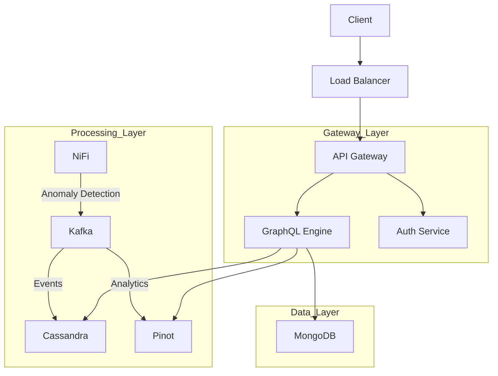
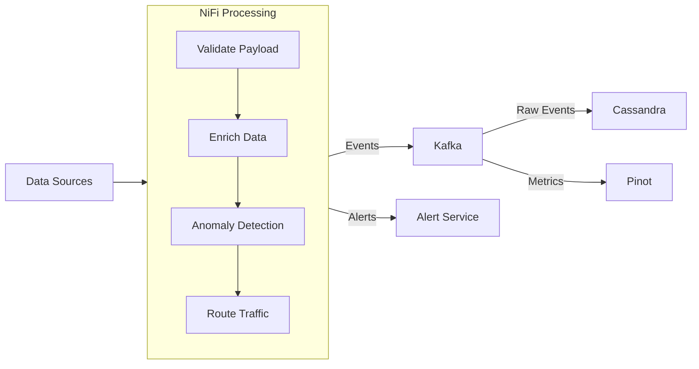

# 

[](https://github.com/Flamingo-CX/openframe/actions/workflows/build.yml)

OpenFrame is a distributed platform that creates a unified layer for data, APIs, automation, and AI on top of carefully selected open-source projects. It simplifies IT and security operations through a single, cohesive platform.

## Features

* **Unified Dashboard** - Single interface for managing all services and workflows
* **Smart Automation** - Automated deployment and monitoring capabilities
* **AI-Powered Insights** - Real-time anomaly detection and AI assistants ("copilots")
* **Enterprise Security** - Integrated security controls across all services
* **High Performance** - Handles 100,000 events/second with sub-500ms latency
* **Scalable Architecture** - Built on proven microservices principles

## System Architecture

### Overview

OpenFrame uses a modern microservices architecture with these key layers:

* **Gateway Layer**
  * GraphQL API Gateway for unified API access
  * Authentication and authorization service
  * Rate limiting and request throttling
  * Circuit breaker patterns for resilience

* **Processing Layer**
  * Stream processing with Apache NiFi
  * Event-driven architecture using Apache Kafka
  * Real-time anomaly detection
  * Data enrichment and transformation pipelines

* **Data Layer**
  * MongoDB for application data and configurations
  * Cassandra for event storage and time-series data
  * Apache Pinot for real-time analytics
  * Redis for caching and rate limiting

* **Infrastructure Layer**
  * Kubernetes for container orchestration
  * Istio service mesh for traffic management
  * Prometheus and Grafana for monitoring
  * Loki for log aggregation

### Data Flow



### Stream Processing



## Technology Stack

### Backend Services

* **Core Runtime**
  * Spring Boot 3.3.0 with Spring Cloud 2023.0.3
  * OpenJDK 21
  * Netflix DGS Framework 7.0.0 (GraphQL)
  * Spring Cloud Gateway with WebFlux
  * Spring Security with OAuth 2.0/OpenID Connect

* **Stream Processing**
  * Apache NiFi 1.22.0
    * Custom processors for data enrichment
    * Real-time anomaly detection
    * Automated data routing
  * Apache Kafka 3.6.0
    * High-throughput event streaming
    * Multi-topic architecture
    * Exactly-once delivery semantics

* **System Agent**
  * Rust-based cross-platform agent
    * Tokio async runtime for high-performance I/O
    * System monitoring and management
    * Auto-update capabilities with Velopack
    * Service lifecycle management

### Data Storage

* **Application Data (MongoDB 7.x)**
  * User profiles and authentication
  * System configurations
  * Service settings
  * Feature flags
  * Performance characteristics:
    * Sub-millisecond reads
    * Automatic sharding
    * Replica sets for high availability

* **Event Storage (Cassandra 4.x)**
  * Time-series event data
  * Audit logs
  * System metrics
  * Performance characteristics:
    * Linear scalability
    * Multi-datacenter replication
    * Tunable consistency

* **Analytics Engine (Apache Pinot 1.2.0)**
  * Real-time analytics
  * Complex aggregations
  * Time-series analysis
  * Performance characteristics:
    * Sub-second OLAP queries
    * Real-time ingestion
    * Multi-tenant support

### Frontend

* **Web Application**
  * Vue 3 with Composition API and TypeScript
  * PrimeVue component library for consistent UI
  * Apollo Client for GraphQL integration
  * Pinia for state management
  * Vite for fast development and builds

### Infrastructure

* **Container Orchestration**
  * Kubernetes 1.28+
    * Auto-scaling
    * Rolling updates
    * Health monitoring
    * Resource management
  * Istio 1.20 Service Mesh
    * Traffic management
    * Security policies
    * Observability
    * Service discovery

* **Monitoring Stack**
  * Prometheus
    * Metric collection
    * Alert management
    * PromQL for queries
  * Grafana
    * Custom dashboards
    * Visualization
    * Alerting
  * Loki
    * Log aggregation
    * Log querying
    * Integration with Grafana

## Prerequisites

* **Java Development**: OpenJDK 21.0.1+, Maven 3.9.6+
* **Frontend Development**: Node.js 18+ with npm
* **Rust Development**: Rust 1.70+ with Cargo (for client agent)
* **Containerization**: Docker 24.0+ and Docker Compose 2.23+
* **Orchestration**: Kubernetes 1.28+ (for production deployment)
* **Version Control**: Git 2.42+
* **Authentication**: GitHub Personal Access Token (Classic) with `repo`, `read:packages`, and `write:packages` permissions

## Running Locally

OpenFrame provides platform-specific scripts to easily run the application locally. Choose the appropriate script based on your operating system:

### Windows
```powershell
.\scripts\run-windows.ps1              # Run with interactive mode
.\scripts\run-windows.ps1 -Silent      # Run in silent mode
.\scripts\run-windows.ps1 -Help        # Show help message
```

The Windows script now includes:
- Automatic tool installation (kind, kubectl, helm, skaffold, jq, telepresence)
- GitHub token validation
- Docker Desktop status check
- Network configuration for Kind
- Seamless integration with Git Bash for running the main script

Tools are installed to `~/bin` directory. The script will remind you to add this directory to your PATH if needed.

### macOS
```bash
./scripts/run-mac.sh              # Run with interactive mode
./scripts/run-mac.sh --silent     # Run in silent mode
./scripts/run-mac.sh --help       # Show help message
```

### Linux
```bash
./scripts/run-linux.sh              # Run with interactive mode
./scripts/run-linux.sh --silent     # Run in silent mode
./scripts/run-linux.sh --help       # Show help message
```

### Script Behavior

The installation scripts provide two modes of operation:

#### Interactive Mode (Default)
- Prompts for user confirmation at key steps
- Displays detailed progress information
- Asks for cleanup preferences
- Shows all informational messages

#### Silent Mode
- Suppresses non-essential output
- Skips most confirmations
- Skips cleanup prompts
- Uses environment variables for automation

Both modes will:
- Always prompt for GitHub token (required for accessing private repositories)
- Install required dependencies if missing
- Set up the development environment
- Configure network settings
- Create and configure the Kind cluster

### GitHub Token

The scripts require a GitHub Personal Access Token (Classic) for authentication. You will be prompted to enter the token during execution, regardless of the mode. The token should have the following permissions:
- `repo` - Full control of private repositories
- `read:packages` - Read access to packages
- `write:packages` - Write access to packages

You can create a new token by following these steps:
1. Go to GitHub Settings > Developer settings > Personal access tokens > Tokens (classic)
2. Click "Generate new token (classic)"
3. Select the required permissions
4. Copy the generated token for use with the installation scripts

Note: The token will be stored only for the current session and will need to be provided again for subsequent runs.

You can monitor the startup progress in the console output. Once started, the application will be available at:
- **UI Dashboard**: http://localhost:8080
- **GraphQL API**: http://localhost:8080/graphql
- **Configuration Server**: http://localhost:8888

To stop the application, press Ctrl+C in the terminal where the script is running.

## Development Workflow

### Building Individual Components

```bash
# Build all Java services and libraries
mvn clean install

# Build without tests (faster)
mvn clean install -DskipTests

# Build and run frontend locally
cd openframe/services/openframe-ui
npm install
npm run dev

# Build Rust client agent
cd client
cargo build --release
```

### Testing

```bash
# Run all Java tests
mvn test

# Run specific test class
mvn test -Dtest=ClassName

# Run frontend tests
cd openframe/services/openframe-ui
npm run type-check

# Run Rust tests
cd client
cargo test
```

## Usage

Documentation for getting started with OpenFrame is in development. For now, please refer to individual sections in our comprehensive guides:

- [System Architecture](docs/system-architecture.md)
- [API Documentation](docs/api.md)
- [Deployment Guide](docs/deployment.md)
- [Security Overview](docs/security.md)

## Core Components

OpenFrame consists of seven core microservices and supporting libraries:

### Microservices

* **openframe-gateway** - Authentication proxy and unified entry point
  * Validates JWT tokens for all incoming requests
  * Central routing layer for services and integrated tools  
  * Supports REST and WebSocket communication protocols
  * Routes: `/api/**` → API service, `/clients/**` → Client service, `/tools/**` → Tool proxy

* **openframe-api** - Core backend service with GraphQL data access
  * Complete OAuth 2.0 implementation with multiple grant types
  * OpenID Connect discovery and userinfo endpoints
  * JWT integration for token-based authentication
  * GraphQL API for events and integrated tools
  * Endpoints: `/oauth/token`, `/graphql`, `/.well-known/openid-configuration`

* **openframe-client** - Agent management and authentication service
  * Manages agent registration and JWT token issuance
  * Tool connections between agents and various integrated tools
  * WebSocket support for real-time metrics
  * REST APIs for client and agent management
  * Endpoints: `/api/agents/**`, `/oauth/token`, `/api/clients/**`

* **openframe-management** - Administrative service with scheduled tasks and system management

* **openframe-stream** - Stream processing service using Kafka and NiFi for real-time data processing

* **openframe-config** - Spring Cloud Config Server for centralized configuration management

* **openframe-ui** - Vue 3 + TypeScript frontend with PrimeVue components
  * Visual hub for operators and administrators
  * Displays integrated tools information and status
  * Environment-driven configuration (API URLs, client secrets)
  * Development: `npm run dev`, Production: `npm run build`

### System Agent
* **client/** - Cross-platform Rust agent for system monitoring and management

### Shared Libraries
* **openframe-core** - Core models, utilities, and base configurations
* **openframe-data** - Data access layer for MongoDB, Cassandra, Redis, and Kafka
* **openframe-jwt** - JWT security implementation with cookie support
* **api-library** - Common API services and DTOs

## Security Features

* OAuth 2.0 + JWT authentication
* AES-256 encryption
* Comprehensive audit logging
* Multi-tenant isolation
* Rate limiting
* Circuit breakers

## Monitoring & Observability

* Real-time metrics collection
* Distributed tracing
* Centralized logging
* Custom Grafana dashboards
* Automated alerting
* Health checks and probes

## Roadmap

### Short Term
* GraphQL Subscriptions
* Enhanced batching and caching
* Advanced NiFi processors
* Real-time analytics improvements

### Long Term
* Multi-region deployment
* Zero-trust architecture
* AI/ML integration
* Advanced OLAP capabilities

## Contributing

We welcome contributions! Please read our [Contributing Guide](CONTRIBUTING.md) for details on our code of conduct and the process for submitting pull requests.

## License

This project is licensed under the [Apache License 2.0](LICENSE).

## Acknowledgments

OpenFrame builds upon many excellent open-source projects. We're grateful to all the communities that make this possible.

## Support

* [Issue Tracker](https://github.com/Flamingo-CX/openframe/issues)
* [Documentation](docs/)
* [Community Forum](https://community.openframe.org)

---

Built with ❤️ by the [Flamingo](https://flamingo.cx) team in [Miami Beach, FL](https://www.google.com/maps?q=Miami+Beach,+FL)
