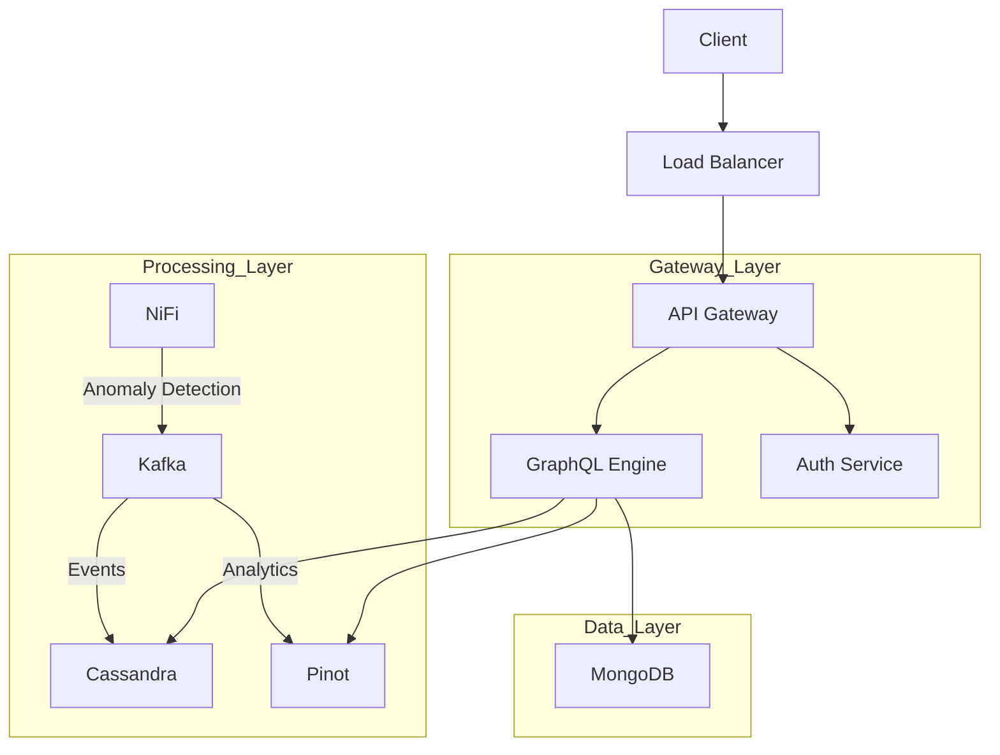
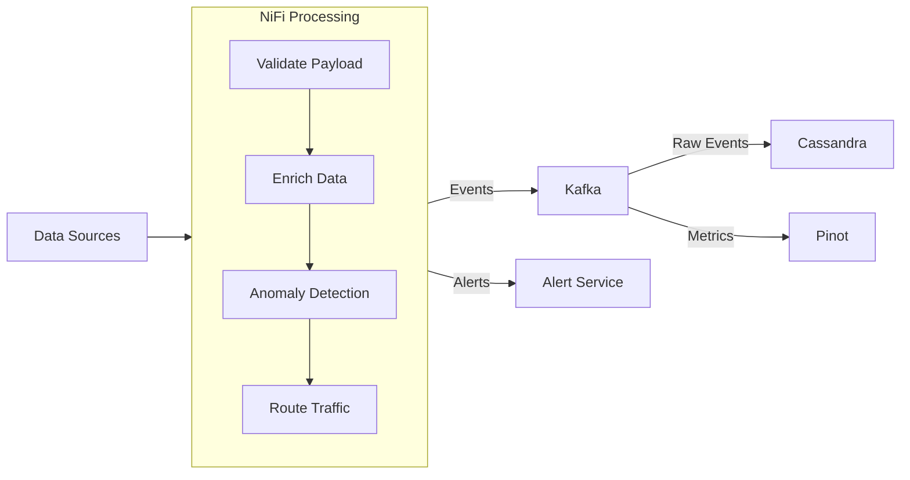

# 

OpenFrame is a distributed platform that creates a unified layer for data, APIs, automation, and AI on top of carefully selected open-source projects. It simplifies IT and security operations through a single, cohesive platform.

## Features

* **Unified Dashboard** - Single interface for managing all services and workflows
* **Smart Automation** - Automated deployment and monitoring capabilities
* **AI-Powered Insights** - Real-time anomaly detection and AI assistants ("copilots")
* **Enterprise Security** - Integrated security controls across all services
* **High Performance** - Handles 100,000 events/second with sub-500ms latency
* **Scalable Architecture** - Built on proven microservices principles

## System Architecture

### Overview

OpenFrame uses a modern microservices architecture with these key layers:

* **Gateway Layer**
  * GraphQL API Gateway for unified API access
  * Authentication and authorization service
  * Rate limiting and request throttling
  * Circuit breaker patterns for resilience

* **Processing Layer**
  * Stream processing with Apache NiFi
  * Event-driven architecture using Apache Kafka
  * Real-time anomaly detection
  * Data enrichment and transformation pipelines

* **Data Layer**
  * MongoDB for application data and configurations
  * Cassandra for event storage and time-series data
  * Apache Pinot for real-time analytics
  * Redis for caching and rate limiting

* **Infrastructure Layer**
  * Kubernetes for container orchestration
  * Istio service mesh for traffic management
  * Prometheus and Grafana for monitoring
  * Loki for log aggregation

### Data Flow

### Stream Processing

## Technology Stack

### Backend Services

* **Core Runtime**
  * Spring Boot 3.2.x
  * OpenJDK 21
  * Netflix DGS Framework (GraphQL)
  * Spring Cloud Gateway
  * Spring Security with OAuth 2.0

* **Stream Processing**
  * Apache NiFi 2.0
    * Custom processors for data enrichment
    * Real-time anomaly detection
    * Automated data routing
  * Apache Kafka 3.6
    * High-throughput event streaming
    * Multi-topic architecture
    * Exactly-once delivery semantics

### Data Storage

* **Application Data (MongoDB 7.x)**
  * User profiles and authentication
  * System configurations
  * Service settings
  * Feature flags
  * Performance characteristics:
    * Sub-millisecond reads
    * Automatic sharding
    * Replica sets for high availability

* **Event Storage (Cassandra 4.x)**
  * Time-series event data
  * Audit logs
  * System metrics
  * Performance characteristics:
    * Linear scalability
    * Multi-datacenter replication
    * Tunable consistency

* **Analytics Engine (Apache Pinot 1.0.0)**
  * Real-time analytics
  * Complex aggregations
  * Time-series analysis
  * Performance characteristics:
    * Sub-second OLAP queries
    * Real-time ingestion
    * Multi-tenant support

### Infrastructure

* **Container Orchestration**
  * Kubernetes 1.28+
    * Auto-scaling
    * Rolling updates
    * Health monitoring
    * Resource management
  * Istio 1.20 Service Mesh
    * Traffic management
    * Security policies
    * Observability
    * Service discovery

* **Monitoring Stack**
  * Prometheus
    * Metric collection
    * Alert management
    * PromQL for queries
  * Grafana
    * Custom dashboards
    * Visualization
    * Alerting
  * Loki
    * Log aggregation
    * Log querying
    * Integration with Grafana

## Prerequisites

* OpenJDK 21.0.1+
* Maven 3.9.6+
* Docker 24.0+ and Docker Compose 2.23+
* Kubernetes 1.28+
* Git 2.42+

## Installation

Detailed installation instructions coming soon.

## Usage

Documentation for getting started with OpenFrame is in development. For now, please refer to individual sections in our comprehensive guides:

- [System Architecture](docs/system-architecture.md)
- [API Documentation](docs/api.md)
- [Deployment Guide](docs/deployment.md)
- [Security Overview](docs/security.md)

## Core Components

OpenFrame consists of several key modules:

* **openframe-core** - Shared libraries and utilities
* **openframe-management** - Service orchestration and administration
* **openframe-data** - Centralized data access layer
* **openframe-security** - Security patterns and configurations
* **openframe-gateway** - API routing and traffic management

## Security Features

* OAuth 2.0 + JWT authentication
* AES-256 encryption
* Comprehensive audit logging
* Multi-tenant isolation
* Rate limiting
* Circuit breakers

## Monitoring & Observability

* Real-time metrics collection
* Distributed tracing
* Centralized logging
* Custom Grafana dashboards
* Automated alerting
* Health checks and probes

## Roadmap

### Short Term
* GraphQL Subscriptions
* Enhanced batching and caching
* Advanced NiFi processors
* Real-time analytics improvements

### Long Term
* Multi-region deployment
* Zero-trust architecture
* AI/ML integration
* Advanced OLAP capabilities

## Contributing

We welcome contributions! Please read our [Contributing Guide](CONTRIBUTING.md) for details on our code of conduct and the process for submitting pull requests.

## License

This project is licensed under the [Apache License 2.0](LICENSE).

## Acknowledgments

OpenFrame builds upon many excellent open-source projects. We're grateful to all the communities that make this possible.

## Support

* [Issue Tracker](https://github.com/Flamingo-CX/openframe/issues)
* [Documentation](docs/)
* [Community Forum](https://community.openframe.org)

---

Built with ❤️ by the [Flamingo](flamingo.cx) team in [Miami Beach, FL](https://www.google.com/maps?q=Miami+Beach,+FL)
