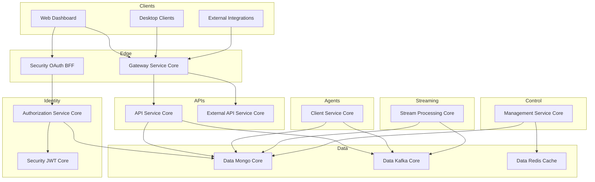

<div align="center">
  <picture>
    <source media="(prefers-color-scheme: dark)" srcset="https://raw.githubusercontent.com/flamingo-stack/openframe-oss-tenant/main/docs/assets/logo-openframe-full-dark-bg.png">
    <source media="(prefers-color-scheme: light)" srcset="https://raw.githubusercontent.com/flamingo-stack/openframe-oss-tenant/main/docs/assets/logo-openframe-full-light-bg.png">
    
  </picture>
</div>

<p align="center">
  <a href="LICENSE.md"></a>
</p>

# OpenFrame OSS Tenant - Unified AI-Powered MSP Platform

OpenFrame is the complete multi-service, multi-tenant backend platform powering the unified AI-driven MSP stack behind **Flamingo**. It replaces expensive proprietary software with open-source alternatives enhanced by intelligent automation (Mingo AI for technicians, Fae for clients).

This repository contains the **entire runtime stack** required to operate an OpenFrame tenant - from identity management and secure API gateway to real-time event processing and integrated tool management.

## Product Overview

[](https://www.youtube.com/watch?v=bINdW0CQbvY)

## ✨ Key Features

### 🚀 **Unified MSP Platform**
- **Single Dashboard**: Consolidates multiple MSP tools into one AI-driven interface
- **Multi-Tenant Architecture**: Complete data isolation and tenant-scoped configurations
- **Real-Time Operations**: Live device monitoring, event processing, and automated responses
- **Integrated Tool Support**: Native integration with FleetDM, TacticalRMM, MeshCentral

### 🤖 **AI-Powered Automation**
- **Mingo AI**: Intelligent assistant for technical operations and automated incident response
- **Fae Client Assistant**: AI-driven client interactions and support automation
- **Event Correlation**: Automated processing and normalization of events from integrated tools
- **Predictive Maintenance**: AI-driven insights for proactive IT management

### 🔐 **Enterprise-Grade Security**
- **Multi-Tenant OAuth2 + OIDC**: Secure identity platform with dynamic SSO support
- **JWT Validation**: Multi-tenant issuer resolution with RSA-based signing
- **API Security**: Comprehensive API key authentication and rate limiting
- **Role-Based Access**: Granular permissions and tenant-scoped authorization

### 🏗 **Modern Architecture**
- **Event-Driven**: Apache Kafka-based stream processing and CDC ingestion
- **Microservices**: Loosely coupled services with clear domain boundaries
- **Horizontally Scalable**: Stateless design with shared infrastructure
- **Real-Time Messaging**: NATS-based agent communication and control

### 📊 **Comprehensive Data Management**
- **Unified Persistence**: MongoDB-based multi-tenant data storage
- **Stream Processing**: Real-time event normalization and enrichment
- **Distributed Caching**: Redis-based session management and performance optimization
- **Change Data Capture**: Debezium-powered data synchronization

## 🏗 System Architecture


```mermaid
flowchart TD
    subgraph Clients
        Browser["Web Dashboard"]
        Agent["Desktop Clients"]
        External["External Integrations"]
    end

    subgraph Edge
        Gateway["Gateway Service Core"]
        BFF["Security OAuth BFF"]
    end

    subgraph Identity
        Auth["Authorization Service Core"]
        JwtCore["Security JWT Core"]
    end

    subgraph APIs
        Api["API Service Core"]
        ExternalApi["External API Service Core"]
    end

    subgraph Agents
        ClientSvc["Client Service Core"]
    end

    subgraph Control
        Mgmt["Management Service Core"]
    end

    subgraph Streaming
        Stream["Stream Processing Core"]
    end

    subgraph Data
        Mongo["Data Mongo Core"]
        Kafka["Data Kafka Core"]
        Redis["Data Redis Cache"]
    end

    Browser --> Gateway
    Browser --> BFF
    BFF --> Auth
    Gateway --> Api
    Gateway --> ExternalApi
    Agent --> Gateway
    External --> Gateway

    Api --> Mongo
    Api --> Kafka

    ClientSvc --> Mongo
    ClientSvc --> Kafka

    Stream --> Kafka
    Stream --> Mongo

    Mgmt --> Mongo
    Mgmt --> Redis

    Auth --> Mongo
    Auth --> JwtCore
```

## 🚀 Quick Start

Get OpenFrame running in 5 minutes:

```bash
# Clone repository
git clone https://github.com/flamingo-stack/openframe-oss-tenant.git
cd openframe-oss-tenant

# Start infrastructure services
docker-compose -f docker-compose.infrastructure.yml up -d

# Build all services
mvn clean install -DskipTests

# Start core services
java -jar openframe/services/openframe-authorization-server/target/openframe-authorization-server-*.jar &
java -jar openframe/services/openframe-gateway/target/openframe-gateway-*.jar &
java -jar openframe/services/openframe-api/target/openframe-api-*.jar &
java -jar openframe/services/openframe-client/target/openframe-client-*.jar &

# Verify installation
curl http://localhost:8080/actuator/health
```

Access the dashboard at `http://localhost:8080` and create your first tenant account.

## 🧩 Core Components

### **Identity & Security Layer**
- **Authorization Service Core**: Multi-tenant OAuth2 server with dynamic SSO
- **Security JWT Core**: Cryptographic foundation with RSA-based JWT handling
- **Security OAuth BFF**: Backend-for-frontend OAuth orchestrator

### **Edge & Gateway Layer**
- **Gateway Service Core**: Reactive Spring Cloud Gateway with multi-tenant JWT validation
- **Rate Limiting & Security**: Comprehensive API protection and request routing

### **Business API Layer**
- **API Service Core**: Primary GraphQL + REST APIs for devices, events, organizations
- **External API Service Core**: Versioned external REST API with cursor pagination
- **API Contracts**: Shared DTOs, filters, and mapping contracts

### **Agent & Device Management**
- **Client Service Core**: Agent lifecycle management and machine presence tracking
- **OAuth-Based Authentication**: Secure agent registration and communication
- **Tool Synchronization**: Integration with FleetDM, TacticalRMM, MeshCentral

### **Data Infrastructure**
- **Data Mongo Core**: Multi-tenant MongoDB persistence with reactive support
- **Data Kafka Core**: Event streaming infrastructure with CDC processing
- **Data Redis Cache**: Distributed caching and session management

### **Stream Processing**
- **Stream Processing Core**: Real-time event normalization and enrichment
- **Debezium Integration**: Change data capture from integrated tools
- **Event Correlation**: Unified event model across all platforms

### **Control Plane**
- **Management Service Core**: Operational orchestration and distributed job scheduling
- **Tool Integration Management**: Dynamic connector provisioning and health monitoring

### **Service Applications**
- **Runnable Microservices**: Spring Boot applications composing core modules
- **Independent Deployment**: Docker-ready services with health checks

## 💻 Technology Stack

- **Backend**: Java 21, Spring Boot 3.3.0, Spring Cloud Gateway
- **Authentication**: OAuth2/OIDC with multi-tenant JWT validation
- **Database**: MongoDB with reactive drivers
- **Event Streaming**: Apache Kafka with Kafka Streams
- **Real-Time Messaging**: NATS and JetStream
- **Caching**: Redis with distributed locking
- **API**: GraphQL (Netflix DGS), REST with OpenAPI
- **Build Tools**: Maven, Docker, Docker Compose
- **Client Agent**: Rust-based cross-platform agents

## 🔗 CLI Tools

The OpenFrame CLI tools are maintained in a separate repository:

- **Repository**: [flamingo-stack/openframe-cli](https://github.com/flamingo-stack/openframe-cli)
- **Installation**: [Installation Guide](https://github.com/flamingo-stack/openframe-cli#installation)
- **Documentation**: [CLI Documentation](https://github.com/flamingo-stack/openframe-cli/tree/main/docs)

**Note**: CLI tools are NOT located in this repository. Always refer to the external repository for installation and usage instructions.

## 📚 Documentation

📚 See the [Documentation](./docs/README.md) for comprehensive guides including:

- **Getting Started**: Installation, prerequisites, and first steps
- **Development**: Environment setup, local development, and contribution guidelines
- **Architecture**: Detailed service documentation and system design
- **API References**: GraphQL schema, REST endpoints, and integration guides

## 🤝 Community & Support

OpenFrame is developed openly with community collaboration:

- **OpenMSP Community**: https://www.openmsp.ai/
- **Slack Community**: [Join OpenMSP Slack](https://join.slack.com/t/openmsp/shared_invite/zt-36bl7mx0h-3~U2nFH6nqHqoTPXMaHEHA)
- **Website**: https://openframe.ai and https://www.flamingo.run/openframe

> **Important**: We don't use GitHub Issues or GitHub Discussions. All support, feature requests, and community interaction happens through our OpenMSP Slack community.

## 📝 License

This project is licensed under the Flamingo AI Unified License v1.0. See [LICENSE.md](LICENSE.md) for details.

---

<div align="center">
  Built with 💛 by the <a href="https://www.flamingo.run/about"><b>Flamingo</b></a> team
</div>