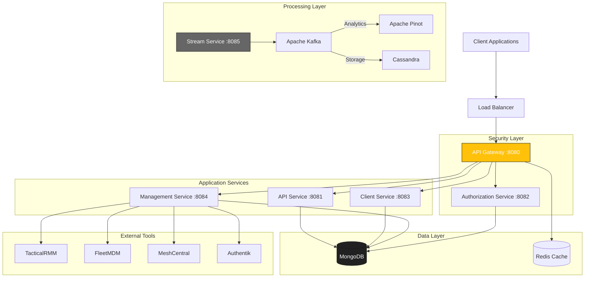

<div align="center">
  <picture>
    <source media="(prefers-color-scheme: dark)" srcset="https://raw.githubusercontent.com/flamingo-stack/openframe-oss-tenant/main/docs/assets/logo-openframe-full-dark-bg.png">
    <source media="(prefers-color-scheme: light)" srcset="https://raw.githubusercontent.com/flamingo-stack/openframe-oss-tenant/main/docs/assets/logo-openframe-full-light-bg.png">
    
  </picture>
</div>

<p align="center">
  <a href="LICENSE.md"></a>
</p>

# OpenFrame OSS Tenant

**A distributed platform that creates a unified layer for data, APIs, automation, and AI on top of carefully selected open-source projects.** OpenFrame simplifies IT and security operations through a single, cohesive, multi-tenant SaaS platform that replaces expensive proprietary MSP tools with intelligent automation.

This repository contains the **complete OpenFrame control plane and data plane** - all runtime services, shared libraries, and infrastructure modules required to operate OpenFrame as a secure, scalable, tenant-isolated MSP platform.

## 🎯 What is OpenFrame?

OpenFrame is an **AI-powered MSP platform** that integrates multiple IT management tools into a single, unified interface:

- **🤖 AI Automation**: Mingo AI for technicians, Fae for clients, autonomous incident handling
- **🔗 Tool Integration**: Unified interface for TacticalRMM, FleetMDM, MeshCentral, Authentik, and more
- **🏢 Multi-Tenant SaaS**: Secure tenant isolation with OAuth2/OIDC authentication
- **📊 Real-Time Processing**: Event streaming and analytics with Apache Kafka and Pinot
- **💰 Cost Reduction**: Replace multiple expensive proprietary tools with open-source alternatives

[](https://www.youtube.com/watch?v=bINdW0CQbvY)

## ✨ Key Features

### 🚀 Unified Dashboard
- Single pane of glass for all MSP operations
- Real-time device monitoring and management
- Integrated ticketing and workflow automation
- Cross-platform agent deployment

### 🧠 AI-Powered Intelligence
- **Mingo AI**: Intelligent assistant for technicians
- **Autonomous Agents**: Handle incident triage and alert management automatically
- **Natural Language Processing**: Chat-based interface for complex operations
- **Predictive Analytics**: Proactive issue detection and resolution

[](https://www.youtube.com/watch?v=jEkFcS4AcQ4)

### 🔧 Tool Integration
OpenFrame connects and unifies essential MSP tools:

| Traditional Tool | OpenFrame Integration | Cost Savings |
|------------------|----------------------|---------------|
| RMM Software ($5-15/endpoint) | TacticalRMM (Free) | Up to 100% |
| PSA Platform ($50-100/user) | OpenFrame PSA (Free) | Up to 100% |
| Remote Access ($10-30/user) | MeshCentral (Free) | Up to 100% |
| Identity Management | Authentik (Free) | Up to 100% |

### 🏗️ Enterprise Architecture
- **Gateway-First Design**: Single entry point with authentication and routing
- **Microservices**: Independent, scalable service components
- **Event-Driven**: Real-time processing with Apache Kafka and NATS
- **Multi-Database**: MongoDB, Cassandra, Pinot, Redis optimized for different workloads

## 🏃‍♂️ Quick Start

Get OpenFrame running locally in minutes:

### Prerequisites
- **Java**: OpenJDK 21.0.1+
- **Node.js**: 18+ with npm
- **Docker**: 24.0+ with Docker Compose
- **Git**: 2.42+

### Installation

```bash
# Clone the repository
git clone https://github.com/flamingo-stack/openframe-oss-tenant.git
cd openframe-oss-tenant

# Set up GitHub authentication for dependencies
export GITHUB_ACTOR=your-github-username
export GITHUB_TOKEN=your-github-token

# Build and start all services
mvn clean install
docker-compose up -d

# Start frontend development server
cd openframe/services/openframe-frontend
npm install && npm run dev
```

### CLI Quick Start

For production deployments, use the OpenFrame CLI:

```bash
# Install OpenFrame CLI (external repository)
# See: https://github.com/flamingo-stack/openframe-cli#installation

# Bootstrap complete OpenFrame environment
openframe bootstrap --non-interactive --verbose
```

**Note**: The OpenFrame CLI is maintained in a separate repository at [flamingo-stack/openframe-cli](https://github.com/flamingo-stack/openframe-cli).

Once started, OpenFrame will be available at:
- **Dashboard**: https://localhost:3000
- **API Gateway**: https://localhost:8080
- **GraphQL Playground**: https://localhost:8081/graphql

## 🏛️ Architecture Overview

OpenFrame follows a **gateway-first, microservices architecture** with strong security boundaries:


```mermaid
flowchart TB
    Client[Client Applications] --> LB[Load Balancer]
    LB --> Gateway[API Gateway :8080]
    
    subgraph "Security Layer"
        Gateway --> Auth[Authorization Service :8082]
    end
    
    subgraph "Application Services"
        Gateway --> API[API Service :8081]
        Gateway --> ClientSvc[Client Service :8083]
        Gateway --> Management[Management Service :8084]
    end
    
    subgraph "Processing Layer"
        Stream[Stream Service :8085] --> Kafka[Apache Kafka]
        Kafka --> |Analytics| Pinot[Apache Pinot]
        Kafka --> |Storage| Cassandra[Cassandra]
    end
    
    subgraph "Data Layer"
        API --> MongoDB[(MongoDB)]
        ClientSvc --> MongoDB
        Management --> MongoDB
        Auth --> MongoDB
        Gateway --> Redis[(Redis Cache)]
    end
    
    subgraph "External Tools"
        Management --> TacticalRMM
        Management --> FleetMDM
        Management --> MeshCentral
        Management --> Authentik
    end
    
    style Gateway fill:#FFC109,stroke:#1A1A1A,color:#FAFAFA
    style Stream fill:#666666,stroke:#1A1A1A,color:#FAFAFA
    style MongoDB fill:#212121,stroke:#1A1A1A,color:#FAFAFA
```

### Core Services

| Service | Port | Purpose |
|---------|------|---------|
| **Gateway** | 8080 | Single entry point, authentication, routing |
| **API** | 8081 | GraphQL/REST APIs, business logic |
| **Authorization** | 8082 | OAuth2/OIDC, multi-tenant authentication |
| **Client** | 8083 | Agent management, device registration |
| **Management** | 8084 | Platform control plane, orchestration |
| **Stream** | 8085 | Event processing, normalization, enrichment |

## 🛠️ Development

### Technology Stack

| Component | Technology | Purpose |
|-----------|------------|---------|
| **Backend** | Spring Boot 3.3 + Java 21 | Core runtime & APIs |
| **Frontend** | Next.js 15 + React 19 + TypeScript 5.8 | Modern web interface |
| **Client Agent** | Rust + Tokio | Cross-platform system agent |
| **API Layer** | GraphQL + Netflix DGS | Unified data access |
| **Message Queue** | Apache Kafka 3.6 | Event streaming |
| **Databases** | MongoDB + Cassandra + Pinot | Multi-model data storage |
| **Cache** | Redis | High-performance caching |
| **Monitoring** | Prometheus + Grafana + Loki | Observability stack |

### Local Development Setup

```bash
# Backend services
mvn clean install

# Frontend development
cd openframe/services/openframe-frontend
npm install
npm run dev

# Rust agent development  
cd client
cargo build --release
cargo test

# Run tests
mvn test                          # Java tests
npm run type-check               # TypeScript tests
cargo test                       # Rust tests
```

### Security Model

OpenFrame implements a **tenant-first security model**:

- **Multi-Tenant Isolation**: Every request is tenant-scoped
- **OAuth2/OIDC**: Standards-based authentication and authorization
- **JWT Tokens**: Stateless authentication with per-tenant signing keys
- **RBAC**: Role-based access control with organization scoping
- **End-to-End Encryption**: TLS 1.3 for transit, AES-256 for rest

## 📚 Documentation

Comprehensive documentation is available in the `docs/` directory:

📚 **[Complete Documentation](./docs/README.md)** - Master documentation index

### Quick Links

| Section | Description |
|---------|-------------|
| **[Getting Started](./docs/README.md#getting-started)** | Installation, prerequisites, first steps |
| **[Development](./docs/README.md#development)** | Architecture, setup, contributing guidelines |
| **[Reference](./docs/README.md#reference)** | Technical specifications and API docs |
| **[CLI Tools](https://github.com/flamingo-stack/openframe-cli)** | Command-line interface (external repo) |

## 🤝 Contributing

We welcome contributions! Here's how to get started:

1. **Fork the repository** and create a feature branch
2. **Read the [Contributing Guide](CONTRIBUTING.md)** for guidelines
3. **Set up your development environment** following the setup guide
4. **Make your changes** and add tests
5. **Submit a pull request** with a clear description

### Development Guidelines

- **Follow code style**: Use provided linters and formatters
- **Write tests**: Maintain high test coverage
- **Document changes**: Update documentation for new features
- **Security first**: Consider security implications of all changes

## 🌟 Screenshots

### Dashboard Overview


### Device Management


### Policies & Compliance


## 🗺️ Roadmap

- [x] Core microservices architecture
- [x] GraphQL API with authentication  
- [x] Real-time stream processing
- [x] Cross-platform Rust agent
- [x] **Multi-tenant support** *(Q2 2025)*
- [x] **Advanced AI/ML integrations** *(Q3 2025)*
- [ ] **Edge computing capabilities** *(Q4 2025)*
- [ ] **Mobile companion app** *(2026)*

## 💡 Benefits

### Cost Reduction
Replace expensive proprietary MSP tools:
- **RMM Software**: Save $5-15 per endpoint monthly
- **PSA Platform**: Save $50-100 per user monthly  
- **Remote Access**: Save $10-30 per user monthly
- **Total Savings**: Up to 70% reduction in tool costs

### Increased Efficiency
- **Single Interface**: Manage all tools from one dashboard
- **AI Automation**: Reduce manual tasks by up to 60%
- **Standardized Workflows**: Consistent processes across all clients
- **Real-Time Insights**: Proactive issue detection and resolution

## 🔒 Security

OpenFrame implements enterprise-grade security:

- **🔐 OAuth 2.0 + JWT** authentication
- **🔑 AES-256** encryption for data at rest
- **📋 Comprehensive** audit logging
- **🏢 Multi-tenant** isolation
- **⚡ Rate limiting** and circuit breakers
- **👀 Real-time** security monitoring

Found a security issue? Please email **security@flamingo.run** instead of opening a public issue.

## 📄 License

This project is licensed under the [Flamingo AI Unified License v1.0](LICENSE.md).

## 🙏 Acknowledgments

- Thanks to all our [contributors](https://github.com/flamingo-stack/openframe-oss-tenant/graphs/contributors)
- Built with amazing open-source projects: Spring Boot, Apache Kafka, React, and many more
- Special thanks to the broader open-source and MSP communities

## 📞 Community & Support

Join our community for support, discussions, and updates:

- **💬 OpenMSP Slack**: [Join our community](https://join.slack.com/t/openmsp/shared_invite/zt-36bl7mx0h-3~U2nFH6nqHqoTPXMaHEHA)
- **📖 Documentation**: [OpenFrame Docs](https://www.flamingo.run/openframe)
- **🌐 Website**: [flamingo.run](https://flamingo.run)
- **🐛 Issues**: [GitHub Issues](https://github.com/flamingo-stack/openframe-oss-tenant/issues)

---

<div align="center">
  Built with 💛 by the <a href="https://www.flamingo.run/about"><b>Flamingo</b></a> team
</div>