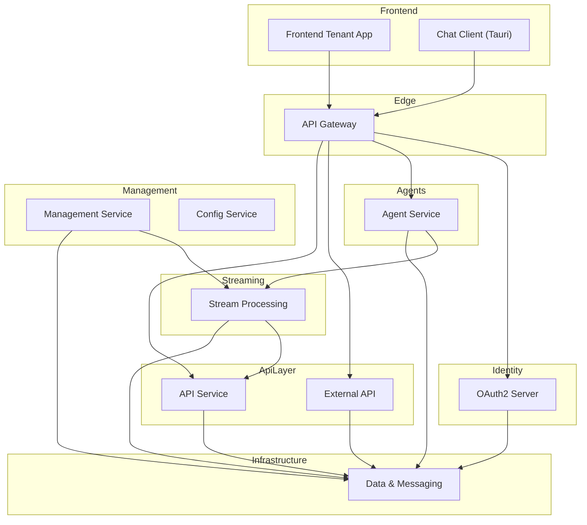

<div align="center">
  <picture>
    <source media="(prefers-color-scheme: dark)" srcset="https://raw.githubusercontent.com/flamingo-stack/openframe-oss-tenant/main/docs/assets/logo-openframe-full-dark-bg.png">
    <source media="(prefers-color-scheme: light)" srcset="https://raw.githubusercontent.com/flamingo-stack/openframe-oss-tenant/main/docs/assets/logo-openframe-full-light-bg.png">
    
  </picture>
</div>

<p align="center">
  <a href="LICENSE.md"></a>
</p>

# OpenFrame OSS Tenant

**A distributed platform that creates a unified layer for data, APIs, automation, and AI on top of carefully selected open-source projects. We simplify IT and security operations through a single, cohesive platform.**

OpenFrame OSS Tenant is the reference multi-tenant implementation of the OpenFrame platform, providing a production-ready AI-powered MSP platform foundation with secure OAuth2 identity, event-driven architecture, and real-time analytics.

## 🎥 Product Demo

[](https://www.youtube.com/watch?v=a45pzxtg27k)

[](https://www.youtube.com/watch?v=bINdW0CQbvY)

## ✨ Features

- **🔐 Multi-Tenant Security** - OAuth2/OIDC identity with per-tenant signing keys
- **🚀 Unified Dashboard** - Single interface for managing all services and workflows
- **🤖 AI-Powered Insights** - Real-time anomaly detection and intelligent assistants
- **⚡ High Performance** - Handles 100,000+ events/second with sub-500ms latency
- **🔄 Event-Driven Architecture** - Kafka + Debezium for real-time data processing
- **📊 Real-time Analytics** - Apache Pinot for fast OLAP queries
- **🌐 GraphQL + REST APIs** - Flexible API layer with DataLoader optimization
- **💬 Desktop Chat Client** - Tauri-based AI chat runtime
- **🛠️ Agent Management** - Endpoint agent lifecycle and tool integration
- **📈 Stream Processing** - Real-time event enrichment and normalization

## 🏗️ Architecture

OpenFrame uses a modern microservices architecture with secure multi-tenant isolation:


```mermaid
flowchart TD
    subgraph Frontend
        TenantApp["Frontend Tenant App"]
        ChatClient["Chat Client (Tauri)"]
    end

    subgraph Edge
        Gateway["API Gateway"]
    end

    subgraph Identity
        AuthServer["OAuth2 Server"]
    end

    subgraph ApiLayer
        ApiService["API Service"]
        ExternalApi["External API"]
    end

    subgraph Agents
        ClientAgent["Agent Service"]
    end

    subgraph Streaming
        StreamCore["Stream Processing"]
    end

    subgraph Management
        ManagementCore["Management Service"]
        ConfigCore["Config Service"]
    end

    subgraph Infrastructure
        DataCore["Data & Messaging"]
    end

    TenantApp --> Gateway
    ChatClient --> Gateway
    Gateway --> ApiService
    Gateway --> ExternalApi
    Gateway --> ClientAgent
    Gateway --> AuthServer

    ApiService --> DataCore
    ExternalApi --> DataCore
    ClientAgent --> DataCore
    AuthServer --> DataCore
    StreamCore --> DataCore
    ManagementCore --> DataCore

    ManagementCore --> StreamCore
    ClientAgent --> StreamCore
    StreamCore --> ApiService
```

## 🚀 Quick Start

### Prerequisites

- **Java:** OpenJDK 21.0.1+
- **Node.js:** 18+ with npm
- **Docker:** 24.0+ with Docker Compose
- **Git:** 2.42+

### CLI Usage

The OpenFrame CLI is maintained in a separate repository. Install it first:

**Installation**: See [OpenFrame CLI Installation Guide](https://github.com/flamingo-stack/openframe-cli#installation)

```bash
# Linux
./openframe-linux-amd64 bootstrap
./openframe-linux-amd64 bootstrap --non-interactive --verbose

# Windows
./openframe-windows-amd64.exe bootstrap
./openframe-windows-amd64.exe bootstrap --non-interactive --verbose

# macOS
./openframe bootstrap
./openframe bootstrap --non-interactive --verbose
```

For detailed CLI documentation and all available commands, see [CLI Documentation](https://github.com/flamingo-stack/openframe-cli/tree/main/docs).

### Local Development

> **Note:** This project depends on `openframe-oss-lib`. Maven authentication via GitHub Packages is required - set `GITHUB_ACTOR` and `GITHUB_TOKEN` environment variables before building.

```bash
# Clone the repository
git clone https://github.com/flamingo-stack/openframe-oss-tenant.git
cd openframe-oss-tenant

# Set up GitHub authentication
export GITHUB_ACTOR=your-github-username
export GITHUB_TOKEN=your-github-token

# Build backend services
mvn clean install

# Start frontend development server
cd openframe/services/openframe-frontend
npm install && npm run dev

# Build chat client
cd ../../clients/openframe-chat
npm install && npm run tauri dev
```

Once started, OpenFrame will be available at:
- **UI Dashboard:** https://localhost

## 🛠️ Technology Stack

| Component | Technology | Purpose |
|-----------|------------|---------|
| **Backend** | Spring Boot 3.3 + Java 21 | Core runtime & APIs |
| **Frontend** | Next.js 15 + React 19 + TypeScript | Modern web interface |
| **Chat Client** | Tauri + Rust + TypeScript | Cross-platform desktop app |
| **API Layer** | GraphQL + Netflix DGS | Unified data access |
| **Message Queue** | Apache Kafka + Debezium | Event streaming & CDC |
| **Databases** | MongoDB + Apache Pinot | Multi-model data storage |
| **Cache** | Redis | High-performance caching |
| **Gateway** | Spring WebFlux | Reactive edge routing |
| **Identity** | OAuth2/OIDC | Multi-tenant authentication |

## 📚 Documentation

📚 See the [Documentation](./docs/README.md) for comprehensive guides including:

- **Getting Started** - Quick start and basic concepts
- **Development** - Local setup, testing, and contribution guidelines  
- **Reference** - Technical documentation for all services
- **Architecture** - System design and component details

### CLI Tools

The OpenFrame CLI tools are maintained in a separate repository:
- **Repository**: [flamingo-stack/openframe-cli](https://github.com/flamingo-stack/openframe-cli)
- **Installation**: [Installation Guide](https://github.com/flamingo-stack/openframe-cli#installation)
- **Documentation**: [CLI Documentation](https://github.com/flamingo-stack/openframe-cli/tree/main/docs)

## 🤝 Contributing

We welcome contributions! Please see our [Contributing Guide](CONTRIBUTING.md) for details on how to get started.

### Quick Contributing Steps:
1. Fork the project
2. Create your feature branch (`git checkout -b feature/amazing-feature`)
3. Commit your changes (`git commit -m 'Add amazing feature'`)
4. Push to the branch (`git push origin feature/amazing-feature`)
5. Open a Pull Request

## 🔒 Security

OpenFrame implements comprehensive security controls:

- **Multi-tenant isolation** with per-tenant JWT signing keys
- **OAuth2/OIDC** authentication with PKCE support
- **AES-256** encryption for data at rest
- **Rate limiting** and circuit breakers
- **Comprehensive audit logging**
- **Real-time security monitoring**

Found a security issue? Please email security@flamingo.run instead of opening a public issue.

## 📄 License

This project is licensed under the [Flamingo AI Unified License v1.0](LICENSE.md).

## 🙏 Acknowledgments

- Thanks to all our [contributors](https://github.com/flamingo-stack/openframe-oss-tenant/graphs/contributors)
- Built with amazing open-source projects: Spring Boot, Apache Kafka, React, and many more
- Special thanks to the broader open-source community

---
<div align="center">
  Built with 💛 by the <a href="https://www.flamingo.run/about"><b>Flamingo</b></a> team
</div>