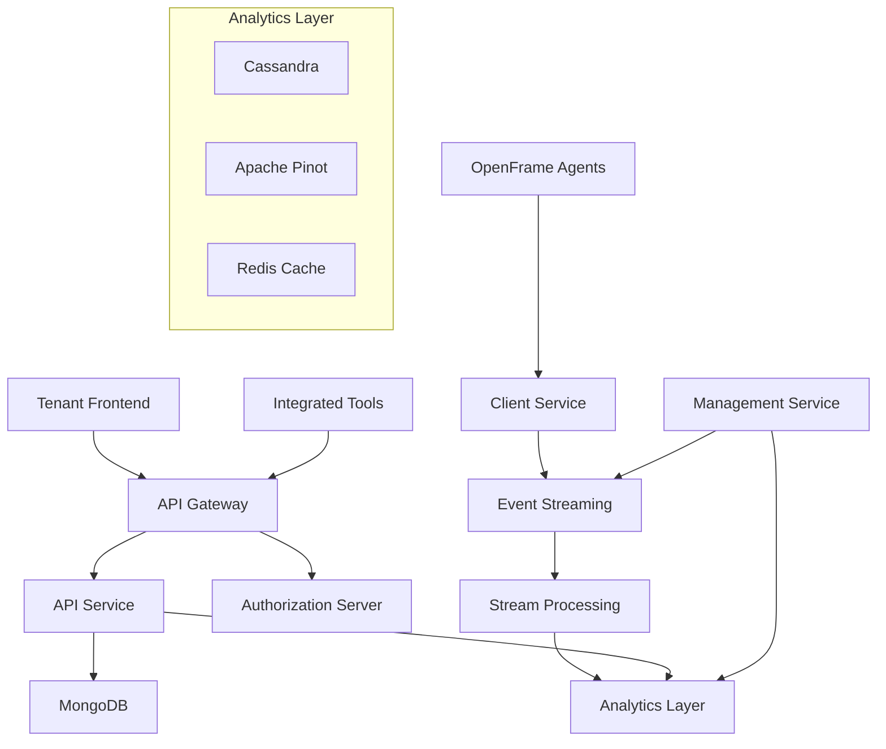

<div align="center">
  <picture>
    <source media="(prefers-color-scheme: dark)" srcset="https://raw.githubusercontent.com/flamingo-stack/openframe-oss-tenant/main/docs/assets/logo-openframe-full-dark-bg.png">
    <source media="(prefers-color-scheme: light)" srcset="https://raw.githubusercontent.com/flamingo-stack/openframe-oss-tenant/main/docs/assets/logo-openframe-full-light-bg.png">
    
  </picture>
</div>

<p align="center">
  <a href="LICENSE.md"></a>
</p>

# OpenFrame OSS Tenant Platform

**The core, multi-tenant OpenFrame platform** that powers Flamingo's AI-driven MSP stack. OpenFrame creates a unified layer for data, APIs, automation, and AI on top of carefully selected open-source projects, simplifying IT and security operations through a single, cohesive platform.

[](https://www.youtube.com/watch?v=bINdW0CQbvY)

## What is OpenFrame?

OpenFrame is a **distributed platform** that replaces expensive proprietary software with open-source alternatives enhanced by intelligent automation. It integrates multiple MSP tools into a single AI-driven interface, automating IT support operations across the stack.

### Core Components

- **Multi-tenant backend** with API, Auth, Gateway, Management, Stream, and Client services
- **Shared OSS foundation** for security, data, streaming, DTOs, and utilities  
- **Unified frontend** that consolidates devices, logs, tools, tickets, and AI (Mingo)
- **Vendor-agnostic integration layer** for RMMs, MDMs, and infrastructure tools

## Features

### 🤖 AI-Native Operations
- **Mingo AI**: Autonomous agent architecture for incident triage and alert management
- **Intelligent Automation**: AI-powered technician assistance and client-facing automation (Fae)
- **Approval Workflows**: Human-in-the-loop oversight for critical operations

### 🔧 Unified Dashboard
- **Single interface** for managing all services and workflows
- **Real-time monitoring** with sub-500ms latency
- **Smart automation** with automated deployment and monitoring capabilities
- **Enterprise security** with integrated controls across all services

### 🏢 Multi-Tenant Architecture
- **Tenant isolation** with secure, isolated environments for each MSP
- **SSO support** for Google, Microsoft, and custom identity providers
- **Role-based access** with fine-grained permissions and user management
- **Scalable design** built on proven microservices principles

### 🔌 Vendor-Agnostic Integrations
- **FleetDM**: Open-source device management and osquery integration
- **Tactical RMM**: Python-based RMM for Windows/Linux management  
- **MeshCentral**: Remote access and file management capabilities
- **Authentik**: Identity and access management

## Architecture Overview

OpenFrame uses a modern microservices architecture with four key layers:


```mermaid
flowchart TD
    Browser["Tenant Frontend"] --> Gateway["API Gateway"]
    Agents["OpenFrame Agents"] --> Client["Client Service"]
    Tools["Integrated Tools"] --> Gateway
    
    Gateway --> API["API Service"]
    Gateway --> Auth["Authorization Server"]
    
    Client --> Kafka["Event Streaming"]
    Kafka --> Stream["Stream Processing"]
    Stream --> Analytics["Analytics Layer"]
    
    API --> MongoDB["MongoDB"]
    API --> Analytics
    
    Management["Management Service"] --> Analytics
    Management --> Kafka
    
    subgraph "Analytics Layer"
        Cassandra["Cassandra"]
        Pinot["Apache Pinot"]  
        Redis["Redis Cache"]
    end
```

## Technology Stack

| Component | Technology | Purpose |
|-----------|------------|---------|
| **Backend** | Spring Boot 3.3 + Java 21 | Core runtime & APIs |
| **Frontend** | Next.js 15 + React 19 + TypeScript 5.8 | Modern web interface |
| **Client** | Rust + Tokio | Cross-platform system agent |
| **API Layer** | GraphQL + Netflix DGS | Unified data access |
| **Message Queue** | Apache Kafka 3.6 | Event streaming |
| **Databases** | MongoDB + Cassandra + Pinot | Multi-model data storage |
| **Cache** | Redis | High-performance caching |
| **Monitoring** | Prometheus + Grafana + Loki | Observability stack |

## Quick Start

### Prerequisites

- **Java**: OpenJDK 21.0.1+
- **Node.js**: 18+ with npm
- **Rust**: 1.70+ with Cargo
- **Docker**: 24.0+ with Docker Compose
- **Git**: 2.42+

### Local Development

> **Note**: This project depends on `openframe-oss-lib` (version defined in `pom.xml`). Maven authentication via GitHub Packages is required - set `GITHUB_ACTOR` and `GITHUB_TOKEN` environment variables before building.

```bash
# Clone the repository
git clone https://github.com/flamingo-stack/openframe-oss-tenant.git
cd openframe-oss-tenant

# Set up GitHub authentication
export GITHUB_ACTOR=your-github-username
export GITHUB_TOKEN=your-github-token

# Build backend services
mvn clean install

# Start frontend development server
cd openframe/services/openframe-frontend
npm install && npm run dev

# Build Rust agent
cd ../../client
cargo build --release
```

### CLI Bootstrap (Recommended)

For the fastest setup, use the OpenFrame CLI tools:

```bash
# Linux
./cli/openframe-linux-amd64 bootstrap --non-interactive --verbose

# Windows  
./cli/openframe-windows-amd64.exe bootstrap --non-interactive --verbose

# macOS
./cli/openframe bootstrap --non-interactive --verbose
```

**CLI Documentation**: See the [OpenFrame CLI repository](https://github.com/flamingo-stack/openframe-cli) for installation and usage instructions.

Once started, OpenFrame will be available at:
- **UI Dashboard**: https://localhost

## Runtime Services

### Core Services

- **API Service** (`openframe/services/openframe-api`) - Tenant-facing and internal APIs
- **Authorization Server** (`openframe/services/openframe-authorization-server`) - OAuth2/OIDC with multi-tenant JWT
- **Gateway Service** (`openframe/services/openframe-gateway`) - API gateway and edge security  
- **Client Service** (`openframe/services/openframe-client`) - Secure ingress for agents
- **Stream Processing** (`openframe/services/openframe-stream`) - Kafka consumers and processors
- **Management Service** (`openframe/services/openframe-management`) - Platform control plane
- **External API Service** (`openframe/services/openframe-external-api`) - Partner integrations

### Shared Libraries

- **Security**: JWT/OAuth, authentication, authorization
- **Data**: MongoDB, Cassandra, Pinot, Redis abstractions
- **Core Utilities**: Validation, configuration, common services
- **Notifications**: Email and messaging services
- **Vendor SDKs**: FleetDM, Tactical RMM integrations

## Screenshots

### Dashboard Overview


### Device Management


### Policies & Compliance


## Performance

- **High Performance**: Handles 100,000+ events/second
- **Low Latency**: Sub-500ms response times
- **Scalable**: Microservices architecture for independent scaling
- **Multi-tenant**: Efficient resource utilization with tenant isolation

## Security

OpenFrame implements enterprise-grade security:

- **Authentication**: OAuth 2.0 + JWT with cookie security
- **Encryption**: AES-256 for data at rest, TLS for data in transit
- **Audit Logging**: Comprehensive activity tracking
- **Multi-tenant Isolation**: Secure boundaries between tenants
- **Rate Limiting**: Circuit breakers and request throttling
- **Real-time Monitoring**: Security event detection and alerting

## Documentation

📚 See the [Documentation](./docs/README.md) for comprehensive guides:

- **[Getting Started](./docs/getting-started/introduction.md)** - Introduction and quick start
- **[Development](./docs/development/README.md)** - Development setup and architecture
- **[Reference](./docs/reference/architecture/overview.md)** - Technical reference documentation

### CLI Tools

The OpenFrame CLI tools are maintained in a separate repository:
- **Repository**: [flamingo-stack/openframe-cli](https://github.com/flamingo-stack/openframe-cli)
- **Installation**: [Installation Guide](https://github.com/flamingo-stack/openframe-cli#installation)
- **Documentation**: [CLI Documentation](https://github.com/flamingo-stack/openframe-cli/tree/main/docs)

**Note**: CLI tools are NOT located in this repository. Always refer to the external repository for installation and usage.

## Contributing

We love contributions! Please see our [Contributing Guide](CONTRIBUTING.md) for details.

### Quick Contributing Steps:
1. Fork the project
2. Create your feature branch (`git checkout -b feature/amazing-feature`)
3. Commit your changes (`git commit -m 'Add amazing feature'`)
4. Push to the branch (`git push origin feature/amazing-feature`)
5. Open a Pull Request

## Community

Join the OpenMSP community for support and discussions:

- **Community**: [OpenMSP Slack](https://join.slack.com/t/openmsp/shared_invite/zt-36bl7mx0h-3~U2nFH6nqHqoTPXMaHEHA)
- **Website**: [flamingo.run](https://www.flamingo.run)
- **Knowledge Base**: [flamingo.run/knowledge-base](https://www.flamingo.run/knowledge-base)
- **LinkedIn**: [OpenFrame on LinkedIn](https://www.linkedin.com/showcase/openframemsp/about/)

## License

This project is licensed under the [Flamingo AI Unified License v1.0](LICENSE.md).

---

<div align="center">
  Built with 💛 by the <a href="https://www.flamingo.run/about"><b>Flamingo</b></a> team
</div>