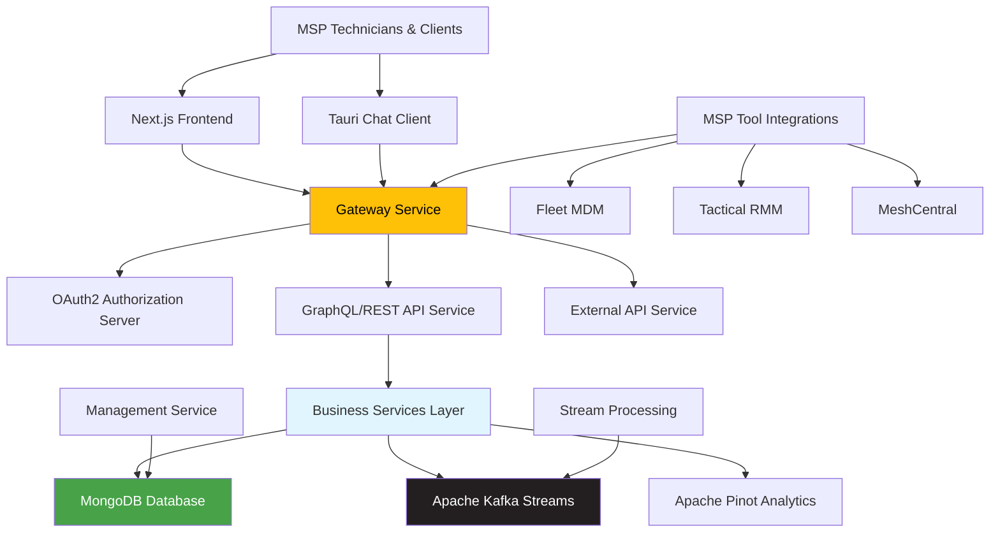

<div align="center">
  <picture>
    <source media="(prefers-color-scheme: dark)" srcset="https://raw.githubusercontent.com/flamingo-stack/openframe-oss-tenant/main/docs/assets/logo-openframe-full-dark-bg.png">
    <source media="(prefers-color-scheme: light)" srcset="https://raw.githubusercontent.com/flamingo-stack/openframe-oss-tenant/main/docs/assets/logo-openframe-full-light-bg.png">
    
  </picture>
</div>

<p align="center">
  <a href="LICENSE.md"></a>
</p>

# OpenFrame OSS Tenant

**The AI-powered open-source MSP platform that transforms IT support operations with intelligent automation and unified tool integration.**

OpenFrame replaces expensive proprietary MSP software with open-source alternatives enhanced by intelligent automation. Combining the power of modern microservices architecture with AI-driven support tools, it creates a unified IT management experience for MSP technicians and their clients.

[](https://www.youtube.com/watch?v=a45pzxtg27k)

## ✨ Key Features

### 🤖 AI-Powered Automation
- **Mingo AI Assistant**: Intelligent technician support with enterprise guardrails
- **Autonomous Issue Resolution**: AI agents that actually fix infrastructure problems  
- **Smart Triage**: Automatic ticket categorization and priority assignment

### 🛡️ Enterprise Security
- **Multi-tenant OAuth2/OIDC**: Secure identity management with per-tenant RSA keys
- **API Key Management**: Granular access control for external integrations
- **SSO Integration**: Google, Microsoft, and custom identity providers
- **Tenant Isolation**: Complete data separation between organizations

### 🔧 Unified Tool Integration
- **Fleet MDM**: Device management and compliance monitoring
- **Tactical RMM**: Remote monitoring and management capabilities
- **MeshCentral**: Remote desktop and file management
- **Open Architecture**: Easy integration of additional MSP tools

### 📊 Real-time Operations
- **Stream Processing**: Apache Kafka for event-driven architecture
- **Live Monitoring**: Real-time device status and alerts
- **Analytics**: Apache Pinot for fast query performance
- **Audit Trails**: Comprehensive logging and compliance tracking

### 💰 Cost Efficiency
- **Open Source Foundation**: No vendor lock-in or licensing fees
- **Horizontal Scaling**: Kubernetes-ready microservices architecture
- **Cloud-Native**: Deploy anywhere (AWS, Azure, GCP, on-premises)
- **Reduced Operational Overhead**: Autonomous AI reduces manual intervention by 80%

## 🚀 Quick Start

Get OpenFrame running locally in just 5 minutes:

```bash
# Clone the repository
git clone https://github.com/flamingo-stack/openframe-oss-tenant.git
cd openframe-oss-tenant

# Set up development configuration
./clients/openframe-client/scripts/setup_dev_init_config.sh

# Start infrastructure services
docker-compose up -d mongodb kafka redis

# Build and start backend services
mvn clean install
mvn spring-boot:run -pl openframe/services/openframe-gateway &
mvn spring-boot:run -pl openframe/services/openframe-api &

# Start frontend
cd openframe/services/openframe-frontend
npm install && npm run dev

# 🎉 Access OpenFrame at https://localhost:3000
```

**Need more details?** Check out our [comprehensive Quick Start Guide](./docs/getting-started/quick-start.md) for step-by-step instructions.

## 🏗️ Architecture Overview

OpenFrame is built as a modular microservices platform with clear separation of concerns:


```mermaid
flowchart TD
    User["MSP Technicians & Clients"] --> Frontend["Next.js Frontend"]
    User --> Desktop["Tauri Chat Client"]
    
    Frontend --> Gateway["Gateway Service"]
    Desktop --> Gateway
    
    Gateway --> Auth["OAuth2 Authorization Server"]
    Gateway --> API["GraphQL/REST API Service"]
    Gateway --> External["External API Service"]
    
    API --> Services["Business Services Layer"]
    Services --> MongoDB["MongoDB Database"]
    Services --> Kafka["Apache Kafka Streams"]
    Services --> Pinot["Apache Pinot Analytics"]
    
    Stream["Stream Processing"] --> Kafka
    Management["Management Service"] --> MongoDB
    
    Tools["MSP Tool Integrations"] --> Gateway
    Tools --> Fleet["Fleet MDM"]
    Tools --> Tactical["Tactical RMM"]
    Tools --> MeshCentral["MeshCentral"]
    
    style Gateway fill:#FFC008,color:#000
    style Services fill:#e1f5fe
    style MongoDB fill:#47a248,color:#fff
    style Kafka fill:#231f20,color:#fff
```

### Technology Stack

| Layer | Technology | Purpose |
|-------|------------|---------|
| **Frontend** | Next.js 16 + VoltAgent AI | Web application with AI integration |
| **Desktop** | Tauri + React + Rust | Native chat client |
| **Backend** | Spring Boot 3.3.0 + Java 21 | Microservices platform |
| **Database** | MongoDB 6.0+ | Primary data persistence |
| **Streaming** | Apache Kafka 3.6.0 | Event-driven architecture |
| **Analytics** | Apache Pinot 1.2.0 | Real-time query engine |
| **Caching** | Redis 6.0+ | Performance optimization |
| **Security** | OAuth2/OIDC | Multi-tenant authentication |

### Service Architecture

| Service | Port | Purpose |
|---------|------|---------|
| **Gateway** | 8080 | Entry point, JWT validation, routing |
| **API Service** | 8081 | Business logic, GraphQL, REST endpoints |
| **Auth Server** | 8082 | OAuth2/OIDC, multi-tenant identity |
| **External API** | 8083 | Public API, versioning, rate limiting |
| **Management** | 8084 | System operations, orchestration |
| **Stream** | 8085 | Event processing, data enrichment |

## 📚 Documentation

Comprehensive documentation is available in the [`./docs`](./docs/README.md) directory:

- **[Getting Started](./docs/getting-started/)** - Installation, quick start, and first steps
- **[Development](./docs/development/)** - Development environment, contributing guidelines
- **[Architecture](./docs/architecture/)** - Technical reference and system design
- **[API Documentation](./docs/api/)** - GraphQL and REST API reference

### 🎯 Quick Links
- [5-Minute Quick Start](./docs/getting-started/quick-start.md) - Get running immediately
- [Prerequisites](./docs/getting-started/prerequisites.md) - System requirements
- [Development Setup](./docs/development/setup/local-development.md) - Local development environment
- [Contributing Guidelines](./CONTRIBUTING.md) - How to contribute to the project

## 🔐 CLI Tools

The OpenFrame CLI tools are maintained in a separate repository:

- **Repository**: [flamingo-stack/openframe-cli](https://github.com/flamingo-stack/openframe-cli)
- **Installation**: [Installation Guide](https://github.com/flamingo-stack/openframe-cli#installation)
- **Documentation**: [CLI Documentation](https://github.com/flamingo-stack/openframe-cli/tree/main/docs)

**Note**: CLI tools are NOT located in this repository. Always refer to the external repository for installation and usage.

## 🎯 Target Audience

### Primary Users
- **MSP Owners & Decision Makers**: Reduce operational costs and improve service quality
- **MSP Technicians**: Efficient tools for device management and issue resolution  
- **MSP Clients**: Self-service capabilities and operational transparency

### Secondary Users
- **Platform Engineers**: Building or customizing MSP solutions
- **Open Source Contributors**: Extending the OpenFrame ecosystem
- **IT Consultants**: Implementing MSP solutions for clients

## 🌟 What Makes OpenFrame Different

| Traditional MSP Platforms | OpenFrame Platform |
|---------------------------|-------------------|
| ❌ Expensive proprietary licenses | ✅ Open source with AI enhancement |
| ❌ Manual ticket triage | ✅ Autonomous AI resolution |
| ❌ Vendor lock-in | ✅ Open architecture & APIs |
| ❌ Reactive problem solving | ✅ Proactive AI-driven operations |
| ❌ Limited integration options | ✅ Unified tool ecosystem |
| ❌ Complex multi-vendor management | ✅ Single pane of glass |

## 🤝 Community & Support

- **GitHub**: [OpenFrame OSS Tenant](https://github.com/flamingo-stack/openframe-oss-tenant)
- **Community**: [OpenMSP Slack](https://join.slack.com/t/openmsp/shared_invite/zt-36bl7mx0h-3~U2nFH6nqHqoTPXMaHEHA) - Join our vibrant community
- **Website**: [flamingo.run](https://flamingo.run)
- **OpenFrame Hub**: [openframe.ai](https://openframe.ai)

## 📄 License

This project is licensed under the Flamingo AI Unified License v1.0. See the [LICENSE.md](LICENSE.md) file for details.

## 🚧 Project Status

OpenFrame is actively developed and maintained by the Flamingo team and community contributors. The platform is production-ready for MSP operations with continuous improvements and new features being added regularly.

---
<div align="center">
  Built with 💛 by the <a href="https://www.flamingo.run/about"><b>Flamingo</b></a> team
</div>