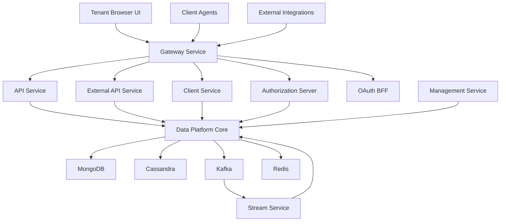

<div align="center">
  <picture>
    <source media="(prefers-color-scheme: dark)" srcset="https://raw.githubusercontent.com/flamingo-stack/openframe-oss-tenant/main/docs/assets/logo-openframe-full-dark-bg.png">
    <source media="(prefers-color-scheme: light)" srcset="https://raw.githubusercontent.com/flamingo-stack/openframe-oss-tenant/main/docs/assets/logo-openframe-full-light-bg.png">
    
  </picture>
</div>

<p align="center">
  <a href="LICENSE.md"></a>
</p>

# OpenFrame OSS Tenant

**OpenFrame** is the unified platform that integrates multiple MSP (Managed Service Provider) tools into a single AI-driven interface, automating IT support operations across the entire technology stack. This repository contains the **tenant-scoped runtime distribution** that transforms OpenFrame OSS core libraries into a fully deployable, multi-tenant MSP platform.

[](https://www.youtube.com/watch?v=bINdW0CQbvY)

## 🚀 Features

- **🤖 AI-Powered Assistance** - Mingo AI technician assistant and Fae client-facing AI
- **🔧 Unified Tool Integration** - Single dashboard for Tactical RMM, MeshCentral, Fleet MDM, and more
- **📊 Centralized Management** - Real-time monitoring, automated patch management, compliance tracking
- **💰 Cost Optimization** - Replace expensive proprietary tools with open-source alternatives
- **🔐 Enterprise Security** - Multi-tenant isolation, OAuth 2.0 + JWT, AES-256 encryption
- **📈 High Performance** - Handles 100,000+ events/second with sub-500ms latency
- **🏗️ Scalable Architecture** - Modern microservices built on Spring Boot 3.3 + Java 21

## 🎯 Quick Start

Get OpenFrame running locally in minutes:

### Prerequisites

- **Java:** OpenJDK 21.0.1+
- **Node.js:** 18+ with npm
- **Docker:** 24.0+ with Docker Compose
- **Git:** 2.42+

### Installation

```bash
# Clone the repository
git clone https://github.com/flamingo-stack/openframe-oss-tenant.git
cd openframe-oss-tenant

# Set up GitHub authentication (required for Maven dependencies)
export GITHUB_ACTOR=your-github-username
export GITHUB_TOKEN=your-github-token

# Build backend services
mvn clean install

# Start frontend development server
cd openframe/services/openframe-frontend
npm install && npm run dev

# Start the platform
docker-compose up -d
```

**Access OpenFrame:**
- **Dashboard:** https://localhost
- **API Documentation:** https://localhost/api/docs
- **GraphQL Playground:** https://localhost/graphql

[](https://www.youtube.com/watch?v=jEkFcS4AcQ4)

## 🏗️ Architecture Overview

OpenFrame deploys a **service mesh** of Spring Boot applications with clear separation between presentation, business logic, data access, and infrastructure concerns:


```mermaid
flowchart TD
    Browser["Tenant Browser UI"]
    Agent["Client Agents"]
    External["External Integrations"]

    Browser --> Gateway["Gateway Service"]
    Agent --> Gateway
    External --> Gateway

    Gateway --> Api["API Service"]
    Gateway --> ExternalApi["External API Service"]
    Gateway --> Authz["Authorization Server"]
    Gateway --> ClientSvc["Client Service"]
    Gateway --> OAuthBff["OAuth BFF"]

    Api --> DataPlatform["Data Platform Core"]
    ExternalApi --> DataPlatform
    ClientSvc --> DataPlatform
    Authz --> DataPlatform
    Management["Management Service"] --> DataPlatform
    Stream["Stream Service"] --> DataPlatform

    DataPlatform --> Mongo["MongoDB"]
    DataPlatform --> Cassandra["Cassandra"]
    DataPlatform --> Kafka["Kafka"]
    DataPlatform --> Redis["Redis"]

    Kafka --> Stream
```

## 💻 Technology Stack

| Component | Technology | Purpose |
|-----------|------------|---------|
| **Backend** | Spring Boot 3.3 + Java 21 | Core runtime & APIs |
| **Frontend** | Vue 3 + TypeScript + PrimeVue | Modern web interface |
| **Client** | Rust + Tokio | Cross-platform system agent |
| **API Layer** | GraphQL + Netflix DGS | Unified data access |
| **Message Queue** | Apache Kafka 3.6 | Event streaming |
| **Databases** | MongoDB + Cassandra + Pinot | Multi-model data storage |
| **Cache** | Redis | High-performance caching |
| **Monitoring** | Prometheus + Grafana + Loki | Observability stack |

## 📚 Documentation

📖 **[Complete Documentation](./docs/README.md)** - Comprehensive guides and API references

| Section | Description |
|---------|-------------|
| **[Getting Started](./docs/getting-started/introduction.md)** | Introduction, quick start, and first steps |
| **[Architecture](./docs/development/architecture/overview.md)** | System design and component interactions |
| **[Development Setup](./docs/development/setup/environment.md)** | Local development environment setup |
| **[API Reference](./docs/reference/)** | Service APIs and technical specifications |

### External Tools

The **OpenFrame CLI** is maintained in a separate repository:
- **Repository**: [flamingo-stack/openframe-cli](https://github.com/flamingo-stack/openframe-cli)
- **Installation**: [CLI Installation Guide](https://github.com/flamingo-stack/openframe-cli#installation)
- **Documentation**: [CLI Documentation](https://github.com/flamingo-stack/openframe-cli/tree/main/docs)

## 🤝 Contributing

We welcome contributions! Please see our [Contributing Guide](./CONTRIBUTING.md) for details on:

- Development workflow and standards
- Code style and testing requirements
- Pull request process
- Community guidelines

### Quick Contributing Steps:
1. Fork the project
2. Create your feature branch (`git checkout -b feature/amazing-feature`)
3. Commit your changes (`git commit -m 'Add amazing feature'`)
4. Push to the branch (`git push origin feature/amazing-feature`)
5. Open a Pull Request

## 🛡️ Security

OpenFrame implements enterprise-grade security:

- **OAuth 2.0 + JWT** authentication with HTTP-only cookies
- **AES-256 encryption** for data at rest
- **Multi-tenant isolation** with organization boundaries
- **Comprehensive audit logging** and real-time monitoring
- **Rate limiting** and DDoS protection

Found a security issue? Please email **security@flamingo.run** instead of opening a public issue.

## 📄 License

This project is licensed under the [Flamingo AI Unified License v1.0](LICENSE.md).

## 🌟 Community & Support

- **💬 OpenMSP Slack**: [Join our community](https://join.slack.com/t/openmsp/shared_invite/zt-36bl7mx0h-3~U2nFH6nqHqoTPXMaHEHA)
- **📖 Knowledge Base**: [Flamingo Documentation](https://www.flamingo.run/knowledge-base)
- **🐛 Issues**: Report bugs and request features on GitHub
- **💼 Enterprise Support**: Available through [Flamingo](https://www.flamingo.run)

## 🗺️ Roadmap

- [x] Core microservices architecture with GraphQL APIs
- [x] Real-time stream processing and multi-tenant support
- [x] Cross-platform Rust agent and AI integrations *(Q2 2025)*
- [x] **Advanced AI/ML capabilities** *(Q3 2025)*
- [ ] **Edge computing and mobile companion app** *(2026)*

## 🙏 Acknowledgments

- Thanks to all our [contributors](https://github.com/flamingo-stack/openframe-oss-tenant/graphs/contributors)
- Built with amazing open-source projects: Spring Boot, Apache Kafka, Vue.js, and many more
- Special thanks to the broader open-source community

---

<div align="center">
  Built with 💛 by the <a href="https://www.flamingo.run/about"><b>Flamingo</b></a> team
</div>