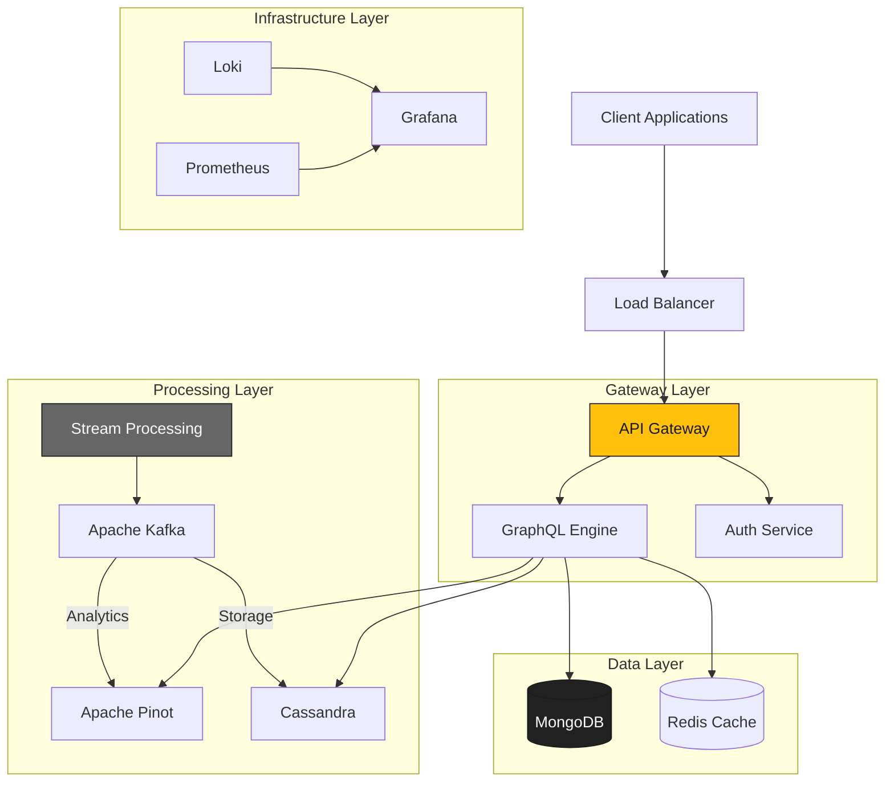

<div align="center">
  <picture>
    <source media="(prefers-color-scheme: dark)" srcset="https://raw.githubusercontent.com/flamingo-stack/openframe-oss-tenant/main/docs/assets/logo-openframe-full-dark-bg.png">
    <source media="(prefers-color-scheme: light)" srcset="https://raw.githubusercontent.com/flamingo-stack/openframe-oss-tenant/main/docs/assets/logo-openframe-full-light-bg.png">
    
  </picture>
</div>

<p align="center">
  <a href="LICENSE.md"></a>
</p>

# OpenFrame OSS Tenant

**A distributed platform that creates a unified layer for data, APIs, automation, and AI on top of carefully selected open-source projects. We simplify IT and security operations through a single, cohesive platform.**

OpenFrame is the core open-source, tenant-aware backend and frontend monorepo powering Flamingo's unified MSP platform. It delivers a full, production-grade MSP stack built on open technologies, providing multi-tenant identity, authentication, API layers, event streaming, data persistence, and tool integrations—all enhanced by AI automation.

[](https://www.youtube.com/watch?v=bINdW0CQbvY)

## ✨ Key Features

- **🎯 Unified Dashboard** - Single interface for managing all services and workflows  
- **🤖 Smart Automation** - AI-powered deployment and monitoring capabilities  
- **🧠 AI-Powered Insights** - Real-time anomaly detection and intelligent assistants  
- **🔐 Enterprise Security** - Integrated security controls across all services  
- **⚡ High Performance** - Handles 100,000+ events/second with sub-500ms latency  
- **📈 Scalable Architecture** - Built on proven microservices principles  
- **🔧 Multi-Tenant Ready** - Complete tenant isolation and management
- **🛠️ Tool Integrations** - Native support for FleetDM, Tactical RMM, and more

[](https://www.youtube.com/watch?v=jEkFcS4AcQ4)

## 🏗️ Architecture Overview

OpenFrame uses a modern microservices architecture with four key layers:


```mermaid
flowchart TB
    Client[Client Applications] --> LB[Load Balancer]
    LB --> Gateway[API Gateway]
    
    subgraph "Gateway Layer"
        Gateway --> GraphQL[GraphQL Engine]
        Gateway --> Auth[Auth Service]
    end
    
    subgraph "Processing Layer"
        Stream[Stream Processing] --> Kafka[Apache Kafka]
        Kafka --> |Analytics| Pinot[Apache Pinot]
        Kafka --> |Storage| Cassandra[Cassandra]
    end
    
    subgraph "Data Layer"
        GraphQL --> MongoDB[(MongoDB)]
        GraphQL --> Cassandra
        GraphQL --> Pinot
        GraphQL --> Redis[(Redis Cache)]
    end
    
    subgraph "Infrastructure Layer"
        Loki       --> Grafana
        Prometheus --> Grafana
    end
    
    style Gateway fill:#FFC109,stroke:#1A1A1A,color:#1A1A1A
    style Stream fill:#666666,stroke:#1A1A1A,color:#FAFAFA
    style MongoDB fill:#212121,stroke:#1A1A1A,color:#FAFAFA
```

## 🚀 Quick Start

Get OpenFrame running locally in under 5 minutes:

### Prerequisites

- **Java:** OpenJDK 21.0.1+
- **Node.js:** 18+ with npm
- **Docker:** 24.0+ with Docker Compose
- **Git:** 2.42+

### Installation

```bash
# 1. Clone the repository
git clone https://github.com/flamingo-stack/openframe-oss-tenant.git
cd openframe-oss-tenant

# 2. Set up environment variables
cp .env.example .env
# Edit .env with your GitHub token (required for dependencies)

# 3. Run platform-specific startup script
./scripts/run-mac.sh --silent     # macOS
# ./scripts/run-linux.sh --silent  # Linux
# ./scripts/run-windows.ps1        # Windows

# 4. Access the application
open http://localhost:8080
```

That's it! OpenFrame will be running with:
- **Frontend UI:** http://localhost:8080
- **GraphQL API:** http://localhost:8080/graphql
- **Health Check:** http://localhost:8080/actuator/health

### CLI Tools

OpenFrame CLI tools are maintained in a separate repository:
- **Repository**: [flamingo-stack/openframe-cli](https://github.com/flamingo-stack/openframe-cli)
- **Installation**: [Installation Guide](https://github.com/flamingo-stack/openframe-cli#installation)
- **Documentation**: [CLI Documentation](https://github.com/flamingo-stack/openframe-cli/tree/main/docs)

## 💻 Technology Stack

| Component | Technology | Purpose |
|-----------|------------|---------|
| **Backend** | Spring Boot 3.3 + Java 21 | Core runtime & APIs |
| **Frontend** | Vue.js 3 + TypeScript 5.8 | Modern web interface |
| **Client** | Rust + Tokio | Cross-platform system agent |
| **API Layer** | GraphQL + Netflix DGS | Unified data access |
| **Message Queue** | Apache Kafka 3.6 | Event streaming |
| **Databases** | MongoDB + Cassandra + Pinot | Multi-model data storage |
| **Cache** | Redis | High-performance caching |
| **Monitoring** | Prometheus + Grafana + Loki | Observability stack |

## 📚 Documentation

📚 **[Complete Documentation](./docs/README.md)** - Comprehensive guides and references

### Quick Links

| Guide | Description | Time to Complete |
|-------|-------------|------------------|
| [🚀 Quick Start](./docs/getting-started/quick-start.md) | Get running in 5 minutes | 5 minutes |
| [📖 Introduction](./docs/getting-started/introduction.md) | Learn about OpenFrame | 15 minutes |
| [⚙️ Prerequisites](./docs/getting-started/prerequisites.md) | System requirements | 10 minutes |
| [👥 First Steps](./docs/getting-started/first-steps.md) | Initial configuration | 30 minutes |
| [🏗️ Architecture](./docs/reference/architecture/overview.md) | Technical architecture | 45 minutes |
| [💻 Development](./docs/development/README.md) | Development guide | 1 hour |

## 🤝 Contributing

We welcome contributions! Please see our [Contributing Guide](./CONTRIBUTING.md) for details on how to get started.

### Quick Contributing Steps

1. Fork the project
2. Create your feature branch (`git checkout -b feature/amazing-feature`)
3. Commit your changes (`git commit -m 'Add amazing feature'`)
4. Push to the branch (`git push origin feature/amazing-feature`)
5. Open a Pull Request

## 🛡️ Security

OpenFrame implements enterprise-grade security:

- **OAuth 2.0 + JWT** authentication with tenant isolation
- **AES-256** encryption for data at rest
- **Comprehensive** audit logging and compliance
- **Multi-tenant** security boundaries
- **Rate limiting** and circuit breakers
- **Real-time** security monitoring and threat detection

🔒 Found a security vulnerability? Please email **security@flamingo.run** instead of opening a public issue.

## 📝 License

This project is licensed under the **[Flamingo AI Unified License v1.0](LICENSE.md)**.

## 🌟 Screenshots

### Dashboard Overview


### Device Management


### Policies & Compliance


## 🗺️ Roadmap

- [x] Core microservices architecture
- [x] GraphQL API with authentication  
- [x] Real-time stream processing
- [x] Cross-platform Rust agent
- [x] Multi-tenant support
- [x] **Advanced AI/ML integrations** *(Q1 2025)*
- [ ] **Edge computing capabilities** *(Q2 2025)*
- [ ] **Mobile companion app** *(2025)*

## 🙏 Acknowledgments

- Thanks to all our [contributors](https://github.com/flamingo-stack/openframe-oss-tenant/graphs/contributors)
- Built with amazing open-source projects: Spring Boot, Vue.js, Apache Kafka, MongoDB, and many more
- Special thanks to the broader open-source community

---

<div align="center">
  Built with 💛 by the <a href="https://www.flamingo.run/about"><b>Flamingo</b></a> team
</div>