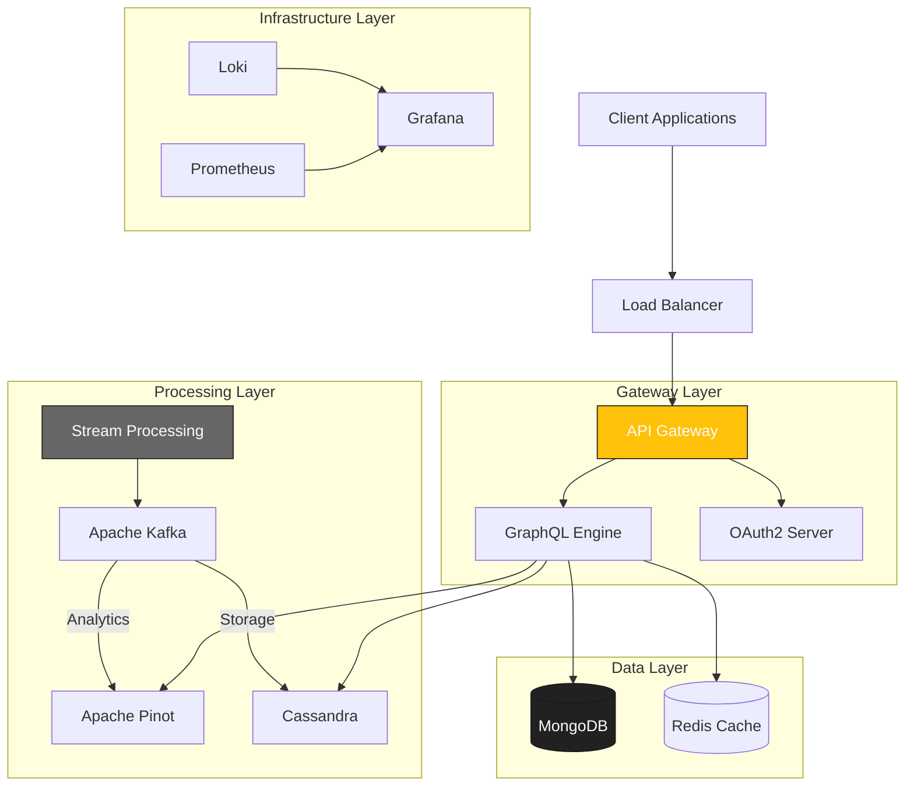

<div align="center">
  <picture>
    <source media="(prefers-color-scheme: dark)" srcset="https://raw.githubusercontent.com/flamingo-stack/openframe-oss-tenant/main/docs/assets/logo-openframe-full-dark-bg.png">
    <source media="(prefers-color-scheme: light)" srcset="https://raw.githubusercontent.com/flamingo-stack/openframe-oss-tenant/main/docs/assets/logo-openframe-full-light-bg.png">
    
  </picture>
</div>

<p align="center">
  <a href="LICENSE.md"></a>
</p>

# OpenFrame OSS Tenant

**A distributed platform that creates a unified layer for data, APIs, automation, and AI on top of carefully selected open-source projects. We simplify IT and security operations through a single, cohesive platform.**

OpenFrame is the **tenant-scoped runtime** that assembles Flamingo's open‑source service cores into a deployable, multi-tenant MSP platform. It wires together identity, gateway, APIs, client/agent services, management, streaming, and data platforms into a cohesive system that powers **OpenFrame**—the unified AI-driven MSP interface.

[](https://www.youtube.com/watch?v=a45pzxtg27k)

## 🚀 Key Features

- **🎯 Unified Dashboard** - Single interface for managing all services and workflows  
- **🤖 Smart Automation** - Automated deployment and monitoring capabilities  
- **🧠 AI-Powered Insights** - Real-time anomaly detection with Mingo AI and Fae assistants  
- **🔒 Enterprise Security** - Integrated OAuth2/OIDC security controls across all services  
- **⚡ High Performance** - Handles 100,000+ events/second with sub-500ms latency  
- **📈 Scalable Architecture** - Built on proven microservices principles  

## 🏗️ Architecture Overview

OpenFrame uses a modern microservices architecture with clear separation of concerns:


```mermaid
flowchart TB
    Client[Client Applications] --> LB[Load Balancer]
    LB --> Gateway[API Gateway]
    
    subgraph "Gateway Layer"
        Gateway --> GraphQL[GraphQL Engine]
        Gateway --> Auth[OAuth2 Server]
    end
    
    subgraph "Processing Layer"
        Stream[Stream Processing] --> Kafka[Apache Kafka]
        Kafka --> |Analytics| Pinot[Apache Pinot]
        Kafka --> |Storage| Cassandra[Cassandra]
    end
    
    subgraph "Data Layer"
        GraphQL --> MongoDB[(MongoDB)]
        GraphQL --> Cassandra
        GraphQL --> Pinot
        GraphQL --> Redis[(Redis Cache)]
    end
    
    subgraph "Infrastructure Layer"
        Loki       --> Grafana
        Prometheus --> Grafana
    end
    
    style Gateway fill:#FFC109,stroke:#1A1A1A,color:#FAFAFA
    style Stream fill:#666666,stroke:#1A1A1A,color:#FAFAFA
    style MongoDB fill:#212121,stroke:#1A1A1A,color:#FAFAFA
```

## 🚀 Quick Start

### Prerequisites

Before starting, ensure you have:
- **Java:** OpenJDK 21.0.1+
- **Node.js:** 18+ with npm
- **Rust:** 1.70+ with Cargo
- **Docker:** 24.0+ with Docker Compose
- **Git:** 2.42+

### 🎯 5-Minute Setup

Get OpenFrame running locally:

```bash
# Clone the repository
git clone https://github.com/flamingo-stack/openframe-oss-tenant.git
cd openframe-oss-tenant

# Set up GitHub authentication (required for Maven dependencies)
export GITHUB_ACTOR=your-github-username
export GITHUB_TOKEN=your-github-token

# Build and start services
./scripts/quick-start.sh
```

**Access Points:**
- **Dashboard:** https://localhost:8088
- **GraphQL API:** https://localhost:8088/graphql
- **Management Console:** https://localhost:8088/admin

### CLI Integration

OpenFrame works seamlessly with the OpenFrame CLI tools:

- **Repository**: [flamingo-stack/openframe-cli](https://github.com/flamingo-stack/openframe-cli)
- **Installation**: [CLI Installation Guide](https://github.com/flamingo-stack/openframe-cli#installation)
- **Documentation**: [CLI Documentation](https://github.com/flamingo-stack/openframe-cli/tree/main/docs)

```bash
# Example CLI usage (after installation)
openframe bootstrap
openframe status
```

## 📦 What This Repository Provides

OpenFrame OSS Tenant is the **assembly layer** that combines reusable service cores into a complete platform:

- ✅ **Multi-tenant OAuth2/OIDC Authorization Server** - Identity and access management
- ✅ **Reactive Gateway** - HTTP and WebSocket traffic routing with security
- ✅ **Internal API Service** - REST + GraphQL domain APIs
- ✅ **External API Service** - Public, API-key–based REST APIs
- ✅ **Client/Agent Service** - Machine onboarding and telemetry
- ✅ **Management Service** - Tool lifecycle, schedulers, initialization
- ✅ **Stream Processing** - Real-time event normalization and enrichment
- ✅ **Data Platforms** - Shared MongoDB, Kafka, Redis infrastructure
- ✅ **Frontend Integration** - Tenant API clients and AI chat (Mingo) support

## 🛠️ Technology Stack

| Component | Technology | Purpose |
|-----------|------------|---------|
| **Backend** | Spring Boot 3.3 + Java 21 | Core runtime & APIs |
| **Frontend** | Vue.js + TypeScript | Modern web interface |
| **Client** | Rust + Tokio | Cross-platform system agent |
| **API Layer** | GraphQL + Netflix DGS | Unified data access |
| **Message Queue** | Apache Kafka 3.6 | Event streaming |
| **Databases** | MongoDB + Cassandra + Pinot | Multi-model data storage |
| **Cache** | Redis | High-performance caching |
| **Monitoring** | Prometheus + Grafana + Loki | Observability stack |

## 📚 Documentation

📚 See the [Documentation](./docs/README.md) for comprehensive guides including:

- **Getting Started** - Introduction, prerequisites, and quick start
- **Development** - Environment setup, architecture, and contribution guidelines  
- **Reference** - Technical specifications and API documentation
- **Integration** - Connecting with external MSP tools

## 🤝 Contributing

We love contributions! Please see our [Contributing Guide](CONTRIBUTING.md) for details on:

- Setting up your development environment
- Code style and standards
- Submitting pull requests
- Community guidelines

### Quick Contributing Steps:
1. Fork the project
2. Create your feature branch (`git checkout -b feature/amazing-feature`)
3. Commit your changes (`git commit -m 'Add amazing feature'`)
4. Push to the branch (`git push origin feature/amazing-feature`)
5. Open a Pull Request

## 🎯 Who Should Use OpenFrame?

### Managed Service Providers (MSPs)
- **Reduce operational costs** by 60-80% through open-source alternatives
- **Increase efficiency** with AI-powered automation via Mingo and Fae
- **Scale operations** without proportional cost increases

### IT Teams & Consultants
- **Centralize management** across multiple client environments
- **Automate routine tasks** to focus on strategic initiatives
- **Gain visibility** into distributed infrastructure

### Technology Partners
- **Integrate existing tools** through open APIs
- **Extend functionality** with custom automation
- **Build solutions** on proven architecture

## 🛡️ Security

OpenFrame implements enterprise-grade security:

- **OAuth 2.0 + JWT** authentication with PKCE
- **AES-256** encryption for data at rest
- **Comprehensive** audit logging
- **Multi-tenant** isolation
- **Rate limiting** and circuit breakers
- **Real-time** security monitoring

Found a security issue? Please email security@flamingo.run instead of opening a public issue.

## 📄 License

This project is licensed under the [Flamingo AI Unified License v1.0](LICENSE.md).

## 🙏 Acknowledgments

- Thanks to all our [contributors](https://github.com/flamingo-stack/openframe-oss-tenant/graphs/contributors)
- Built with amazing open-source projects: Spring Boot, Apache Kafka, Vue.js, and many more
- Special thanks to the broader open-source community

---

<div align="center">
  Built with 💛 by the <a href="https://www.flamingo.run/about"><b>Flamingo</b></a> team
</div>