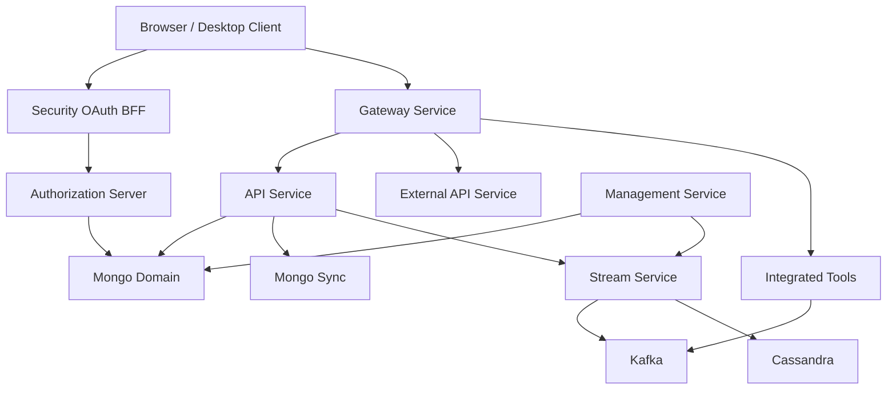

<div align="center">
  <picture>
    <source media="(prefers-color-scheme: dark)" srcset="https://shdrojejslhgnojzkzak.supabase.co/storage/v1/object/public/public/doc-orchestrator/logos/1771371901777-lc3cse-logo-openframe-full-dark-bg.png">
    <source media="(prefers-color-scheme: light)" srcset="https://shdrojejslhgnojzkzak.supabase.co/storage/v1/object/public/public/doc-orchestrator/logos/1771372526604-k3y1w-logo-openframe-full-light-bg.png">
    
  </picture>
</div>

<p align="center">
  <a href="LICENSE.md"></a>
</p>

# OpenFrame OSS Tenant

**OpenFrame OSS Tenant** is the open-source, multi-service tenant runtime of the [OpenFrame platform](https://openframe.ai) — a unified, AI-driven platform that integrates multiple MSP (Managed Service Provider) tools into a single intelligent interface. It replaces expensive proprietary software with open-source alternatives enhanced by intelligent automation.

> **Flamingo** ([https://flamingo.run](https://flamingo.run)) powers this platform with AI agents — **Mingo AI** for technicians and **Fae** for clients — sitting on top of OpenFrame to deliver autonomous IT operations.

[](https://www.youtube.com/watch?v=er-z6IUnAps)

---

## What's Included

The `openframe-oss-tenant` repository packages all core services, shared libraries, and client modules required to run a full OpenFrame tenant stack:

- **Identity & OAuth** — Multi-tenant Authorization Server (OAuth2 / OIDC)
- **API & GraphQL layer** — Netflix DGS, Relay-compatible pagination, DataLoader batching
- **Reactive Gateway & WebSocket proxy** — Spring WebFlux, JWT & API key enforcement
- **Stream Processing & CDC ingestion** — Kafka, Debezium, real-time enrichment
- **Management Control Plane** — Schedulers, Mongock migrations, tool lifecycle orchestration
- **MongoDB Persistence Layer** — Canonical domain models (users, devices, tickets, orgs)
- **Security OAuth BFF** — Browser-safe PKCE login flows with HTTPOnly cookies
- **Desktop Chat Client** — Tauri-based GraphQL runtime for the OpenFrame Chat app

---

## Key Features

| Feature | Description |
|---------|-------------|
| **Multi-tenant SaaS-ready** | Fully isolated tenant environments with per-tenant RSA key signing |
| **OAuth2 / OIDC Identity Provider** | Authorization Code + PKCE, Google & Microsoft SSO support |
| **GraphQL + REST API Runtime** | Relay-compatible pagination, DataLoader batching, custom scalars |
| **Reactive Gateway** | JWT & API key enforcement, rate limiting, WebSocket proxying |
| **Kafka Stream Processing** | CDC ingestion from Tactical RMM, MeshCentral, Fleet MDM |
| **MongoDB Domain Layer** | Canonical document models for all platform entities |
| **Operational Control Plane** | Distributed scheduling (ShedLock + Redis), Mongock migrations |
| **Extensible Architecture** | Processor hook pattern for SaaS & enterprise customizations |
| **Horizontal Scalability** | 8 independently deployable microservices |

---

## Architecture


```mermaid
flowchart TD
    Browser["Browser / Desktop Client"] --> BFF["Security OAuth BFF"]
    BFF --> Authz["Authorization Server"]
    Browser --> Gateway["Gateway Service"]

    Gateway --> Api["API Service"]
    Gateway --> External["External API Service"]
    Gateway --> Tools["Integrated Tools"]

    Api --> Mongo["Mongo Domain"]
    Api --> Sync["Mongo Sync"]
    Api --> Stream["Stream Service"]

    Authz --> Mongo
    Management["Management Service"] --> Mongo
    Management --> Stream

    Stream --> Kafka["Kafka"]
    Stream --> Cassandra["Cassandra"]

    Tools --> Kafka
```

### Service Map

| Service | Role |
|---------|------|
| `openframe-gateway` | Edge routing, JWT validation, WebSocket proxy |
| `openframe-authorization-server` | OAuth2/OIDC multi-tenant identity provider |
| `openframe-api` | Business logic (GraphQL + REST) |
| `openframe-stream` | Kafka CDC event ingestion & enrichment |
| `openframe-management` | Schedulers, migrations, tool orchestration |
| `openframe-external-api` | External REST API for third-party integrations |
| `openframe-client` | Agent client for device registration |
| `openframe-config` | Spring Cloud Config Server |

---

## Technology Stack

- **Backend**: Java 21 + Spring Boot 3.3 + Spring Cloud
- **API**: Netflix DGS (GraphQL) + Spring MVC (REST) + Spring WebFlux (Gateway)
- **Messaging**: Apache Kafka 3.6 + NATS 2.10
- **Persistence**: MongoDB 6.0 + Redis 7.0 + Apache Cassandra 4.1 + Apache Pinot 1.2
- **Security**: OAuth2/OIDC + JWT + Spring Security + PKCE
- **Agent**: Rust (Tauri desktop client, device agent)
- **Frontend**: Next.js
- **Deployment**: Kubernetes (manifests included)

---

## Quick Start

### Prerequisites

Ensure you have installed:

- **Java 21+**, **Maven 3.8+**, **Docker 24+**, **Git 2.40+**
- **Node.js 18+** (documentation tooling only)
- Running infrastructure: MongoDB, Redis, Kafka, NATS

See the full [Prerequisites guide](./docs/getting-started/prerequisites.md).

### 1. Clone the Repository

```bash
git clone https://github.com/openframehq/openframe-oss-tenant.git
cd openframe-oss-tenant
```

### 2. Build the Backend Services

```bash
# Build all services (skipping tests for a faster first build)
mvn clean install -DskipTests
```

### 3. Start Infrastructure (Docker)

```bash
# MongoDB
docker run -d --name openframe-mongo -p 27017:27017 mongo:6.0

# Redis
docker run -d --name openframe-redis -p 6379:6379 redis:7.0-alpine

# NATS
docker run -d --name openframe-nats -p 4222:4222 nats:2.10-alpine
```

### 4. Configure Environment

```bash
export SPRING_DATA_MONGODB_URI="mongodb://localhost:27017/openframe"
export SPRING_KAFKA_BOOTSTRAP_SERVERS="localhost:9092"
export SPRING_REDIS_HOST="localhost"
export NATS_URL="nats://localhost:4222"
```

### 5. Start Services (in order)

```bash
# 1. Config Server
cd openframe/services/openframe-config && mvn spring-boot:run

# 2. Authorization Server
cd ../openframe-authorization-server && mvn spring-boot:run

# 3. API Service
cd ../openframe-api && mvn spring-boot:run

# 4. Gateway (entry point for all traffic)
cd ../openframe-gateway && mvn spring-boot:run
```

### 6. Verify

```bash
# Gateway health
curl http://localhost:8080/actuator/health

# OIDC discovery
curl http://localhost:9000/.well-known/openid-configuration

# GraphQL playground
open http://localhost:8081/graphiql
```

See the [Quick Start guide](./docs/getting-started/quick-start.md) for full details.

---

## Platform Walkthrough

[](https://www.youtube.com/watch?v=awc-yAnkhIo)

---

## Documentation

📚 See the [Documentation](./docs/README.md) for comprehensive guides, architecture references, and development workflows.

| Section | Description |
|---------|-------------|
| [Getting Started](./docs/getting-started/introduction.md) | Introduction, prerequisites, quick start |
| [Development Guide](./docs/development/README.md) | Local setup, architecture, testing, security |
| [Architecture Reference](./docs/architecture/README.md) | Deep-dives into each service core |

---

## Community & Support

All questions, discussions, and contributions happen on the **OpenMSP Slack community** — we do not use GitHub Issues or GitHub Discussions.

- 💬 **OpenMSP Slack**: [Join here](https://join.slack.com/t/openmsp/shared_invite/zt-36bl7mx0h-3~U2nFH6nqHqoTPXMaHEHA)
- 🌐 **Community Hub**: [https://www.openmsp.ai/](https://www.openmsp.ai/)
- 🔗 **OpenFrame**: [https://openframe.ai](https://openframe.ai)
- 🔗 **Flamingo**: [https://flamingo.run](https://flamingo.run)

---

## Contributing

We welcome contributions! Please read the [Contributing Guidelines](./CONTRIBUTING.md) before submitting a pull request.

---

<div align="center">
  Built with 💛 by the <a href="https://www.flamingo.run/about"><b>Flamingo</b></a> team
</div>
