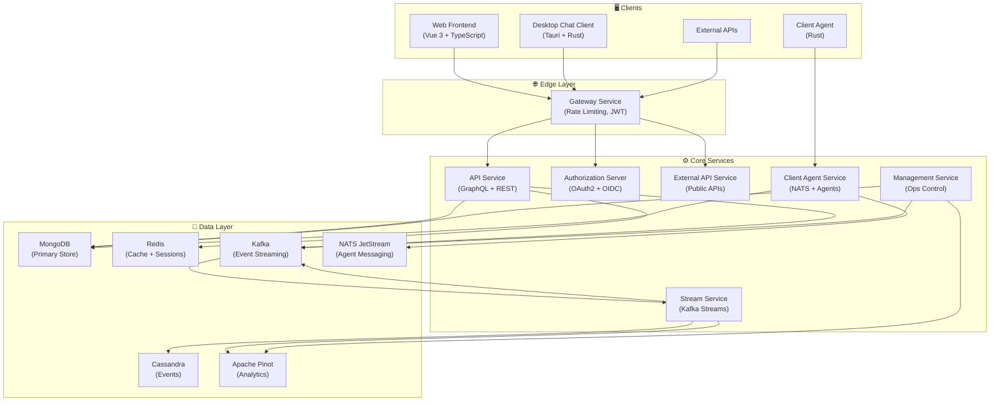
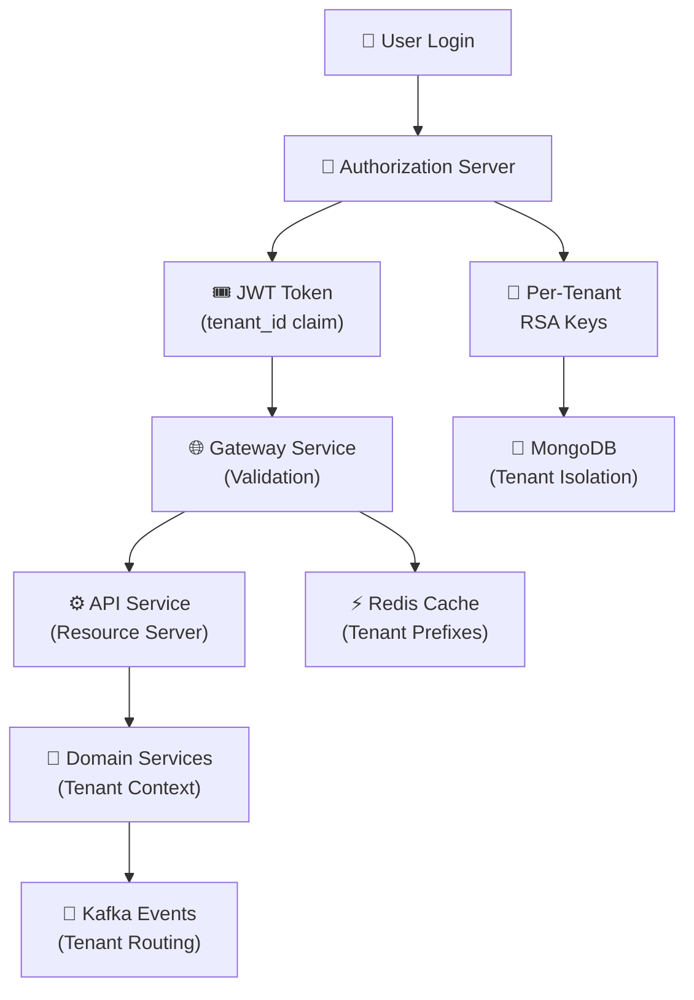

<div align="center">
  <picture>
    <source media="(prefers-color-scheme: dark)" srcset="https://raw.githubusercontent.com/flamingo-stack/openframe-oss-tenant/main/docs/assets/logo-openframe-full-dark-bg.png">
    <source media="(prefers-color-scheme: light)" srcset="https://raw.githubusercontent.com/flamingo-stack/openframe-oss-tenant/main/docs/assets/logo-openframe-full-light-bg.png">
    
  </picture>
</div>

<p align="center">
  <a href="LICENSE.md"></a>
</p>

# OpenFrame OSS Tenant

The complete open-source, multi-tenant backend and frontend implementation of the **OpenFrame platform** - an AI-powered MSP platform that unifies multiple MSP tools into a single intelligent interface, automating IT support operations with Mingo AI for technicians and Fae for clients.

[](https://www.youtube.com/watch?v=a45pzxtg27k)

## What is OpenFrame?

OpenFrame replaces expensive proprietary MSP software with open-source alternatives enhanced by intelligent automation. It's not a single service—it's an **entire platform runtime** that provides:

- **Unified MSP Tool Integration**: Fleet MDM, Tactical RMM, MeshCentral, and more
- **AI-Powered Automation**: Mingo AI for technicians, Fae for client interactions
- **Multi-Tenant Architecture**: Complete tenant isolation across the entire stack
- **Event-Driven Backbone**: Real-time analytics and automation
- **Secure by Design**: OAuth2/OIDC with PKCE, JWT-based security

## ✨ Key Features

### 🤖 AI-Powered Automation
- **Mingo AI**: Intelligent technician assistant for IT support
- **Autonomous Agents**: AI that can actually fix infrastructure issues
- **Predictive Analytics**: Powered by Apache Pinot and stream processing

### 🔧 Unified Tool Ecosystem
- **Fleet MDM**: Mobile device management integration
- **Tactical RMM**: Remote monitoring and management
- **MeshCentral**: Remote access and control
- **Extensible Architecture**: Plugin system for custom integrations

### 🏢 Enterprise-Grade Multi-Tenancy
- **Per-Tenant RSA Keys**: Isolated security domains
- **Organization Management**: Complete tenant separation
- **SSO Integration**: Google, Microsoft, and custom providers
- **API Key Management**: Secure external integrations

### 📊 Real-Time Analytics & Monitoring
- **Event Streaming**: Kafka-based event processing with Debezium CDC
- **Time-Series Analytics**: Cassandra and Apache Pinot for scalable queries
- **GraphQL Subscriptions**: Real-time UI updates
- **Distributed Caching**: Redis with tenant-aware key prefixing

### 🔐 Security-First Design
- **OAuth2/OIDC**: Full authorization server with PKCE support
- **JWT with Cookies**: Secure, scalable authentication
- **Dynamic Issuer Resolution**: Multi-tenant JWT validation
- **Rate Limiting & CORS**: Gateway-level protection

## 🏗️ Architecture Overview

OpenFrame follows a modern **microservices architecture** with event-driven components:


```mermaid
flowchart TD
    subgraph Clients["🖥️ Clients"]
        WebUI["Web Frontend<br/>(Vue 3 + TypeScript)"]
        ChatClient["Desktop Chat Client<br/>(Tauri + Rust)"]
        Agent["Client Agent<br/>(Rust)"]
        External["External APIs"]
    end

    subgraph Edge["🌐 Edge Layer"]
        Gateway["Gateway Service<br/>(Rate Limiting, JWT)"]
    end

    subgraph Core["⚙️ Core Services"]
        Api["API Service<br/>(GraphQL + REST)"]
        Authz["Authorization Server<br/>(OAuth2 + OIDC)"]
        ExternalApi["External API Service<br/>(Public APIs)"]
        Stream["Stream Service<br/>(Kafka Streams)"]
        Management["Management Service<br/>(Ops Control)"]
        ClientSvc["Client Agent Service<br/>(NATS + Agents)"]
    end

    subgraph Data["💾 Data Layer"]
        Mongo["MongoDB<br/>(Primary Store)"]
        Cassandra["Cassandra<br/>(Events)"]
        Pinot["Apache Pinot<br/>(Analytics)"]
        Redis["Redis<br/>(Cache + Sessions)"]
        Kafka["Kafka<br/>(Event Streaming)"]
        Nats["NATS JetStream<br/>(Agent Messaging)"]
    end

    WebUI --> Gateway
    ChatClient --> Gateway
    External --> Gateway
    Agent --> ClientSvc

    Gateway --> Api
    Gateway --> Authz
    Gateway --> ExternalApi

    Api --> Mongo
    Api --> Redis
    Api --> Kafka

    Stream --> Kafka
    Stream --> Cassandra
    Stream --> Pinot

    Management --> Mongo
    Management --> Kafka
    Management --> Pinot

    ClientSvc --> Nats
    ClientSvc --> Mongo

    Kafka --> Stream
```

## 🚀 Quick Start

Get OpenFrame running in 5 minutes with our comprehensive quick start guide:

### Prerequisites

- **Java 21** (OpenJDK recommended)
- **Node.js 18+** with npm
- **Docker & Docker Compose** (for infrastructure services)
- **Git** for cloning the repository

### 1. Clone and Setup Infrastructure

```bash
# Clone the repository
git clone https://github.com/flamingo-stack/openframe-oss-tenant.git
cd openframe-oss-tenant

# Start infrastructure services (MongoDB, Redis, Kafka)
docker compose -f integrated-tools/docker-compose.yml up -d mongodb redis kafka
```

### 2. Build and Start Services

```bash
# Build all Java services
mvn clean install -DskipTests

# Start services in order (each in separate terminal)
cd openframe/services/openframe-config && mvn spring-boot:run          # Terminal 1
cd openframe/services/openframe-authorization-server && mvn spring-boot:run  # Terminal 2
cd openframe/services/openframe-api && mvn spring-boot:run             # Terminal 3
cd openframe/services/openframe-gateway && mvn spring-boot:run         # Terminal 4
```

### 3. Start Frontend

```bash
# Start the Vue.js frontend
cd openframe/services/openframe-frontend
npm install
npm run dev
```

### 4. Access OpenFrame

🎉 **Success!** OpenFrame is now running:

- **Web UI**: http://localhost:3000
- **API Gateway**: http://localhost:8080
- **GraphQL Playground**: http://localhost:8081/graphiql

[](https://www.youtube.com/watch?v=jEkFcS4AcQ4)

For detailed setup instructions, see our [Quick Start Guide](./docs/getting-started/quick-start.md).

## 🛠️ Technology Stack

### Backend Services
- **Runtime**: Java 21, Spring Boot 3.3.0
- **API**: GraphQL with DataLoaders, REST Controllers, WebSocket
- **Security**: OAuth2/OIDC, JWT with cookies, PKCE
- **Data**: MongoDB, Cassandra, Redis, Apache Pinot
- **Messaging**: Apache Kafka 3.6.0, NATS JetStream
- **Build**: Maven, Docker

### Frontend Applications
- **Framework**: Vue 3 with TypeScript and Composition API
- **UI Components**: PrimeVue with custom design system
- **State Management**: Pinia for reactive state
- **GraphQL**: Apollo Client with real-time subscriptions
- **Build**: Vite, ESLint, Prettier

### Client & Desktop
- **Language**: Rust for cross-platform compatibility
- **Desktop Chat**: Tauri framework
- **Features**: System monitoring, secure communication
- **Security**: Encrypted messaging, automatic updates

### Infrastructure & DevOps
- **Containerization**: Docker & Docker Compose
- **Databases**: MongoDB 7.0, Cassandra 4.1, Redis 7.0
- **Analytics**: Apache Pinot for OLAP queries
- **Service Discovery**: Spring Cloud Config
- **Monitoring**: Actuator health checks, distributed tracing

## 📦 Repository Structure

This repository contains the complete OpenFrame platform:

### Core Services (`openframe/services/`)
- **openframe-api**: Main API service with GraphQL and REST
- **openframe-authorization-server**: OAuth2/OIDC provider
- **openframe-gateway**: Edge routing and security gateway
- **openframe-external-api**: Public API for third-party integrations
- **openframe-management**: Operational control plane
- **openframe-stream**: Kafka Streams processing
- **openframe-client**: Client agent communication service
- **openframe-config**: Centralized configuration server

### Frontend Applications
- **openframe-frontend**: Main web application (Vue 3)
- **clients/openframe-chat**: Desktop chat client (Tauri)

### Shared Libraries
- **API Service Core**: Runtime, security, GraphQL, REST, domain services
- **Authorization Server Core**: OAuth flows, JWT issuance, SSO
- **Gateway Service Core**: JWT validation, rate limiting, WebSocket proxy
- **Data Layer**: MongoDB, Cassandra, Redis, Kafka abstractions
- **Security Core**: Shared OAuth utilities, JWT encoding/decoding

## 🎯 Use Cases

### For MSP Providers
- **Reduce Vendor Costs**: Replace expensive proprietary tools with open-source alternatives
- **Automate IT Support**: Let AI handle routine troubleshooting and ticket triage
- **Improve Technician Efficiency**: Mingo AI provides intelligent assistance and recommendations
- **Better Client Experience**: Fae AI handles common client requests automatically

### For DevOps Teams
- **Unified Monitoring**: Single pane of glass for all infrastructure and devices
- **Automated Incident Response**: AI-driven resolution for common issues
- **Compliance Management**: Automated security and compliance reporting
- **Scalable Architecture**: Horizontally scalable microservices design

### for Enterprise IT
- **Centralized Management**: Manage all tools and integrations from one platform
- **Custom Integrations**: Extensible plugin architecture for existing tools
- **Multi-Tenant Isolation**: Complete separation for different departments/clients
- **Modern Infrastructure**: Cloud-native, API-first design

## 🔐 Security Model

OpenFrame implements a comprehensive multi-tenant security model:


```mermaid
flowchart TD
    User["👤 User Login"] --> Authz["🔐 Authorization Server"]
    Authz --> JWT["🎟️ JWT Token<br/>(tenant_id claim)"]
    JWT --> Gateway["🌐 Gateway Service<br/>(Validation)"]
    Gateway --> Api["⚙️ API Service<br/>(Resource Server)"]
    Api --> Domain["🏢 Domain Services<br/>(Tenant Context)"]

    Authz --> RSA["🔑 Per-Tenant<br/>RSA Keys"]
    RSA --> Mongo["💾 MongoDB<br/>(Tenant Isolation)"]
    
    Gateway --> Cache["⚡ Redis Cache<br/>(Tenant Prefixes)"]
    Domain --> Events["📡 Kafka Events<br/>(Tenant Routing)"]
```

**Key Security Features:**
- Per-tenant RSA key pairs for JWT signing
- Dynamic issuer resolution for multi-tenant validation
- Tenant-scoped data isolation across all layers
- OAuth2 with PKCE for secure public clients
- Rate limiting and CORS protection at gateway level

## 🤝 Contributing

We welcome contributions from the community! OpenFrame is built by MSPs, for MSPs.

### Quick Start for Contributors

1. **Read the [Contributing Guidelines](./CONTRIBUTING.md)**
2. **Set up your [Development Environment](./docs/development/setup/local-development.md)**
3. **Find a [Good First Issue](https://github.com/flamingo-stack/openframe-oss-tenant/issues?q=is%3Aissue+is%3Aopen+label%3A%22good+first+issue%22)**
4. **Join our [OpenMSP Slack Community](https://join.slack.com/t/openmsp/shared_invite/zt-36bl7mx0h-3~U2nFH6nqHqoTPXMaHEHA)**

### Ways to Contribute
- 🐛 **Bug Reports**: Help us identify and fix issues
- ✨ **Feature Requests**: Suggest new functionality
- 🔧 **Code Contributions**: Implement features and fix bugs
- 📚 **Documentation**: Improve guides and API references
- 🧪 **Testing**: Add test coverage and find edge cases
- 💬 **Community Support**: Help other users in Slack

## 📚 Documentation

📖 **[Complete Documentation](./docs/README.md)** - Comprehensive guides and references

### Getting Started
- [Introduction](./docs/getting-started/introduction.md) - What is OpenFrame?
- [Prerequisites](./docs/getting-started/prerequisites.md) - System requirements
- [Quick Start](./docs/getting-started/quick-start.md) - 5-minute setup guide
- [First Steps](./docs/getting-started/first-steps.md) - Initial configuration

### Development
- [Local Development](./docs/development/setup/local-development.md) - Development environment setup
- [Architecture Overview](./docs/development/architecture/README.md) - System design and patterns
- [Testing Strategy](./docs/development/testing/README.md) - Testing approach and tools

### Reference
- [API Documentation](./docs/architecture/) - Service APIs and GraphQL schema
- [Configuration](./docs/architecture/) - Environment variables and settings
- [Security](./docs/development/security/README.md) - Authentication and authorization

## 🌐 Community & Support

### 💬 Get Help & Connect
- **[OpenMSP Slack](https://join.slack.com/t/openmsp/shared_invite/zt-36bl7mx0h-3~U2nFH6nqHqoTPXMaHEHA)**: Join our active community for real-time support
- **[GitHub Discussions](https://github.com/flamingo-stack/openframe-oss-tenant/discussions)**: Technical discussions and Q&A
- **[GitHub Issues](https://github.com/flamingo-stack/openframe-oss-tenant/issues)**: Bug reports and feature requests

### 🔗 Links
- **Website**: [OpenFrame.ai](https://openframe.ai) - Product information and demos
- **Flamingo Platform**: [Flamingo.run](https://flamingo.run) - The company behind OpenFrame
- **CLI Tools**: [OpenFrame CLI](https://github.com/flamingo-stack/openframe-cli) - Command-line utilities

> 💡 **Note**: We don't use GitHub Issues or GitHub Discussions for general support. Everything is managed on our OpenMSP Slack community where you can get faster help from both maintainers and community members.

## 📊 Project Status

OpenFrame is actively developed and used in production by MSPs worldwide. Current focus areas:

- ✅ **Stable**: Core platform, multi-tenant architecture, basic AI features
- 🚧 **Active Development**: Advanced AI agents, new tool integrations, performance optimization
- 📋 **Planned**: Enhanced mobile support, marketplace for plugins, advanced analytics

**Latest Release**: v0.5.2 - [See Release Notes](https://github.com/flamingo-stack/openframe-oss-tenant/releases)

## 📄 License

This project is licensed under the **Flamingo AI Unified License v1.0** - see the [LICENSE.md](LICENSE.md) file for details.

---

<div align="center">
  Built with 💛 by the <a href="https://www.flamingo.run/about"><b>Flamingo</b></a> team
</div>