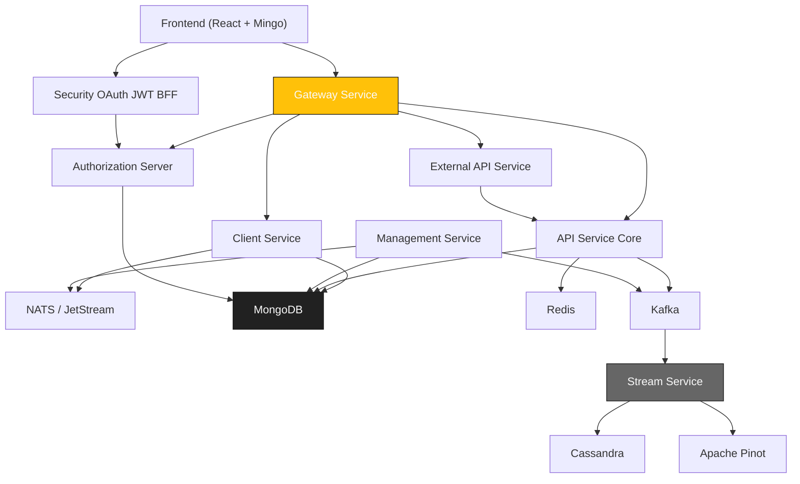

<div align="center">
  <picture>
    <source media="(prefers-color-scheme: dark)" srcset="https://raw.githubusercontent.com/flamingo-stack/openframe-oss-tenant/main/docs/assets/logo-openframe-full-dark-bg.png">
    <source media="(prefers-color-scheme: light)" srcset="https://raw.githubusercontent.com/flamingo-stack/openframe-oss-tenant/main/docs/assets/logo-openframe-full-light-bg.png">
    
  </picture>
</div>

<p align="center">
  <a href="LICENSE.md"></a>
</p>

# OpenFrame OSS Tenant

**A distributed platform that creates a unified layer for data, APIs, automation, and AI on top of carefully selected open-source projects. We simplify IT and security operations through a single, cohesive platform.**

OpenFrame is the complete open-source, multi-tenant backend and frontend stack that powers Flamingo's unified AI-driven MSP platform. It replaces expensive proprietary software with open-source alternatives enhanced by intelligent automation.

## 🎥 Platform Overview

[](https://www.youtube.com/watch?v=bINdW0CQbvY)

## ✨ Key Features

### 🤖 AI-Powered Intelligence
- **Mingo AI** - Intelligent assistant for technicians that automates routine tasks
- **Fae** - AI-powered client interface for streamlined support interactions  
- Real-time anomaly detection and automated issue resolution

### 🔧 Unified Tool Integration
- **Remote Monitoring**: Tactical RMM, Fleet MDM integration
- **Remote Access**: MeshCentral support with WebSocket proxy
- **Authentication**: Google SSO, Microsoft SSO, Authentik integration
- **Device Management**: Cross-platform Rust agent with NATS messaging

### 🏢 Enterprise-Grade Architecture
- **Multi-tenant isolation** with per-organization configuration
- **OAuth2 + PKCE** authentication with JWT security
- **Event-driven** design with Kafka streaming
- **Microservices** architecture with Spring Boot 3.3

### 📊 Advanced Analytics & Monitoring
- **Real-time processing** with Apache Kafka and stream enrichment
- **Multi-model storage** with MongoDB, Cassandra, and Apache Pinot
- **High-performance caching** with Redis
- **Comprehensive observability** with Prometheus and Grafana

## 🚀 Quick Start

[](https://www.youtube.com/watch?v=a45pzxtg27k)

### Prerequisites
- **Java**: OpenJDK 21.0.1+
- **Node.js**: 18+ with npm
- **Rust**: 1.70+ with Cargo
- **Docker**: 24.0+ with Docker Compose
- **Git**: 2.42+

### Installation

OpenFrame CLI tools are maintained separately:

**Repository**: [flamingo-stack/openframe-cli](https://github.com/flamingo-stack/openframe-cli)  
**Installation Guide**: [CLI Installation](https://github.com/flamingo-stack/openframe-cli#installation)  
**Documentation**: [CLI Documentation](https://github.com/flamingo-stack/openframe-cli/tree/main/docs)

```bash
# Get OpenFrame running locally:

# Linux
./openframe-linux-amd64 bootstrap

# Windows  
./openframe-windows-amd64.exe bootstrap

# macOS
./openframe bootstrap
```

Once started, OpenFrame will be available at **https://localhost**

For detailed setup instructions, see our [Getting Started Guide](./docs/README.md).

## 🏗️ Architecture Overview

OpenFrame implements a modern microservices architecture with four key layers:


```mermaid
flowchart TB
    Browser["Frontend (React + Mingo)"] --> Gateway["Gateway Service"]
    Browser --> AuthBFF["Security OAuth JWT BFF"]

    Gateway --> ApiService["API Service Core"]
    Gateway --> ExternalApi["External API Service"]
    Gateway --> ClientService["Client Service"]
    Gateway --> AuthServer["Authorization Server"]

    AuthBFF --> AuthServer

    ClientService --> NATS["NATS / JetStream"]
    ClientService --> Mongo["MongoDB"]

    ApiService --> Mongo
    ApiService --> Redis["Redis"]
    ApiService --> Kafka["Kafka"]

    ExternalApi --> ApiService

    Kafka --> StreamService["Stream Service"]
    StreamService --> Cassandra["Cassandra"]
    StreamService --> Pinot["Apache Pinot"]

    ManagementService["Management Service"] --> Mongo
    ManagementService --> Kafka
    ManagementService --> NATS

    AuthServer --> Mongo

    style Gateway fill:#FFC109,stroke:#1A1A1A,color:#FAFAFA
    style StreamService fill:#666666,stroke:#1A1A1A,color:#FAFAFA
    style Mongo fill:#212121,stroke:#1A1A1A,color:#FAFAFA
```

### Core Components

| Service | Technology | Purpose |
|---------|------------|---------|
| **API Service** | Spring Boot 3.3 + Java 21 | REST + GraphQL application layer |
| **Frontend** | Next.js 15 + React 19 + TypeScript 5.8 | Modern web interface with Mingo AI |
| **Gateway** | Spring Cloud Gateway | JWT validation, routing, WebSocket proxy |
| **Authorization Server** | Spring Authorization Server | OAuth2 + OIDC multi-tenant identity |
| **Stream Service** | Apache Kafka 3.6 | Event streaming and enrichment |
| **Client Agent** | Rust + Tokio | Cross-platform system monitoring |
| **Data Layer** | MongoDB + Cassandra + Pinot + Redis | Multi-model data storage |

## 🌟 Platform Benefits

- **Unified Dashboard** - Single interface for managing all services and workflows
- **Smart Automation** - AI-powered deployment and monitoring capabilities
- **High Performance** - Handles 100,000+ events/second with sub-500ms latency
- **Enterprise Security** - Integrated security controls across all services
- **Cost Reduction** - Replace expensive enterprise licenses with open-source alternatives
- **Scalable Architecture** - Built on proven microservices principles

## 📚 Documentation

📚 See the [Documentation](./docs/README.md) for comprehensive guides including:

- **Getting Started** - Quick setup and basic concepts
- **Development** - Local development environment and testing
- **Reference** - Architecture documentation and technical specifications
- **Deployment** - Production deployment guides

## 🛠️ Development Setup

### GitHub Authentication Required

> **Note**: This project depends on `openframe-oss-lib` via GitHub Packages. Set `GITHUB_ACTOR` and `GITHUB_TOKEN` environment variables before building.

```bash
# Clone the repository
git clone https://github.com/flamingo-stack/openframe-oss-tenant.git
cd openframe-oss-tenant

# Set up GitHub authentication
export GITHUB_ACTOR=your-github-username
export GITHUB_TOKEN=your-github-token

# Build backend services
mvn clean install

# Start frontend development server
cd openframe/services/openframe-frontend
npm install && npm run dev

# Build Rust agent
cd ../../client
cargo build --release
```

### Running Tests
```bash
# Java tests
mvn test

# Frontend tests
cd openframe/services/openframe-frontend
npm run type-check

# Rust tests  
cd client
cargo test
```

## 🤝 Contributing

We welcome contributions! Please see our [Contributing Guide](CONTRIBUTING.md) for details.

### Quick Contributing Steps:
1. Fork the project
2. Create your feature branch (`git checkout -b feature/amazing-feature`)
3. Commit your changes (`git commit -m 'Add amazing feature'`)
4. Push to the branch (`git push origin feature/amazing-feature`)
5. Open a Pull Request

## 🔐 Security

OpenFrame takes security seriously with:

- **OAuth 2.0 + JWT** authentication with HTTP-only cookies
- **AES-256** encryption for data at rest
- **Multi-tenant isolation** and comprehensive audit logging
- **Rate limiting** and circuit breakers
- **Real-time security monitoring**

Found a security issue? Please email security@flamingo.run instead of opening a public issue.

## 🌐 Community & Support

Join the OpenFrame community:

- 💬 **Slack Community**: [OpenMSP Slack](https://join.slack.com/t/openmsp/shared_invite/zt-36bl7mx0h-3~U2nFH6nqHqoTPXMaHEHA)
- 🌐 **Website**: [flamingo.run/openframe](https://www.flamingo.run/openframe)
- 📧 **Community Hub**: [openmsp.ai](https://www.openmsp.ai/)

> **Note**: We don't use GitHub Issues or GitHub Discussions. All support and development discussions happen on our OpenMSP Slack community.

## 📜 License

This project is licensed under the [The Flamingo AI Unified License v1.0](LICENSE.md).

## 🙏 Acknowledgments

- Thanks to all our [contributors](https://github.com/flamingo-stack/openframe-oss-tenant/graphs/contributors)
- Built with amazing open-source projects: Spring Boot, Apache Kafka, MongoDB, and many more
- Special thanks to the broader open-source community

---

<div align="center">
  Built with 💛 by the <a href="https://www.flamingo.run/about"><b>Flamingo</b></a> team
</div>