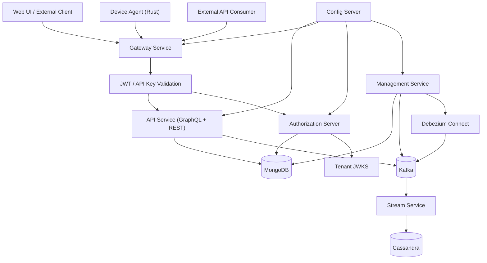

<div align="center">
  <picture>
    <source media="(prefers-color-scheme: dark)" srcset="https://shdrojejslhgnojzkzak.supabase.co/storage/v1/object/public/public/doc-orchestrator/logos/1771371901777-lc3cse-logo-openframe-full-dark-bg.png">
    <source media="(prefers-color-scheme: light)" srcset="https://shdrojejslhgnojzkzak.supabase.co/storage/v1/object/public/public/doc-orchestrator/logos/1771372526604-k3y1w-logo-openframe-full-light-bg.png">
    
  </picture>
</div>

<p align="center">
  <a href="LICENSE.md"></a>
</p>

# OpenFrame OSS Tenant

**OpenFrame OSS Tenant** is the open-source, multi-tenant backend platform powering [OpenFrame](https://openframe.ai) — an AI-driven unified platform for Managed Service Providers (MSPs). It replaces expensive proprietary software with open-source alternatives enhanced by intelligent automation.

Built by [Flamingo](https://flamingo.run), OpenFrame integrates multiple MSP tools (Tactical RMM, MeshCentral, FleetDM, and more) into a single AI-driven interface, automating IT support operations across the entire stack — from device monitoring and remote access to ticketing, knowledge management, and AI-powered assistance.

[](https://www.youtube.com/watch?v=a45pzxtg27k)

---

## Features

- **Multi-Tenant Architecture** — Tenant-scoped data, signing keys, and OAuth2 flows with complete isolation per client
- **OAuth2 / OIDC Compliant** — Full authorization server with PKCE, SSO (Google, Microsoft), and per-tenant RSA key pairs
- **GraphQL + Relay** — Netflix DGS-powered GraphQL with cursor-based pagination and DataLoader N+1 mitigation
- **Event-Driven CDC** — Kafka + Debezium change data capture for real-time tool synchronization
- **Reactive Gateway** — Spring WebFlux-based edge layer with JWT validation, API key rate limiting, and WebSocket proxying
- **AI-Powered Assistance** — Mingo AI for technicians, Fae for clients — built into the platform fabric
- **Pluggable Tool Routing** — Support for Tactical RMM, MeshCentral, FleetDM, and custom tool upstreams
- **Distributed Scheduling** — ShedLock-backed distributed schedulers safe for multi-instance deployments
- **Modular Microservice Architecture** — Each service composes reusable core libraries for clean separation of concerns

---

## Architecture


```mermaid
flowchart TD
    Browser["Web UI / External Client"] --> Gateway["Gateway Service"]
    Agent["Device Agent (Rust)"] --> Gateway
    ExtClient["External API Consumer"] --> Gateway

    Gateway --> Auth["JWT / API Key Validation"]
    Auth --> Api["API Service (GraphQL + REST)"]
    Auth --> Authz["Authorization Server"]

    Api --> Mongo[("MongoDB")]
    Api --> Kafka[("Kafka")]

    Authz --> Mongo
    Authz --> JWKS["Tenant JWKS"]

    Kafka --> Stream["Stream Service"]
    Stream --> Cassandra[("Cassandra")]

    Management["Management Service"] --> Mongo
    Management --> Kafka
    Management --> Debezium["Debezium Connect"]

    Debezium --> Kafka
    Config["Config Server"] --> Api
    Config --> Gateway
    Config --> Authz
    Config --> Management
```

### Core Services

| Service | Purpose |
|---------|---------|
| **Gateway** | Reactive edge routing, JWT validation, API key auth, WebSocket proxy |
| **API Service** | GraphQL + REST business API surface (Netflix DGS) |
| **Authorization Server** | OAuth2 / OIDC identity provider, multi-tenant SSO |
| **Stream Service** | Kafka-based event processing and CDC normalization |
| **Management Service** | Operational control plane, schedulers, migrations, tool lifecycle |
| **External API** | Public REST API for third-party integrations |
| **Config Server** | Centralized Spring Cloud Config distribution |

---

## Technology Stack

**Backend (Java)**
- Java 21 + Spring Boot 3.3
- Spring Cloud Gateway (reactive edge)
- Spring Authorization Server (OAuth2 / OIDC)
- Netflix DGS (GraphQL)
- Apache Kafka + Debezium (CDC)
- MongoDB (primary datastore)
- Redis (caching, rate limiting, distributed locks)
- NATS (messaging for device agents)
- Apache Cassandra (unified log storage)

**AI & Automation Layer (Node.js)**
- `@voltagent/core` (agent orchestration)
- `@ai-sdk/anthropic` + `@anthropic-ai/sdk` (Claude AI)
- `zod` (schema validation)

**Frontend (Next.js)**
- Next.js 15 (React 19 App Router)
- Relay (GraphQL client)
- TanStack Query
- `@flamingo-stack/openframe-frontend-core` (shared UI library)

**Device Agent (Rust)**
- OpenFrame Client Agent for managed endpoints

---

## Quick Start

### Prerequisites

- **Java 21** (JDK)
- **Apache Maven 3.9+**
- **Node.js 18+**
- **Docker 24+** and **Docker Compose 2.x**

### 1. Clone the Repository

```bash
git clone https://github.com/flamingo-run/openframe-oss-tenant.git
cd openframe-oss-tenant
```

### 2. Install Node.js Dependencies

```bash
npm install
```

### 3. Build All Java Services

```bash
mvn clean install -DskipTests
```

### 4. Start Infrastructure

```bash
# MongoDB (with replica set for Debezium CDC)
docker run -d --name openframe-mongo \
  -p 27017:27017 \
  mongo:7 --replSet rs0

docker exec openframe-mongo mongosh --eval "rs.initiate()"

# Redis
docker run -d --name openframe-redis \
  -p 6379:6379 redis:7

# NATS with JetStream
docker run -d --name openframe-nats \
  -p 4222:4222 nats:2 -js
```

### 5. Start Services (in order)

```bash
# 1. Config Server
cd openframe/services/openframe-config && mvn spring-boot:run

# 2. Authorization Server
cd openframe/services/openframe-authorization-server && mvn spring-boot:run -Dspring-boot.run.profiles=local

# 3. API Service
cd openframe/services/openframe-api && mvn spring-boot:run -Dspring-boot.run.profiles=local

# 4. Gateway (entry point for all traffic)
cd openframe/services/openframe-gateway && mvn spring-boot:run -Dspring-boot.run.profiles=local
```

### 6. Verify

```bash
# Check API health
curl https://localhost/api/health

# Access OIDC discovery
curl https://localhost/auth/.well-known/openid-configuration
```

### Service Port Reference

| Service | Default Port |
|---------|-------------|
| Gateway | 443 (HTTPS) |
| API Service | 8080 |
| Authorization Server | 8081 |
| Management Service | 8082 |
| Stream Service | 8083 |
| External API | 8084 |
| Config Server | 8888 |

---

## First Steps After Setup

1. **Register your first tenant** via the Authorization Server registration endpoint
2. **Explore the GraphQL API** at `https://localhost/graphql/graphiql`
3. **Connect an integration tool** (Tactical RMM, MeshCentral, or FleetDM) via the Management API
4. **Install the OpenFrame Client Agent** on managed devices
5. **Configure SSO** with Google or Microsoft for production deployments

---

## Repository Structure

```text
openframe-oss-tenant/
├── openframe/
│   └── services/
│       ├── openframe-api/                   # GraphQL + REST API service
│       ├── openframe-authorization-server/  # OAuth2 / OIDC server
│       ├── openframe-gateway/               # Edge gateway
│       ├── openframe-management/            # Operational control plane
│       ├── openframe-stream/                # Kafka event processing
│       ├── openframe-external-api/          # Public REST API
│       ├── openframe-client/                # Client integration layer
│       ├── openframe-config/                # Config server
│       └── openframe-frontend/              # Next.js frontend
├── clients/
│   ├── openframe-client/                    # Rust device agent
│   └── openframe-chat/                      # Chat client (Tauri)
├── manifests/
│   └── integrated-tools/                    # Kubernetes manifests
├── pom.xml                                  # Maven parent POM
└── package.json                             # Node.js / AI tooling
```

---

## Documentation

📚 See the [Documentation](./docs/README.md) for comprehensive guides including architecture reference, getting started tutorials, and development workflows.

---

## Community and Support

All discussions, feature requests, and support are managed through the **OpenMSP Slack community** — not GitHub Issues or Discussions.

> **Join the Community:** [OpenMSP Slack](https://join.slack.com/t/openmsp/shared_invite/zt-36bl7mx0h-3~U2nFH6nqHqoTPXMaHEHA)
>
> **Community Website:** [https://www.openmsp.ai/](https://www.openmsp.ai/)
>
> **OpenFrame Platform:** [https://openframe.ai](https://openframe.ai)
>
> **Flamingo:** [https://flamingo.run](https://flamingo.run)

---

## Contributing

Contributions are welcome! Please read our [Contributing Guide](./CONTRIBUTING.md) before submitting a pull request.

---

<div align="center">
  Built with 💛 by the <a href="https://www.flamingo.run/about"><b>Flamingo</b></a> team
</div>
