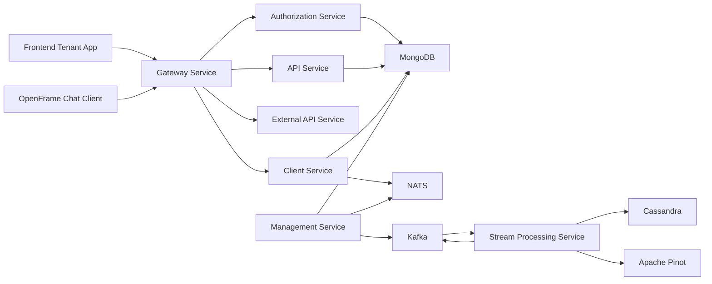

<div align="center">
  <picture>
    <source media="(prefers-color-scheme: dark)" srcset="https://raw.githubusercontent.com/flamingo-stack/openframe-oss-tenant/main/docs/assets/logo-openframe-full-dark-bg.png">
    <source media="(prefers-color-scheme: light)" srcset="https://raw.githubusercontent.com/flamingo-stack/openframe-oss-tenant/main/docs/assets/logo-openframe-full-light-bg.png">
    
  </picture>
</div>

<p align="center">
  <a href="LICENSE.md"></a>
</p>

# OpenFrame OSS Tenant Platform

**A distributed platform that creates a unified layer for data, APIs, automation, and AI on top of carefully selected open-source projects. We simplify IT and security operations through a single, cohesive platform.**

The OpenFrame OSS Tenant repository provides a complete multi-tenant backend and frontend platform powering OpenFrame, featuring:

- Multi-tenant OAuth2 authorization server
- Secure reactive API gateway  
- Domain-driven REST + GraphQL APIs
- Agent lifecycle and tool integration services
- Event streaming and real-time processing
- MongoDB, Kafka, Pinot, and Cassandra data layers
- Tenant-facing frontend application
- AI-powered desktop chat client (OpenFrame Chat)

This repository represents a **full-stack, microservices-based MSP platform** designed for extensibility, security, and tenant isolation.

## 🎬 Demo Videos

Get a quick overview of OpenFrame's capabilities:

[](https://www.youtube.com/watch?v=bINdW0CQbvY)

[](https://www.youtube.com/watch?v=a45pzxtg27k)

## ✨ Key Features

- **Unified Dashboard** - Single interface for managing all services and workflows
- **Multi-Tenant Architecture** - Complete tenant isolation with per-tenant RSA keys
- **Smart Automation** - Automated deployment and monitoring capabilities  
- **AI-Powered Insights** - Real-time anomaly detection and intelligent assistants
- **Enterprise Security** - OAuth2 + JWT authentication with comprehensive audit logging
- **High Performance** - Handles 100,000+ events/second with sub-500ms latency
- **Tool Integration** - Native support for Fleet, Tactical RMM, and other MSP tools
- **Event Streaming** - Real-time processing with Kafka and stream analytics
- **Scalable Architecture** - Built on proven microservices principles

## 🏗️ Architecture Overview

OpenFrame uses a modern microservices architecture with layered separation of concerns:


```mermaid
flowchart LR
    Frontend["Frontend Tenant App"] --> Gateway["Gateway Service"]
    ChatClient["OpenFrame Chat Client"] --> Gateway

    Gateway --> Authz["Authorization Service"]
    Gateway --> Api["API Service"]
    Gateway --> ExternalApi["External API Service"]
    Gateway --> ClientSvc["Client Service"]

    Authz --> Mongo["MongoDB"]
    Api --> Mongo
    ClientSvc --> Mongo
    Management --> Mongo

    ClientSvc --> Nats["NATS"]
    Stream --> Kafka["Kafka"]
    Kafka --> Stream["Stream Processing Service"]

    Stream --> Cassandra["Cassandra"]
    Stream --> Pinot["Apache Pinot"]

    Management["Management Service"] --> Kafka
    Management --> Nats
```

## 🚀 Quick Start

### Prerequisites

Before getting started, ensure you have:

- **Java:** OpenJDK 21.0.1+
- **Node.js:** 18+ with npm
- **Rust:** 1.70+ with Cargo  
- **Docker:** 24.0+ with Docker Compose
- **Git:** 2.42+

### CLI Usage

Get OpenFrame running locally using the CLI:

```bash
# Linux
./cli/openframe-linux-amd64 bootstrap
./cli/openframe-linux-amd64 bootstrap --non-interactive --verbose

# Windows
./cli/openframe-windows-amd64.exe bootstrap
./cli/openframe-windows-amd64.exe bootstrap --non-interactive --verbose

# macOS
./cli/openframe bootstrap
./cli/openframe bootstrap --non-interactive --verbose
```

For detailed CLI documentation, installation, and all available commands, see [CLI Documentation](https://github.com/flamingo-stack/openframe-cli).

Once started, OpenFrame will be available at:
- **UI Dashboard:** https://localhost

### Local Development Setup

For development work on the platform itself:

```bash
# Clone the repository
git clone https://github.com/flamingo-stack/openframe-oss-tenant.git
cd openframe-oss-tenant

# Set up GitHub authentication for Maven
export GITHUB_ACTOR=your-github-username
export GITHUB_TOKEN=your-github-token

# Build backend services
mvn clean install

# Start frontend development server
cd openframe/services/openframe-frontend
npm install && npm run dev

# Build Rust agent
cd ../../client
cargo build --release
```

## 📚 Documentation

📚 See the [Documentation](./docs/README.md) for comprehensive guides covering:

- **Getting Started** - Quick start guide and basic concepts
- **Development** - Local development environment setup and workflows
- **Reference** - Technical documentation for all core modules and services
- **Architecture** - System design, request flows, and integration patterns

## 💻 Technology Stack

| Component | Technology | Purpose |
|-----------|------------|---------|
| **Backend** | Spring Boot 3.3 + Java 21 | Core runtime & APIs |
| **Frontend** | Next.js 15 + React 19 + TypeScript 5.8 | Modern web interface |
| **Client** | Rust + Tokio | Cross-platform system agent |
| **API Layer** | GraphQL + Netflix DGS | Unified data access |
| **Message Queue** | Apache Kafka 3.6 | Event streaming |
| **Databases** | MongoDB + Cassandra + Pinot | Multi-model data storage |
| **Cache** | Redis | High-performance caching |
| **Monitoring** | Prometheus + Grafana + Loki | Observability stack |

## 🖼️ Screenshots

### Dashboard Overview


### Devices


### Policies & Compliance


## 🛣️ Roadmap

- [x] Core microservices architecture
- [x] GraphQL API with authentication  
- [x] Real-time stream processing
- [x] Cross-platform Rust agent
- [x] Multi-tenant support *(Q2 2025)*
- [x] **Advanced AI/ML integrations** *(Q3 2025)*
- [ ] **Edge computing capabilities** *(Q4 2025)*
- [ ] **Mobile companion app** *(2026)*

## 🤝 Contributing

We love contributions! Please see our [Contributing Guide](CONTRIBUTING.md) for details on:

- Setting up your development environment
- Code style and standards
- Submitting pull requests
- Reporting bugs and feature requests

### Quick Contributing Steps:
1. Fork the project
2. Create your feature branch (`git checkout -b feature/amazing-feature`)
3. Commit your changes (`git commit -m 'Add amazing feature'`)
4. Push to the branch (`git push origin feature/amazing-feature`)
5. Open a Pull Request

## 🔐 Security

OpenFrame takes security seriously. We implement:

- **OAuth 2.0 + JWT** authentication
- **AES-256** encryption for data at rest
- **Comprehensive** audit logging
- **Multi-tenant** isolation
- **Rate limiting** and circuit breakers
- **Real-time** security monitoring

Found a security issue? Please email security@flamingo.run instead of opening a public issue.

## 📄 License

This project is licensed under the [The Flamingo AI Unified License v1.0](LICENSE.md).

## 🙏 Acknowledgments

- Thanks to all our [contributors](https://github.com/flamingo-stack/openframe-oss-tenant/graphs/contributors)
- Built with amazing open-source projects: Spring Boot, Apache Kafka, and many more
- Special thanks to the broader open-source community

---
<div align="center">
  Built with 💛 by the <a href="https://www.flamingo.run/about"><b>Flamingo</b></a> team
</div>