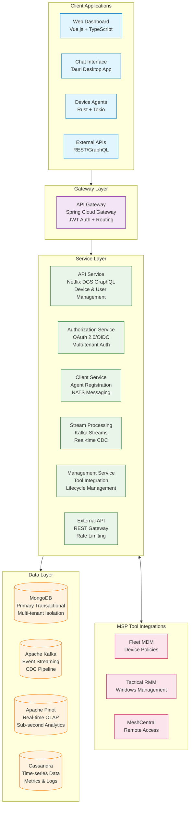

<div align="center">
  <picture>
    <source media="(prefers-color-scheme: dark)" srcset="https://raw.githubusercontent.com/flamingo-stack/openframe-oss-tenant/main/docs/assets/logo-openframe-full-dark-bg.png">
    <source media="(prefers-color-scheme: light)" srcset="https://raw.githubusercontent.com/flamingo-stack/openframe-oss-tenant/main/docs/assets/logo-openframe-full-light-bg.png">
    
  </picture>
</div>

<p align="center">
  <a href="LICENSE.md"></a>
</p>

# OpenFrame OSS Tenant

**A distributed multi-tenant backend platform that creates a unified layer for data, APIs, automation, and AI on top of carefully selected open-source projects. We simplify IT and security operations through a single, cohesive platform.**

OpenFrame serves as the foundation for [Flamingo](https://flamingo.run), providing the technical infrastructure for Mingo AI (for technicians) and Fae (for clients), all integrated through the [OpenFrame unified interface](https://www.flamingo.run/openframe).

---

## 🚀 Product Overview

See OpenFrame in action with our product preview:

[](https://www.youtube.com/watch?v=bINdW0CQbvY)

---

## ✨ Features

### 🔮 **AI-Powered MSP Platform**
- **Mingo AI Assistant** - Intelligent troubleshooting and automated resolution
- **Unified Dashboard** - Single interface for all MSP tools and workflows
- **Smart Automation** - Event-driven workflows with automated deployment and monitoring
- **Real-time Analytics** - Advanced insights with sub-500ms query latency

### 🏗️ **Enterprise Architecture**
- **Multi-Tenant Support** - Complete tenant isolation at data, security, and configuration layers
- **Microservices Design** - Scalable Spring Boot services with clear boundaries
- **Event-Driven Processing** - Kafka-based streaming with 100,000+ events/second capacity
- **Security-First** - OAuth 2.0/OIDC authentication with enterprise SSO integration

### 🛠️ **MSP Tool Integration**
- **Fleet MDM** - Device management and osquery integration
- **Tactical RMM** - Windows agent management with scripts and checks
- **MeshCentral** - Remote desktop and file management capabilities
- **Extensible SDKs** - Type-safe Java client libraries for seamless integration

### 📊 **Advanced Data Platform**
- **Real-Time Processing** - Apache Kafka streams with Debezium CDC
- **Multi-Model Storage** - MongoDB, Cassandra, Apache Pinot for different data patterns
- **GraphQL API** - Unified data access with Netflix DGS framework
- **Analytics Engine** - Real-time OLAP with Apache Pinot for instant insights

## 🏃‍♂️ Quick Start

### Prerequisites

Before getting started, ensure you have:

- **Java**: OpenJDK 21.0.1+ 
- **Node.js**: 18+ with npm
- **Rust**: 1.70+ with Cargo (for client agents)
- **Docker**: 24.0+ with Docker Compose
- **Git**: 2.42+

### Using the CLI (Recommended)

The fastest way to get OpenFrame running:

```bash
# Download and run the bootstrap CLI
# Linux
./cli/openframe-linux-amd64 bootstrap

# Windows  
./cli/openframe-windows-amd64.exe bootstrap

# macOS
./cli/openframe bootstrap

# For non-interactive setup
./cli/openframe bootstrap --non-interactive --verbose
```

Once started, OpenFrame will be available at: **https://localhost**

### Manual Development Setup

For development and customization:

```bash
# Clone the repository
git clone https://github.com/flamingo-stack/openframe-oss-tenant.git
cd openframe-oss-tenant

# Set up GitHub authentication for private dependencies
export GITHUB_ACTOR=your-github-username
export GITHUB_TOKEN=your-github-token

# Start infrastructure services
docker-compose up -d mongodb kafka consul redis pinot

# Build backend services
mvn clean install

# Start frontend development server
cd openframe/services/openframe-frontend
npm install && npm run dev

# Build Rust client agent
cd ../../client
cargo build --release
```

### Verification

Verify your setup by accessing:

- **Web Dashboard**: https://localhost
- **GraphQL Playground**: https://localhost/graphql
- **API Health**: https://localhost/actuator/health

## 🏛️ Architecture

OpenFrame uses a modern microservices architecture with four key layers:


```mermaid
flowchart TB
    subgraph clients[Client Applications]
        Web[Web Dashboard<br/>Vue.js + TypeScript]
        Chat[Chat Interface<br/>Tauri Desktop App]
        Agent[Device Agents<br/>Rust + Tokio]
        API[External APIs<br/>REST/GraphQL]
    end
    
    subgraph gateway[Gateway Layer]
        GW[API Gateway<br/>Spring Cloud Gateway<br/>JWT Auth + Routing]
    end
    
    subgraph services[Service Layer]
        GraphQL[API Service<br/>Netflix DGS GraphQL<br/>Device & User Management]
        Auth[Authorization Service<br/>OAuth 2.0/OIDC<br/>Multi-tenant Auth]
        Client[Client Service<br/>Agent Registration<br/>NATS Messaging]
        Stream[Stream Processing<br/>Kafka Streams<br/>Real-time CDC]
        Mgmt[Management Service<br/>Tool Integration<br/>Lifecycle Management]
        External[External API<br/>REST Gateway<br/>Rate Limiting]
    end
    
    subgraph data[Data Layer]
        Mongo[(MongoDB<br/>Primary Transactional<br/>Multi-tenant Isolation)]
        Kafka[(Apache Kafka<br/>Event Streaming<br/>CDC Pipeline)]
        Pinot[(Apache Pinot<br/>Real-time OLAP<br/>Sub-second Analytics)]
        Cassandra[(Cassandra<br/>Time-series Data<br/>Metrics & Logs)]
    end
    
    subgraph integrations[MSP Tool Integrations]
        Fleet[Fleet MDM<br/>Device Policies]
        Tactical[Tactical RMM<br/>Windows Management]
        Mesh[MeshCentral<br/>Remote Access]
    end

    clients --> gateway
    gateway --> services
    services --> data
    services <--> integrations
    
    classDef clientStyle fill:#e1f5fe,stroke:#0277bd
    classDef gatewayStyle fill:#f3e5f5,stroke:#7b1fa2
    classDef serviceStyle fill:#e8f5e8,stroke:#2e7d32
    classDef dataStyle fill:#fff3e0,stroke:#f57c00
    classDef integrationStyle fill:#fce4ec,stroke:#c2185b
    
    class Web,Chat,Agent,API clientStyle
    class GW gatewayStyle
    class GraphQL,Auth,Client,Stream,Mgmt,External serviceStyle
    class Mongo,Kafka,Pinot,Cassandra dataStyle
    class Fleet,Tactical,Mesh integrationStyle
```

### Key Architectural Benefits

- **🔄 Event-Driven**: Real-time processing with Kafka streams
- **🌐 Multi-Tenant**: Complete isolation at all layers
- **📈 Scalable**: Handles 100,000+ events/second with horizontal scaling
- **🔒 Secure**: OAuth 2.0, JWT, and role-based access control
- **🛡️ Resilient**: Circuit breakers, retries, and health monitoring

## 🛠️ Technology Stack

| Component | Technology | Purpose |
|-----------|------------|---------|
| **Backend Runtime** | Spring Boot 3.3 + Java 21 | Core microservices platform |
| **API Layer** | GraphQL (Netflix DGS) + REST | Unified data access and external APIs |
| **Authentication** | OAuth 2.0/OIDC + JWT | Multi-tenant security with enterprise SSO |
| **Primary Database** | MongoDB | Transactional data with multi-tenant isolation |
| **Event Streaming** | Apache Kafka | Real-time events and CDC processing |
| **Analytics Engine** | Apache Pinot | Real-time OLAP with sub-second queries |
| **Time-Series Store** | Apache Cassandra | Metrics, logs, and historical data |
| **Cache Layer** | Redis | High-performance caching and sessions |
| **Message Queue** | NATS JetStream | Real-time client communication |
| **Service Discovery** | Consul | Dynamic service registration and discovery |
| **Frontend** | Vue 3 + TypeScript | Modern reactive web interface |
| **Desktop Client** | Tauri + Vue | Cross-platform desktop application |
| **Agent Runtime** | Rust + Tokio | High-performance device agents |
| **Monitoring** | Prometheus + Grafana | Observability and metrics |

## 📊 Performance Characteristics

### Throughput & Latency

| Component | Throughput | Latency (p95) |
|-----------|------------|---------------|
| **API Gateway** | 50,000 req/sec | <50ms |
| **GraphQL API** | 10,000 req/sec | <200ms |
| **Stream Processing** | 100,000 events/sec | <500ms |
| **Database Queries** | MongoDB: 10,000 ops/sec | <100ms |
| **Analytics Queries** | Pinot: 1,000 queries/sec | <500ms |

### Scalability

- **Multi-Tenant**: 1,000+ tenants per cluster
- **Device Management**: 100,000+ devices per tenant
- **Real-Time Events**: 1M+ events/minute processing
- **Horizontal Scaling**: Auto-scaling based on load

## 🔐 Security Features

OpenFrame implements enterprise-grade security:

- **🔐 OAuth 2.0 + JWT** - Multi-tenant authentication with HTTP-only cookies
- **🏢 Enterprise SSO** - Microsoft Entra ID, Google Workspace integration  
- **🛡️ Multi-Tenant Isolation** - Complete data and configuration separation
- **🔒 Encryption** - AES-256 data at rest, TLS 1.3 in transit
- **📝 Audit Logging** - Comprehensive security event tracking
- **⚡ Rate Limiting** - API protection with configurable thresholds
- **🔍 Security Monitoring** - Real-time threat detection and alerting

## 📚 Documentation

📖 **See the [Documentation](./docs/README.md) for comprehensive guides and references.**

### Quick Navigation

| Section | Description |
|---------|-------------|
| [Getting Started](./docs/getting-started/introduction.md) | Introduction, prerequisites, and quick start |
| [Development Setup](./docs/development/setup/environment.md) | Local development environment configuration |
| [Architecture Guide](./docs/development/architecture/overview.md) | System design and component details |
| [API Reference](./docs/reference/api/README.md) | GraphQL schema and REST endpoint documentation |
| [Contributing](./CONTRIBUTING.md) | How to contribute code, docs, and feedback |

### Additional Resources

- **CLI Documentation**: [Command-line interface guide](./docs/cli/README.md)
- **Testing Guide**: [Testing strategies and examples](./docs/development/testing/overview.md)
- **Security Guide**: [Security architecture and best practices](./docs/development/architecture/security.md)

## 🤝 Contributing

We love contributions! OpenFrame is built for the community, by the community.

### Quick Contributing Steps

1. **Join the Discussion**: [OpenMSP Slack Community](https://join.slack.com/t/openmsp/shared_invite/zt-36bl7mx0h-3~U2nFH6nqHqoTPXMaHEHA)
2. **Fork the Repository**: Click the "Fork" button on GitHub
3. **Create Feature Branch**: `git checkout -b feature/amazing-feature`
4. **Make Your Changes**: Follow our [contributing guidelines](./CONTRIBUTING.md)
5. **Run Tests**: Ensure all tests pass locally
6. **Submit Pull Request**: Include clear description of changes

### Types of Contributions Welcome

- 🐛 **Bug Fixes** - Help improve stability and reliability
- ✨ **New Features** - Add functionality and capabilities  
- 📝 **Documentation** - Improve guides, tutorials, and API docs
- 🧪 **Testing** - Increase test coverage and quality
- ⚡ **Performance** - Optimize queries, reduce latency
- 🎨 **UI/UX** - Enhance user experience and design

**Read the complete [Contributing Guide](./CONTRIBUTING.md) for detailed guidelines and best practices.**

## 🌍 Community & Support

### Join Our Community

OpenFrame is powered by a vibrant open-source community. Connect with fellow developers, MSP providers, and OpenFrame maintainers:

- **💬 OpenMSP Slack**: [Join here](https://join.slack.com/t/openmsp/shared_invite/zt-36bl7mx0h-3~U2nFH6nqHqoTPXMaHEHA) for real-time discussions
- **🌐 Community Hub**: Visit [OpenMSP.ai](https://www.openmsp.ai/) for resources and events
- **📖 Knowledge Base**: [Flamingo Knowledge Base](https://www.flamingo.run/knowledge-base) for guides and tutorials

### Support Channels

| Type | Channel | Response Time |
|------|---------|---------------|
| **General Questions** | Slack `#general` | Community-driven |
| **Technical Support** | Slack `#dev-help` | Within 24h |
| **Bug Reports** | Slack `#bugs` | Within 48h |
| **Feature Requests** | Slack `#features` | Weekly review |
| **Security Issues** | security@flamingo.run | Within 24h |

> **Note**: We don't use GitHub Issues or GitHub Discussions. All support and collaboration happens in our OpenMSP Slack community.

## 📈 Roadmap

### Current Status ✅
- [x] Core microservices architecture with Spring Boot
- [x] Multi-tenant OAuth 2.0/OIDC authentication
- [x] GraphQL API with Netflix DGS framework
- [x] Real-time event processing with Kafka Streams
- [x] Cross-platform Rust device agents
- [x] Fleet MDM and Tactical RMM integration
- [x] Vue.js dashboard with real-time updates

### Upcoming Features 🚧
- [ ] **Enhanced AI Capabilities** *(Q2 2025)* - Advanced Mingo AI features with multi-model support
- [ ] **Mobile SDKs** *(Q3 2025)* - Native iOS and Android client libraries  
- [ ] **Advanced Analytics** *(Q4 2025)* - Real-time dashboards and custom reporting
- [ ] **Workflow Automation** *(2026)* - Visual workflow builder for IT automation
- [ ] **Multi-Region Support** *(2026)* - Geographic distribution for global deployments

### Technical Improvements 🔧
- [ ] **gRPC Support** - High-performance inter-service communication
- [ ] **Service Mesh** - Istio integration for advanced traffic management  
- [ ] **GraphQL Federation** - Distributed schema management
- [ ] **Observability** - Distributed tracing with OpenTelemetry

## ⚡ Performance Highlights

OpenFrame is designed for enterprise-scale operations:

### Key Metrics
- **🚀 High Throughput**: 100,000+ events/second processing capacity
- **⚡ Low Latency**: Sub-500ms response times for 95th percentile
- **🔄 Real-Time Updates**: WebSocket-based live dashboard updates
- **📊 Fast Analytics**: Sub-second query performance with Apache Pinot
- **🌐 Multi-Tenant**: Support for 1,000+ isolated tenants per cluster

### Scalability Features
- **Horizontal Scaling**: All services support elastic scaling
- **Database Sharding**: MongoDB and Kafka partitioning for growth
- **Auto-Scaling**: Kubernetes HPA for dynamic resource allocation
- **Load Balancing**: Intelligent request distribution across service instances

## 🏆 Why Choose OpenFrame?

| Traditional MSP Stack | OpenFrame Advantage |
|----------------------|---------------------|
| Multiple expensive proprietary tools | **Single unified open-source platform** |
| Manual troubleshooting and maintenance | **AI-powered automation with Mingo AI** |
| Vendor lock-in and high licensing costs | **Open-source with transparent pricing** |
| Fragmented data across systems | **Unified data layer with real-time analytics** |
| Complex multi-tool workflows | **Streamlined single-interface operations** |
| Limited customization options | **Extensible architecture with custom integrations** |

## 🔧 Technology Deep Dive

### Backend Services Architecture


```mermaid
graph TB
    subgraph external[External Clients]
        WebUI[Web Dashboard<br/>Vue.js + TypeScript]
        ChatApp[Desktop Chat<br/>Tauri + Vue]
        Agents[Device Agents<br/>Rust + Tokio]
        ThirdParty[Third-party APIs<br/>REST/GraphQL]
    end

    subgraph gateway_layer[Gateway Layer]
        Gateway[API Gateway<br/>Spring Cloud Gateway<br/>JWT Validation + Routing]
    end

    subgraph service_layer[Core Services]
        API[API Service<br/>Netflix DGS GraphQL<br/>Primary Data Operations]
        Auth[Authorization Service<br/>Spring Authorization Server<br/>OAuth 2.0/OIDC]
        Client[Client Service<br/>Agent Management<br/>NATS Messaging]
        Management[Management Service<br/>Tool Integration<br/>Debezium CDC]
        Stream[Stream Processing<br/>Kafka Streams<br/>Real-time Events]
        ExternalAPI[External API<br/>REST Gateway<br/>Rate Limiting]
    end

    subgraph data_layer[Data Layer]
        MongoDB[(MongoDB<br/>Primary Transactional<br/>Multi-tenant)]
        Kafka[(Apache Kafka<br/>Event Streaming<br/>CDC Events)]
        Pinot[(Apache Pinot<br/>Real-time Analytics<br/>OLAP Queries)]
        Cassandra[(Cassandra<br/>Time-series<br/>Metrics & Logs)]
        Redis[(Redis<br/>Caching<br/>Session Store)]
    end

    external --> gateway_layer
    gateway_layer --> service_layer
    service_layer --> data_layer

    classDef clientStyle fill:#e3f2fd,stroke:#1976d2
    classDef gatewayStyle fill:#f3e5f5,stroke:#7b1fa2  
    classDef serviceStyle fill:#e8f5e8,stroke:#388e3c
    classDef dataStyle fill:#fff8e1,stroke:#f57c00
    
    class WebUI,ChatApp,Agents,ThirdParty clientStyle
    class Gateway gatewayStyle
    class API,Auth,Client,Management,Stream,ExternalAPI serviceStyle
    class MongoDB,Kafka,Pinot,Cassandra,Redis dataStyle
```

### Integration Layer

OpenFrame integrates with leading MSP tools through type-safe SDKs:

- **Fleet MDM SDK**: Device management, osquery execution, policy enforcement
- **Tactical RMM SDK**: Windows agent management, script execution, system monitoring  
- **MeshCentral Integration**: Remote desktop access, file management, device control

## 📖 Example Usage

### GraphQL Device Query

```graphql
query GetDevices($tenantId: ID!, $filter: DeviceFilter) {
  devices(tenantId: $tenantId, filter: $filter, first: 20) {
    edges {
      node {
        id
        hostname
        status
        lastSeen
        operatingSystem
        ipAddress
        organization {
          id
          name
        }
        metrics {
          cpuUsage
          memoryUsage
          diskUsage
        }
      }
    }
    pageInfo {
      hasNextPage
      endCursor
    }
  }
}
```

### REST API Device Status

```bash
# Get device status via REST API
curl -X GET "https://api.openframe.dev/v1/devices" \
  -H "Authorization: Bearer $API_TOKEN" \
  -H "Content-Type: application/json"

# Update device configuration
curl -X PUT "https://api.openframe.dev/v1/devices/device-123" \
  -H "Authorization: Bearer $API_TOKEN" \
  -H "Content-Type: application/json" \
  -d '{
    "name": "Updated Device Name",
    "maintenanceMode": false,
    "alerting": true
  }'
```

### Rust Agent Integration

```rust
use openframe_client::{Client, DeviceStatus, HeartbeatConfig};

#[tokio::main]
async fn main() -> Result<()> {
    let client = Client::builder()
        .api_endpoint("https://api.openframe.dev")
        .auth_token("your-agent-token")
        .build()
        .await?;

    // Register device with OpenFrame
    let device_id = client.register_device().await?;

    // Start heartbeat monitoring
    let config = HeartbeatConfig::default();
    client.start_heartbeat(&device_id, config).await?;

    Ok(())
}
```

## 🧪 Testing

### Running Tests

```bash
# Backend unit tests
mvn test

# Integration tests
mvn verify -P integration-tests

# Frontend tests  
cd openframe/services/openframe-frontend
npm run test:unit
npm run test:e2e

# Rust tests
cd clients/openframe-client  
cargo test

# Full test suite
./scripts/test-all.sh
```

### Test Coverage

We maintain high test coverage standards:
- **Unit Tests**: 80%+ coverage for business logic
- **Integration Tests**: Critical data flows and API contracts
- **End-to-End Tests**: User workflows and system interactions

## 🚀 Deployment

### Development Environment

```bash
# Start with Docker Compose
docker-compose -f docker-compose.dev.yml up -d

# Or use the CLI
./cli/openframe bootstrap --dev
```

### Production Environment

```bash
# Kubernetes deployment
kubectl apply -f k8s/

# Or use Helm charts
helm install openframe ./helm/openframe
```

For detailed deployment instructions, see [Development Setup](./docs/development/setup/local-development.md).

## 🔍 Monitoring & Observability

OpenFrame includes comprehensive monitoring:

- **📊 Metrics**: Prometheus metrics with Grafana dashboards
- **📝 Logging**: Structured logging with correlation IDs
- **🏥 Health Checks**: Kubernetes-ready liveness and readiness probes
- **🔍 Tracing**: Request tracing across microservices (coming soon)
- **🚨 Alerting**: Real-time alerts for system and business events

Access monitoring dashboards at:
- **Grafana**: https://grafana.yourdomain.com
- **Health Checks**: https://api.yourdomain.com/actuator/health

## 📄 License

This project is licensed under the **Flamingo AI Unified License v1.0**. See [LICENSE.md](LICENSE.md) for details.

## 🙏 Acknowledgments

OpenFrame is built on the shoulders of giants. Special thanks to:

- **Open Source Projects**: Spring Boot, Apache Kafka, MongoDB, Apache Pinot, Vue.js, Rust
- **Contributors**: All our amazing [contributors](https://github.com/flamingo-stack/openframe-oss-tenant/graphs/contributors)
- **Community**: The vibrant OpenMSP community for feedback and support
- **MSP Industry**: For inspiring us to build better tools

## 🚀 Get Started Today

Ready to revolutionize your MSP operations?

1. **🎬 Watch the Demo**: See OpenFrame in action with our [product preview](https://www.youtube.com/watch?v=bINdW0CQbvY)
2. **⚡ Quick Start**: Get running in 5 minutes with the [bootstrap CLI](#quick-start)
3. **💬 Join Community**: Connect with us on [OpenMSP Slack](https://join.slack.com/t/openmsp/shared_invite/zt-36bl7mx0h-3~U2nFH6nqHqoTPXMaHEHA)
4. **📖 Read Docs**: Explore the [complete documentation](./docs/README.md)

---

<div align="center">
  Built with 💛 by the <a href="https://www.flamingo.run/about"><b>Flamingo</b></a> team
</div>