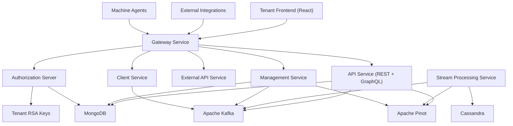
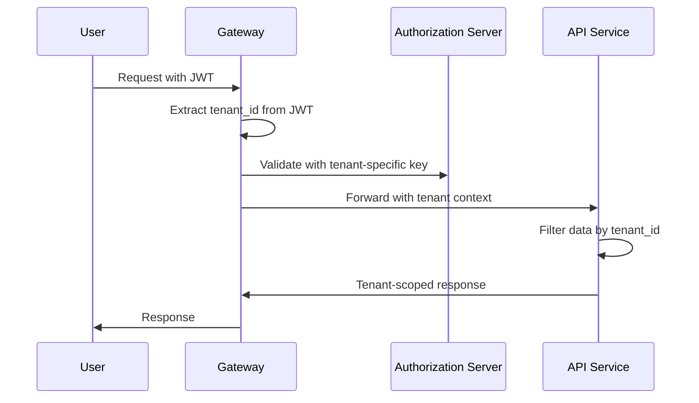

<div align="center">
  <picture>
    <source media="(prefers-color-scheme: dark)" srcset="https://raw.githubusercontent.com/flamingo-stack/openframe-oss-tenant/main/docs/assets/logo-openframe-full-dark-bg.png">
    <source media="(prefers-color-scheme: light)" srcset="https://raw.githubusercontent.com/flamingo-stack/openframe-oss-tenant/main/docs/assets/logo-openframe-full-light-bg.png">
    
  </picture>
</div>

<p align="center">
  <a href="LICENSE.md"></a>
</p>

# OpenFrame OSS Tenant

The **complete OSS reference implementation** of OpenFrame's multi-tenant AI-powered MSP platform. This repository contains the full multi-service backend and frontend stack that powers the OpenFrame platform, delivering intelligent automation for IT service providers.

OpenFrame replaces expensive proprietary MSP software with open-source alternatives enhanced by AI automation - **Mingo AI** for technicians and **Fae** for clients.

## 🎥 Platform Overview

[](https://www.youtube.com/watch?v=er-z6IUnAps)

## ✨ Key Features

### 🤖 AI-Powered Automation
- **Multi-tenant identity & authorization** (OAuth2/OIDC with Google/Microsoft SSO)
- **Gateway-based edge security** (JWT + API keys + rate limiting + WebSocket proxying)
- **Intelligent device management** with real-time monitoring and automated remediation
- **AI assistants**: Mingo AI for technicians, Fae for client-facing support

### 🔧 Unified Platform Integration
- **Internal REST + GraphQL APIs** with Netflix DGS and cursor-based pagination
- **Public External API layer** with API key security and OpenAPI documentation
- **Real-time stream processing** (Kafka + Debezium + Kafka Streams)
- **Multi-platform agent support** (Windows, macOS, Linux)
- **Tool integration layer** for TacticalRMM, Fleet MDM, MeshCentral, and more

### 📊 Enterprise Data & Analytics
- **Analytics platform** (Apache Pinot for real-time queries)
- **Operational storage** (MongoDB + Cassandra for distributed persistence)
- **Event-driven architecture** with Kafka CDC ingestion and enrichment
- **Audit logging** and compliance features

### 🏢 Multi-Tenant Architecture
- **Tenant isolation** through JWT claims and ThreadLocal context
- **Per-tenant RSA keys** for secure token signing
- **Organization management** with role-based access control
- **Scalable microservices** design for MSPs of all sizes

## 🚀 Quick Start

Get OpenFrame running locally in under 5 minutes:

### Prerequisites
- Docker and Docker Compose installed
- At least 8GB RAM available
- Ports 3000, 8080, 9000 available

### Launch OpenFrame

```bash
# Clone the repository
git clone https://github.com/flamingo-stack/openframe-oss-tenant.git
cd openframe-oss-tenant

# Start the platform (macOS/Linux)
./scripts/run-mac.sh --silent

# Or for Windows (PowerShell)
./scripts/run-windows.ps1 -Silent
```

### Access the Platform

After startup completes:
- **Frontend**: [http://localhost:3000](http://localhost:3000)
- **API Gateway**: [http://localhost:8080](http://localhost:8080)
- **GraphQL Playground**: [http://localhost:8080/graphql](http://localhost:8080/graphql)

**Default Admin Login:**
```text
Email: admin@openframe.local
Password: admin123
```

## 🏗️ System Architecture


```mermaid
flowchart TD
    Frontend["Tenant Frontend (React)"] --> Gateway["Gateway Service"]

    Gateway --> Authz["Authorization Server"]
    Gateway --> Api["API Service (REST + GraphQL)"]
    Gateway --> ExternalApi["External API Service"]
    Gateway --> ClientService["Client Service"]
    Gateway --> Management["Management Service"]

    ExternalClients["External Integrations"] --> Gateway
    Agents["Machine Agents"] --> Gateway

    Api --> Mongo["MongoDB"]
    Api --> Pinot["Apache Pinot"]
    Api --> Kafka["Apache Kafka"]

    Stream["Stream Processing Service"] --> Kafka
    Stream --> Cassandra["Cassandra"]
    Stream --> Pinot

    Management --> Kafka
    Management --> Pinot
    Management --> Mongo

    ClientService --> Kafka

    Authz --> Mongo
    Authz --> Jwt["Tenant RSA Keys"]
```

## 💻 Technology Stack

### Backend Services
- **Java 21** with Spring Boot 3.3+ and Spring Cloud Gateway
- **GraphQL** with Netflix DGS framework
- **OAuth2/OIDC** authorization server with PKCE support
- **Reactive programming** with WebFlux and R2DBC

### Data Platform
- **MongoDB** - Operational data (users, organizations, devices)
- **Apache Kafka** - Event streaming and CDC ingestion
- **Apache Pinot** - Real-time analytics and queries
- **Cassandra** - Distributed operational storage
- **Redis** - Distributed locking and caching

### Frontend
- **React 18** with TypeScript
- **Zustand** for state management
- **GraphQL** with auto-generated types
- **Tailwind CSS** for styling

### Infrastructure
- **Docker** containerization
- **NATS** for real-time messaging
- **Debezium** for change data capture
- **ShedLock** for distributed scheduling

## 🏢 Core Services

| Service | Purpose | Key Features |
|---------|---------|--------------|
| **Gateway Service** | Edge security & routing | JWT validation, API keys, rate limiting, WebSocket proxy |
| **Authorization Server** | OAuth2/OIDC provider | Multi-tenant JWT signing, SSO integration, per-tenant keys |
| **API Service** | Internal GraphQL/REST | Netflix DGS, cursor pagination, DataLoader batching |
| **External API Service** | Public API access | API key security, OpenAPI docs, tool proxy support |
| **Client Service** | Agent management | Registration, OAuth tokens, heartbeat tracking |
| **Stream Processing** | Real-time data pipeline | Kafka ingestion, event enrichment, analytics publishing |
| **Management Service** | Infrastructure control | Schema deployment, connector initialization, scheduling |
| **Frontend Application** | Tenant interface | AI chat integration, real-time updates, tool management |

## 📖 Documentation

📚 See the [Documentation](./docs/README.md) for comprehensive guides including:

- **Getting Started**: Prerequisites, quick start, and first steps
- **Development**: Environment setup, contribution guidelines, and testing
- **Architecture**: Detailed service documentation and system diagrams  
- **CLI Tools**: External [OpenFrame CLI](https://github.com/flamingo-stack/openframe-cli) tools and installation

## 🛠️ Development

### Local Development Setup

```bash
# Set up development environment
git clone https://github.com/flamingo-stack/openframe-oss-tenant.git
cd openframe-oss-tenant

# Install dependencies and start services
./scripts/dev-setup.sh

# Run tests
mvn test                    # Backend tests
cd openframe/services/openframe-frontend && npm test  # Frontend tests
```

### Contributing

We welcome contributions! Please see our [Contributing Guidelines](./CONTRIBUTING.md) for:

- Development workflow and coding standards
- Pull request process and review criteria  
- Testing requirements and performance guidelines
- Security guidelines and best practices

## 🔗 Related Projects

### OpenFrame CLI Tools
The OpenFrame CLI tools are maintained in a separate repository:
- **Repository**: [flamingo-stack/openframe-cli](https://github.com/flamingo-stack/openframe-cli)
- **Installation**: [CLI Installation Guide](https://github.com/flamingo-stack/openframe-cli#installation)
- **Documentation**: [CLI Documentation](https://github.com/flamingo-stack/openframe-cli/tree/main/docs)

## 🎯 Multi-Tenancy Design

OpenFrame implements strict tenant isolation through:

- **JWT-based tenant context** with `tenant_id` claims
- **Per-tenant RSA key signing** for security isolation
- **Tenant-aware data repositories** with automatic filtering
- **Tenant-scoped Redis locks** for distributed operations
- **Multi-tenant issuer validation** at the gateway level


```mermaid
sequenceDiagram
    participant User
    participant Gateway
    participant Auth as Authorization Server
    participant API as API Service

    User->>Gateway: Request with JWT
    Gateway->>Gateway: Extract tenant_id from JWT
    Gateway->>Auth: Validate with tenant-specific key
    Gateway->>API: Forward with tenant context
    API->>API: Filter data by tenant_id
    API->>Gateway: Tenant-scoped response
    Gateway->>User: Response
```

## 🤝 Community & Support

- **Community**: Join our [OpenMSP Slack Community](https://join.slack.com/t/openmsp/shared_invite/zt-36bl7mx0h-3~U2nFH6nqHqoTPXMaHEHA)
- **Website**: [https://www.flamingo.run/openframe](https://www.flamingo.run/openframe)
- **Main Platform**: [https://flamingo.run](https://flamingo.run)

## 📜 License

This project is licensed under the Flamingo AI Unified License v1.0 - see the [LICENSE.md](LICENSE.md) file for details.

---
<div align="center">
  Built with 💛 by the <a href="https://www.flamingo.run/about"><b>Flamingo</b></a> team
</div>