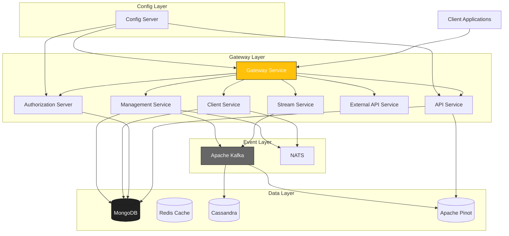

<div align="center">
  <picture>
    <source media="(prefers-color-scheme: dark)" srcset="https://raw.githubusercontent.com/flamingo-stack/openframe-oss-tenant/main/docs/assets/logo-openframe-full-dark-bg.png">
    <source media="(prefers-color-scheme: light)" srcset="https://raw.githubusercontent.com/flamingo-stack/openframe-oss-tenant/main/docs/assets/logo-openframe-full-light-bg.png">
    
  </picture>
</div>

<p align="center">
  <a href="LICENSE.md"></a>
</p>

# OpenFrame OSS Tenant

A distributed platform that creates a unified layer for data, APIs, automation, and AI on top of carefully selected open-source projects. OpenFrame simplifies IT and security operations through a single, cohesive platform powered by intelligent automation.

The **`openframe-oss-tenant`** repository contains the **multi-tenant, open‑source backend stack of OpenFrame**, bringing together deployable tenant services and a rich set of shared OSS libraries that implement security, data access, streaming, analytics, and integrations.

## 🎥 Product Overview

[](https://www.youtube.com/watch?v=bINdW0CQbvY)

## ✨ Features

- **Unified Dashboard** - Single interface for managing all services and workflows
- **Smart Automation** - Automated deployment and monitoring capabilities with AI-powered insights
- **Multi-tenant by Design** - Secure tenant context propagated across all services
- **Event-driven Architecture** - Real-time processing with Kafka, Debezium, and NATS
- **Analytics-first** - Low-latency analytics with Apache Pinot and Cassandra
- **Enterprise Security** - OAuth2/OIDC, JWT, SSO, and comprehensive audit logging
- **Microservice-oriented** - Spring Boot/WebFlux based scalable services
- **High Performance** - Handles 100,000+ events/second with sub-500ms latency

## 🏗️ Architecture

OpenFrame uses a modern microservices architecture with integrated data, event, and security layers:


```mermaid
flowchart TB
    Client[Client Applications] --> Gateway[Gateway Service]
    
    subgraph "Gateway Layer"
        Gateway --> Auth[Authorization Server]
        Gateway --> Api[API Service]
        Gateway --> ClientSvc[Client Service]
        Gateway --> Mgmt[Management Service]
        Gateway --> ExternalApi[External API Service]
        Gateway --> StreamSvc[Stream Service]
    end
    
    subgraph "Data Layer"
        Mongo[(MongoDB)]
        Redis[(Redis Cache)]
        Cassandra[(Cassandra)]
        Pinot[(Apache Pinot)]
    end
    
    subgraph "Event Layer"
        Kafka[Apache Kafka]
        Nats[NATS]
    end
    
    subgraph "Config Layer"
        Config[Config Server]
    end
    
    Api --> Mongo
    Api --> Pinot
    Auth --> Mongo
    ClientSvc --> Nats
    ClientSvc --> Mongo
    StreamSvc --> Kafka
    Kafka --> Pinot
    Kafka --> Cassandra
    Mgmt --> Mongo
    Mgmt --> Kafka
    Mgmt --> Nats
    
    Config --> Gateway
    Config --> Api
    Config --> Auth
    
    style Gateway fill:#FFC109,stroke:#1A1A1A,color:#FAFAFA
    style Kafka fill:#666666,stroke:#1A1A1A,color:#FAFAFA
    style Mongo fill:#212121,stroke:#1A1A1A,color:#FAFAFA
```

**Key Components:**
- **MongoDB**: Source of truth for all platform data
- **Apache Kafka**: Change propagation and event streaming
- **Apache Pinot + Cassandra**: Low-latency analytics and durable event storage
- **NATS**: Real-time agent communication
- **Redis**: High-performance caching layer

## 🚀 Quick Start

Get OpenFrame running locally in minutes:

### Using OpenFrame CLI

The OpenFrame CLI is maintained in a separate repository. Install and use it to bootstrap your OpenFrame instance:

```bash
# Install CLI (see external repository for installation instructions)
# Repository: https://github.com/flamingo-stack/openframe-cli

# Bootstrap OpenFrame
openframe bootstrap

# Non-interactive mode
openframe bootstrap --non-interactive --verbose
```

For detailed CLI documentation and installation, see the [OpenFrame CLI Repository](https://github.com/flamingo-stack/openframe-cli).

### Development Setup

```bash
# Clone the repository
git clone https://github.com/flamingo-stack/openframe-oss-tenant.git
cd openframe-oss-tenant

# Set up GitHub authentication for private dependencies
export GITHUB_ACTOR=your-github-username
export GITHUB_TOKEN=your-github-token

# Build backend services
mvn clean install

# Start development services (see development docs for full setup)
```

Once started, OpenFrame will be available at:
- **UI Dashboard:** https://localhost

### Latest Release Demo

[](https://www.youtube.com/watch?v=jEkFcS4AcQ4)

## 🛠️ Technology Stack

| Component | Technology | Purpose |
|-----------|------------|---------|
| **Backend** | Spring Boot 3.3 + Java 21 | Core runtime & APIs |
| **Frontend** | Next.js 15 + React 19 + TypeScript 5.8 | Modern web interface |
| **Client Agent** | Rust + Tokio | Cross-platform system agent |
| **API Layer** | GraphQL + Netflix DGS | Unified data access |
| **Message Queue** | Apache Kafka 3.6 | Event streaming |
| **Databases** | MongoDB + Cassandra + Pinot | Multi-model data storage |
| **Cache** | Redis | High-performance caching |
| **Monitoring** | Prometheus + Grafana + Loki | Observability stack |

## 📚 Documentation

📚 See the [Documentation](./docs/README.md) for comprehensive guides including:

- **Getting Started** - Quick introduction and prerequisites
- **Development Setup** - Local development environment configuration  
- **Architecture Guides** - System design and component details
- **API Reference** - REST and GraphQL API documentation
- **Security** - Authentication, authorization, and security best practices

## 🤝 Contributing

We welcome contributions! Please see our [Contributing Guidelines](CONTRIBUTING.md) for details on:

- Code style and standards
- Development workflow
- Testing requirements
- Pull request process

### Quick Contributing Steps:
1. Fork the project
2. Create your feature branch (`git checkout -b feature/amazing-feature`)
3. Commit your changes (`git commit -m 'Add amazing feature'`)
4. Push to the branch (`git push origin feature/amazing-feature`)
5. Open a Pull Request

## 🔐 Security

OpenFrame implements enterprise-grade security:

- **OAuth 2.0 + OIDC** multi-tenant authentication
- **JWT** with tenant-scoped claims
- **AES-256** encryption for data at rest
- **Comprehensive** audit logging across all services
- **Multi-tenant** isolation and data segregation
- **Rate limiting** and circuit breakers
- **Real-time** security monitoring and anomaly detection

Found a security issue? Please email security@flamingo.run instead of opening a public issue.

## 🗺️ Roadmap

- [x] Core microservices architecture
- [x] Multi-tenant OAuth2/OIDC authentication
- [x] Real-time event streaming and processing
- [x] Cross-platform Rust agent
- [x] GraphQL API with comprehensive data access
- [ ] **Advanced AI/ML integrations** *(Q3 2025)*
- [ ] **Edge computing capabilities** *(Q4 2025)*
- [ ] **Mobile companion app** *(2026)*

## 📄 License

This project is licensed under the [Flamingo AI Unified License v1.0](LICENSE.md).

## 🙏 Acknowledgments

- Thanks to all our [contributors](https://github.com/flamingo-stack/openframe-oss-tenant/graphs/contributors)
- Built with amazing open-source projects: Spring Boot, Apache Kafka, MongoDB, Apache Pinot, and many more
- Special thanks to the broader open-source community for making this platform possible

---
<div align="center">
  Built with 💛 by the <a href="https://www.flamingo.run/about"><b>Flamingo</b></a> team
</div>