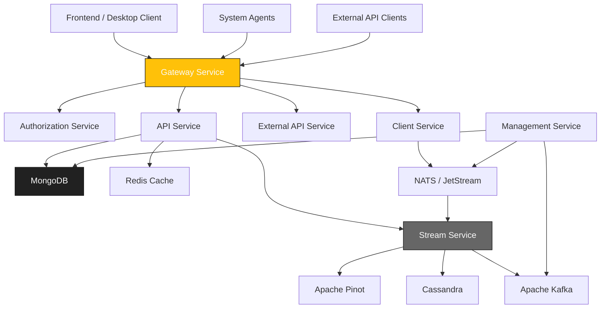

<div align="center">
  <picture>
    <source media="(prefers-color-scheme: dark)" srcset="https://raw.githubusercontent.com/flamingo-stack/openframe-oss-tenant/main/docs/assets/logo-openframe-full-dark-bg.png">
    <source media="(prefers-color-scheme: light)" srcset="https://raw.githubusercontent.com/flamingo-stack/openframe-oss-tenant/main/docs/assets/logo-openframe-full-light-bg.png">
    
  </picture>
</div>

<p align="center">
  <a href="LICENSE.md"></a>
</p>

# OpenFrame OSS Tenant

**The open-source, multi-tenant core of OpenFrame** - Flamingo's unified AI-powered MSP platform that replaces expensive proprietary software with intelligent, open-source alternatives.

OpenFrame creates a distributed platform with a unified layer for data, APIs, automation, and AI on top of carefully selected open-source projects. It simplifies IT and security operations through a single, cohesive platform designed for multi-tenant MSP operations.

## 🎥 Product Overview

[](https://www.youtube.com/watch?v=bINdW0CQbvY)

## ✨ Features

### 🤖 AI-Powered Automation
- **Mingo AI** for technicians - Autonomous incident triage and alert management
- **Fae AI** for clients - Intelligent client portal interactions
- Real-time anomaly detection and intelligent assistants

### 🏢 Multi-Tenant Architecture  
- Secure tenant isolation with per-tenant OAuth2/OIDC issuers
- Organization, user, device, and tool management
- Role-based access control and audit logging

### 🔧 Unified Tool Integration
- **Device Management**: Fleet MDM, Tactical RMM, MeshCentral integration
- **Event Streaming**: Real-time data processing with Kafka and Cassandra
- **Analytics**: Apache Pinot for high-performance analytics queries
- **Monitoring**: Comprehensive observability with Prometheus, Grafana, and Loki

### 🚀 Enterprise-Grade Performance
- Handles 100,000+ events/second with sub-500ms latency
- Microservices architecture built on Spring Boot 3.3 and Java 21
- Cross-platform Rust system agent for efficient monitoring
- Modern frontend with Vue 3, TypeScript, and real-time WebSocket communication

### 🔐 Security-First Design
- OAuth2/OIDC with PKCE support for secure authentication
- JWT-based authorization with multi-tenant issuer support  
- AES-256 encryption for data at rest
- Comprehensive audit logging and security monitoring

## 🏗️ Architecture

OpenFrame follows a layered, service-oriented architecture with strong separation between edge security, API layer, event streaming, and data persistence:


```mermaid
flowchart TB
    Browser["Frontend / Desktop Client"] --> Gateway["Gateway Service"]
    Agents["System Agents"] --> Gateway
    ExternalClients["External API Clients"] --> Gateway

    Gateway --> Authz["Authorization Service"]
    Gateway --> ApiService["API Service"]
    Gateway --> ExternalApi["External API Service"]
    Gateway --> ClientService["Client Service"]

    ApiService --> Mongo["MongoDB"]
    ApiService --> Redis["Redis Cache"]
    ApiService --> StreamService["Stream Service"]

    ClientService --> NATS["NATS / JetStream"]
    NATS --> StreamService

    StreamService --> Kafka["Apache Kafka"]
    StreamService --> Cassandra["Cassandra"]
    StreamService --> Pinot["Apache Pinot"]

    Management["Management Service"] --> Mongo
    Management --> Kafka
    Management --> NATS

    style Gateway fill:#FFC109,stroke:#1A1A1A,color:#FAFAFA
    style StreamService fill:#666666,stroke:#1A1A1A,color:#FAFAFA
    style Mongo fill:#212121,stroke:#1A1A1A,color:#FAFAFA
```

### Core Services

| Service | Purpose | Technology Stack |
|---------|---------|------------------|
| **Gateway Service** | Entry point, JWT validation, WebSocket proxy | Spring Boot, Spring Security |
| **Authorization Service** | Multi-tenant OAuth2/OIDC provider | Spring Security OAuth2, MongoDB |
| **API Service** | GraphQL/REST APIs, domain logic | Netflix DGS, Spring Boot, MongoDB |
| **Client Service** | Agent management, NATS messaging | Spring Boot, NATS JetStream |
| **Stream Service** | Event processing and analytics | Kafka Streams, Cassandra, Pinot |
| **Management Service** | Control plane, tool initialization | Spring Boot, ShedLock schedulers |
| **External API Service** | Public REST API for integrations | Spring MVC, API key authentication |

## 🚀 Quick Start

### Prerequisites
- **Java**: OpenJDK 21.0.1+
- **Node.js**: 18+ with npm
- **Docker**: 24.0+ with Docker Compose
- **Git**: 2.42+

### CLI Installation

The OpenFrame CLI tools are maintained in a separate repository. Install from:

**Repository**: [flamingo-stack/openframe-cli](https://github.com/flamingo-stack/openframe-cli)  
**Installation Guide**: [CLI Installation](https://github.com/flamingo-stack/openframe-cli#installation)

### Local Development

```bash
# Clone the repository
git clone https://github.com/flamingo-stack/openframe-oss-tenant.git
cd openframe-oss-tenant

# Set up GitHub authentication (required for openframe-oss-lib dependency)
export GITHUB_ACTOR=your-github-username
export GITHUB_TOKEN=your-github-token

# Start infrastructure services
cd integrated-tools && docker compose up -d

# Build backend services  
mvn clean install

# Start frontend development server
cd openframe/services/openframe-frontend
npm install && npm run dev

# Build Rust system agent
cd ../../../client
cargo build --release
```

### Running with CLI

Once you have the CLI installed (see external repository), you can bootstrap OpenFrame:

```bash
# Bootstrap OpenFrame (interactive)
openframe bootstrap

# Non-interactive bootstrap with verbose output
openframe bootstrap --non-interactive --verbose
```

### Access Points

After startup, OpenFrame will be available at:
- **Web Dashboard**: https://localhost
- **GraphQL Playground**: https://localhost/graphql
- **API Documentation**: https://localhost/swagger-ui

## 📖 Documentation

📚 See the [Documentation](./docs/README.md) for comprehensive guides including:

- **Getting Started**: Introduction, prerequisites, and quick start
- **Development**: Environment setup, architecture, and contribution guidelines
- **Reference**: Technical specifications and API documentation
- **Deployment**: Production deployment and operations guides

## 🧪 Technology Stack

| Layer | Technology | Purpose |
|-------|------------|---------|
| **Backend Core** | Spring Boot 3.3 + Java 21 | Microservices runtime and APIs |
| **Frontend** | Vue 3 + TypeScript + PrimeVue | Modern web interface |
| **System Agent** | Rust + Tokio | Cross-platform monitoring client |
| **API Layer** | GraphQL (Netflix DGS) + REST | Unified data access and external APIs |
| **Message Queue** | Apache Kafka 3.6 + NATS | Event streaming and agent communication |
| **Databases** | MongoDB + Cassandra + Apache Pinot | Multi-model data storage and analytics |
| **Cache** | Redis | High-performance caching and sessions |
| **Security** | OAuth2/OIDC + JWT + Spring Security | Authentication and authorization |
| **Monitoring** | Prometheus + Grafana + Loki | Comprehensive observability |

## 🤝 Contributing

We welcome contributions! Please see our [Contributing Guidelines](CONTRIBUTING.md) for details on:

- Code style and standards
- Development workflow
- Pull request process
- Testing requirements

### Quick Contributing Steps:
1. Fork the repository
2. Create your feature branch (`git checkout -b feature/amazing-feature`)
3. Commit your changes (`git commit -m 'Add amazing feature'`)
4. Push to the branch (`git push origin feature/amazing-feature`)
5. Open a Pull Request

## 📸 Screenshots

### Dashboard Overview


### Device Management


### Policies & Compliance


## 🗺️ Roadmap

- [x] Core microservices architecture
- [x] GraphQL API with multi-tenant authentication  
- [x] Real-time stream processing with Kafka
- [x] Cross-platform Rust system agent
- [x] Vue 3 frontend with AI chat integration
- [ ] **Advanced AI/ML integrations** *(Q3 2025)*
- [ ] **Edge computing capabilities** *(Q4 2025)*
- [ ] **Mobile companion app** *(2026)*

## 📋 FAQ

<details>
<summary><strong>How does OpenFrame compare to other MSP platforms?</strong></summary>

OpenFrame uniquely combines data processing, API management, AI capabilities, and multi-tenant architecture in a single unified platform, while most alternatives focus on just one area or require expensive proprietary licenses.
</details>

<details>
<summary><strong>What are the minimum system requirements?</strong></summary>

For development: 8GB RAM, 4 CPU cores, 20GB storage. For production: 16GB RAM, 8 CPU cores, 100GB storage minimum. See our [Prerequisites](./docs/getting-started/prerequisites.md) for detailed requirements.
</details>

<details>
<summary><strong>Can OpenFrame integrate with existing MSP tools?</strong></summary>

Yes! OpenFrame is designed to integrate with existing infrastructure through its flexible API layer, Kafka event streaming, and support for standard protocols. We provide SDKs for Fleet MDM, Tactical RMM, and other popular MSP tools.
</details>

<details>
<summary><strong>Is commercial support available?</strong></summary>

Yes, enterprise support and managed hosting are available through [Flamingo](https://www.flamingo.run). Contact us for commercial licensing and support options.
</details>

## 🔒 Security

OpenFrame takes security seriously with:

- **Multi-tenant OAuth2/OIDC** with PKCE support
- **AES-256 encryption** for data at rest
- **Comprehensive audit logging** for all operations
- **JWT-based authorization** with tenant isolation
- **Rate limiting** and circuit breaker patterns
- **Real-time security monitoring** and alerting

Found a security issue? Please email security@flamingo.run instead of opening a public issue.

## 📄 License

This project is licensed under [The Flamingo AI Unified License v1.0](LICENSE.md).

## 🙏 Acknowledgments

- Thanks to all our [contributors](https://github.com/flamingo-stack/openframe-oss-tenant/graphs/contributors)
- Built with amazing open-source projects: Spring Boot, Apache Kafka, Vue.js, and many more
- Special thanks to the broader open-source and MSP communities

---
<div align="center">
  Built with 💛 by the <a href="https://www.flamingo.run/about"><b>Flamingo</b></a> team
</div>