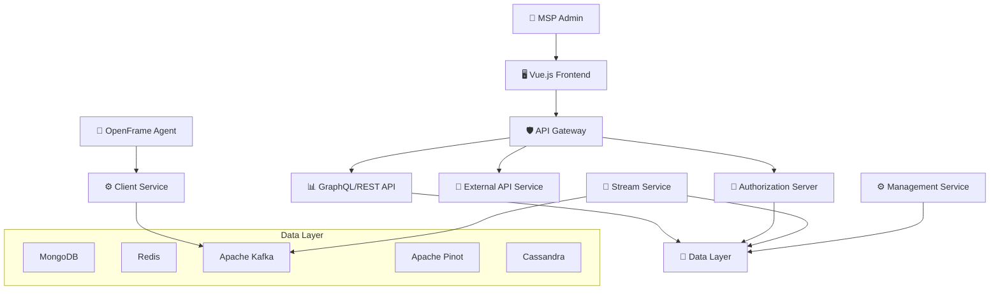

<div align="center">
  <picture>
    <source media="(prefers-color-scheme: dark)" srcset="https://raw.githubusercontent.com/flamingo-stack/openframe-oss-tenant/main/docs/assets/logo-openframe-full-dark-bg.png">
    <source media="(prefers-color-scheme: light)" srcset="https://raw.githubusercontent.com/flamingo-stack/openframe-oss-tenant/main/docs/assets/logo-openframe-full-light-bg.png">
    
  </picture>
</div>

<p align="center">
  <a href="LICENSE.md"></a>
</p>

# OpenFrame OSS Tenant

**OpenFrame** is the unified, AI-powered platform that consolidates multiple MSP (Managed Service Provider) tools into a single intelligent interface. As the open-source, multi-tenant backbone of the OpenFrame platform, this repository powers Flamingo's AI-driven MSP stack.

**A distributed platform that creates a unified layer for data, APIs, automation, and AI on top of carefully selected open-source projects. We simplify IT and security operations through a single, cohesive platform.**

[](https://www.youtube.com/watch?v=awc-yAnkhIo)

## ✨ Key Features

- **🎯 Unified Dashboard** - Single interface for managing all services and workflows
- **🤖 Mingo AI Assistant** - Autonomous incident response and intelligent triage
- **🏢 Multi-Tenant Architecture** - Secure isolation for multiple organizations and clients
- **🔒 Enterprise Security** - OAuth2/OIDC with JWT authentication, RBAC, and audit trails
- **⚡ High Performance** - Handles 100,000+ events/second with sub-500ms latency
- **🔧 Open Architecture** - RESTful and GraphQL APIs with comprehensive integrations
- **📊 Real-time Analytics** - Apache Pinot and Kafka-powered streaming analytics
- **🌐 Cross-Platform Agents** - Rust-based system agents for Windows, macOS, and Linux

## 🚀 Quick Start

Get OpenFrame running locally in under 5 minutes:

### Prerequisites

- **Java:** OpenJDK 21.0.1+
- **Node.js:** 18+ with npm
- **Docker:** 24.0+ with Docker Compose
- **Git:** 2.42+

### CLI Usage

The OpenFrame CLI tools are maintained in a separate repository:
- **Repository**: [flamingo-stack/openframe-cli](https://github.com/flamingo-stack/openframe-cli)
- **Installation**: [Installation Guide](https://github.com/flamingo-stack/openframe-cli#installation)
- **Documentation**: [CLI Documentation](https://github.com/flamingo-stack/openframe-cli/tree/main/docs)

```bash
# Linux
./openframe-linux-amd64 bootstrap
./openframe-linux-amd64 bootstrap --non-interactive --verbose

# Windows
./openframe-windows-amd64.exe bootstrap
./openframe-windows-amd64.exe bootstrap --non-interactive --verbose

# macOS
./openframe bootstrap
./openframe bootstrap --non-interactive --verbose
```

### Local Development

> **Note:** This project depends on `openframe-oss-lib`. Maven authentication via GitHub Packages is required - set `GITHUB_ACTOR` and `GITHUB_TOKEN` environment variables before building.

```bash
# Clone the repository
git clone https://github.com/flamingo-stack/openframe-oss-tenant.git
cd openframe-oss-tenant

# Set up GitHub authentication
export GITHUB_ACTOR=your-github-username
export GITHUB_TOKEN=your-github-token

# Build backend services
mvn clean install

# Start frontend development server
cd openframe/services/openframe-frontend
npm install && npm run dev

# Build Rust agent
cd ../../client
cargo build --release
```

Once started, OpenFrame will be available at:
- **UI Dashboard:** https://localhost

## 🏗️ Architecture Overview

OpenFrame uses a modern microservices architecture with event-driven communication:


```mermaid
flowchart TD
    User["👤 MSP Admin"] --> Frontend["🖥️ Vue.js Frontend"]
    Frontend --> Gateway["🛡️ API Gateway"]
    
    Gateway --> Auth["🔐 Authorization Server"]
    Gateway --> API["📊 GraphQL/REST API"]
    Gateway --> External["🔌 External API Service"]
    
    API --> Data["📁 Data Layer"]
    Auth --> Data
    
    subgraph "Data Layer"
        Mongo["MongoDB"]
        Redis["Redis"]
        Kafka["Apache Kafka"]
        Pinot["Apache Pinot"]
        Cassandra["Cassandra"]
    end
    
    Agent["🤖 OpenFrame Agent"] --> ClientService["⚙️ Client Service"]
    ClientService --> Kafka
    
    Stream["🌊 Stream Service"] --> Kafka
    Stream --> Data
    
    Management["⚙️ Management Service"] --> Data
```

### Technology Stack

| Component | Technology | Purpose |
|-----------|------------|---------|
| **Backend** | Spring Boot 3.3 + Java 21 | Core runtime & APIs |
| **Frontend** | Vue 3 + TypeScript | Modern web interface |
| **Agent** | Rust + Tokio | Cross-platform system agent |
| **API Layer** | GraphQL + Netflix DGS | Unified data access |
| **Message Queue** | Apache Kafka 3.6 | Event streaming |
| **Databases** | MongoDB + Cassandra + Pinot + Redis | Multi-model data storage |
| **Monitoring** | Prometheus + Grafana + Loki | Observability stack |

## 🎯 Target Audience

OpenFrame is designed for:

| User Type | Primary Use Cases |
|-----------|-------------------|
| **MSP Owners** | Business oversight, client management, operational efficiency |
| **MSP Technicians** | Device management, incident response, automation workflows |
| **IT Administrators** | Infrastructure monitoring, security compliance, user management |
| **Developers** | API integrations, custom tool development, workflow automation |

## 📚 Documentation

Comprehensive documentation is available in the `docs/` directory:

📚 **See the [Documentation](./docs/README.md)** for comprehensive guides including:

- **[Getting Started](./docs/getting-started/introduction.md)** - Quick start guide and basic concepts
- **[Architecture Guide](./docs/development/architecture/overview.md)** - System design and components  
- **[Development Setup](./docs/development/setup/environment.md)** - Local development environment
- **[API Reference](./docs/reference/README.md)** - GraphQL schema and endpoints
- **[Contributing Guide](./CONTRIBUTING.md)** - How to contribute to the project

## 🤝 Contributing

We love contributions! Please see our [Contributing Guide](CONTRIBUTING.md) for details on:

- Setting up your development environment
- Coding standards and best practices
- Submitting pull requests
- Reporting issues

### Quick Contributing Steps:
1. Fork the project
2. Create your feature branch (`git checkout -b feature/amazing-feature`)
3. Commit your changes (`git commit -m 'Add amazing feature'`)
4. Push to the branch (`git push origin feature/amazing-feature`)
5. Open a Pull Request

## 🔒 Security

OpenFrame takes security seriously. We implement:

- **OAuth 2.0 + JWT** authentication with HTTP-only cookies
- **AES-256** encryption for data at rest
- **Multi-tenant** isolation and RBAC
- **Rate limiting** and circuit breakers
- **Comprehensive** audit logging
- **Real-time** security monitoring

Found a security issue? Please email security@flamingo.run instead of opening a public issue.

## 📈 Benefits for MSPs

### 💰 **Cost Reduction**
- Eliminate expensive proprietary tool licensing
- Reduce infrastructure complexity and maintenance
- Minimize training costs with unified interface

### ⚡ **Operational Efficiency** 
- Automate routine incident triage and response
- Centralize all MSP tools in one platform
- Reduce context switching between applications

### 📈 **Scalability**
- Multi-tenant architecture supports unlimited clients
- Cloud-native design scales with business growth
- API-first approach enables easy integrations

## 🌟 Community & Support

- 💬 **Slack Community**: [Join OpenMSP](https://join.slack.com/t/openmsp/shared_invite/zt-36bl7mx0h-3~U2nFH6nqHqoTPXMaHEHA)
- 🌐 **Website**: [https://www.flamingo.run/openframe](https://www.flamingo.run/openframe)
- 📚 **Knowledge Base**: [https://www.flamingo.run/knowledge-base](https://www.flamingo.run/knowledge-base)
- 🐙 **GitHub**: [OpenFrame Repositories](https://github.com/flamingo-stack)

## 📄 License

This project is licensed under the [The Flamingo AI Unified License v1.0](LICENSE.md).

## 🙏 Acknowledgments

- Thanks to all our [contributors](https://github.com/flamingo-stack/openframe-oss-tenant/graphs/contributors)
- Built with amazing open-source projects: Spring Boot, Apache Kafka, Vue.js, and many more
- Special thanks to the broader open-source community

---

<div align="center">
  Built with 💛 by the <a href="https://www.flamingo.run/about"><b>Flamingo</b></a> team
</div>