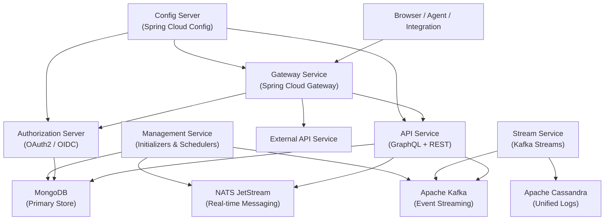

<div align="center">
  <picture>
    <source media="(prefers-color-scheme: dark)" srcset="https://shdrojejslhgnojzkzak.supabase.co/storage/v1/object/public/public/doc-orchestrator/logos/1771371901777-lc3cse-logo-openframe-full-dark-bg.png">
    <source media="(prefers-color-scheme: light)" srcset="https://shdrojejslhgnojzkzak.supabase.co/storage/v1/object/public/public/doc-orchestrator/logos/1771372526604-k3y1w-logo-openframe-full-light-bg.png">
    
  </picture>
</div>

<p align="center">
  <a href="LICENSE.md"></a>
</p>

# OpenFrame OSS Tenant

**OpenFrame** ([openframe.ai](https://openframe.ai) · [flamingo.run/openframe](https://www.flamingo.run/openframe)) is the unified platform that integrates multiple MSP tools into a single AI-driven interface, automating IT support operations across the entire stack.

The **`openframe-oss-tenant`** repository is the full **multi-tenant runtime backend** of the OpenFrame platform. It assembles identity, API, routing, persistence, messaging, stream processing, and management services into a cohesive tenant-aware system — ready for production deployment as a cloud-native MSP backend.

> **Part of Flamingo**: OpenFrame is the open-source backbone of [Flamingo](https://flamingo.run), an AI-powered MSP platform that replaces expensive proprietary software with open-source alternatives enhanced by intelligent automation (Mingo AI for technicians, Fae for clients).

---

## 🎬 See It In Action

[](https://www.youtube.com/watch?v=awc-yAnkhIo)

[](https://www.youtube.com/watch?v=-_56_qYvMWk)

---

## ✨ Features

| Feature | Description |
|---|---|
| **Multi-Tenant Architecture** | Every layer is tenant-scoped — data, auth, messaging, and APIs all enforce `tenantId` isolation |
| **OAuth2 / OIDC Authorization Server** | Full-featured auth server with SSO (Google, Microsoft), per-tenant RSA signing keys, PKCE support |
| **GraphQL + REST API** | Netflix DGS-powered GraphQL with Relay pagination, custom scalars, and REST mutation endpoints |
| **Reactive Gateway** | Spring Cloud Gateway with JWT validation, API key auth, WebSocket proxying, and rate limiting |
| **Event-Driven Messaging** | Apache Kafka (durable streaming) + NATS JetStream (real-time agent communication) |
| **CDC Stream Processing** | Debezium-based ingestion, event normalization, Kafka Streams enrichment, Cassandra unified logs |
| **Tool Integrations** | MeshCentral, Tactical RMM, and Fleet MDM supported out of the box |
| **Mingo AI** | AI-powered ticket automation and IT support intelligence for MSP technicians |
| **Management & Scheduling** | Startup initializers, Mongock migrations, ShedLock distributed schedulers |
| **Self-Hosted** | Deploy on your own infrastructure with Kubernetes manifests included |

---

## 🏗️ Architecture


```mermaid
flowchart TD
    Client["Browser / Agent / Integration"] --> Gateway["Gateway Service\n(Spring Cloud Gateway)"]

    Gateway --> Auth["Authorization Server\n(OAuth2 / OIDC)"]
    Gateway --> API["API Service\n(GraphQL + REST)"]
    Gateway --> ExternalAPI["External API Service"]

    API --> Mongo["MongoDB\n(Primary Store)"]
    API --> NATS["NATS JetStream\n(Real-time Messaging)"]
    API --> Kafka["Apache Kafka\n(Event Streaming)"]

    Auth --> Mongo

    Stream["Stream Service\n(Kafka Streams)"] --> Kafka
    Stream --> Cassandra["Apache Cassandra\n(Unified Logs)"]

    Management["Management Service\n(Initializers & Schedulers)"] --> Mongo
    Management --> NATS
    Management --> Kafka

    Config["Config Server\n(Spring Cloud Config)"] --> Gateway
    Config --> API
    Config --> Auth
```

### Service Overview

| Service | Port | Responsibility |
|---|---|---|
| **Config Server** | 8888 | Centralized configuration for all services |
| **Gateway** | 8080 | Edge routing, JWT validation, API key auth, WebSocket proxy |
| **Authorization Server** | 9000 | OAuth2/OIDC, SSO, multi-tenant JWT issuance |
| **API Service** | 8081 | GraphQL + REST orchestration layer |
| **Management Service** | 8082 | Startup init, migrations, schedulers |
| **Stream Service** | 8083 | Debezium CDC ingestion, event enrichment |
| **External API Service** | 8084 | Third-party integration surface |
| **Client Service** | 8085 | Agent-facing APIs, NATS communication |
| **Frontend (dev)** | 3000 | Next.js UI with hot reload |

---

## 🚀 Quick Start

> **Prerequisites**: Java 21, Maven 3.9+, MongoDB 6+, Redis 7+, Apache Kafka 3.6+, NATS 2.10+, Apache Cassandra 4+. See [Prerequisites](./docs/getting-started/prerequisites.md) for details.

### 1. Clone & Build

```bash
git clone https://github.com/openframeai/openframe-oss-tenant.git
cd openframe-oss-tenant
mvn clean install -DskipTests
```

### 2. Start the Config Server First

```bash
cd openframe/services/openframe-config
mvn spring-boot:run
```

### 3. Start Core Services (each in a separate terminal)

```bash
# Authorization Server
cd openframe/services/openframe-authorization-server
mvn spring-boot:run

# API Service
cd openframe/services/openframe-api
mvn spring-boot:run

# Gateway
cd openframe/services/openframe-gateway
mvn spring-boot:run

# Management Service
cd openframe/services/openframe-management
mvn spring-boot:run
```

### 4. Start the Frontend

```bash
cd openframe/services/openframe-frontend
npm install
npm run dev
# Frontend available at http://localhost:3000
```

### 5. Verify the Platform

```bash
# Gateway health
curl http://localhost:8080/actuator/health

# Authorization Server OIDC discovery
curl http://localhost:9000/.well-known/openid-configuration

# API Service health
curl http://localhost:8081/health
```

📚 For full setup instructions, see the **[Quick Start Guide](./docs/getting-started/quick-start.md)**.

---

## 🧱 Technology Stack

### Backend (Java 21 + Spring Boot 3.3)

- **Runtime**: Java 21, Spring Boot 3.3, Spring Cloud 2023.0
- **API**: Netflix DGS (GraphQL), Spring WebMVC, Spring WebFlux
- **Security**: Spring Authorization Server, Spring Security (OAuth2/JWT/OIDC)
- **Gateway**: Spring Cloud Gateway (Reactive, Netty)
- **Messaging**: Apache Kafka 3.6, NATS JetStream
- **Databases**: MongoDB 6+, Redis 7+, Apache Cassandra 4+
- **Stream Processing**: Kafka Streams, Debezium CDC
- **Scheduling**: ShedLock (Redis), Spring `@Scheduled`
- **Migrations**: Mongock
- **Build**: Maven (multi-module `openframe-parent`)

### Frontend

- **Framework**: Next.js (React)
- **Component Library**: `@flamingo-stack/openframe-frontend-core`
- **Styling**: TailwindCSS

### Infrastructure

- **Orchestration**: Kubernetes (manifests included under `manifests/`)
- **Agent**: Rust (`openframe-client`) — communicates via NATS JetStream
- **Desktop Chat**: Tauri (`openframe-chat`)

---

## 📁 Repository Structure

```text
openframe-oss-tenant/
├── openframe/
│   └── services/
│       ├── openframe-api/               # API Application (GraphQL + REST)
│       ├── openframe-authorization-server/  # OAuth2/OIDC Authorization Server
│       ├── openframe-gateway/           # Reactive Gateway
│       ├── openframe-external-api/      # External API for integrations
│       ├── openframe-management/        # Management, schedulers, migrations
│       ├── openframe-stream/            # Kafka Streams event processing
│       ├── openframe-client/            # Agent-facing API service
│       ├── openframe-config/            # Spring Cloud Config Server
│       └── openframe-frontend/          # Next.js frontend
├── clients/
│   ├── openframe-client/               # Rust agent client
│   └── openframe-chat/                 # Tauri desktop chat app
├── manifests/                          # Kubernetes deployment manifests
└── pom.xml                             # Maven parent POM
```

---

## 📖 Documentation

📚 See the **[Documentation Index](./docs/README.md)** for comprehensive guides:

- **[Introduction](./docs/getting-started/introduction.md)** — What is OpenFrame and why it exists
- **[Prerequisites](./docs/getting-started/prerequisites.md)** — Required software and system requirements
- **[Quick Start](./docs/getting-started/quick-start.md)** — Get running in under 10 minutes
- **[First Steps](./docs/getting-started/first-steps.md)** — Register a tenant, explore the dashboard, connect integrations
- **[Architecture Overview](./docs/development/architecture/README.md)** — Detailed system architecture
- **[Local Development](./docs/development/setup/local-development.md)** — Hot reload, debugging, dev workflows
- **[Contributing Guidelines](./docs/development/contributing/guidelines.md)** — Code style, PR process, conventions

---

## 🤝 Community & Support

OpenFrame is developed by the [Flamingo](https://flamingo.run) team and the **OpenMSP community**.

> ⚠️ We do **not** use GitHub Issues or GitHub Discussions. All community interaction happens in Slack.

- **Community Slack**: [Join OpenMSP Slack](https://join.slack.com/t/openmsp/shared_invite/zt-36bl7mx0h-3~U2nFH6nqHqoTPXMaHEHA)
- **OpenMSP Hub**: [openmsp.ai](https://www.openmsp.ai/)
- **OpenFrame Website**: [openframe.ai](https://openframe.ai)
- **Flamingo Platform**: [flamingo.run](https://flamingo.run)

---

## 🤝 Contributing

We welcome contributions! Please read the **[Contributing Guidelines](./CONTRIBUTING.md)** before opening a pull request.

Key conventions:
- Branch naming: `feat/`, `fix/`, `refactor/`, `docs/`, `chore/`
- Commits: [Conventional Commits](https://www.conventionalcommits.org/)
- All discussion in [OpenMSP Slack](https://join.slack.com/t/openmsp/shared_invite/zt-36bl7mx0h-3~U2nFH6nqHqoTPXMaHEHA)

---

<div align="center">
  Built with 💛 by the <a href="https://www.flamingo.run/about"><b>Flamingo</b></a> team
</div>
