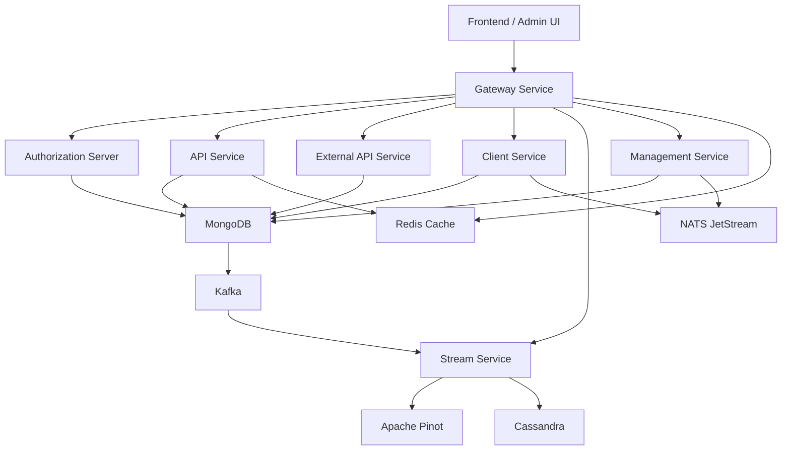

<div align="center">
  <picture>
    <source media="(prefers-color-scheme: dark)" srcset="https://raw.githubusercontent.com/flamingo-stack/openframe-oss-tenant/main/docs/assets/logo-openframe-full-dark-bg.png">
    <source media="(prefers-color-scheme: light)" srcset="https://raw.githubusercontent.com/flamingo-stack/openframe-oss-tenant/main/docs/assets/logo-openframe-full-light-bg.png">
    
  </picture>
</div>

<p align="center">
  <a href="LICENSE.md"></a>
</p>

# OpenFrame OSS Tenant

The **OpenFrame OSS Tenant** is the open-source, multi-tenant foundation of the OpenFrame platform — the unified AI-driven MSP stack that powers [Flamingo](https://flamingo.run). This repository contains the complete end-to-end backend control plane and data plane for modern MSP operations.

OpenFrame replaces expensive proprietary software with open-source alternatives enhanced by intelligent automation, providing MSPs with a unified platform that integrates multiple tools into a single AI-driven interface.

## 🎥 Platform Overview

[](https://www.youtube.com/watch?v=er-z6IUnAps)

[](https://www.youtube.com/watch?v=bINdW0CQbvY)

## ✨ Features

**Complete Multi-Tenant MSP Backend:**
- ✅ **8+ Microservices** - API, Gateway, Authorization, Client, Stream, Management, Config, External API
- ✅ **OAuth2/OIDC Identity Management** - Full authorization server with per-tenant isolation
- ✅ **Device & Tool Lifecycle Management** - Agent authentication, registration, heartbeats
- ✅ **Unified API & GraphQL Interfaces** - REST controllers and GraphQL data fetchers
- ✅ **Real-Time Event Streaming** - Kafka + NATS + Debezium CDC processing
- ✅ **Analytics & OLAP** - Apache Pinot real-time analytics with Cassandra persistence
- ✅ **Distributed Messaging** - Kafka message transport with NATS JetStream
- ✅ **Centralized Configuration** - Config server with environment-specific settings
- ✅ **Secure Gateway Edge Layer** - WebFlux reactive gateway with JWT validation
- ✅ **AI Chat Desktop Client** - React + Tauri desktop application

**Platform Capabilities:**
- **Multi-Tenant Architecture** - Tenant-aware JWT, per-tenant RSA keys, tenant keyspaces
- **Event-Driven Design** - Kafka + Debezium + NATS for reliable event propagation
- **Analytics-Ready** - Pinot OLAP engine with Cassandra wide-column storage
- **Reactive Edge** - Spring WebFlux gateway for high-performance request handling
- **Security-First** - OAuth2 Authorization Code + PKCE, SSO (Google, Microsoft)
- **Clean Architecture** - Layered design with Controller → Service → Repository pattern
- **Cursor Pagination** - Consistent pagination across GraphQL & REST APIs
- **Infrastructure as Code** - Conditional Spring beans for pluggable infrastructure

## 🚀 Quick Start

### Prerequisites

- **Java 21+** - Required for Spring Boot 3.x
- **Docker & Docker Compose** - For running infrastructure services
- **MongoDB** - Primary operational data store
- **Apache Kafka** - Event streaming platform
- **Redis** - Caching layer
- **Apache Pinot** - Real-time OLAP analytics (optional)
- **Cassandra** - Event persistence (optional)

### Architecture Overview


```mermaid
flowchart TD
    User["Frontend / Admin UI"] --> Gateway["Gateway Service"]
    
    Gateway --> Auth["Authorization Server"]
    Gateway --> Api["API Service"]
    Gateway --> ExternalApi["External API Service"]
    Gateway --> ClientSvc["Client Service"]
    Gateway --> StreamSvc["Stream Service"]
    Gateway --> ManagementSvc["Management Service"]
    
    Auth --> Mongo["MongoDB"]
    Api --> Mongo
    ExternalApi --> Mongo
    ClientSvc --> Mongo
    ManagementSvc --> Mongo
    
    ClientSvc --> NATS["NATS JetStream"]
    ManagementSvc --> NATS
    
    Mongo --> Kafka["Kafka"]
    Kafka --> StreamSvc
    StreamSvc --> Pinot["Apache Pinot"]
    StreamSvc --> Cassandra["Cassandra"]
    
    Api --> Redis["Redis Cache"]
    Gateway --> Redis
```

### Service Architecture

The platform consists of multiple specialized services:

**Edge Layer:**
- **Gateway Service** - JWT validation, API key enforcement, rate limiting, WebSocket proxy
- **Authorization Server** - OAuth2 + OIDC, per-tenant RSA keys, SSO integration

**API Layer:**
- **API Service** - REST controllers, GraphQL layer, domain services, DTO contracts
- **External API Service** - Tool proxy routing, API key-secured endpoints

**Client & Agent Layer:**
- **Client Service** - Agent authentication, registration, heartbeats, NATS lifecycle updates
- **Management Service** - Tool management and configuration

**Stream & Analytics:**
- **Stream Service** - Kafka ingestion, Debezium CDC, event normalization, Pinot enrichment

**Infrastructure:**
- **Config Service** - Centralized configuration management
- **Shared Libraries** - Security, utilities, data persistence, caching, messaging

## 🛠️ Technology Stack

**Backend Services:**
- **Spring Boot 3.x** - Microservice framework with Java 21
- **Spring Security** - OAuth2/OIDC authentication and authorization
- **Spring WebFlux** - Reactive gateway and edge services
- **Spring Data MongoDB** - Operational data persistence
- **Spring Data Redis** - Distributed caching
- **GraphQL Java** - API query layer with DataFetchers and DataLoaders

**Data & Messaging:**
- **MongoDB** - Primary operational datastore with cursor-based pagination
- **Apache Kafka** - Event streaming and message transport
- **NATS JetStream** - Real-time agent communication
- **Apache Pinot** - Real-time OLAP analytics
- **Cassandra** - Event and analytics data persistence
- **Redis** - Caching and session management

**Frontend:**
- **React** - Modern UI framework
- **Tauri** - Desktop application runtime
- **GraphQL** - Type-safe API client
- **TypeScript** - Type safety and development experience

## 📋 System Requirements

**Infrastructure Dependencies:**
- Java 21+ runtime
- Docker and Docker Compose
- Minimum 8GB RAM for full stack
- MongoDB 6.0+
- Kafka 2.8+
- Redis 6.0+

**Optional Analytics Stack:**
- Apache Pinot 0.12+
- Cassandra 4.0+

## 🏗️ Repository Structure

```text
├── api_service_entrypoint/              # API microservice bootstrap
├── authorization_server_entrypoint/     # OAuth2/OIDC identity provider
├── gateway_service_entrypoint/          # Edge gateway and routing
├── client_service_entrypoint/           # Agent lifecycle management
├── stream_service_entrypoint/           # Event processing pipeline
├── management_service_entrypoint/       # Tool and config management
├── external_api_service_entrypoint/     # External tool integration
├── config_service_entrypoint/           # Configuration management
├── *_service_core/                      # Business logic libraries
├── data_*/                              # Infrastructure libraries
├── shared_*/                            # Cross-cutting concerns
└── frontend_chat_client/                # React + Tauri desktop app
```

## 📚 Documentation

📚 See the [Documentation](./docs/README.md) for comprehensive guides including:
- Service architecture and design patterns
- API reference and GraphQL schemas
- Development setup and contribution guidelines
- Deployment and infrastructure guides

## 🤝 Community & Support

- **OpenMSP Community**: [Join our Slack](https://join.slack.com/t/openmsp/shared_invite/zt-36bl7mx0h-3~U2nFH6nqHqoTPXMaHEHA)
- **Community Hub**: [openmsp.ai](https://www.openmsp.ai/)
- **Commercial Support**: [flamingo.run](https://flamingo.run)

## 🧩 Related Projects

**OpenFrame CLI Tools** (External Repository):
- **Repository**: [flamingo-stack/openframe-cli](https://github.com/flamingo-stack/openframe-cli)
- **Installation**: [Installation Guide](https://github.com/flamingo-stack/openframe-cli#installation)
- **Documentation**: [CLI Documentation](https://github.com/flamingo-stack/openframe-cli/tree/main/docs)

> **Note**: CLI tools are maintained separately and are NOT located in this repository.

## 📄 License

This project is licensed under the **Flamingo AI Unified License v1.0**. See [LICENSE.md](LICENSE.md) for details.

---
<div align="center">
  Built with 💛 by the <a href="https://www.flamingo.run/about"><b>Flamingo</b></a> team
</div>