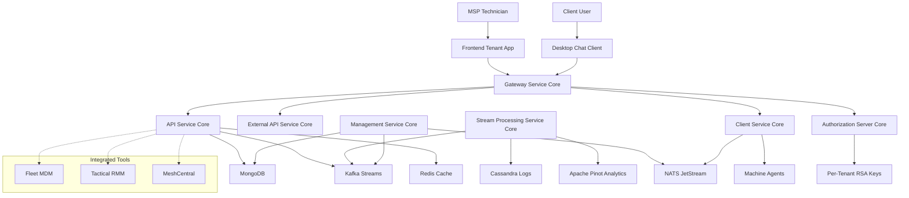

<div align="center">
  <picture>
    <source media="(prefers-color-scheme: dark)" srcset="https://raw.githubusercontent.com/flamingo-stack/openframe-oss-tenant/main/docs/assets/logo-openframe-full-dark-bg.png">
    <source media="(prefers-color-scheme: light)" srcset="https://raw.githubusercontent.com/flamingo-stack/openframe-oss-tenant/main/docs/assets/logo-openframe-full-light-bg.png">
    
  </picture>
</div>

<p align="center">
  <a href="LICENSE.md"></a>
</p>

# OpenFrame OSS Tenant

**The AI-powered MSP platform that replaces expensive proprietary software with open-source alternatives enhanced by intelligent automation.**

OpenFrame is the unified platform that integrates multiple MSP tools into a single AI-driven interface, automating IT support operations across the stack. Built by [Flamingo](https://flamingo.run), OpenFrame delivers enterprise-grade multi-tenant architecture with Mingo AI for technicians and Fae AI for clients.

[](https://www.youtube.com/watch?v=bINdW0CQbvY)

## ✨ Key Features

### 🤖 **Intelligent Automation**
- **Mingo AI**: AI assistant for technicians handling device management, incident triage, and automation
- **Fae AI**: Client-facing AI managing support requests and self-service capabilities  
- **Autonomous Agent Architecture**: Independent AI agents for alert handling and incident response

### 💰 **Cost Reduction & Open Source Foundation**
- **Cut Vendor Costs**: Replace 25-35% of revenue spent on expensive vendor tools
- **Reduce Labor**: Automate routine tasks like password resets and disk cleanups
- **Open Source Stack**: Battle-tested community-driven tools without vendor lock-in

### 🔧 **Integrated Tool Stack**
- **Device Management**: Fleet MDM and Tactical RMM integration
- **Remote Access**: MeshCentral for secure remote desktop and file management
- **Monitoring & Analytics**: Unified event processing with Kafka and Apache Pinot
- **Authentication**: Multi-tenant OAuth2/OIDC with SSO support (Google, Microsoft)

### 🏗️ **Enterprise Architecture**
- **Multi-Service Backend**: Spring Boot microservices with Java 21 and reactive patterns
- **Event-Driven**: Real-time data processing with Kafka streams and NATS messaging
- **Multi-Database**: MongoDB for operations, Cassandra for logs, Pinot for analytics
- **Cloud Native**: Docker containers, Kubernetes ready, Redis caching

## 🚀 Quick Start

Get OpenFrame running locally in **under 5 minutes**:

```bash
# Clone the repository
git clone https://github.com/flamingo-stack/openframe-oss-tenant.git
cd openframe-oss-tenant

# Start infrastructure services
docker compose up -d mongodb redis kafka

# Build and run backend services
mvn clean install -DskipTests
java -jar openframe/services/openframe-api/target/openframe-api-*.jar &
java -jar openframe/services/openframe-gateway/target/openframe-gateway-*.jar &

# Start the frontend
cd openframe/services/openframe-frontend
npm install && npm run dev

# Open browser to https://localhost:3000
```

**Prerequisites**: Docker, Java 21, Node.js 18+, and Maven. See [Prerequisites Guide](./docs/getting-started/prerequisites.md) for details.

[](https://www.youtube.com/watch?v=a45pzxtg27k)

## 🏗️ System Architecture

OpenFrame implements a comprehensive multi-tenant SaaS architecture with microservices, event-driven processing, and AI-powered automation:


```mermaid
flowchart TD
    User["MSP Technician"] --> Frontend["Frontend Tenant App"]
    Client["Client User"] --> Desktop["Desktop Chat Client"]
    
    Frontend --> Gateway["Gateway Service Core"]
    Desktop --> Gateway

    Gateway --> Api["API Service Core"]
    Gateway --> ExternalApi["External API Service Core"]
    Gateway --> ClientService["Client Service Core"]
    Gateway --> Authz["Authorization Server Core"]

    Api --> Mongo["MongoDB"]
    Api --> Kafka["Kafka Streams"]
    Api --> Redis["Redis Cache"]

    Stream["Stream Processing Service Core"] --> Kafka
    Stream --> Cassandra["Cassandra Logs"]
    Stream --> Pinot["Apache Pinot Analytics"]

    Management["Management Service Core"] --> Mongo
    Management --> Kafka
    Management --> NATS["NATS JetStream"]

    ClientService --> NATS
    ClientService --> Agents["Machine Agents"]

    Authz --> JWT["Per-Tenant RSA Keys"]
    
    subgraph "Integrated Tools"
        Fleet["Fleet MDM"]
        Tactical["Tactical RMM"]
        Mesh["MeshCentral"]
    end
    
    Api -.-> Fleet
    Api -.-> Tactical
    Api -.-> Mesh
```

### Core Services

**Identity & Security Layer:**
- **Authorization Server Core**: Multi-tenant OAuth2/OIDC with per-tenant JWT signing keys
- **Security OAuth and JWT Core**: RSA key management, PKCE utilities, token lifecycle

**Edge & Routing Layer:**
- **Gateway Service Core**: Reactive Spring Cloud Gateway with JWT validation and rate limiting

**API Layer:**
- **API Service Core**: Internal GraphQL + REST orchestration with Netflix DGS
- **External API Service Core**: Public REST API with cursor-based pagination

**Agent & Processing Layer:**
- **Client Service Core**: Agent authentication, machine registration, NATS event handling
- **Stream Processing Service Core**: Kafka Streams for event enrichment and analytics

**Management Layer:**
- **Management Service Core**: System administration, schema deployment, job scheduling

## 🛠️ Technology Stack

### Backend Services
- **Java 21** with Spring Boot 3.3.0 microservices
- **Spring Cloud Gateway** for routing and rate limiting
- **Netflix DGS** for GraphQL APIs
- **Spring Security OAuth2** Resource Server
- **Maven** for build management

### Frontend Applications
- **Next.js** tenant application with App Router
- **React 18+** components with Tailwind CSS
- **Tauri** desktop chat client (Rust + TypeScript)
- **TypeScript** for type safety

### AI & Automation
- **VoltAgent Core** for autonomous agent architecture
- **Anthropic Claude** integration for AI assistance
- **Custom AI Models** for incident triage and automation

### Data Infrastructure
- **MongoDB 6.0+** for operational data persistence
- **Apache Kafka 3.6+** for real-time event streaming
- **Redis 7.0+** for caching and session management
- **Apache Cassandra 4.0+** for time-series logs storage
- **Apache Pinot 1.2+** for real-time analytics queries
- **NATS JetStream** for agent communication

### Integrated Tools
- **Fleet MDM** for device management
- **Tactical RMM** for endpoint monitoring
- **MeshCentral** for remote access
- **Debezium** for change data capture

## 📚 Documentation

📚 See the [Documentation](./docs/README.md) for comprehensive guides:

- **[Getting Started](./docs/getting-started/introduction.md)** - Complete setup and introduction
- **[Development Guide](./docs/development/README.md)** - Development environment and workflows
- **[Architecture Reference](./docs/architecture/)** - Technical architecture documentation

### Quick Navigation
- [Prerequisites](./docs/getting-started/prerequisites.md) - System requirements
- [Quick Start](./docs/getting-started/quick-start.md) - 5-minute setup guide
- [First Steps](./docs/getting-started/first-steps.md) - Initial configuration
- [Environment Setup](./docs/development/setup/environment.md) - Developer setup
- [Contributing Guidelines](./docs/development/contributing/guidelines.md) - How to contribute

### CLI Tools

The OpenFrame CLI tools are maintained in a separate repository:
- **Repository**: [flamingo-stack/openframe-cli](https://github.com/flamingo-stack/openframe-cli)
- **Installation**: [Installation Guide](https://github.com/flamingo-stack/openframe-cli#installation)
- **Documentation**: [CLI Documentation](https://github.com/flamingo-stack/openframe-cli/tree/main/docs)

## 🤝 Contributing

We welcome contributions from the community! OpenFrame is built by MSP professionals for MSP professionals.

### How to Contribute
1. **Read** our [Contributing Guidelines](CONTRIBUTING.md)
2. **Fork** the repository and create a feature branch
3. **Develop** your changes with tests
4. **Submit** a pull request with detailed description

### Development Workflow
```bash
# Set up development environment
git clone https://github.com/flamingo-stack/openframe-oss-tenant.git
cd openframe-oss-tenant

# Follow the development setup guide
./docs/development/setup/environment.md

# Make your changes and test
mvn test
npm test

# Submit pull request
```

### Areas of Contribution
- **Tool Integrations**: Add support for new MSP tools
- **AI Enhancements**: Improve Mingo and Fae AI capabilities  
- **Frontend Components**: React components and user interfaces
- **Documentation**: Guides, tutorials, and API documentation
- **Testing**: Unit tests, integration tests, and performance tests

## 🌟 Community & Support

- **OpenMSP Slack Community**: https://www.openmsp.ai/
- **Join Slack**: https://join.slack.com/t/openmsp/shared_invite/zt-36bl7mx0h-3~U2nFH6nqHqoTPXMaHEHA
- **GitHub Repository**: https://github.com/flamingo-stack/openframe-oss-tenant
- **Website**: https://www.flamingo.run/openframe

> **Note**: We don't use GitHub Issues or GitHub Discussions. All community support and discussions happen in our OpenMSP Slack community where you'll get faster, more personal help from the team and community.

## 📄 License

OpenFrame is licensed under the [Flamingo AI Unified License v1.0](LICENSE.md) - a business-friendly open source license that balances community development with commercial sustainability.

## 🏆 What's New in v0.5.2

- **Independent AI Agents**: Autonomous architecture for incident handling and alert management
- **Enhanced Device Management**: Improved Fleet MDM and Tactical RMM integrations
- **Advanced Analytics**: Apache Pinot integration for real-time insights and reporting
- **Security Improvements**: Enhanced multi-tenant isolation and JWT handling
- **Performance Optimizations**: Improved Kafka streams processing and caching strategies

---
<div align="center">
  Built with 💛 by the <a href="https://www.flamingo.run/about"><b>Flamingo</b></a> team
</div>