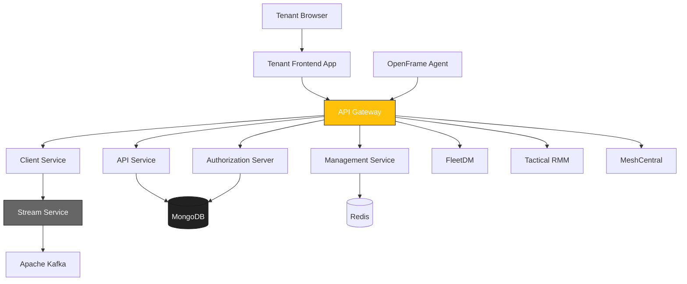

<div align="center">
  <picture>
    <source media="(prefers-color-scheme: dark)" srcset="https://raw.githubusercontent.com/flamingo-stack/openframe-oss-tenant/main/docs/assets/logo-openframe-full-dark-bg.png">
    <source media="(prefers-color-scheme: light)" srcset="https://raw.githubusercontent.com/flamingo-stack/openframe-oss-tenant/main/docs/assets/logo-openframe-full-light-bg.png">
    
  </picture>
</div>

<p align="center">
  <a href="LICENSE.md"></a>
</p>

# OpenFrame OSS Tenant

**OpenFrame** is Flamingo's unified, AI-powered MSP platform that replaces expensive proprietary software with open-source alternatives enhanced by intelligent automation. This repository contains the complete tenant-facing, multi-service implementation of OpenFrame, providing a unified layer for data, APIs, automation, and AI on top of carefully selected open-source projects.

[](https://www.youtube.com/watch?v=bINdW0CQbvY)

## 🚀 Features

- **🤖 AI-Powered Automation** - Mingo AI for autonomous incident triage and Fae AI for intelligent client interactions
- **🔧 Unified Tool Integration** - Single interface for FleetDM, Tactical RMM, MeshCentral, and more MSP tools
- **🏢 Multi-Tenant Architecture** - Secure tenant isolation with OAuth2/OIDC, SSO, and role-based access
- **📊 Comprehensive Monitoring** - Real-time device monitoring, centralized logging, and compliance reporting
- **⚡ High Performance** - Handles 100,000+ events/second with sub-500ms latency
- **🔒 Enterprise Security** - Zero-trust architecture with AES-256 encryption and comprehensive audit trails

## 🏗️ Architecture

OpenFrame follows a modern microservices architecture with strict security and tenant isolation:


```mermaid
flowchart TB
    Browser[Tenant Browser] --> Frontend[Tenant Frontend App]
    Frontend --> Gateway[API Gateway]
    Agent[OpenFrame Agent] --> Gateway

    Gateway --> Authz[Authorization Server]
    Gateway --> API[API Service]
    Gateway --> ClientSvc[Client Service]
    Gateway --> Management[Management Service]

    ClientSvc --> StreamSvc[Stream Service]
    StreamSvc --> Kafka[Apache Kafka]
    
    API --> MongoDB[(MongoDB)]
    Authz --> MongoDB
    Management --> Redis[(Redis)]
    
    Gateway --> Fleet[FleetDM]
    Gateway --> Tactical[Tactical RMM]
    Gateway --> Mesh[MeshCentral]

    style Gateway fill:#FFC109,stroke:#1A1A1A,color:#FAFAFA
    style StreamSvc fill:#666666,stroke:#1A1A1A,color:#FAFAFA
    style MongoDB fill:#212121,stroke:#1A1A1A,color:#FAFAFA
```

## 🚀 Quick Start

Get OpenFrame running locally with the CLI tools:

### Prerequisites

- **Java:** OpenJDK 21.0.1+
- **Node.js:** 18+ with npm
- **Docker:** 24.0+ with Docker Compose
- **Git:** 2.42+

### CLI Installation

The OpenFrame CLI tools are maintained in a separate repository. Install them first:

```bash
# Visit the CLI repository for installation instructions
# https://github.com/flamingo-stack/openframe-cli#installation
```

### Bootstrap OpenFrame

```bash
# Linux
./openframe-linux-amd64 bootstrap
./openframe-linux-amd64 bootstrap --non-interactive --verbose

# Windows
./openframe-windows-amd64.exe bootstrap
./openframe-windows-amd64.exe bootstrap --non-interactive --verbose

# macOS
./openframe bootstrap
./openframe bootstrap --non-interactive --verbose
```

Once started, OpenFrame will be available at:
- **UI Dashboard:** https://localhost

[](https://www.youtube.com/watch?v=jEkFcS4AcQ4)

## 🛠️ Technology Stack

| Component | Technology | Purpose |
|-----------|------------|---------|
| **Backend** | Spring Boot 3.3 + Java 21 | Core runtime & APIs |
| **Frontend** | Vue 3 + TypeScript 5.8 | Modern web interface |
| **Client** | Rust + Tokio | Cross-platform system agent |
| **API Layer** | GraphQL + Netflix DGS | Unified data access |
| **Message Queue** | Apache Kafka 3.6 | Event streaming |
| **Databases** | MongoDB + Cassandra + Pinot | Multi-model data storage |
| **Cache** | Redis | High-performance caching |
| **Monitoring** | Prometheus + Grafana + Loki | Observability stack |

## 🔧 Development Setup

### Local Development

> **Note:** This project depends on `openframe-oss-lib` (version defined in `pom.xml` as `<openframe.libs.version>`). Maven authentication via GitHub Packages is required - set `GITHUB_ACTOR` and `GITHUB_TOKEN` environment variables before building.

```bash
# Clone the repository
git clone https://github.com/flamingo-stack/openframe-oss-tenant.git
cd openframe-oss-tenant

# Set up GitHub authentication
export GITHUB_ACTOR=your-github-username
export GITHUB_TOKEN=your-github-token

# Build backend services
mvn clean install

# Start frontend development server
cd openframe/services/openframe-frontend
npm install && npm run dev

# Build Rust agent
cd ../../client
cargo build --release
```

### Running Tests

```bash
# Java tests
mvn test

# Frontend tests
cd openframe/services/openframe-frontend
npm run type-check

# Rust tests  
cd client
cargo test
```

## 📱 Screenshots

### Dashboard Overview


### Device Management


### Policies & Compliance


## 📚 Documentation

📚 See the [Documentation](./docs/README.md) for comprehensive guides including:

- **Getting Started** - Quick start and prerequisites
- **Development** - Environment setup, architecture, and contributing
- **Reference** - Technical specifications and API documentation
- **CLI Tools** - Command-line interface documentation

## 🤝 Community & Support

- **OpenMSP Slack Community**: [https://www.openmsp.ai/](https://www.openmsp.ai/)
- **Join our Slack**: [Direct Invite Link](https://join.slack.com/t/openmsp/shared_invite/zt-36bl7mx0h-3~U2nFH6nqHqoTPXMaHEHA)
- **OpenFrame Website**: [https://openframe.ai](https://openframe.ai)
- **Flamingo Platform**: [https://flamingo.run](https://flamingo.run)

> **Note**: We use our OpenMSP Slack community for all support, discussions, and community engagement. GitHub Issues and Discussions are not monitored - please use Slack for all questions and support requests.

## 📈 Roadmap

- [x] Core microservices architecture
- [x] GraphQL API with authentication  
- [x] Real-time stream processing
- [x] Cross-platform Rust agent
- [x] Multi-tenant support
- [x] **Advanced AI/ML integrations** 
- [ ] **Edge computing capabilities** *(Q4 2025)*
- [ ] **Mobile companion app** *(2026)*

## 🔒 Security

OpenFrame implements comprehensive security measures:

- **OAuth 2.0 + JWT** authentication
- **AES-256** encryption for data at rest
- **Multi-tenant** isolation
- **Rate limiting** and circuit breakers
- **Real-time** security monitoring

Found a security issue? Please email security@flamingo.run instead of opening a public issue.

## 📄 License

This project is licensed under the [Flamingo AI Unified License v1.0](LICENSE.md).

## 🙏 Acknowledgments

- Thanks to all our [contributors](https://github.com/flamingo-stack/openframe-oss-tenant/graphs/contributors)
- Built with amazing open-source projects: Spring Boot, Vue 3, Apache Kafka, and many more
- Special thanks to the broader open-source community

---

<div align="center">
  Built with 💛 by the <a href="https://www.flamingo.run/about"><b>Flamingo</b></a> team
</div>