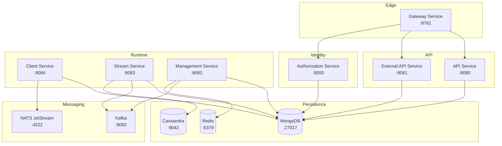

<div align="center">
  <picture>
    <source media="(prefers-color-scheme: dark)" srcset="https://raw.githubusercontent.com/flamingo-stack/openframe-oss-tenant/main/docs/assets/logo-openframe-full-dark-bg.png">
    <source media="(prefers-color-scheme: light)" srcset="https://raw.githubusercontent.com/flamingo-stack/openframe-oss-tenant/main/docs/assets/logo-openframe-full-light-bg.png">
    
  </picture>
</div>

<p align="center">
  <a href="LICENSE.md"></a>
</p>

# OpenFrame OSS Tenant

**The complete open-source backend platform that powers AI-driven MSP automation.** OpenFrame OSS Tenant provides a production-grade, multi-tenant microservices architecture that replaces expensive proprietary MSP tools with intelligent automation powered by **Mingo AI** for technicians and **Fae** for clients.

OpenFrame (https://openframe.ai) is the unified platform that integrates multiple MSP tools into a single AI-driven interface, automating IT support operations across the stack.

## 🎯 Key Features

### 🏢 Multi-Tenant SaaS Backend Architecture
- **Complete tenant isolation** with per-tenant configuration management
- **OAuth2/OIDC identity provider** with JWT-based authentication
- **Scalable microservices architecture** built for enterprise deployment
- **Edge gateway security** with rate limiting and CORS enforcement

### 🤖 AI-Powered MSP Automation
- **Mingo AI**: Intelligent technician assistant for ticket routing and resolution
- **Fae**: Client-facing AI support for automated password resets and maintenance
- **Real-time event processing** with intelligent data enrichment
- **Automated tool lifecycle management** with predictive maintenance

### 🔐 Enterprise-Grade Security
- **Multi-tenant RSA key management** with per-tenant token signing
- **API key authentication** for service-to-service communication  
- **JWT token validation** with dynamic issuer resolution
- **Encrypted sensitive data storage** with audit trails

### 🚀 Comprehensive MSP Operations
- **Device and machine management** with agent registration and heartbeat processing
- **Organization and user administration** with role-based access control
- **Log aggregation and analysis** with real-time streaming and Cassandra storage
- **Tool integration framework** supporting RMM, ticketing, and monitoring systems

## 📺 Platform Overview

[](https://www.youtube.com/watch?v=a45pzxtg27k)

## 🏗️ Architecture

OpenFrame OSS Tenant implements a sophisticated microservices architecture with event-driven communication:


```mermaid
flowchart TD
    subgraph Edge
        Gateway[Gateway Service<br/>:8761]
    end

    subgraph Identity
        Authz[Authorization Service<br/>:9000]
    end

    subgraph API
        Api[API Service<br/>:8080]
        ExternalApi[External API Service<br/>:8081]
    end

    subgraph Runtime
        Client[Client Service<br/>:8084]
        Stream[Stream Service<br/>:8083]
        Management[Management Service<br/>:8082]
    end

    subgraph Persistence
        Mongo[(MongoDB<br/>:27017)]
        Cassandra[(Cassandra<br/>:9042)]
        Redis[(Redis<br/>:6379)]
    end

    subgraph Messaging
        Kafka[Kafka<br/>:9092]
        Nats[NATS JetStream<br/>:4222]
    end

    Gateway --> Api
    Gateway --> ExternalApi
    Gateway --> Authz

    Api --> Mongo
    ExternalApi --> Mongo
    Authz --> Mongo
    Client --> Mongo
    Management --> Mongo
    Stream --> Mongo

    Stream --> Kafka
    Client --> Nats
    Management --> Kafka

    Stream --> Cassandra
    Management --> Redis
```

### Service Responsibilities

| Service | Purpose | Technology |
|---------|---------|------------|
| **Gateway Service** | Edge routing, JWT validation, CORS, rate limiting | Spring Cloud Gateway |
| **Authorization Service** | OAuth2/OIDC flows, tenant isolation, token management | Spring Security OAuth2 |
| **API Service** | Internal GraphQL/REST APIs for platform UI | Netflix DGS, Spring Boot |
| **External API Service** | Public REST APIs for integrations | Spring Boot, OpenAPI |
| **Client Service** | Agent authentication and registration | NATS JetStream |
| **Stream Service** | Event processing and data enrichment | Kafka Streams, Cassandra |
| **Management Service** | Tool lifecycle and system coordination | ShedLock, Redis |

## 🛠️ Technology Stack

### Backend Services (Spring Boot 3.3.0)
- **Language**: Java 21 with modern language features
- **Framework**: Spring Boot with Spring Cloud ecosystem
- **Security**: Spring Security OAuth2 Resource Server
- **Data**: MongoDB (primary), Cassandra (logs), Redis (cache)
- **Messaging**: Apache Kafka (event streaming), NATS JetStream (real-time)
- **Monitoring**: Prometheus metrics with Micrometer

### Tooling Layer (Node.js)
- **AI Integration**: Anthropic AI SDK (@ai-sdk/anthropic)
- **Core Framework**: VoltAgent Core (@voltagent/core)
- **Validation**: Zod schema validation
- **Utilities**: Glob pattern matching, file processing

### Infrastructure & Deployment
- **Containerization**: Docker and Docker Compose support
- **Event Streaming**: Kafka with Debezium CDC for database changes
- **Service Discovery**: Spring Cloud Discovery
- **Configuration Management**: Spring Cloud Config Server

## ⚡ Quick Start

Get OpenFrame running locally in under 5 minutes:

```bash
# 1. Clone the repository
git clone https://github.com/flamingo-stack/openframe-oss-tenant.git
cd openframe-oss-tenant

# 2. Start infrastructure services
docker-compose up -d mongodb kafka redis

# 3. Install Node.js dependencies
npm install

# 4. Build the Spring Boot services
mvn clean install -DskipTests

# 5. Start the core services
./start-dev-services.sh
```

**Verify installation:**
```bash
# Check API service health
curl http://localhost:8080/actuator/health

# Test GraphQL endpoint
curl -X POST "http://localhost:8080/graphql" \
     -H "Content-Type: application/json" \
     -d '{"query": "query { __schema { types { name } } }"}'
```

OpenFrame will be available at `http://localhost:8080` with the Gateway at `http://localhost:8761`.

## 🎯 Use Cases

### MSP Providers
- **Cost Reduction**: Replace expensive proprietary MSP tools with open-source alternatives
- **AI Automation**: Leverage Mingo AI for intelligent ticket routing and Fae for client support
- **Unified Management**: Centralize device monitoring, log analysis, and tool integration

### Developers & System Integrators
- **Multi-Tenant SaaS**: Production-ready backend architecture with tenant isolation
- **Microservices Platform**: Event-driven design with Kafka and NATS integration
- **Custom Integrations**: Extensible tool integration framework

### IT Operations Teams
- **Automated Operations**: Intelligent script execution and maintenance scheduling
- **Centralized Monitoring**: Real-time log aggregation with Cassandra storage
- **Agent Management**: Automated agent registration and heartbeat monitoring

## 🎥 Featured Videos

[](https://www.youtube.com/watch?v=jEkFcS4AcQ4)

## 📚 Documentation

📚 See the [Documentation](./docs/README.md) for comprehensive guides covering:

- **Getting Started**: Prerequisites, quick start, and first steps
- **Development**: Local setup, architecture, testing, and security
- **Reference**: Detailed service documentation and API specifications
- **Architecture Diagrams**: Visual documentation of system components

## 🤝 Community & Support

- **OpenMSP Slack Community**: https://join.slack.com/t/openmsp/shared_invite/zt-36bl7mx0h-3~U2nFH6nqHqoTPXMaHEHA
- **OpenFrame Website**: https://www.flamingo.run/openframe
- **Flamingo Platform**: https://flamingo.run

> **Note**: We use our OpenMSP Slack community for all discussions, support, and feature requests. GitHub Issues and Discussions are not monitored.

## 🔗 Related Projects

### CLI Tools
The OpenFrame CLI tools are maintained in a separate repository:
- **Repository**: [flamingo-stack/openframe-cli](https://github.com/flamingo-stack/openframe-cli)
- **Installation**: [Installation Guide](https://github.com/flamingo-stack/openframe-cli#installation)
- **Documentation**: [CLI Documentation](https://github.com/flamingo-stack/openframe-cli/tree/main/docs)

## 🚀 Benefits

### 💰 Cost Reduction
- Replace expensive proprietary MSP tools with open-source alternatives
- Reduce vendor lock-in and operational overhead
- Lower total cost of ownership through automation

### 🤖 AI-Powered Efficiency
- Intelligent ticket routing and automated resolution
- Predictive issue detection and prevention
- Automated password resets and maintenance tasks

### 📈 Scalability & Flexibility
- Multi-tenant architecture supports business growth
- Microservices enable independent scaling and deployment
- Event-driven design handles high-volume operations

## 📄 License

This project is licensed under the Flamingo AI Unified License v1.0. See [LICENSE.md](LICENSE.md) for details.

---
<div align="center">
  Built with 💛 by the <a href="https://www.flamingo.run/about"><b>Flamingo</b></a> team
</div>