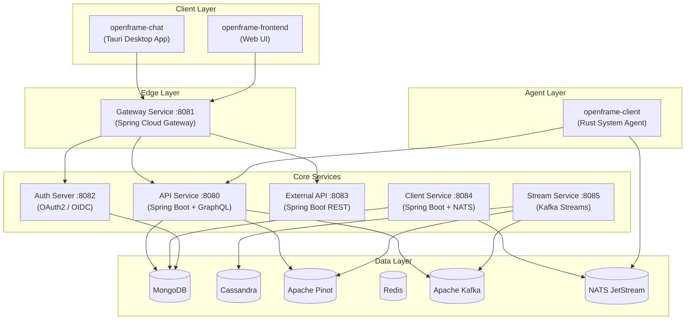

<div align="center">
  <picture>
    <source media="(prefers-color-scheme: dark)" srcset="https://shdrojejslhgnojzkzak.supabase.co/storage/v1/object/public/public/doc-orchestrator/logos/1771371901777-lc3cse-logo-openframe-full-dark-bg.png">
    <source media="(prefers-color-scheme: light)" srcset="https://shdrojejslhgnojzkzak.supabase.co/storage/v1/object/public/public/doc-orchestrator/logos/1771372526604-k3y1w-logo-openframe-full-light-bg.png">
    
  </picture>
</div>

<p align="center">
  <a href="LICENSE.md"></a>
</p>

# OpenFrame OSS Tenant

**OpenFrame OSS Tenant** is the multi-service, multi-tenant open-source foundation of the [OpenFrame platform](https://openframe.ai) — an AI-powered MSP (Managed Service Provider) platform built by [Flamingo](https://flamingo.run) that replaces expensive proprietary software with intelligent automation.

It integrates device management, real-time messaging, AI-assisted support (**Mingo AI** for technicians, **Fae** for clients), and event-driven automation across a polyglot microservice architecture built on Spring Boot (Java), Rust, and TypeScript.

[](https://www.youtube.com/watch?v=FgQu7hfKJKw)

---

## ✨ Features

- **AI-Assisted Support** — Mingo AI for technicians and Fae for end clients, both powered by streaming LLMs with real-time response delivery
- **Cross-Platform Rust Agent** — `openframe-client` runs as a system service on Windows, macOS, and Linux; supports script execution, tool management, and self-updating via Velopack
- **Desktop AI Chat (Fae)** — Tauri 2 + React 19 desktop application delivering the Fae end-client experience with AES-256-GCM token security and NATS-based streaming
- **Multi-Tenant Architecture** — Full tenant isolation with per-tenant OAuth2 clients, RSA-signed JWTs, and `TenantAwareMongoTemplate` database scoping
- **Real-Time Event Streaming** — Apache Kafka + NATS JetStream for device events, script execution results, and AI message chunk delivery
- **Remote Management (RMM)** — Script execution (bash, PowerShell, Python, Nushell), scheduling, live commands, and compliance checking across all managed endpoints
- **Integrated Tool Management** — MeshCentral, FleetMDM, and custom tool agents orchestrated through the platform
- **SSO Support** — Google and Microsoft OIDC integration via the Spring Authorization Server
- **GraphQL API** — Netflix DGS-powered API service with full multi-tenant scoping
- **Open Source & Self-Hostable** — Deploy and extend on your own infrastructure

---

## 🏗️ Architecture

All client traffic passes through the Spring Cloud Gateway. Backend services communicate via HTTP/GraphQL internally and asynchronously via Kafka and NATS JetStream. The Rust agent communicates exclusively over NATS.


```mermaid
graph TB
    subgraph Clients["Client Layer"]
        ChatApp["openframe-chat\n(Tauri Desktop App)"]
        FrontendUI["openframe-frontend\n(Web UI)"]
    end

    subgraph Gateway["Edge Layer"]
        GW["Gateway Service :8081\n(Spring Cloud Gateway)"]
    end

    subgraph CoreServices["Core Services"]
        API["API Service :8080\n(Spring Boot + GraphQL)"]
        AuthServer["Auth Server :8082\n(OAuth2 / OIDC)"]
        ExtAPI["External API :8083\n(Spring Boot REST)"]
        StreamSvc["Stream Service :8085\n(Kafka Streams)"]
        ClientSvc["Client Service :8084\n(Spring Boot + NATS)"]
    end

    subgraph AgentLayer["Agent Layer"]
        OFClient["openframe-client\n(Rust System Agent)"]
    end

    subgraph DataLayer["Data Layer"]
        Mongo[("MongoDB")]
        Cassandra[("Cassandra")]
        Pinot[("Apache Pinot")]
        Redis[("Redis")]
        Kafka[("Apache Kafka")]
        NATS[("NATS JetStream")]
    end

    ChatApp --> GW
    FrontendUI --> GW
    GW --> API
    GW --> AuthServer
    GW --> ExtAPI
    API --> Mongo
    API --> Pinot
    API --> Kafka
    StreamSvc --> Kafka
    StreamSvc --> Cassandra
    StreamSvc --> Pinot
    ClientSvc --> Mongo
    ClientSvc --> NATS
    AuthServer --> Mongo
    OFClient --> NATS
    OFClient --> API
```

### Core Components

| Component | Language | Port | Responsibility |
|---|---|---|---|
| **API Service** | Java / Spring Boot 3.3 | 8080 | REST + GraphQL APIs; tickets, dialogs, AI settings, tenant management |
| **Authorization Server** | Java / Spring Authorization Server | 8082 | Multi-tenant OAuth2/OIDC; RSA-signed JWT issuance; SSO (Google, Microsoft) |
| **Gateway** | Java / Spring Cloud Gateway | 8081 | Security enforcement, JWT validation, routing, WebSocket proxy |
| **External API** | Java / Spring Boot | 8083 | Rate-limited public API endpoints with API key management |
| **Stream Service** | Java / Kafka Streams | 8085 | Real-time event normalization, enrichment, Cassandra/Pinot writes |
| **Client Service** | Java / Spring Boot + NATS | 8084 | Agent lifecycle management, tool orchestration |
| **openframe-client** | Rust | — | Cross-platform system agent; device registration, script execution, self-update |
| **openframe-chat** | TypeScript / Tauri + React | 3003 | Desktop AI chat client (Fae) for end clients |

---

## 🚀 Quick Start

### Prerequisites

- **JDK 21** (OpenJDK 21 recommended)
- **Apache Maven 3.9+**
- **Node.js 20 LTS** + npm 9+
- **Rust 1.78+** (stable) — install via [rustup](https://rustup.rs)
- **Tauri system libraries** — see [Prerequisites guide](./docs/getting-started/prerequisites.md)

### Clone and Build

```bash
# 1. Clone the repository
git clone https://github.com/flamingo-stack/openframe-oss-tenant.git
cd openframe-oss-tenant

# 2. Build all backend services (Java / Spring Boot)
mvn clean install -DskipTests

# 3. Install frontend dependencies (openframe-chat desktop app)
cd clients/openframe-chat
npm install

# 4. Build the Rust agent
cd ../openframe-client
OPENFRAME_VERSION=0.0.0-dev cargo build

# 5. Return to root
cd ../..
```

### Run the Desktop App

```bash
cd clients/openframe-chat
npm run tauri dev
```

The OpenFrame Chat desktop window (Fae) will launch automatically at `http://localhost:3003`.

### Run a Backend Service

```bash
# Start the API service
mvn spring-boot:run -pl openframe/services/openframe-api
```

### Verify the Rust Agent

```bash
./clients/openframe-client/target/debug/openframe-client --help
```

### Agent Doctor Check

```bash
cd clients/openframe-client
./target/debug/openframe-client doctor
```

### Install Agent as a System Service

```bash
sudo ./target/release/openframe-client install \
  --serverUrl https://your-openframe-instance.example.com \
  --initialKey YOUR_INITIAL_KEY \
  --orgId YOUR_ORG_ID
```

---

## 🛠️ Technology Stack

| Layer | Technology |
|---|---|
| Backend services | Java 21, Spring Boot 3.3, Spring Cloud Gateway, Spring Authorization Server, Netflix DGS (GraphQL) |
| Endpoint agent | Rust (stable), async-nats, tokio, Velopack |
| Desktop client | TypeScript, React 19, Vite, Tauri 2 |
| Event streaming | Apache Kafka, Kafka Streams |
| Agent messaging | NATS JetStream |
| Primary datastore | MongoDB (multi-tenant, tenant-scoped) |
| Time-series storage | Apache Cassandra |
| Real-time analytics | Apache Pinot |
| Cache / sessions | Redis |
| Shared UI library | `@flamingo-stack/openframe-frontend-core` (npm) |

---

## 📁 Repository Structure

```text
openframe-oss-tenant/
├── openframe/
│   └── services/              # Spring Boot microservices
│       ├── openframe-api/     # Core REST + GraphQL API (port 8080)
│       ├── openframe-gateway/ # Spring Cloud Gateway (port 8081)
│       ├── openframe-authorization-server/ # OAuth2/OIDC (port 8082)
│       ├── openframe-external-api/         # Public API (port 8083)
│       ├── openframe-client/  # Agent lifecycle service (port 8084)
│       ├── openframe-stream/  # Kafka Streams (port 8085)
│       ├── openframe-management/
│       └── openframe-config/
├── clients/
│   ├── openframe-client/      # Rust cross-platform agent
│   └── openframe-chat/        # Tauri + React desktop app (Fae)
├── manifests/                 # Kubernetes manifests & data service configs
└── pom.xml                    # Parent Maven POM
```

---

## 🔧 CLI Tools

The OpenFrame CLI tools are maintained in a separate repository:

- **Repository:** [flamingo-stack/openframe-cli](https://github.com/flamingo-stack/openframe-cli)
- **Installation:** [Installation Guide](https://github.com/flamingo-stack/openframe-cli#installation)
- **Documentation:** [CLI Documentation](https://github.com/flamingo-stack/openframe-cli/tree/main/docs)

---

## 📚 Documentation

Full documentation is available in the [`docs/`](./docs/README.md) directory:

- [Introduction](./docs/getting-started/introduction.md) — What is OpenFrame OSS Tenant?
- [Prerequisites](./docs/getting-started/prerequisites.md) — Environment requirements
- [Quick Start](./docs/getting-started/quick-start.md) — Step-by-step setup guide
- [First Steps](./docs/getting-started/first-steps.md) — Explore the platform after setup
- [Architecture Overview](./docs/development/architecture/README.md) — Diagrams and component relationships
- [Development Guide](./docs/development/README.md) — Full development documentation
- [Contributing Guidelines](./docs/development/contributing/guidelines.md) — How to contribute

---

## 🤝 Community

All support, feature requests, bug reports, and development discussions happen in the **OpenMSP Slack community** — GitHub Issues and GitHub Discussions are not used.

- **OpenMSP Community:** [https://www.openmsp.ai/](https://www.openmsp.ai/)
- **Join Slack:** [Invite Link](https://join.slack.com/t/openmsp/shared_invite/zt-36bl7mx0h-3~U2nFH6nqHqoTPXMaHEHA)
- **OpenFrame Website:** [https://openframe.ai](https://openframe.ai)
- **Flamingo Platform:** [https://flamingo.run](https://flamingo.run)
- **Releases:** [github.com/flamingo-stack/openframe-oss-tenant/releases](https://github.com/flamingo-stack/openframe-oss-tenant/releases)

---

<div align="center">
  Built with 💛 by the <a href="https://www.flamingo.run/about"><b>Flamingo</b></a> team
</div>
