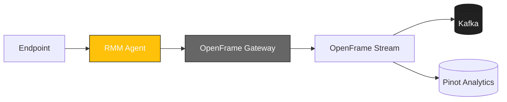

<div align="center">
  <picture>
    <!-- Dark theme -->
    <source media="(prefers-color-scheme: dark)" srcset="docs/assets/logo-openframe-full-dark-bg.png">
    <!-- Light theme -->
    <source media="(prefers-color-scheme: light)" srcset="docs/assets/logo-openframe-full-light-bg.png">
    <!-- Default / fallback -->
    
  </picture>

  <h1>RMM Agent</h1>

  <p><b>Cross-platform Rust agent for remote monitoring, automation, and secure device management in the OpenFrame ecosystem.</b></p>

  <p>
    <a href="LICENSE.md">
      
    </a>
    <a href="https://www.flamingo.run/knowledge-base">
      
    </a>
    <a href="https://www.openmsp.ai/">
      
    </a>
  </p>
</div>

---

## Highlights

- System Monitoring – CPU, memory, disk, services, processes  
- Remote Execution – commands, service restart, package deployment  
- Secure Communication – gRPC/WebSocket over TLS with JWT  
- Automatic Updates – Velopack-based, zero-downtime  
- Cross-Platform – Windows, macOS, Linux  
- Extensible – collectors and plugins  

---

## Architecture

The RMM Agent runs locally on endpoints and connects securely to OpenFrame Gateway:



## Quick Start

Prerequisites:  
- Rust 1.70+  
- Cargo  
- Go 1.21+ (если нужен Go-билд в стиле Tactical RMM)  
- Access to a running OpenFrame Gateway  

---

### Build (Rust - OpenFrame RMM Agent)

```bash
git clone https://github.com/flamingo-stack/rmmagent.git
cd rmmagent
cargo build --release
```

Run:  
```bash
./target/release/rmmagent --server https://gateway.local --token <JWT>
```

---

### Build (Go - Tactical RMM)

```bash
git clone https://github.com/flamingo-stack/rmmagent.git
cd rmmagent
env CGO_ENABLED=0 GOOS=<GOOS> GOARCH=<GOARCH> go build -ldflags "-s -w"
```
 
- Linux x64:  
  ```bash
  env CGO_ENABLED=0 GOOS=linux GOARCH=amd64 go build -ldflags "-s -w"
  ```
- Windows x64:  
  ```bash
  env CGO_ENABLED=0 GOOS=windows GOARCH=amd64 go build -ldflags "-s -w"
  ```

---

## Configuration

Environment variables and CLI flags are supported:  

- `RMM_SERVER` - Gateway base URL  
- `RMM_TOKEN` - JWT token for authentication  
- `RMM_LOG_LEVEL` - info, debug, trace  
- `RMM_UPDATE_CHANNEL` - stable, beta  

---

## Development

Run Tests:  
```bash
cargo test
```

Lint & Format:  
```bash
cargo fmt
cargo clippy
```

---

## Security

- TLS 1.3 is enforced for all communication  
- OAuth2/OIDC → JWT for authentication (via Gateway)  
- Least privilege mode on endpoints  

Found a vulnerability? Email **security@flamingo.run** instead of opening a public issue.  

---

## Compatibility Notes

- This agent is inspired by and compatible with the **Tactical RMM Agent**.  
- Supports similar build patterns (`go build` with `GOOS`/`GOARCH`) for environments already using Tactical RMM.  
- Extends functionality with **OpenFrame integration**, adding:  
  - Kafka & Pinot streaming pipeline  
  - Unified API layer with OpenFrame Gateway  
  - Multi-tenant security and advanced monitoring  

This makes migration from Tactical RMM or hybrid deployments seamless.

---

## License

This project is licensed under the **Flamingo Unified License v1.0** ([LICENSE.md](LICENSE.md)).

---

<div align="center">
  <table border="0" cellspacing="0" cellpadding="0">
    <tr>
      <td align="center">
        Built with 💛 by the <a href="https://www.flamingo.run/about"><b>Flamingo</b></a> team
      </td>
      <td align="center">
        <a href="https://www.flamingo.run">Website</a> • 
        <a href="https://www.flamingo.run/knowledge-base">Knowledge Base</a> • 
        <a href="https://www.linkedin.com/showcase/openframemsp/about/">LinkedIn</a> • 
        <a href="https://www.openmsp.ai/">Community</a>
      </td>
    </tr>
  </table>
</div>
