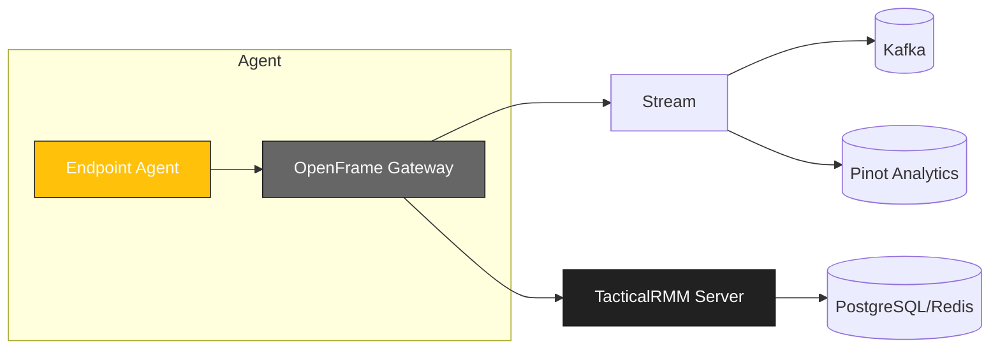

<div align="center">
  <picture>
    <!-- Dark theme -->
    <source media="(prefers-color-scheme: dark)" srcset="docs/assets/logo-openframe-full-dark-bg.png">
    <!-- Light theme -->
    <source media="(prefers-color-scheme: light)" srcset="docs/assets/logo-openframe-full-light-bg.png">
    <!-- Default / fallback -->
    
  </picture>

  <h1>Tactical RMM</h1>

  <p><b>Remote monitoring and management (RMM) platform, adapted and integrated into the OpenFrame ecosystem.</b></p>

  <p>
    <a href="LICENSE.md">
      
    </a>
    <a href="https://www.flamingo.run/knowledge-base">
      
    </a>
    <a href="https://www.openmsp.ai/">
      
    </a>
  </p>
</div>

---

## Quick Links
- [Quick Start](#quick-start)  
- [Configuration](#configuration)  
- [Development](#development)  
- [Security](#security)  

---

## Highlights

- Full-featured RMM: monitoring, automation, patching, remote scripts  
- Multi-tenant MSP support  
- Web console for agents and policies  
- Secure API with JWT and TLS  
- Cross-platform agent support (Windows, macOS, Linux)  
- Integrates with OpenFrame Gateway & Stream  

---

## Architecture

Tactical RMM server integrates with agents and OpenFrame components:



## Quick Start

### Prerequisites
- Python 3.11+
- Django & DRF dependencies
- Redis + PostgreSQL
- Access to a running OpenFrame Gateway

### Clone & setup
```bash
git clone https://github.com/flamingo-stack/tacticalrmm.git
cd tacticalrmm
pip install -r api/requirements.txt
npm install --prefix web
```

### Run server (development)
```bash
cd api
python manage.py migrate
python manage.py runserver
```

### Run frontend (development)
```bash
cd web
npm start
```

## Configuration

Configuration is managed via .env or environment variables:
- `DB_HOST` / `DB_USER` / `DB_PASS` – PostgreSQL config
- `REDIS_URL` – Redis instance URL
- `SECRET_KEY` – Django secret key
- `API_URL` – TacticalRMM API base
- `GATEWAY_URL` – OpenFrame Gateway URL
- `JWT_SECRET` – Token signing secret
- `LOG_LEVEL` – error, warning, info, debug

## Development

### Run backend tests
```bash
cd api
pytest
```

### Run frontend tests
```bash
cd web
npm test
```

### Lint & format
```bash
cd web
npm run lint
black api/
```

## Security

- TLS 1.3 enforced for all API communication
- JWT authentication with OpenFrame Gateway
- Multi-tenant access controls
- Agents authenticate with enrollment keys
- Least-privilege role model

Found a vulnerability? Email security@flamingo.run instead of opening a public issue.

---

## Contributing

We welcome PRs! Please follow these guidelines:  
- Use branching strategy: `feature/...`, `bugfix/...`  
- Add descriptions to the **CHANGELOG**  
- Follow consistent Go code style (`go fmt`, linters)  
- Keep documentation updated in `docs/`  

---

## License

This project is licensed under the **Flamingo Unified License v1.0** ([LICENSE.md](LICENSE.md)).

---

<div align="center">
  <table border="0" cellspacing="0" cellpadding="0">
    <tr>
      <td align="center">
        Built with 💛 by the <a href="https://www.flamingo.run/about"><b>Flamingo</b></a> team
      </td>
      <td align="center">
        <a href="https://www.flamingo.run">Website</a> • 
        <a href="https://www.flamingo.run/knowledge-base">Knowledge Base</a> • 
        <a href="https://www.linkedin.com/showcase/openframemsp/about/">LinkedIn</a> • 
        <a href="https://www.openmsp.ai/">Community</a>
      </td>
    </tr>
  </table>
</div>
