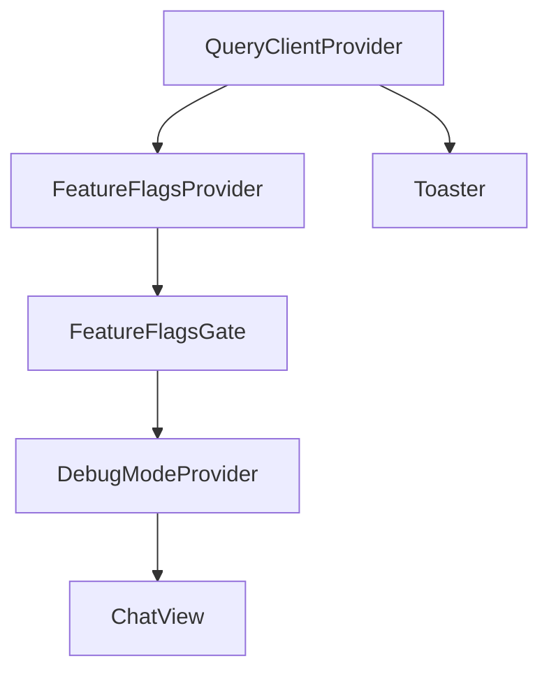

<!-- source-hash: c8d451a90de9661f90b537af1849c67f -->
The root application component that bootstraps the Flamingo/OpenFrame chat interface, wiring together global providers, connection monitoring, and the main chat view.

## Key Components

| Export/Symbol | Description |
|---|---|
| `App` (default) | Root React component; composes all global providers and renders `ChatView` |
| `queryClient` | Singleton `QueryClient` with 60s stale time, no window-focus refetch, and 1 retry |
| `useConnectionStatus` | Hook called at app root to monitor backend connectivity |
| `FeatureFlagsProvider` / `FeatureFlagsGate` | Wraps the app to supply and conditionally gate feature flag values |
| `DebugModeProvider` | Provides debug-mode context to all children |
| `data-app-type` attribute | Set on `<html>` from `NEXT_PUBLIC_APP_TYPE` env var (defaults to `"flamingo"`) to drive theming/branding |

## Provider Tree



## Usage Example

```typescript
// main.tsx — mount the app
import { StrictMode } from 'react';
import { createRoot } from 'react-dom/client';
import App from './App';

createRoot(document.getElementById('root')!).render(
  <StrictMode>
    <App />
  </StrictMode>
);
```

```bash
# Set the app type before building (defaults to "flamingo")
NEXT_PUBLIC_APP_TYPE=openframe npm run build
```

> The `data-app-type` attribute on `<html>` enables CSS-level branding switches — ensure `globals.css` defines scoped token overrides for each supported app type.