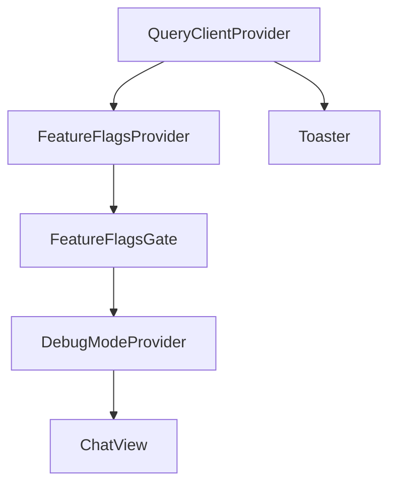

<!-- source-hash: c8d451a90de9661f90b537af1849c67f -->
Root application component that bootstraps the Flamingo/OpenFrame chat interface, wiring together global providers, feature flags, connection monitoring, and the main chat view.

## Key Components

| Export/Symbol | Description |
|---|---|
| `App` (default export) | Root React component — composes all providers and renders `ChatView` |
| `queryClient` | Singleton `QueryClient` with 60s stale time, no window-focus refetch, 1 retry |
| `useConnectionStatus` | Hook invoked at root level to monitor network/server connectivity |
| `FeatureFlagsProvider` / `FeatureFlagsGate` | Provides and guards feature flag context before rendering children |
| `DebugModeProvider` | Supplies debug mode state to the component tree |
| `ChatView` | Primary UI view rendered once all gates pass |

## Provider Tree



## Usage Example

```typescript
// main.tsx — standard Vite/React entrypoint
import { StrictMode } from 'react';
import { createRoot } from 'react-dom/client';
import App from './App';

createRoot(document.getElementById('root')!).render(
  <StrictMode>
    <App />
  </StrictMode>
);
```

## Notes

- The `data-app-type` attribute is set on `<html>` at mount using `NEXT_PUBLIC_APP_TYPE` (defaults to `"flamingo"`), enabling CSS-level theming per deployment target.
- `Toaster` is intentionally rendered **outside** `QueryClientProvider` so notifications remain visible regardless of query state.
- `queryClient` is module-scoped (not inside the component) to prevent re-instantiation on re-renders.