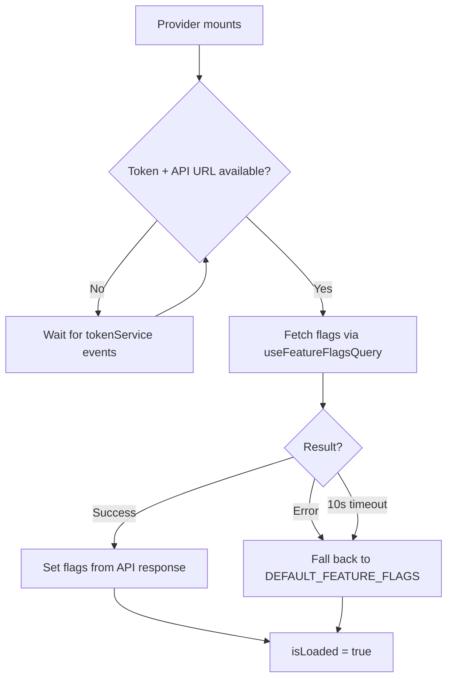

<!-- source-hash: c0a91107518a8c948db9d056c0ec9ac2 -->
Provides a React context for managing feature flag state, handling async flag loading with token-aware initialization, error fallback, and a safety timeout.

## Key Components

| Export | Type | Description |
|---|---|---|
| `FeatureFlagsProvider` | Component | Context provider that fetches flags once a valid token and API URL are available |
| `FeatureFlagsGate` | Component | Renders `null` until flags are fully loaded — use to block UI until flags are ready |
| `useFeatureFlags` | Hook | Consumes the context; throws if used outside `FeatureFlagsProvider` |
| `FeatureFlagsContext` | Context | Internal context holding `flags`, `isLoaded`, and `isError` |

### Loading Behavior



## Usage Example

```typescript
// Wrap your app with the provider
function App() {
  return (
    <FeatureFlagsProvider>
      {/* Block rendering until flags are ready */}
      <FeatureFlagsGate>
        <MainLayout />
      </FeatureFlagsGate>
    </FeatureFlagsProvider>
  );
}

// Consume flags anywhere inside the provider
function MainLayout() {
  const { flags, isLoaded, isError } = useFeatureFlags();

  if (isError) {
    console.warn('Running with default feature flags');
  }

  return flags.newDashboard ? <NewDashboard /> : <LegacyDashboard />;
}
```

> **Note:** The provider delays fetching until `tokenService` exposes a valid token and API base URL. If flags are not resolved within 10 seconds, `DEFAULT_FEATURE_FLAGS` are applied and `isError` is set to `true`.