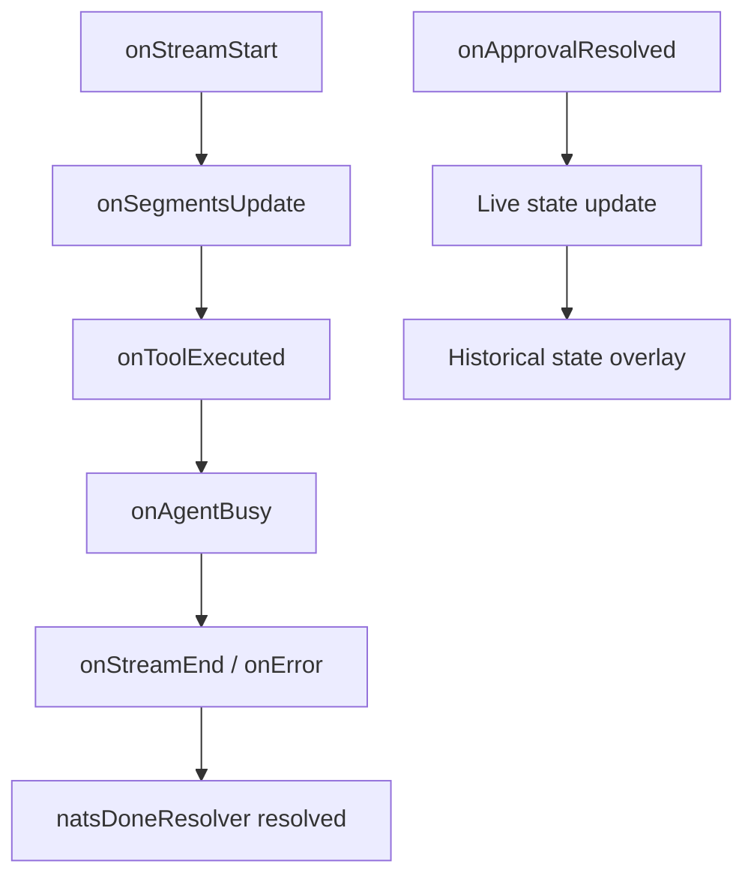

<!-- source-hash: 310451401079b49789721c0b1fbadb56 -->
Orchestrates real-time chat functionality by combining NATS streaming, historical message loading, approval workflows, and API communication into a unified React hook.

## Key Components

| Export | Type | Description |
|--------|------|-------------|
| `useChat` | Hook | Primary hook managing the full chat lifecycle |
| `UseChatOptions` | Interface | Configuration options for the hook |
| `findLatestPendingApprovalId` | Function | Scans messages for the most recent pending approval |
| `SUBSCRIPTION_WAIT_CANCELLED` | Constant | Sentinel for deliberately-cancelled subscription waits |

## Key State & Refs

| Name | Purpose |
|------|---------|
| `isTyping` | Typing indicator visibility |
| `natsStreaming` | Active NATS stream flag |
| `natsDialogId` | Current dialog session ID |
| `hasReconnected` | Tracks post-reconnect state to enable history back-fill |
| `escalatedApprovalsRef` | Stores approval command metadata across renders |
| `subscriptionPromiseRef` | Controls send-flow lifecycle gating |

## Usage Example

```typescript
import { useChat } from './useChat';

function ChatComponent() {
  const {
    // returned values consumed downstream
  } = useChat({
    useApi: true,
    useNats: true,
    onMetadataUpdate: ({ modelName, providerName, contextWindow }) => {
      console.log(`Model: ${modelName} via ${providerName}`);
    },
    onTokenUsage: (data) => {
      console.log('Token usage:', data);
    },
    onDialogClosed: () => {
      console.log('Dialog session ended');
    },
    onDirectModeDetected: () => {
      console.log('Direct mode active');
    },
  });
}
```

## Realtime Callback Pipeline

The hook wires a set of `realtimeCallbacks` that handle the full streaming lifecycle:



## History & Realtime Merge

Uses `mergeHistoryWithRealtime` to reconcile React Query-backed historical messages with in-flight NATS synthetics. The `streamingMessageId` exempts the active streaming bubble from deduplication until it is persisted.

## Source

[`useChat.ts`](https://github.com/flamingo-stack/openframe-oss-tenant/blob/main/useChat.ts)