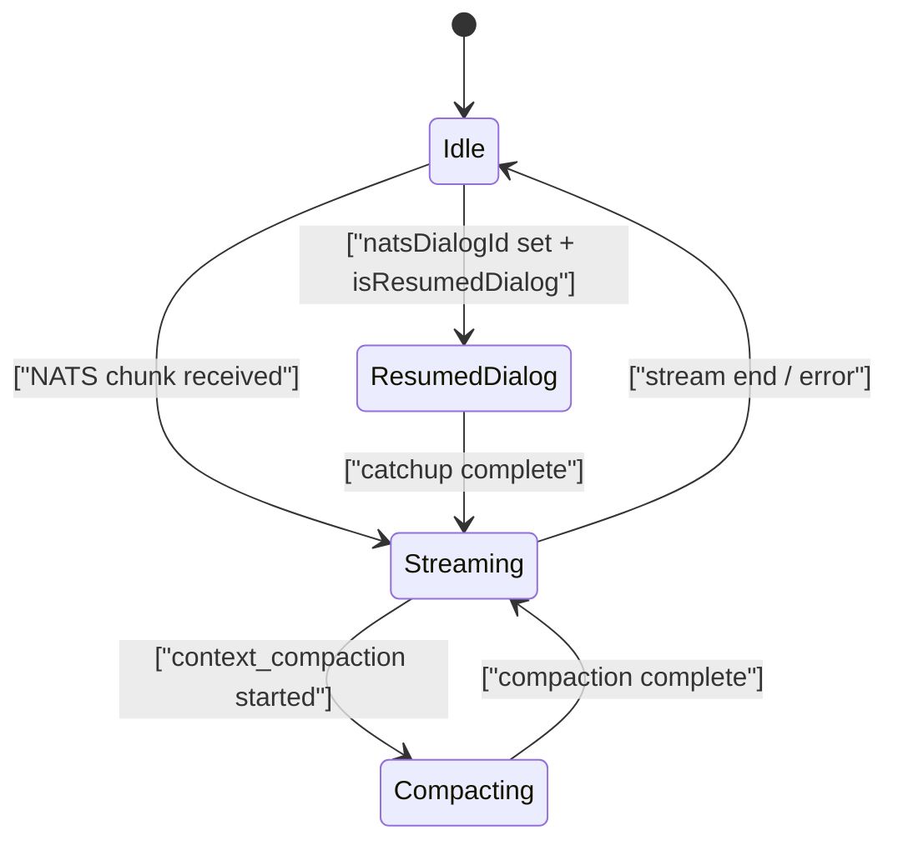

<!-- source-hash: abab85bcaff1c12a48c801cc59a309df -->
Brief description of the file's purpose and key components.

## Key Components

**Primary Hook:** `useChat` — orchestrates the full chat lifecycle for the Fae AI client chat interface, managing NATS/JetStream streaming, message state, tool approvals, dialog resumption, and real-time chunk processing.

**Helper Function:** `findLatestPendingApprovalId` — scans messages newest-to-oldest to locate the most recent pending approval request or batch, used for optimistic cancellation when a user sends a new message.

**Interface:** `UseChatOptions` — configuration contract for the hook, accepting flags for API/NATS usage, token/URL overrides, and event callbacks (`onMetadataUpdate`, `onTokenUsage`, `onDialogClosed`).

---

## Key Components

| Export / Symbol | Role |
|---|---|
| `useChat` | Main hook — composes all sub-hooks and manages streaming state machine |
| `findLatestPendingApprovalId` | Utility to find the newest pending approval across message history |
| `UseChatOptions` | Hook configuration interface |
| `CHAT_CHUNKS_STREAM` | NATS stream name constant (`"CHAT_CHUNKS"`) |
| `realtimeCallbacks` | Memoized callback map wired to `useRealtimeChunkProcessor` |
| `incompleteState` | Derived state reconstructed from resumed dialog for stream catchup |
| `isCompacting` | Boolean derived from last message tail indicating context compaction in progress |

**Composed sub-hooks:**

- `useChatMessages` — local session message state
- `useChatApprovals` — approval request/reject lifecycle
- `useDialogMessages` — paginated historical messages via React Query
- `useChatNatsConfig` — NATS WebSocket URL + reconnect config
- `useChatConfig` — quick actions config
- `useChunkCatchup` — replays missed chunks on reconnect
- `useJetStreamDialogSubscription` / `useNatsDialogSubscription` — transport layer (feature-flagged)
- `useRealtimeChunkProcessor` — decodes and dispatches `ChunkData` events

---

## Usage Example

```typescript
import { useChat } from './hooks/useChat';

function ChatWidget() {
  const {
    messages,        // merged historical + live messages
    isTyping,        // assistant is streaming a response
    natsStreaming,   // raw NATS stream active
    error,           // last error string or null
    sendMessage,     // (text: string) => Promise<void>
    resetChat,       // clears session state
  } = useChat({
    useApi: true,
    useNats: false,
    onMetadataUpdate: ({ modelName, providerName, contextWindow }) => {
      console.log(`Model: ${modelName} via ${providerName}`);
    },
    onTokenUsage: (data) => {
      console.log('Tokens used:', data);
    },
    onDialogClosed: () => {
      console.log('Dialog was closed by the server');
    },
  });

  return (
    <div>
      {isTyping && <span>Fae is typing…</span>}
      {messages.map((m) => (
        <p key={m.id}>{String(m.content)}</p>
      ))}
    </div>
  );
}
```

---

## State Machine Overview



> **Approval flow:** When a pending `approval_request` or `approval_batch` segment is detected, `findLatestPendingApprovalId` returns its ID so `sendMessage` can optimistically cancel the gate before dispatching the new user message.