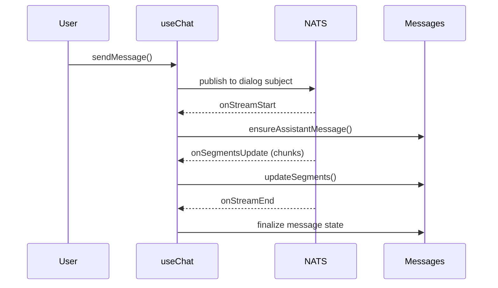

<!-- source-hash: abab85bcaff1c12a48c801cc59a309df -->
Orchestrates the real-time chat experience for the Fae client-facing AI, managing NATS/JetStream subscriptions, message state, approval workflows, and stream lifecycle for a dialog session.

## Key Components

| Export / Symbol | Description |
|---|---|
| `useChat` | Primary hook that composes all chat subsystems and exposes a unified chat interface |
| `findLatestPendingApprovalId` | Utility that scans messages newest-to-oldest to locate the most recent pending approval gate |
| `UseChatOptions` | Configuration interface for API/NATS mode, token handling, and event callbacks |
| `CHAT_CHUNKS_STREAM` | JetStream stream name constant (`CHAT_CHUNKS`) used for real-time chunk delivery |

### Internal Subsystems Composed

| Hook | Responsibility |
|---|---|
| `useChatMessages` | Live message buffer and segment mutation |
| `useDialogMessages` | Paginated historical message loading via React Query |
| `useChatApprovals` | Approval request/reject lifecycle and status tracking |
| `useChatNatsConfig` | NATS WebSocket URL and reconnect configuration |
| `useRealtimeChunkProcessor` | Incoming chunk parsing and routing |
| `useChunkCatchup` | Replay missed chunks on reconnect |

## Usage Example

```typescript
function ChatPanel() {
  const {
    allMessages,
    isTyping,
    sendMessage,
    approvals,
    error,
  } = useChat({
    useApi: true,
    useNats: false,
    onMetadataUpdate: ({ modelName, providerName }) => {
      console.log(`Streaming via ${providerName} / ${modelName}`);
    },
    onTokenUsage: (data) => {
      console.log('Tokens used:', data);
    },
    onDialogClosed: () => {
      console.log('Dialog session ended');
    },
  });

  return (
    <MessageList
      messages={allMessages}
      isTyping={isTyping}
      error={error}
    />
  );
}
```

## Stream Lifecycle



> **Note:** When `isResumedDialog` is true, historical messages are merged with live stream output, with trailing assistant messages trimmed from history to avoid duplication during catchup replay.