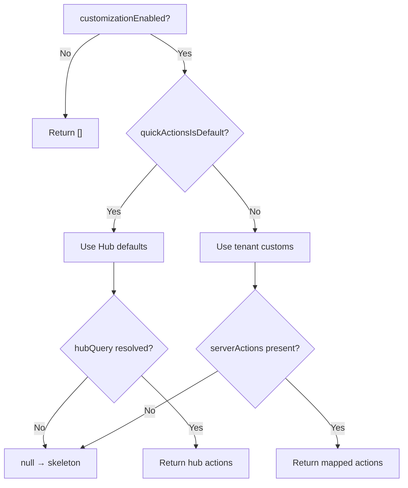

<!-- source-hash: f44983ed4357be48bc21b41ecf635aec -->
Aggregates AI assistant configuration for the chat interface by combining feature flags, AI settings, and quick actions into a single resolved state object.

## Key Components

### Interfaces

- **`QuickAction`** — Describes a chat chip/button with `id`, `name`, `instructions`, and optional icon fields (`iconName`, `iconUrl`, `iconProps`)
- **`DefaultChatModel`** — Describes the active LLM with `modelName`, `provider`, and `contextWindow`

### Hook

- **`useChatConfig()`** — Composes [`useFeatureFlags`](https://github.com/flamingo-stack/openframe-oss-tenant/blob/main/src/contexts/FeatureFlagsContext.ts), [`useAiSettingsQuery`](https://github.com/flamingo-stack/openframe-oss-tenant/blob/main/src/hooks/useAiSettingsQuery.ts), and [`useHubQuickActionsQuery`](https://github.com/flamingo-stack/openframe-oss-tenant/blob/main/src/hooks/useHubQuickActionsQuery.ts) to return:
  - `quickActions` — Resolved `QuickAction[]` (empty array while loading, never fabricated defaults)
  - `aiSettings` — Raw AI settings object, or `null` when the customization flag is off
  - `defaultModel` — Active `DefaultChatModel` for the footer display, or `null` if unconfigured
  - `isSettingsLoading` — `true` while the flag is on and the AiSettings query itself is still pending (drives branding/appearance skeletons)
  - `isQuickActionsLoading` — `true` when the flag is on but quick actions have not yet resolved (drives the quick-action wall skeleton)
  - `settingsUnavailable` — `true` when the real customization state is unknowable (feature-flags fallback or settings query error); appearance keeps the persisted pre-paint values instead of wiping them

## Usage Example

```typescript
import { useChatConfig } from './useChatConfig';

function ChatInterface() {
  const { quickActions, aiSettings, defaultModel, isQuickActionsLoading } = useChatConfig();

  if (isQuickActionsLoading) return <QuickActionsSkeleton />;

  return (
    <>
      {quickActions.map(action => (
        <ChipButton key={action.id} label={action.name} prompt={action.instructions} />
      ))}
      {defaultModel && <FooterModelLabel model={defaultModel.modelName} />}
    </>
  );
}
```

## Source-Selection Logic

Quick actions follow a two-tier resolution strategy:



> **Design note:** `null` is used as an explicit skeleton sentinel — no bundled fallbacks are ever shown to avoid masking a tenant's real configured set.