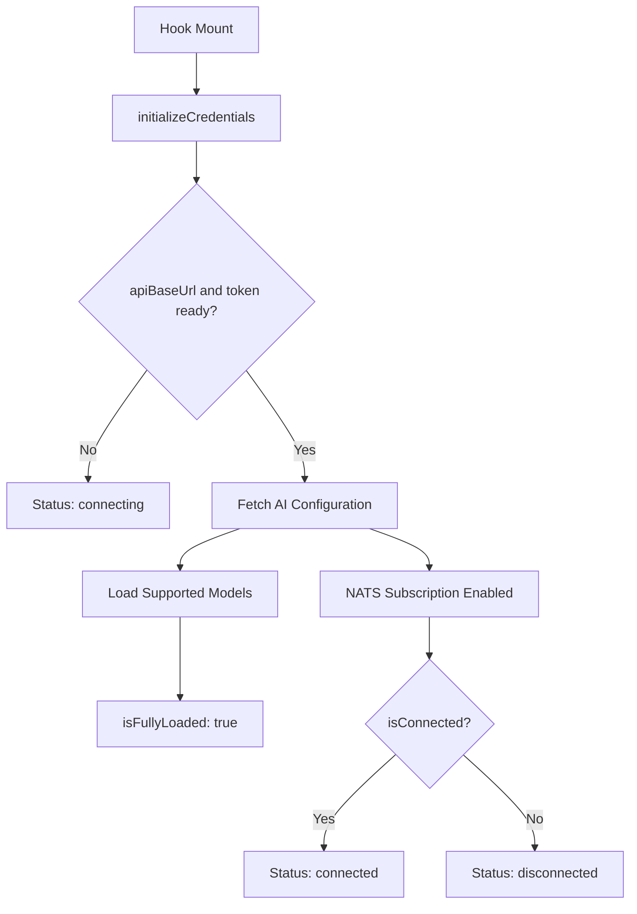

<!-- source-hash: 55932a917b0d5680da563248910b1da0 -->
Manages real-time connection state for the AI chat interface, tracking NATS WebSocket connectivity, server URL, and AI model configuration.

## Key Components

- **`ConnectionStatus`** — Union type: `'connected' | 'disconnected' | 'connecting'`
- **`AiConfiguration`** — Interface describing an AI provider configuration (model name, provider, API key presence, active state)
- **`useConnectionStatus()`** — Primary hook returning connection state, server URL, AI config, and a fully-loaded flag

### Internal State & Side Effects

| Effect | Trigger | Purpose |
|--------|---------|---------|
| `initializeCredentials` | `apiBaseUrl`, `token` change | Bootstraps API URL and auth token via `tokenService` |
| `setServerUrl` | `apiBaseUrl` change | Strips protocol prefix for display |
| `loadAiConfiguration` | `apiBaseUrl` + `token` ready | Fetches `/chat/api/v1/ai-configuration`, loads supported models |
| `isConnected` sync | NATS connection state | Maps NATS status to `ConnectionStatus` enum |

## Usage Example

```typescript
import { useConnectionStatus } from './useConnectionStatus';

function ChatStatusBar() {
  const { status, serverUrl, aiConfiguration, isFullyLoaded } = useConnectionStatus();

  if (!isFullyLoaded) return <Spinner />;

  return (
    <div>
      <span>Status: {status}</span>
      <span>Server: {serverUrl}</span>
      <span>Model: {aiConfiguration?.modelName}</span>
    </div>
  );
}
```

## Flow

