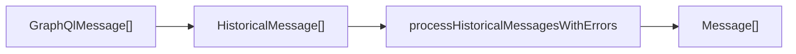

<!-- source-hash: 360e84e5d0e06e7d49eac0ceda6d4f7f -->
Transforms raw GraphQL dialog messages into a normalized chat display format for the Fae AI assistant interface.

## Key Components

### `processHistoricalMessages`
Main exported function that converts GraphQL message objects into UI-ready `Message[]` format.

**Parameters:**
- `messages: GraphQlMessage[]` — Raw messages fetched from the GraphQL dialog service
- `onApprove?: (requestId?) => Promise<void>` — Optional callback for approval actions
- `onReject?: (requestId?) => Promise<void>` — Optional callback for rejection actions

**Returns:** `Message[]` — Normalized messages ready for chat display

## Processing Pipeline



1. **Normalization** — Maps raw GraphQL fields (`id`, `dialogId`, `chatType`, `owner`, etc.) into `HistoricalMessage` shape
2. **Core Processing** — Delegates to `processHistoricalMessagesWithErrors` with Fae-specific config (`assistantName`, `assistantAvatar`, `CLIENT` chat type filter)
3. **Display Mapping** — Flattens to `Message[]`, injecting `faeAvatar` for `assistant` and `error` roles

## Usage Example

```typescript
import { processHistoricalMessages } from './messageProcessor';

const messages = processHistoricalMessages(
  graphqlMessages,
  async (requestId) => { await approveRequest(requestId); },
  async (requestId) => { await rejectRequest(requestId); },
);

// messages[0].avatar is set for assistant/error roles
// messages[0].role: 'user' | 'assistant' | 'error'
```

> **Note:** Avatar injection is scoped to `assistant` and `error` roles only — `user` messages receive `undefined` for avatar.