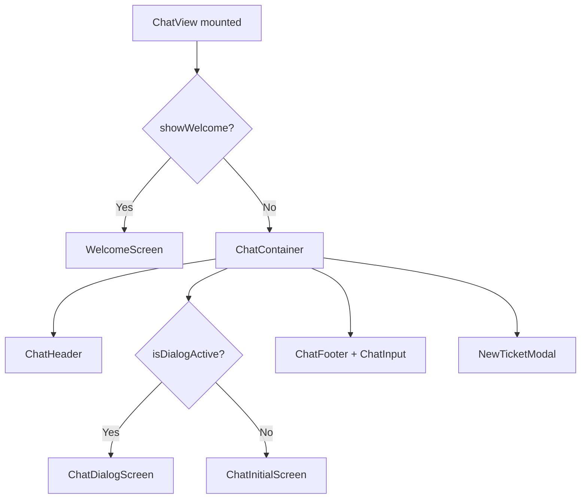

<!-- source-hash: f2fd7e652357960c0528e18b5ad112e9 -->
Renders the full Fae client chat interface, orchestrating message display, ticket management, model metadata, and connection state into a single view component.

## Key Components

| Export / Helper | Purpose |
|---|---|
| `ChatView` | Main view component — composes header, content, input, and modals |
| `toTokenUsageData` | Normalizes `DialogTokenUsage` → `TokenUsageData` for the UI |
| `processedMessages` (memo) | Filters pending approvals and deduplicates `approval_request`/`approval_batch` segments |
| `displayMessages` (memo) | Prepends a synthetic Fae-form message when a FAE_FORM ticket has no dialog history |
| `handleTicketClick` | Loads ticket details, resolves dialog ID, and either previews or resumes the dialog |
| `handleNewChat` | Resets all chat/ticket state and invalidates the `tickets` query cache |

**Hooks consumed:** `useChat`, `useTickets`, `useWelcomeScreen`, `useConnectionStatus`, `useToast`

**Services consumed:** `dialogGraphQlService`, `ticketGraphQlService`, `supportedModelsService`

## Usage Example

```typescript
// Mount as the top-level chat route — no props required.
// All state is self-contained via hooks and services.
import { ChatView } from './views/ChatView';

function App() {
  return <ChatView />;
}
```

## Rendering Flow

