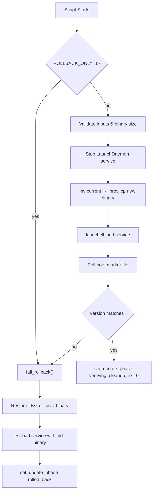

<!-- source-hash: e90227cfb36b7652f5d88bb723027087 -->
Provides the macOS self-update infrastructure as compile-time string constants: a LaunchDaemon plist template and a bash update script that orchestrates binary replacement for OpenFrame agent updates.

## Key Components

| Constant | Type | Description |
|---|---|---|
| `UPDATER_PLIST_TEMPLATE` | `&str` | XML plist template for a `com.openframe.updater` LaunchDaemon with placeholder tokens for runtime injection |
| `UPDATE_SCRIPT_MACOS` | `&str` | Bash script that stops the agent service, swaps the binary, restarts the service, and verifies boot via a version marker file |

### Plist Template Tokens

| Token | Purpose |
|---|---|
| `{SCRIPT_PATH}` | Path to the update bash script |
| `{BINARY_PATH}` | Downloaded new binary to install |
| `{SERVICE_LABEL}` | LaunchDaemon label (e.g. `com.openframe.agent`) |
| `{TARGET_EXE}` | Installed agent executable path |
| `{UPDATE_STATE_PATH}` | JSON file tracking update phase |
| `{TARGET_VERSION}` | Expected version string after update |
| `{BOOT_MARKER_PATH}` | File written by agent on successful boot |
| `{LKG_PATH}` | Last-known-good binary for rollback |
| `{BOOT_MARKER_WAIT_SECS}` | Timeout waiting for boot verification |
| `{ROLLBACK_ONLY}` | `1` to force rollback without updating |
| `{TRANSCRIPT_PATH}` | stdout/stderr log destination |

### Update Script Behavior

The bash script follows a strict failure-safe flow:



## Usage Example

```rust
use crate::updater::scripts::macos::{UPDATER_PLIST_TEMPLATE, UPDATE_SCRIPT_MACOS};

// Inject runtime values into the plist template
let plist = UPDATER_PLIST_TEMPLATE
    .replace("{SCRIPT_PATH}", "/tmp/openframe_update.sh")
    .replace("{BINARY_PATH}", "/tmp/openframe_agent_new")
    .replace("{SERVICE_LABEL}", "com.openframe.agent")
    .replace("{TARGET_EXE}", "/usr/local/bin/openframe-agent")
    .replace("{UPDATE_STATE_PATH}", "/var/lib/openframe/update_state.json")
    .replace("{TARGET_VERSION}", "1.2.3")
    .replace("{BOOT_MARKER_PATH}", "/var/run/openframe/boot_marker")
    .replace("{LKG_PATH}", "/var/lib/openframe/agent.lkg")
    .replace("{BOOT_MARKER_WAIT_SECS}", "90")
    .replace("{ROLLBACK_ONLY}", "0")
    .replace("{TRANSCRIPT_PATH}", "/var/log/openframe/updater.log");

std::fs::write("/tmp/com.openframe.updater.plist", plist)?;
std::fs::write("/tmp/openframe_update.sh", UPDATE_SCRIPT_MACOS)?;
```

> **Source:** [`flamingo-stack/openframe-oss-tenant`](https://github.com/flamingo-stack/openframe-oss-tenant) — part of the OpenFrame agent self-update subsystem.