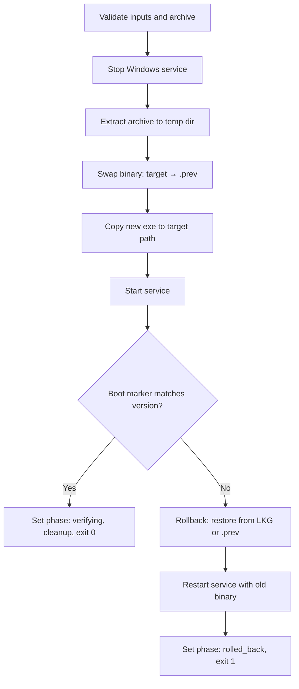

<!-- source-hash: 1f7e9d7a9380f779372e212f30806f18 -->
Rust module that embeds a Windows PowerShell self-update script as a compile-time string constant, used by the OpenFrame agent's self-update mechanism to safely replace its own binary on Windows hosts.

## Key Components

| Export | Type | Description |
|---|---|---|
| `UPDATE_SCRIPT_WINDOWS` | `&str` (raw string literal) | Complete PowerShell script for orchestrating agent binary replacement, rollback, and service lifecycle management |

### Embedded Script Parameters

| Parameter | Type | Description |
|---|---|---|
| `$ArchivePath` | string | Path to the downloaded `.zip` update archive |
| `$ServiceName` | string | Windows service name to stop/start around the swap |
| `$TargetExe` | string | Absolute path to the agent executable |
| `$UpdateStatePath` | string | JSON state file path for phase tracking |
| `$TargetVersion` | string | Expected version string written to the boot marker |
| `$BootMarkerPath` | string | File the new binary writes on successful boot |
| `$LkgPath` | string | Last-known-good binary reserve for rollback |
| `$TranscriptPath` | string | Optional path for full PowerShell transcript logging |
| `$BootMarkerWaitSecs` | int | Timeout (default 90s) waiting for boot marker |
| `$RollbackOnly` | switch | Forces immediate rollback without attempting an update |

### Update Flow



## Usage Example

```rust
use crate::updater::scripts::windows::UPDATE_SCRIPT_WINDOWS;

// Write the embedded script to a temp file and invoke it via PowerShell
let script_path = temp_dir.join("update.ps1");
std::fs::write(&script_path, UPDATE_SCRIPT_WINDOWS)?;

std::process::Command::new("powershell.exe")
    .args([
        "-NonInteractive", "-File", script_path.to_str().unwrap(),
        "-ArchivePath", &archive_path,
        "-ServiceName", "openframe-agent",
        "-TargetExe", &exe_path,
        "-TargetVersion", &target_version,
        "-BootMarkerPath", &marker_path,
        "-LkgPath", &lkg_path,
    ])
    .spawn()?;
```

> **Rollback safety:** The script tracks whether the binary swap (`$SwapReached`) has occurred before any failure. If the agent is uninstalled mid-update (state file disappears), the script exits cleanly without touching the service.

**Source:** [`windows.rs`](https://github.com/flamingo-stack/openframe-oss-tenant/blob/main/windows.rs)