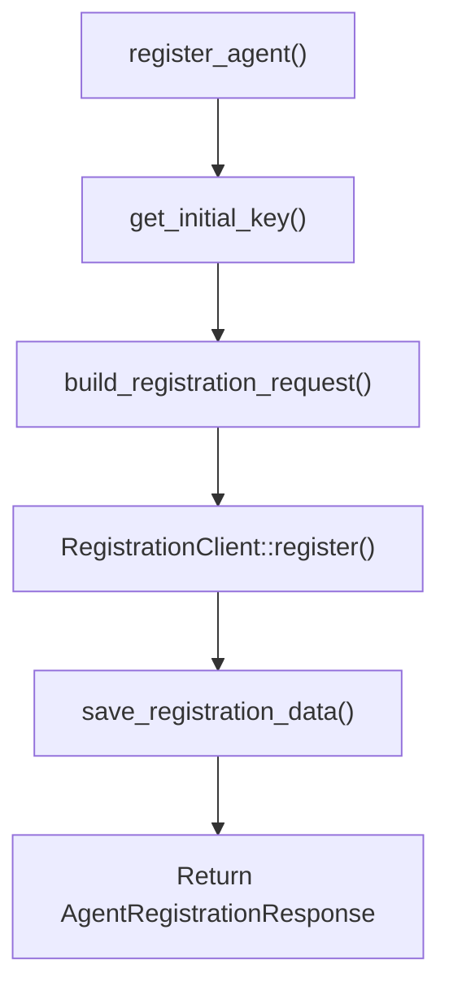

<!-- source-hash: 24c7aa83de3cb02ee957ffc2b55dd59c -->
Handles agent registration by collecting device data, building a registration request, submitting it to the registration API, and persisting the returned credentials to local configuration.

## Key Components

### `AgentRegistrationService`
A cloneable service struct that orchestrates the full agent registration lifecycle.

**Dependencies (injected via constructor):**
- `RegistrationClient` — HTTP client for the registration API
- `DeviceDataFetcher` — Retrieves local device metadata (hostname, OS, agent version)
- `AgentConfigurationService` — Persists registration credentials post-registration
- `InitialConfigurationService` — Reads the initial key, org ID, and tags from bootstrap config

**Methods:**

| Method | Description |
|--------|-------------|
| `new(...)` | Constructs the service with all required dependencies |
| `register_agent()` | Runs the full registration flow; returns `AgentRegistrationResponse` |
| `build_registration_request()` | Assembles `AgentRegistrationRequest` from device and config data |

## Usage Example

```rust
let service = AgentRegistrationService::new(
    registration_client,
    device_data_fetcher,
    config_service,
    initial_configuration_service,
);

match service.register_agent().await {
    Ok(response) => {
        println!("Registered with machine_id: {}", response.machine_id);
    }
    Err(e) => {
        eprintln!("Registration failed: {e:#}");
    }
}
```

## Registration Flow



> Registration data (machine ID, client ID, client secret) is saved locally after a successful API response. If either the API call or the save step fails, the error is propagated with context via `anyhow`.